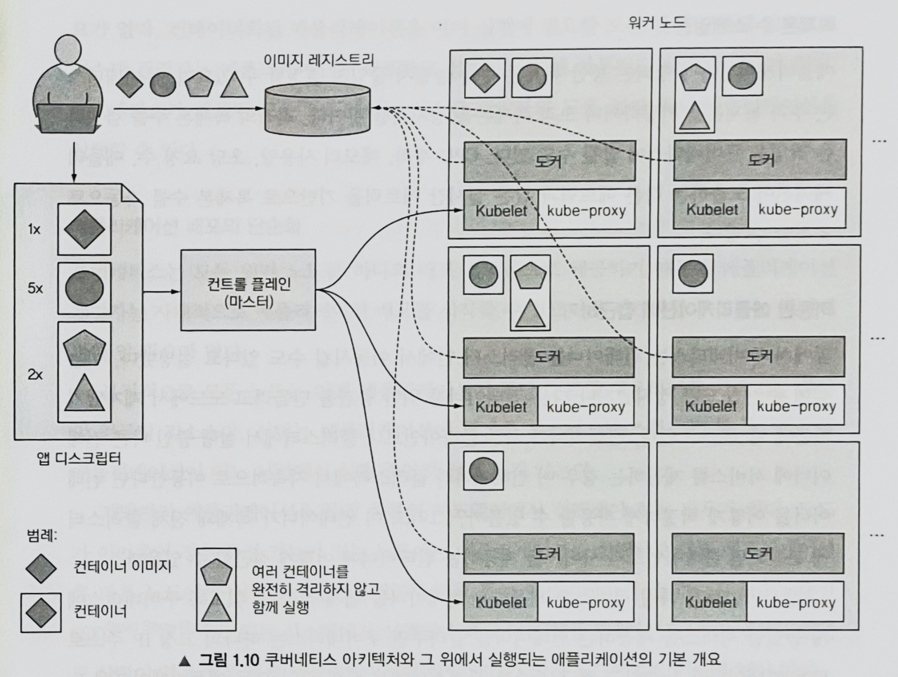

# Ch1. 쿠버네티스 소개

# 쿠버네티스와 같은 시스템이 필요한 이유

## 1. monolith → microservices

- Monolithic applications?
    - 모든 애플리케이션이 강하게 결합, 하나의 운영체제 프로세스에서 실행됨 → 하나의 개체로 개발, 배포, 관리
    - scale-up(서버를 수직적으로 확장), scale-out(어플리케이션 레플리카 생성)이 어려움
- Microservices?
    - microservice는 각각 독립적인 프로세스로 실행되며, API로 다른 microservice와 통신
    - 필요한 서비스만 별도로 확장 가능
    
    ← 그러나, microservice가 늘어날 수록 배포 조합의 수 뿐만 아니라 구성 요소 간의 상호 종속성 관리가 어려줘짐
    

## 2. 애플리케이션에 일관된 환경 제공

- 개발 환경과 프로덕션 환경(애플리케이션을 실행하는 환경)의 차이, 프로덕션 환경의 업데이트 등 애플리케이션이 실행되는 환경에는 다양한 변수들이 발생할 수 있음
    
    → 기존 애플리케이션에 영향을 주지 않고 동일한 환경을 제공 할 수 있어야
    

## 3. 지속적인 배포로 전환

- 하드웨어 인프라를 전혀 알지 못하더라도 운영 팀을 거치지 않고 개발자가 애플리케이션을 배포하는 것이 가장 이상적(NoOps)

# 컨테이너 기술 소개

## 컨테이너 이해

- 쿠버네티스는 애플리케이션을 격리하는 기능을 제공하기 위해 리눅스 컨테이너 기술을 사용

### 리눅스 컨테이너 기술

- 운영체제 수준의 가상화 기술로 리눅스 커널을 공유하면서 프로세스를 격리된 환경에서 실행하는 기술
- docker, rkt

### 가상머신 vs. 리눅스 컨테이너 기술

- 가상머신과 달리 컨테이너는 가벼움
    - 구성 요소 프로세스 뿐만 아니라 시스템 프로세스를 실행할 필요가 없어서 추가 컴퓨팅 리소스가 필요하지 않음
- 컨테이너는 호스트 os에서 실행되는 격리된 프로세스 중 하나일 뿐
- 컨테이너는 호스트 os의 커널을 그대로 사용

### 컨테이너 격리를 가능하게 하는 메커니즘 소개

1. 리눅스 네임스페이스(namespace)
    - 각 프로세스가 시스템(파일, 프로세스, 네트워크 인터페이스, 호스트 이름 등)에 대한 독립된 뷰만 볼수 있도록 함
    - 프로세스는 동일한 네임스페이스 내에 있는 리소스만 볼 수 있음 → 특정 리소스 그룹을 격리하는데 사용
    - 프로세스는 하나의 네임스페이스에만 속하는 것이 아니라 여러 네임스페이스에 속할 수 있음
    - 네임스페이스의 종류
        - 마운트(mnt)
        - 프로세스ID(pid)
        - 네트워크(net)
        - 프로세스 간 통신(ipc)
        - 호스트와 도메인 이름(uts)
        - 사용자 ID(user)
2. 리눅스 컨트롤 그룹(cgroups)
    - 프로세스가 사용할 수 있는 리소스(CPU, 메모리, 네트워크 대역폭 등)의 양을 제한
    

## 도커 컨테이터 플랫폼 소개

### 도커

- 도커는 애플리케이션 패키지, 배포, 실행하기 위한 플랫폼
- 세 가지 주요 개념
    1. 이미지: 애플리케이션과 해당 환경을 패키지화 한 것
    2. 레지스트리: 도커 이미지를 저장(push)하고 공유(pull)할 수 이는 저장소
    3. 컨테이너: 도커 기반 커터이너 이미지에서 생성된 일반적인 리눅스 컨테이너

### 이미지 레이어

- 도커 이미지는 공유되고 재사용이 가능한 레이어로 구성
- 레이어는 읽기 전용이며, 컨테이너가 실행될 때 이미지 레이어 위에 새로운 쓰기 가능한 레이어가 만들어짐. 변경사항은 이 최상위 레이어에 만들어짐
- 레이어는 동일한 호스트에 한 번만 저장됨

### 컨테이너 이미지의 제한적인 이식성

- 컨테이너 이미지는 호스트의 리눅스 커널을 사용하기 때문에 특정 커널 버전이 필요한 경우 작동하지 않을 수 있음

# 쿠버네티스 소개

- 쿠버네티스를 사용하면 모든 노드가 하나의 거대한 컴퓨터인 것처럼 수천 대의 컴퓨터 노드에서 소프트웨어 애플리케이션을 실행할 수 있음

## 쿠버네티스 시스템과 아키텍쳐

- 쿠버네티스 시스템은 마스터 노드(master node)와 워커 노드(worker node)로 구성

- 마스터 노드는 전체 쿠버네티스 시스템을 제어하고 관리하는 쿠버네티스 컨트롤 플레인을 실행
- 워커 노드는 실제 배포되는 컨테이너 애플리케이션을 실행

### 컨트롤 플레인

- 컨트롤 플레인(control plane)은 클러스터를 제어하고 작동
- 컨트롤 플레인 구성요소
    - API 서버: 사용자, 컨트롤 플레인 구성 요소와 통신
    - 스케줄러: 애플리케이션 배포(애플리케이션의 배포 가능한 구성요소들을 워크노드에 할당)
    - 컨트롤러 매니저: 구성 요소 복제본, 워커 노드 추적, 노드 장애 처리 등과 같은 클러스터 단의 기능을 수행
    - etcd: 클러스터 구성을 지속적으로 저장하는 신뢰할 수 있는 분산 데이터 저장소

### 노드

- 워커 노드는 컨테이너화된 애플리케이션을 실행하는 시스템
- 워커 노드 구성요소
    - 컨테이너 런타임: 컨테이너를 실행(docker, rkt)
    - kubelet: API 서버와 통신, 노드의 컨테이너를 관리
    - kube-proxy: 애플리케이션 구성 요소 간에 네트워크 트래픽을 로드밸런싱

## 쿠버네티스에서 애플리케이션 실행

- flow
    
    쿠버네티스 API 서버에 애플리케이션 디스크립션을 게시 → 스케줄러가 할당 가능한 리소스를 계산 & 워커 노드에 지정된 컨테이너를 할당 → 해당 노드의 kubelet이 컨테이너 런타임에 필요한 컨테이너 이미지를 가져와 컨테이너를 실행
    
- 디스크립션?
    - 컨테이너 이미지
    - 애플리케이션 구성 요소가 포함된 이미지
    - 해당 구성 요소가 서로 통신하는 방법
    - 동일 서버에 함께 배치돼야 하는 구성 요소
    - 각 구성 요소의 복제본 수
    
    등 다양한 애플리케이션에 대한 정보들
    
- 애플리케이션이 실행되면 쿠버네티스는 애플리케이션의 배포 상태가 사용자가 제공한 디스크립션과 일치하는지 지속적으로 확인
    - 만약 제대로 작동하지 않으면 쿠버네티스가 자동으로 해당 애플리케이션을 다시 시작
- 워커 노드 전체가 종료되거나 액세스할 수 없게 되면 쿠버네티스는 이 노드에서 실행 중인 모든 컨테이너의 노드를 새로 스케줄링하고, 실행
- 애플리케이션이 실행되는 동안 복제본 수를 스케일링할 수 있음
    - CPU부하, 메모리 사용량 등 실시간 메트릭을 기반으로 복제본 수를 자동으로 조정할 수 있음
- kube-porxy는 서비스를 제공하는 모든 컨테이너에서 서비스 연결이 로드밸런싱되도록 해줌 → 클러스너 내에서 컨테이너가 이동하더라도 서비스 연결이 중지 되지 않음

## 쿠버네티스 사용의 장점

### 애플리케이션 배포의 단순화

- 쿠버네티스는 모든 워커 노드를 하나의 배포 플랫폼으로 제공 → 개발자가 자체적으로 애플리케이션 배포 가능

### 하드웨어 활용도 높이기

- 쿠버네티스는 애플리케이션의 리소스 요구사항에 대한 디스크립션과 각 노드에서 사용 가능한 리소스를 고려하여 가장 적합한 노드를 선택

### 상태 확인과 자가 치유

- 노드 모니터링 → 노드 장애 발생 시 자동으로 다른 노드로 스케줄링

### 오토스케일링

- 애플리케이션의 부하를 지속적으로 모니터링 할 필요 없이 각 애플리케이션의 실행 인스턴스 수를 자동으로 조정하도록 지정할 수 있음

### 애플리케이션 개발 단순화

- 버그 발견 및 수정이 용이
- 개발자가 일반적으로 구현해야 하는 기능을 구현할 필요x 
    - 서비스, 피어 검색, 리더 선정 등
- 새로운 버전으로 업데이트시 모니터링을 통한 롤아웃(rollout) 가능 → 지속적인 전달(continuous delivery) 가능