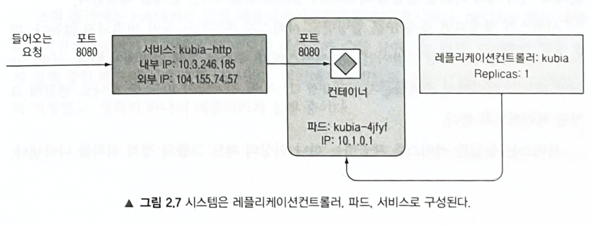
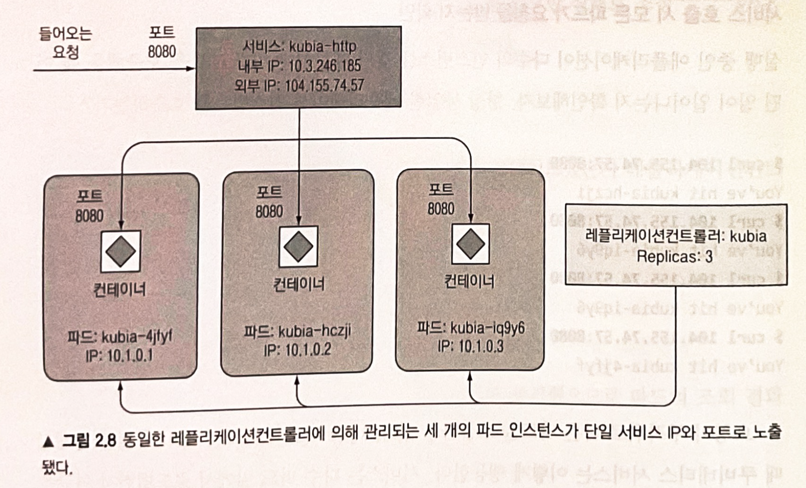

# Ch2. 도커와 쿠버네티스 첫걸음

*도커 관련 명령어와 개념은 이미 안다고 가정하여 생략*

# 쿠버네티스 클러스터 설치

1. minikube(단일 노드 클러스터)
2. kubeadm
3. GKE(구글 쿠버네티스 엔진)
4. AWS EKS
등등

# 쿠버네티스에 애플리케이션 실행하기

## 1. 애플리케이션 구동하기

- kubectl run 명령어를 이용하여 생성
    
    오브젝트의 구조를 깊이 살펴볼 필요가 없음
    
    ```bash
    k run $NAME --image=$IMAGE_NAME --port=$PORT
    ```
    

### 파드 소개

- 쿠버네티스는 개별 컨테이너를 직접 다루지 않으며, 함께 배치된 다수의 컨테이너를 그룹으로 묶어서 파드(pod)라는 개념으로 사용
- 파드 안의 컨테이너들은 같은 워커 노드에서 같은 리눅스 네임스페이스로 함께 실행됨
- 각 파드는 자체 IP, 호스트 이름, 프로세스 등 논리적으로 분리된 머신


개발자가 쿠버네티스에서 이미지를 띄우는 과정

## 2. 애플리케이션에 접근하기

- 각 파드는 자체 IP 주소를 가지고 있지만 이 주소는 클러스트 내부에 있음. 따라서 외부에서 접근 불가
- 파드와 마찬가지로 일반적인 서비스(Cluster IP 서비스)는 클러스터 내부에서만 접근 가능

⇒ LoadBalancer 유형의 특별한 서비스를 생성해야함

### 서비스 오브젝트 생성하기

```bash
k expose po $NAME --type=LoadBalancer --name $LOADBALANCER_NAME
```

### 서비스 오브젝트 조회하기

```bash
k get svc
```

### External IP를 이용해 서비스 접근하기

```bash
curl $EXTERNAL_IP:$PORT
```

- 애플리케이션에서 파드 이름을 호스트 이름으로 사용함

## 3. 시스템의 논리적인 부분



- 사용자는 컨테이너를 직접 생성하거나 동작시키지 않으며, 파드 또한 직접 생성하지 않음
- 디플로이먼트(*책에서는 레플리케이션컨트롤러를 사용하지만 공식문서에는 디플로이먼트를 권장함 )*를 통해 레플리카(replicas)의 min, max를 설정하여 관리할 수 있음

### 서비스가 필요한 이유

- 파드는 일시적이며, 교체되고 새롭게 만들어짐. 이 때 새로운 파드는 다른 IP 주소를 할당(파드는 각각의 고유한 IP주소를 갖게되므로)받음.
- 서비스가 생성되면 정적 IP를 할당받고 서비스가 존속하는 동안 변경되지 않음. 파드 고유의 IP주소를 통해 직접 연결하는 것이 아니라 서비스의 IP 주소를 통해 연결됨. 즉 서비스는 어떤 파드가 어떤 IP를 갖는지에 관계없이 파드로 연결해서 요청을 처리할 수 있게 함.

## 4. 애플리케이션 수평 확장

- 쿠버네티스는 어떤 액션을 직접 수행하도록 알려주는 대신에 시스템의 의도하는 상태(desired state)를 선언적으로 변경하고 실제 현재 상태(current state)를 검사해 의도한 상태로 조정함(reconcile)

```bash
k scale $RESOURCE_TYPE $NAME --replicas=$NUM
```

- 단, 이를 위해 애플리케이션 자체에서 수평 확장을 지원하도록 만들어야함



- 서비스는 다수 파드 앞에서 로드밸런서 역할을 수행

## 5. 애플리케이션이 실행 중인 노드 검사하기

- 사실 쿠버네티스에서 파드가 어떤 노드에서 실행중인지는 중요하지 않음(요구하는 CPU, GPU, 메모리 사항을 이미 만족시켰기 때문에 스케쥴링이 되었음)
- 그럼에도 불구하고 노드에 대한 정보가 궁금하다면, `-o wide` 옵션을 주면 확인 가능
    
    ```bash
    k get po -o wide
    ```
    

### 파드 세부 정보 살펴보기

```bash
k describe po $NAME
```