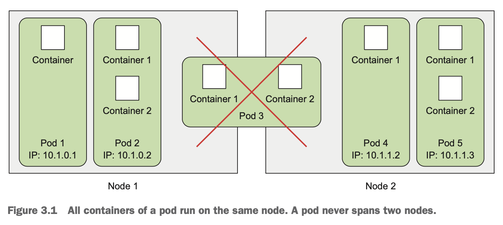
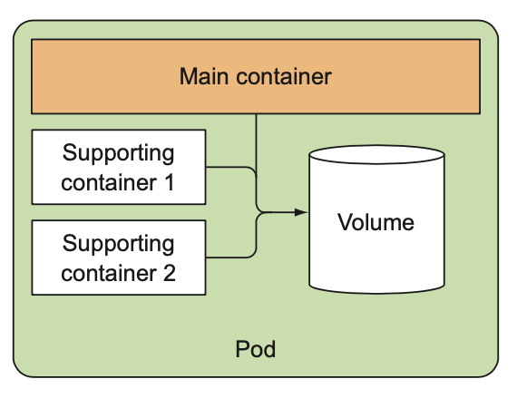
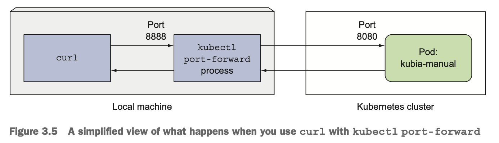
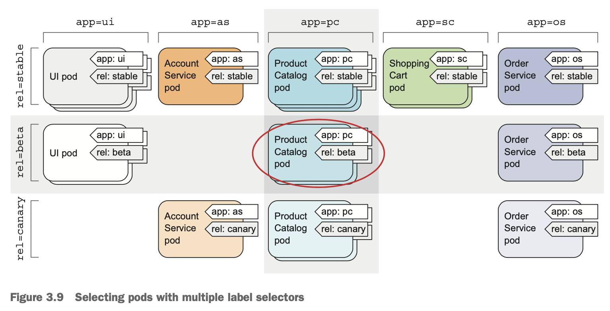
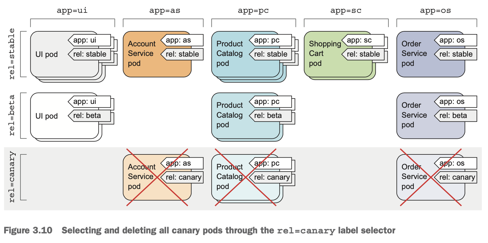

# Ch3. 파드: 쿠버네티스에서 컨테이너 실행

# 파드 소개

- 파드는 함께 배치된 컨테이너 그룹이며, 쿠버네티스의 기본 빌딩 블록임
- 쿠버네티스는 컨테이너를 개별적으로 배포하기보다는 컨테이너를 가진 파드를 배포하고 운영함
- 파드가 여러 컨테이너를 가지고 있을 경우에, 모든 컨테이너는 항상 하나의 워커 노드에서 실행되며 여러 워커 노드에 걸쳐 실행되지 않음



## 1. 파드가 필요한 이유

- 하나의 애플리케이션이 여러개의 프로세스로 구성되어 있을 경우, 단일 컨테이너에서 이를 실행시키기 보다는 다중 컨테이너로 실행 시키는 것이 더욱 유리
    - 컨테이너는 단일 프로세스를 실행하는 것을 목적으로 설계됨
    - 하나의 컨테이너에서 여러개의 프로세스를 실행하는 경우, 그 프로세스 자체를 실행시키고 로그를 관리하는 것 모두 사용자의 책임
    - 또한, 개별 프로세스가 실패하는 경우 다시 시작시켜주는 메커니즘을 확보해야하며, 모든 프로세스가 동일한 표준 출력으로 로그를 기록하기 때문에 로그 파악이 어려움

## 2. 파드 이해하기

- 여러 프로세스를 단일 컨테이너가 아닌 다중 컨테이너를 이용하여 묶기 때문에, 이를 하나의 단위로 관리할 수 있는 또 다른 상위 구조가 필요 ⇒ 파드

### 같은 파드에서 컨테이너 간 부분 격리

- 쿠버네티스는 파드 안에 모든 컨테이너가 자체 네임스페이스가 아닌 동일한 리눅스 네임스페이스를 공유하도록 도커를 설정 → 컨테이너가 특정한 리소스를 공유할 수 있게됨
- 파드의 모든 컨테이너는 동일한 네트워크 네임스페이스와 UTS 네임스페이스 안에서 실행되기 때문에, 같은 호스트 이름과 네트워크 네임스페이스를 공유
- 그러나, 컨테이너 파일시스템의 경우 컨테이너 이미지에서 나오기 때문에, 다른 컨테이너와 완전히 분리됨
    - 쿠버네티스의 볼륨 개념을 이용하면 컨테이너가 파일 시스템을 공유할 수 있음

### 컨테이너가 동일한 IP와 포트 공간을 공유하는 방법

- 파드 안의 컨테이너가 동일한 네트워크 네임스페이스에서 실행되기 때문에, 동일한 IP주소와 포트 공간을 공유함
    - 파드 안에 있는 컨테이너들은 로컬호스트를 통해 서로 통신할 수 있음

## 3. 파드에서 컨테이너의 적절한 구성

- 쿠버네티스는 개별 컨테이너가 아니라 전체 파드를 수평으로 확장

### 파드에서 여러 컨테이너를 사용하는 경우

- 주요 프로세스와 보완 프로세스로 구성된 경우
    
    
    
    - 보완 프로세스는 보통 사이드카 컨테이너라고 불리며 로그 로테이터와 수집기, 데이터 프로세서 통신 어댑터 등이 있음

# YAML 또는 JSON 디스크립터로 파드 생성

## 1. 기존 파드의 YAML 디스크립터 살펴보기

- YAML을 사용하면 버전 관리 시스템 이용 가능 & 모든 속성에 대한 설정 가능
    
    ```bash
    k get po $NAME -o yaml
    ```
    

### 파드를 정의하는 주요 부분 소개

- k8s api version
- resource type
- metadata: 이름, 네임스페이스, 레이블 및 파드에 관한 기타 정보
- Spec: 파드 컨테이너, 볼륨, 기타 데이터 등 파드 자체에 관한 실제 명세
- Status: 파드 상태, 각 컨테이너 설명과 상태, 파드 내부 IP, 기타 기본 정보 등 현재 실행 중인 파드에 관한 현재 정보

## 2. 파드를 정의하는 간단한 YAML 정의 작성하기

- k explain을 이용하면 사용 가능한 API 오브젝트 필드를 츶을 수 있음
    
    ```bash
    k explain $resource
    ```
    
- yaml 예시
    
    ```yaml
    apiVersion: v1
    kind: Pod
    metadata:
    name: kubia-manual spec:
    containers:
    - image: luksa/kubia
    name: kubia
    ports:
    - containerPort: 8080
          protocol: TCP
    ```
    

## 3. YAML 파일로 파드 생성하기

```bash
k create -f $YAML_FILE_PATH
```

## 4. 애플리케이션 로그 보기

- 컨테이너화된 애플리케이션 로그는 일반적으로 표준 출력과 표준 에러를 사용
    
    ```bash
    K logs $POD_NAME
    ```
    
    ```bash
    K logs $POD_NAME -c $CONTAINER_NAME
    ```
    
- 단, 현재 존재하는 파드의 컨테이너 로그만 가져올 수 있으며, 파드가 삭제되면 해당 로그도 삭제됨

## 5. 파드에 요청 보내기

### 로컬 네트워크 포트를 파드의 포트로 포워딩

- 서비스를 거치지 않고(디버깅이나 다른 이유로) 특정 파드에 접근하기 위해서 쿠버네티스는 해당 파드로 향하는 포트 포워딩을 구성해줌

```bash
K port-forward $POD_NAME 8888:8080
```



# 레이블을 이용한 파드 구성

- 레이블은 파드를 임의의 기준에 따라 분류할 때 사용하며 파드와 기타 다른 쿠버네티스 오브젝트를 조직화함

## 1. 레이블 소개

- 레이블은 리소스에 첨부하는 key-value 쌍으로, 이 쌍은 레이블 셀렉터를 사용해 리소스를 선택할 때 활용됨
    - 리소스는 셀렉터에 지정된 레이블의 포함여부에 따라 필터링

## 2. 파드를 생성할 때 레이블 지정

- metadata에 labels를 key-value 쌍으로 지정
    
    ```yaml
    apiVersion: v1
    kind: Pod
    metadata:
      name: kubia-manual-v2
      labels:
        creation_method: manual
        env: prod
    spec:
      containers:
      - image: luksa/kubia
        name: kubia
        ports:
        - containerPort: 8080
          protocol: TCP
    ```
    
- 레이블을 보고 싶다면 `—-show-labels`
    
    ```bash
    k get po --show-labels
    ```
    
- 특정 레이블만 보고 싶다면 `-L`
    
    ```bash
    k get po -L $LABLE_KEY
    ```
    

## 3. 기존 파드 레이블 수정

- 기존 파드에 새로운 레이블 추가
    
    ```bash
    k label po $POD_NAME $LABLE_KEY=$LABLE_VALUE
    ```
    
- 기존 레이블 변경
    
    ```bash
    k label po $POD_NAME $LABLE_KEY=$LABLE_VALUE --overwrite
    ```
    

# 레이블 셀렉터를 이용한 파드 부분 집합 나열

- 레이블 셀렉터는 특정 레이블로 태그된 파드의 부분 집합을 선택해 원하는 작업을 수행할 수 있게 함
- 레이블 셀렉터는 리소스 중에서 다음 기준에 따라 리소스를 선택
    - 특정한 키를 포함하거나 포함하지 않는 레이블
    - 특정한 키와 값을 가진 레이블
    - 특정한 키를 갖고 있지만, 다른 값을 가진 레이블

## 1. 레이블 셀렉터를 사용해 파드 나열

- 특정한 레이블과 값을 가진 파드 조회
    
    ```bash
    k get po -l $KEY=$VALUE
    ```
    
- 특정한 레이블을 가진 파드 조회
    
    ```bash
    k get po -l $KEY
    ```
    
- 특정한 레이블을 가지지 않은 파드 조회
    
    ```bash
    k get po -l '!$KEY'
    ```
    
- 특정한 레이블을 가진 파드 중 특정 값이 아닌  파드 조회
    
    ```bash
    k get po -l $KEY!=$VALUE
    ```
    
- 레이블의 값이 A 또는 B인 파드를 조회
    
    ```bash
    k get po -l $KEY in (A, B)
    ```
    
- 레이블의 값이 A와 B가 아닌 파드를 조회
    
    ```bash
    k get po -l $KEY notin (A, B)
    ```
    

## 2. 레이블 셀렉터에서 여러 조건 사용

- 셀렉터는 쉼표로 구분된 여러 기준을 포함하는 것도 가능
- 셀렉터를 통해 선택하기 위해서는 리소스가 모든 기준을 만족해야 함
    
    
    
    app=pc,rel=beta
    
- 레이블 셀렉터는 kubectl에서만 사용하는 것이 아니고 내부적으로도 사용됨

# 레이블과 셀렉터를 이용해 파드 스케줄링 제한

- 파드를 스케줄링할 때 하드웨어 인프라를 설정하거나, GPU 설정 등 필요한 노드 요구 사항을 기술하고 쿠버네티스가 요구 사항을 만족하는 노드를 선택하도록 할 수 있으며, 이를 레이블과 레이블 설렉터를 통해 할 수 있음

## 1. 특정 노드에 파드 스케줄링

- 스케줄러가 특정 노드를 선택하도록 요청하려면, 파드 YAML에 노드 셀렉터를 추가해야함
    
    ```yaml
    apiVersion: v1
    kind: Pod
    metadata:
      name: kubia-gpu
    spec:
      nodeSelector:
        gpu: "true" # 동일한 레이블을 가지고 있는 node에 스케줄링 되도록 함
      containers:
      - image: luksa/kubia
        name: kubia
    ```
    

# 파드에 어노테이션 달기

- 파드 및 다른 오브젝트는 레이블 외에 어노테이션(annotations)을 가질 수 있음
- 어노테이션은 key-value 쌍으로 레이블과 유사하지만 식별 정보를 갖지 않음. 즉 레이블은 오브젝트들을 묶는 데 사용할 수 있으나, 어노테이션은 아님
- 그러나 어노테이션은 더 많은 정보를 보유할 수 있음
- 주로 도구들(tools)에서 사용됨
- 어노테이션 사용 예시
    - 새로운 기능을 추가할 때
        - 새로운 버전의 기능을 바로 오브젝트 필드에 추가하지 않고, 어노테이션을 사용 → 변경이 명확해지면 새로운 필드 도입 & 관련 어노테이션 사용 중단
    - 오브젝트 만드는 사람 이름을 어노테이션으로 지정하여 협업 용이

## 1. 오브젝트의 어노테이션 조회

- 어노테이션을 보기 위해서는 kubectl describe 또는 YAML 전체 내용 조회
    
    ```bash
    k describe po $POD_NAME
    ```
    
    ```bash
    k ket po $POD_NAME -o yaml
    ```
    

## 2. 어노테이션 추가 및 수정

- 어노테이션을 추가할 때 키 충돌 방지를 위해 고유한 접두사를 사용하는 것을 권장

```bash
k annotate pod $POD_NAME $KEY=$VALUE
```

# 네임스페이스를 사용한 리소스 그룹화

- 오브젝트는 여러 레이블을 가질 수 있기 때문에, 오브젝트 그룹이 서로 겹칠 수 있음
- 오브젝트를 겹치지 않는 그룹으로 분할하기 위해서는 네임스페이스를 이용하면 됨
    - 여기서의 네임스페이스는 프로세스를 격리하는데 사용하는 리눅스 네임스페이스가 아님
    - 쿠버네티스 네임스페이스는 오브젝트 이름의 범위를 제공

## 1. 네임스페이스의 필요성

- 복잡한 시스템을 좀 더 작은 개별 그룹으로 분리할 수 있음
- 멀티테넌트(multi-tenant)환경처럼 리소스를 분리하는 데 사용
    - 프로덕션, 개발, QA 등등
- 특정 사용자가 지정된 리소스에 접근할 수 있도록 허용하고, 개별 사용자가 사용할 수 있는 컴퓨팅 리소스를 제한하는데에도 사용
- 리소스 이름은 각 네임스페이스 안에서만 고유하면 됨
- 대부분의 리소스 유형은 네임스페이스 안에 속하지만 일부는 그렇지 않음(eg. 노드 리소스)

## 2. 다른 네임스페이스와 파드 살펴보기

- 네임스페이스 조회
    
    ```bash
    k get ns
    ```
    
- 특정 네임스페이스에 속한 파드 조회
    
    ```bash
    k get po --namespace $NAME_SPACE
    ```
    
- 모든 네임스페이스에서 파드 조회
    
    ```bash
    k get po --all-namespaces
    ```
    

## 3. 네임스페이스 생성

- YAML 파일을 이용하여 생성
    
    ```yaml
    apiVersion: v1
    kind: Namespace
    metadata:
      name: custom-namespace
    ```
    
- kubectl 명령어로 생성
    
    ```bash
    k create namespace $NAME_SPACE
    ```
    

## 4. 다른 네임스페이스의 오브젝트 관리

- YAML 파일을 통해 네임스페이스를 지정
    
    ```yaml
    apiVersion: v1
    kind: Pod
    metadata:
      namespace: search-engine
    ```
    
- kubectl로 생성시 `-n` 옵션 추가
    
    ```bash
    k create -f $YAML_PATH -n $NAME_SPACE
    ```
    

## 5. 네임스페이스가 제공하는 격리 이해

- 네임스페이스는 실행 중인 오브젝트에 대한 격리는 제공하지 않음
- 네트워크 솔루션이 네임스페이스 간 격리를 제공하지 않은 경우, 다른 네임스페이스 안에 있는 파드의 IP주소를 알고 있다면 통신 가능

# 파드 중지와 제거

## 1. 이름으로 파드 삭제

```bash
k delete po $POD_NAME_1 $POD_NAME_2
```

- 파드를 삭제하면 쿠버네티스는 파드 안에 모든 컨테이너를 종료하도록 지시
    - SIGTERM 신호를 프로세스에 보내고 지정된 시간(기본값 30s)동안 기다림
    - 시간 내에 종료되지 않으면 SIGKILL 신호를 통해 종료
- 디플로이먼트로 파드가 생성된 경우, 파드가 삭제되도 디플로이먼트가 남아 있는 한 다시 생성됨

## 2. 레이블 셀렉터를 이용한 파드 삭제

- 레이블 셀렉터로 지정한 모든 파드들 삭제 가능
    
    ```bash
    k delete po -l $KEY=$VALUE
    ```
    
    
    

## 3. 네임스페이스를 삭제한 파드 제거

- 네임스페이스 삭제하면 해당되는 파드도 모두 삭제됨
    
    ```bash
    k delete ns $NAME_SPACE
    ```
    

## 4. 네임스페이스를 유지하면서 네임스페이스 안에 있는 모든 파드 삭제

- 현재 네임스페이스에 있는 모든 파드를 삭제
    
    ```bash
    k delete po --all
    ```
    

## 5. 네임스페이스에서 모든 리소스 삭제

```bash
k delete all --all
```

- all 키워드를 이용해 삭제해도 시크릿 등 특정 리소스는 보존되어 있음