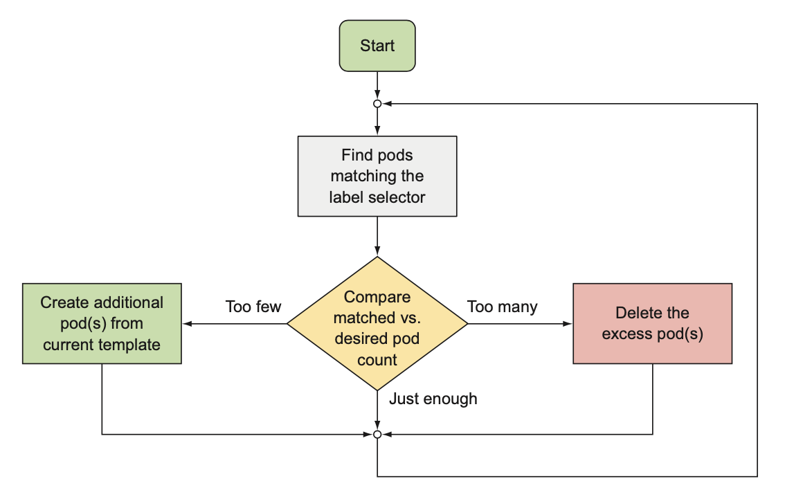
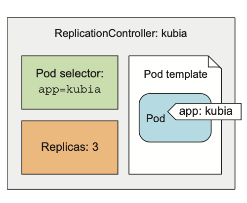
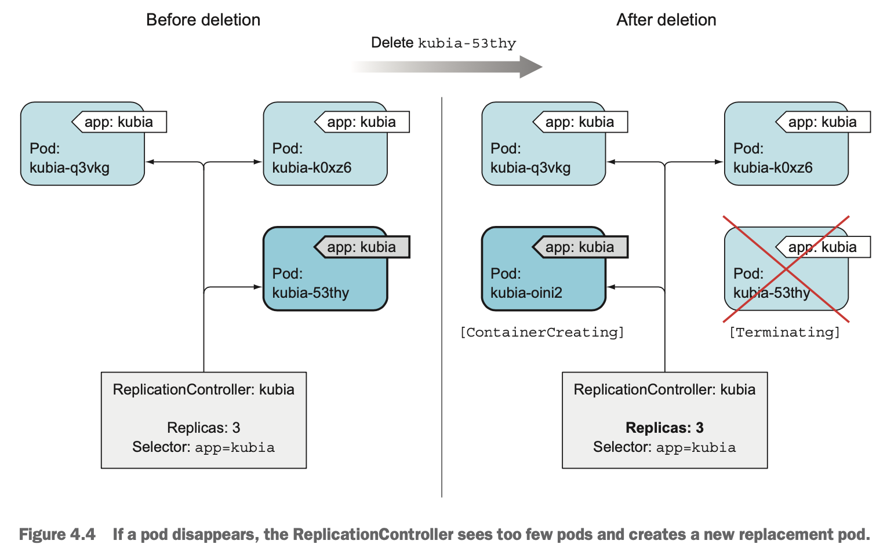
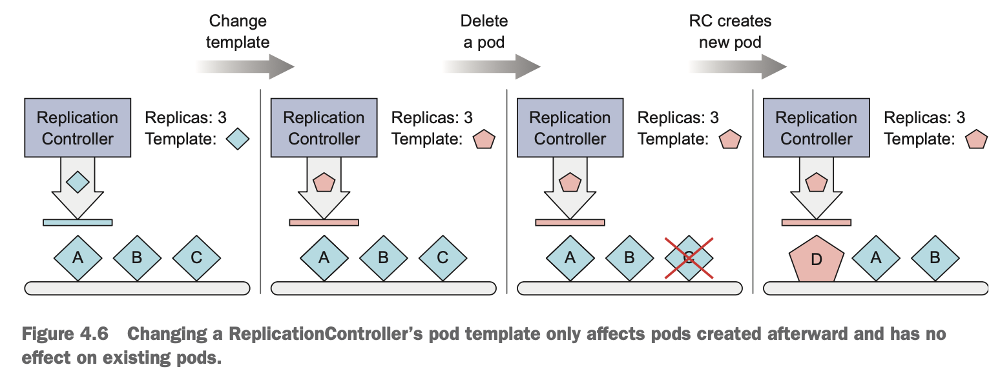

# Ch4. 레플리케이션과 그 밖의 컨트롤러: 관리되는 파드 배포

*[ReplicaSet](https://kubernetes.io/ko/docs/concepts/workloads/controllers/replicaset/)을 구성하는 [Deployment](https://kubernetes.io/ko/docs/concepts/workloads/controllers/deployment/)가 현재 권장하는 레플리케이션 설정 방법임*

- 쿠버네티스에서는 수동으로 파드를 생성하고 관리하기보다는 디플로이먼트와 같은 유형의 리소스를 생성해 실제 파드를 생성하고 관리하게 됨
    - 수동으로 파드를 관리하게 될 경우, 노드 전체에 장애가 발생하면 노드에 있는 파드가 유실되며, 새로운 파드로 대체되지 않음

# 파드를 안정적으로 유지하기

- 파드가 한 번 노드에 스케줄링되면, 해당 노드의 kubelet은 파드의 컨테이너를 실행하고 파드가 존재하는 한 컨테이너가 계속 실행되도록 함. crash가 발생하면 kubelet이 컨테이너를 다시 시작함. 그러나 애플리케이션이 프로세스의 crash 없이 작동이 중단되거나, 무한 루프나 교착 상태에 빠져서 응답을 하지 않는 경우 등의 상황에 빠지면 컨테이너를 재시작하기 어려움 ⇒ 외부에서 애플리케이션의 상태 체크가 필요

## 1. 라이브니스 프로브(liveness probe) 소개

- 파드의 spec에 각 컨테이너의 라이브니스 프로브를 지정할 수 있음
- 쿠버네티스는 주기적으로 프로브를 실행하고 프로브가 실패할 경우 컨테이너를 재시작함
- 라이브니스 프로브는 세 가지 메커니즘을 사용함
    - HTTP GET probe: 지정한 IP 주소, 포트, 경로에 HTTP GET 요청을 수행 →  응답 코드가 오류를 나타내거나(HTTP 응답 코드가 4xx 또는 5xx) 전혀 응답하지 않으면 컨테이너 재시작
    - TCP socket probe: 컨테이너의 지정된 포트에 TCP 연결을 시도 → 연결에 성공하지 못하면 컨테이너 재시작
    - Exec probe: 컨테이너 내의 임의의 명령을 실행 → 명령의 종료 코드를 확인 → 상태 코드가 0이 아니면 컨테이너 재시작

## 2. HTTP 기반 라이브니스 프로브 생성

```yaml
apiVersion: v1
kind: pod
metadata:
	name: kubia-liveness 
spec:
	containers:
	- image: luksa/kubia-unhealthy
	    name: kubia
	    livenessProbe:
	      httpGet:
	        path: /
					port: 8080
```

### 3. 동작 중인 라이브니스 프로브 확인

- 컨테이너가 재시작된 이유는 `k describe`를 통해 확인 가능
    
    ```bash
    $ kubectl describe po $POD_NAME
    
    Containers:
      kubia:
        Container ID:   docker://480986f8
        Image:          luksa/kubia-unhealthy
        Image ID:       ocker://sha256:2b208508
        Port:           <none>
        Host Port:      <none>
        State:          Running
          Started:      Tue, 28 Jun 2022 00:22:45 +0900
        Last State:     Terminated
          Reason:       OOMKilled
          Exit Code:    137
          Started:      Tue, 28 Jun 2022 00:16:23 +0900
          Finished:     Tue, 28 Jun 2022 00:17:42 +0900
        Ready:          True
        Restart Count:  60
    ```
    
    - Exit Code 137은 프로세스가 외부 신호에 의해 종료됐음을 나타냄
        - 137은 128 + $\alpha$로 여기서 $\alpha$는 프로세스에 전송된 시그널 번호임. 예제에서 $\alpha$는 9였는데 이는 SIGKILL(강제종료)를 의미
            - 참고로 SIGTERM은 15
    
- crash된 컨테이너의 로그도 확인 가능
    
    ```bash
    k logs $POD_NAME --previous
    ```
    

## 4. 라이브니스 프로브의 추가 속성 설정

- `delay`, `timeout`, `period`등 추가 속성을 줄 수 있음
    - delay는 컨테이너가 시작된 후로부터 프로브가 언제 시작할 건지
    - timeout은 얼마 안에 응답을 받아야하는지
    - period는 얼마 간격으로 프로브를 실행할 것인지
    - failure는 프로브가 실패로 간주하기 위해서 얼마나 참을 건지(failure만큼 응답을 받지 못하면 프로브 실패)
    - livenessProbe 정의할 때 `initialDelaySeconds`를 추가하면 delay를 설정할 수 있음

## 5. 효과적인 라이브니스 프로브 생성

### 라이브니스 프로브가 확인해야 할 사항

- 특정 URL 경로(eg. `/health` )에 요청하도록 구성
- 단 HTTP endpoint에 인증이 필요하면 안됨. 인증이 필요하게 되면 프로브는 항상 실패해 컨테이너를 무한정으로 재시작하게 됨
- 프로브는 애플리케이션의 내부만 체크하고, 외부 요인의 영향을 받지 않도록 해야함

### 프로브를 가볍게 유지하기

- 프로브는 너무 많은 연산 리소스를 사용해서는 안 되며, 완료하는 데 너무 오래 걸리지 않아야 함
- 기본적으로 프로브는 비교적 자주 실행되며 1초 내에 완료되어야 함

← 너무 많은 일을 하는 프로브는 컨테이너의 속도를 상당히 느려지게 만듦

### 프로브에 재시도 루프를 구현하지 마라

- 프로브는 실패 임계값(failure)을 설정할 수 있으며, 프로브 실패를 판단하기 위해 프로브를 여러번 재시도 함(심지어 임계값이 1이더라도)

# 레플리케이션컨트롤러 소개

- 레플리케이션컨트롤러는 쿠버네티스 리소스로서 파드가 항상 실행되도록 보장하며 파드의 여러 복제본(레플리카)를 작성하고 관리

## 1. 레플리케이션컨트롤러의 동작

- 실행 중인 파드 목록을 지속적으로 모니터링, 특정 유형의 실제 파드 수가 의도하는 수와 일치하는지 항상 확인

### 컨트롤러 조정 루프 소개

- 레플리케이션컨트롤러의 역할은 정확한 수의 파드가 항상 레이블 셀렉터와 일치하는지 확인 → 그렇지 않으면 스케일 조정



### 레플리케이션컨트롤러의 세 가지 요소 이해

- 레이블 셀렉터(label selector): 레플리케이션컨트롤러의 범위에 있는 파드를 결정
- 레플리카 수(replica count): 실행할 파드의 의도하는(desired) 수를 지정
- 파드 템플릿(pod template): 새로운 파드 레플리카를 만들 때 사용



### 컨트롤러의 레이블 셀렉터 또는 라드 템플릿 변경의 영향 이해

- 레이블 셀렉터와 파드 템플릿을 변경하더라도 기존의 파드에는 영향 x
    - 레이블 셀렉터 변경 → 기존에 관리하던 파드들 관리 중지 & 새로운 파드 그룹 관리
    - 파드 템플릿 변경 → 새로 파드를 생성할 때만 영향

### 레플리케이션컨트롤러 사용 시 이점

- 기존 파드가 사라지면 새 파드를 시작해 파드가 항상 실행되도록 함
- 클러스터 노드에 장애가 발생하면 장애 노드에서 실행 중이던 파드에 관한 교체 복제본이 다른 노드에 생성
- 수동 또는 자동으로 파드를 쉽게 수평적 확장 가능

## 2. 레플리케이션컨트롤러 생성

- 레플리케이션컨트롤러 YAML 예시
    
    ```yaml
    apiVersion: v1
    kind: ReplicationController
    metadata:
      name: kubia
    spec:
      replicas: 3
      selector:
        app: kubia
      template:
        metadata:
          labels:
            app: kubia
        spec:
          containers:
          - name: kubia
            image: luksa/kubia
            ports:
            - containerPort: 8080
    ```
    
- 템플릿의 파드 레이블은 레플리케이션컨트롤러의 레이블 셀렉터와 완전히 일치해야 함
    - API 서버는 레플리케이션컨트롤러의 정의를 검증하고 잘못 구성된 경우 이를 받아들이지 않음
    - 셀렉터를 명시적으로 쓰지 않으면, 템플릿의 레이블로 자동 설정됨

## 3. 레플리케이션컨트롤러 작동 확인

### 레플리케이션 컨트롤러 정보 얻기

- `k get`
    
    ```bash
    $ k get rc
    NAME    DESIRED CURRENT READY AGE
    kubias  3       3       2     3m
    ```
    
    - desired: 의도하는 pod 수
    - current: 현재 pod 수
    - ready: 준비된 pod 수
- `k describe`로 더 자세한 정보를 얻을 수 있음

### 컨트롤러가 새로운 파드를 생성한 원인 정확히 이해하기

- 레플리케이션컨트롤러는 파드 삭제 그 자체에 대응하기 보다는 삭제가 된 상태(부족한 파드 수)에 대응함



### 노드 장애 대응

- 레플리케이션 컨트롤러는 노드의 파드가 다운됐음을 감지하자마자 파드를 대체하기 위해 새 파드를 기동
- 노드가 일정 시간 동안 접속할 수 없는 상태가 되면(노드 장애) 해당 노드에 스케줄된 파드의 상태가 Unknown으로 변경 → 다른 노드에 새로운 파드 생성 → 노드 장애 해결 → 노드 READY로 돌아옴 → Unknown 파드 삭제

## 4. 레플리케이션컨트롤러의 범위 안팎으로 파드 이동하기

- 파드의 레이블을 변경하여 rc가 관리하는 범위를 조절할 수 있음
    - eg) 디버깅을 위해 버그가 생긴 파드를 rc의 범위 밖으로 빼내기

### 레플리케이션컨트롤러가 관리하는 파드에 레이블 추가

- 관리되고 있는 파드에 다른 레이블을 추가하더라도 rc는 상관하지 않음
- 오직 레이블 셀렉터에서 참조하는 모든 레이블을 가지고 있는지만 고려

## 5. 파드 템플릿 변경

- 파드 템플릿은 언제든지 변경이 가능하나, 현재 생성된 파드에는 영향이 없음. 이후 생성되는 파드부터 새롭게 적용.



- `k edit`로 yaml을 직접 수정하여 적용할 수 도있으나, 더 나은 방법이 ch9에 소개 될 예정

## 6. 수평 파드 스케일링

- `k scale`
    
    ```bash
    k scale rc $RC_NAME --replicas=$NUM
    ```
    
- `k edit`을 이용해 rc의 replicas 필드 값을 변경
    
    ```yaml
    apiVersion: v1
    kind: ReplicationController
    metadata: ...
    spec:
      replicas: 3
      selector:
    app: kubia
    ```
    

## 7.레플리케이션컨트롤러 삭제

- `k delete`로 rc를 삭제하면 파드도 삭제 됨
- `—-cascade=flase`로 rc만 삭제하고 파드는 실행 상태로 둘 수도 있음
    
    ```bash
    k delete rc $RC_NAME --cascade=false
    ```
    

# 레플리케이션컨트롤러 대신 레플리카셋 사용하기

- 일반적으로 레플리카셋은 직접 생성하지 않고 디플로이먼트 리소스를 생성할 때 자동으로 생성되게 함

## 1. 레플리카셋과 레플리케이션컨트롤러 비교

- 레플리카셋은 레플리케이션컨트롤러와 똑같이 동작하지만 좀 더 풍부한 표현식을 사용하는 파드 셀렉터를 가지고 있음
- 레플리카셋은 특정 레이블이 없는 파드나 레이블 값과는 상관없이 키를 가지고 있는 파드를 모두 매칭시킬 수도 있음

## 2. 레플리카셋 정의하기

- selector에 `matchLabels`는 기존 레플리케이션컨트롤러와 동일한 방식으로 key와 value가 모두 일치해야만 파드가 선택됨
    
    ```yaml
    apiVersion: apps/v1beta2 
    kind: ReplicaSet
    metadata:
      name: kubia
    spec:
      replicas: 3
      selector:
        matchLabels:
          app: kubia 
      template:
        metadata:
          labels:
            app: kubia
        spec:
          containers:
          - name: kubia
            image: luksa/kubia
    ```
    

## 3. 레플리카셋의 더욱 표현적인 레이블 셀렉터 사용하기

- `matchExpressions`을 통해 표현적인 레이블 셀렉터를 사용할 수 있음
    
    ```yaml
    selector:
        matchExpressions:
          - key: app
            operator: In
            values:         
             - kubia
    ```
    
- 각 표현식은 key, operator, values(operator에 따라 다름)이 포함되어야함
- operator 종류
    - In: 레이블의 value가 지정된 값 중 하나와 일치
    - NotIn: 레이블의 value가 지정된 값과 일치하지 않아야함
    - Exists: 지정된 key를 포함되어야함. value 필드는 지정되지 않음
    - DoesNotExist: 지정된 key를 포함하지 않아야함. value 필드는 지정되지 않음
- 여러 표현식을 지정할 수 있지만, 이 경우 모든 표현식이 true여야함
- `matchLabels`와 `matchExpressions`을 모두 지정하는 경우, 셀렉터가 파드를 매칭하기 위해서 모든 레이블이 일치하고, 모든 표현식이 true여야함

# 데몬셋을 사용해 각 노드에서 정확히 한 개의 파드 실행하기

- 레플리케이션컨트롤러, 레플리카셋은 쿠버네티스 클러스터 내에만 지정된 수가 있으면 됨
- 그러나 클러스터 모든 노드에, 노드당 하나의 파드만 실행되길 원하는 경우 데몬셋을 이용하면 됨
    - eg) 시스템 수준의 작업을 수행하는 인프라 관련 파드들(로그 수집기, 리소스 모니터링, kube-proxy 등)

## 1. 데몬셋으로 모든 노드에 파드 실행하기

- 데몬셋에 의해 생성되는 파드는 타깃 노드가 이미 지정돼 있고, 쿠버네티스 스케줄러를 건너뜀. 또한, 레플리카의 개념이 필요 없음

## 2. 데몬셋을 사용해 특정 노드에서만 파드를 실행하기

- 데몬셋 정의 시 파드 템플릿에서 `node-Selector` 속성을 지정하면 특정 노드에서만 실행시킬 수 있음


```yaml
apiVersion: apps/v1beta2
kind: DaemonSet
metadata:
  name: ssd-monitor
spec:
  selector:
    matchLabels:
      app: ssd-monitor
  template:
    metadata:
      labels:
        app: ssd-monitor
    spec:
      nodeSelector:
        disk: ssd
      containers:
      - name: main
        image: luksa/ssd-monitor
```

# 완료 가능한 단일 태스크를 수행하는 파드 실행

- 완료 가능한 태스크는 작업이 완료한 후 종료가 되는 태스크를 의미하며, 이런 태스크들은 프로세스가 종료된 후 다시 시작될 필요가 없음
- 쿠버네티스의 잡은 이러한 기능을 지원

## 1. 잡 리소스 소개

- 잡은 파드의 컨테이너 내부에서 실행중인 프로세스가 성공적으로 완료되면 컨테이너를 다시 시작하지 않는 파드를 실행시킴 → 파드는 완료된 것으로 간주
- 잡에서 관리하는 파드는 성공적으로 끝날 때까지 다시 스케줄링 됨
- 노드의 장애가 발생할 경우 해당 노드에 있던 잡이 관리하는 파드는 다른 노드에 다시 스케줄링 됨
- 프로세스 자체에 장애가 발생한 경우는 잡에서 컨테이너 재시작 여부를 지정할 수 있음

## 2. 잡 리소스 정의

```yaml
apiVersion: batch/v1
kind: Job
metadata:
  name: batch-job
spec:  
  template:
    metadata:
      labels:
        app: batch-job
    spec:
      restartPolicy: OnFailure
      containers:
      - name: main
        image: luksa/batch-job
```

- 잡은 `restartPolicy`로 Always를 사용할 수 없음
    - OnFailure나 Never로 명시적으로 설정해야함

## 3. 파드를 실행한 잡 보기

```bash
$ k get po -a
```

- 파드가 완료되어도 삭제되지 않는데 그 이유는 해당 파드의 로그를 검사할 수 있게 하기 위해서임

## 4. 잡에서 여러 파드 인스턴스 실행하기

- 잡은 두 개 이상의 파드 인스턴스를 생성해 병렬, 또는 순차적으로 실행하도록 구성 할 수 있음

### 순차적으로 잡 파드 실행하기

- `completions` 설정
    
    ```yaml
    apiVersion: batch/v1
    kind: Job
    metadata:
    name: multi-completion-batch-job 
    spec:
      completions: 5
      template:
    
    ```
    
    - 5개의 job을 순차적으로 실행

### 병렬로 잡 파드 실행하기

- `parallelism` 설정
    
    ```yaml
    apiVersion: batch/v1
    kind: Job
    metadata:
    name: multi-completion-batch-job 
    spec:
      completions: 5
    	parallelism: 2
      template:
    
    ```
    
    - 2개까지 job을 병렬적으로 실행

### 잡 스케일링

- 잡이 실행되는 동안 잡의 `parallelism` 속성을 변경할 수도 있음

```bash
k scale job $JOB_NAME --replicas 3
```

### 잡 파드가 완료되는 데 걸리는 시간 제한하기

- `activeDeadlineSeconds` 속성으로 파드 실행 시간을 제한할 수 있음. 파드가 이보다 오래 실행되면 시스템이 종료를 시도하고 잡이 실패한 것으로 표시
- `backoffLimiit` 속성으로 실패로 표시되기 전에 잡을 재시도 할 수 있는 횟수를 설정 할 수 있음(기본값은 6)

# 잡을 주기적으로 또는 한 번 실행되도록 스케줄링하기

- 특정 시간 또는 지정된 가격으로 반복 실행하는 작업을 크론 작업이라고 함
- 크론잡 리소스를 통해 쿠버네티스에서 크론 작업을 할 수 있음

## 1. 크론잡 생성하기

```yaml
apiVersion: batch/v1beta1
kind: CronJob
metadata:
  name: batch-job-every-fifteen-minutes
spec:
  schedule: "0,15,30,45 * * * *"
  jobTemplate:
    spec:
      template:
        metadata:
          labels:
            app: periodic-batch-job
        spec:
          restartPolicy: OnFailure
          containers:
          - name: main
            image: luksa/batch-job
```

### 스케줄 설정하기

- 스케줄은 왼쪽에서 오른쪽으로 다섯 개의 항목을 가지고 있음
    - 분, 시, 일, 월, 요일
- eg)
    - 15분마다 잡을 실행
        
        “0, 15, 30, 45 * * * *”
        
    - 매달 첫째 날에 30분마다 시행
        
        “0, 30 * 1 * *”
        
    - 일요일 3AM마다 실행
        
        “0 3 * * 0”
        

## 2. 스케줄된 잡의 실행 방법 이해

- 잡 리소스는 대략 예정된 시간에 크론잡 리소스를 생성 → 잡은 파드를 생성
- 잡이나 파드가 상대적으로 늦게 생성되고 실행될 수 있음. 이런 경우, `startingDeadlineSeconds`을 설정하여 생성 시 걸리는 시간에 데드라인을 설정할 수 있음
- 일반적으로 크론잡은 스케줄에 설정한 각 실행에 항상 하나의 잡만 생성. 그러나 두개의 잡이 동시에 생성되거나 전혀 생성되지 않을 수도 있음
    - 첫번째를 해결하기 위해서는 잡이 멱등성(한 번 실행이 아니라 여러번 실행해도 원치 않는 결과가 초래되지 않음)을 가져야 함
    - 두번째를 해결하기 위해서는 다음 번 잡 실행이 이전의(누락된) 실행에서 완료했어야 하는 작업을 수행하는지 확인
