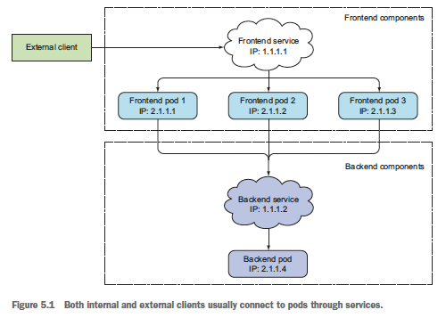

# Ch5. 서비스: 클라이언트가 파드를 검색하고 통신을 가능하게 함

- 쿠버네티스에서는 서버의 정확한 IP주소나 호스트 이름을 지정해 각 클라이언트 애플리케이션을 구성하게 되면 동작 하지 않음
    - 파드는 일시적(스케일링을 통해 변동 가능)
    - 클라이언트는 서버인 파드의 IP 주소를 미리 알 수 없음(파드의 IP주소는 스케줄링 후 파드 시작 되기 직전에 할당됨)
    - 수평 스케일링을 통해 여러 파드가 동일한 서비스를 제공할 수 있으며, 이 때 각 파드는 고유한 IP 주소를 가지고 있음. 따라서 개별 파드의 IP주소가 아닌 단일 IP 주소로 액세스가 가능해야 함

# 서비스 소개

- 서비스는 존재하는 동안 바뀌지 않는 IP주소와 포트를 갖고 있음



## 1. 서비스 생성

- 서비스는 레이블 셀렉터를 통해 파드를 지정함
- 서비스는 2가지 방식으로 생성 할 수 있음
    - `k expose`
        
        ```bash
        k expose po $NAME --type=LoadBalancer --name $LOADBALANCER_NAME
        ```
        
    - YAML로 정의하기
        
        ```yaml
        apiVersion: v1
        kind: Service
        metadata:
          name: kubia
        spec:
          ports:
          - port: 80 # 서비스가 사용할 포트
            targetPort: 8080 # 서비스가 포워드할 컨테이터 포트
          selector:
            app: kubia
        ```
        

### 생성된 서비스 조회하기

```bash
$ k get svc
NAME         TYPE        CLUSTER-IP       EXTERNAL-IP   PORT(S)   AGE
kubernetes   ClusterIP   10.111.240.1     <none>        443/TCP   30d
kubia        ClusterIP   10.111.249.153   <none>        80/TCP    4s
```

- 클러스터 IP는 클러스터 내부에서만 액세스할 수 있음

### 클러스터 내에서 서비스 테스트

- 클러스터 IP로 요청을 보내고 응답을 로그로 남기는 파드를 생성 → 응답 확인
- 쿠버네티스 노드로 `ssh` 접속 → `curl`
- `k exec`로 기존 파드에 접근 → `curl`

### 실행 중인 컨테이너에 원격으로 명령어 실행

```bash
$ k exec $POD_NAME -- curl -s $CLUSTER_IP
```


### 서비스의 세션 어피니티 구성

```yaml
apiVersion: V1
kind: Service
spec:
  sessionAffinity: ClientIP
```

- sessionAffinity
    - None: 서비스 프록시가 각 연결을 임의의 파드를 선택해 연결을 전달함
    - ClientIP: 특정 클라이언트의 모든 요청을 매번 같은 파드로 리디렉션 함
- 쿠버네티스는 쿠기 기반 세션 어피니티(cookie-based session affinity) 옵션이 없음
    
    ← 쿠버네티스 서비스가 HTTP 수준에서 작동하지 않음
    

### 동일한 서비스에서 여러 개의 포트 노출

- 서비스는 단일 포트만 노출하지만 여러 포트를 지원할 수 있음
- 멀티 포트 서비스를 사용하기 위해서는 각 포트의 이름을 지정해야함

```yaml
apiVersion: v1
kind: Service
metadata:
  name: kubia
spec:
  ports:
  - name: http
    port: 80
    targetPort: 8080
  - name: https
    port: 443
    targetport: 8443
  selector:
    app: kubia
```

- 레이블 셀렉터는 서비스 전체에 적용되기 때문에 각 포트를 개별적으로 구성할 수는 없음. 다른 포트가 다른 파드 서브셋에 매핑되도록 하려면 서비스를 두 개 만들어야함

### 이름이 지정된 포트 사용

- 각 파드의 포트에 이름을 지정하고 서비스 스펙에서 targetPort에 이름을 참조해서 구성할 수도 있음
- 장점: 서비스 스펙을 변경하지 않고도 포트 번호를 변경 할 수 있음

```yaml
kind: pod
spec:
  containers:
  - name: kubia
    ports:
    - name: http
      containerPort: 8080
    - name: https
      containerPort: 8443
```

```yaml
apiVersion: v1
kind: Service
metadata:
  name: kubia
spec:
  ports:
  - name: http
    port: 80
    targetPort: http
  - name: https
    port: 443
    targetport: https
  selector:
    app: kubia
```

## 2. 서비스 검색

- 클라이언트 파드가 서비스의 IP와 포트를 알아야지만 주소로 액세스 가능. 그렇다면 클라이언트 파드는 어떻게 서비스의 IP와 포트를 알아낼까?

### 환경변수를 통한 서비스 검색

- 파드가 시작되면 쿠버네티스는 해당 시점에 존재하는 각 서비스를 가리키는 환경 변수 셋을 초기화 함
    - 클라이언트 파드를 생성하기 전에 서비스를 생성하면 해당 파드의 프로세스는 환경변수를 검사해 서비스의 IP 주소와 포트를 얻을 수 있음

```bash
$ k exec $POD_NAME env
KUBERNETES_SERVICE_HOST=10.111.240.1
KUBERNETES_SERVICE_PORT=443
KUBIA_SERVICE_HOST=10.111.249.153
KUBIA_SERVICE_PORT=80
```

### DNS를 통한 서비스 검색

- kube-system 네임스페이스에 kube-dns 존재
    - DNS 서버를 실행 & 클러스터에서 실행 중인 다른 모든 파드는 자동으로 이를 사용하도록 구성
    - 파드에서 실행 중인 프로세스에서 수행된 모든 DNS 쿼리는 시스템에서 실행 중인 모든 서비스를 알고 있는 쿠버네티스의 자체 DNS 서버로 처리됨
- 서비스는 내부 DNS 서버에서 DNS 항목을 가져오고 서비스 이름을 알고 있는 클라이언트 파드는 환경변수 대신 FQDN(정규화된 도메인 이름)으로 액세스 가능

### FQDN을 통한 서비스 연결

- FQDN 예제
    
    ```bash
    $SERVICE_NAME.$NAME_SPACE.svc.cluster.local
    ```
    
    - svc.cluster.local은 모든 클러스터의 로컬 서비스 이름에 사용되는 클러스터 도메인 접미사
    - 클라이언트 파드와 요청하고자 하는 파드와 동일한 네임스페이스에 있는 경우 svc.cluster.local와 네임스페이스는 생략 가능
        
        ```bash
        $ curl http://kubia.default.svc.cluster.local
        $ curl http://kubia.default
        $ curl http://kubia
        ```
        

### 서비스 IP에  핑을 할 수 없는 이유

- curl은 동작하지만 ping은 응답이 없는데, 이는 서비스의 클러스터 IP가 가상 IP이므로 서비스 포트와 결합된 경우에만 의미가 있기 때문
    
    ← 11장에서 서비스의 동작 방식과 연결
    

# 클러스터 외부에 있는 서비스 연결

- 서비스가 클러스터 내에 있는 파드로 연결을 전달하는 게 아니라, 외부 IP와 포트로 연결을 전달할 필요가 있음
    
    ⇒ 서비스 로드밸런싱과 서비스 검색을 활용하여 연결
    

## 1. 서비스 엔드포인트 소개

- 서비스는 파드에 직접 연결되지 않으며, 엔드포인트 리소스를 사이에 두고 있음

```bash
$ k describe svc $SVC_NAME
Name:           kubia
Namespace:      default
Labels:         <none>
Selector:       app=kubia
Type:           ClusterIP
IP:             10.111.249.153
Port:           <unset> 80/TCP
Endpoints:      10.108.1.4:8080,10.108.2.5:8080,10.108.2.6:808
```

- 서비스의 파드 셀렉터는 엔드포인트 목록을 만드는데에 사용됨. 연결을 전달할 때 직접 사용 x
- 엔드포인트는 서비스로 노출되는 파드의 IP 주소와 포트 목록

## 2. 서비스 엔드포인트 수동 구성

- 수동으로 관리되는 엔드포인트를 사용해 서비스를 만들려면 서비스와 엔드포인트 리소스를 모두 만들어야 함
    - 파드 셀렉터 없이 서비스를 만들면 쿠버네티스는 엔드포인트를 생성하지 못함
    - 서비스에서 셀렉터를 제거하면 쿠버네티스는 엔드포인트 업데이트를 멈춤(이는 서비스의 실제 구현이 변경되는 동안에도 서비스 IP 주소가 일정하게 유지 될 수 있음을 의미)

### 셀렉터가 없는 서비스에 관한 엔드포인트 리소스 생성

- 엔드포인트의 이름은 서비스 이름과 일치해야하며, 서비스를 제공하는 대상 IP주소와 포트 목록을 가지고 있어야 함

```yaml
apiVersion: v1
kind: Endpoints
metadata:
  name: external-service
subsets:
  - addresses:
    - ip: 11.11.11.11
    - ip: 22.22.22.22
    ports:
    - port: 80
```

## 3. 외부 서비스를 위한 별칭 생성

- `ExternalName`을 사용하면 FQDN으로 외부 서비스를 참조할 수 있음

### ExternalName 서비스 생성

```yaml
apiVersion: v1
kind: Service
metadata:
  name: external-service
spec:
  type: ExternalName
  externalName: api.somecompany.com
  ports:
  - port: 80
```

- 서비스 이름 대신 `ExternalName`으로 접근할 수 있음
    
    ```bash
    external-service.$NAME_SPACE.svc.cluster.local
    ```
    
- `ExternalName`서비스는 DNS 레벨에서만 구현
    - 서비스에 연결하는 클라이언트는 서비스 프록시를 완전히 무시하고 외부 서비스에 직접 연결됨 → ClusterIP를 얻지 못함

# 외부 클라이언트에 서비스 노출


- 외부에서 서비스를 액세스할 수 있는 방법
    - 노트포트로 서비스 유형 설정
    - 서비스 유형을 노드포트 유형의 확장인 로드밸런서로 설정:
    - 단일 IP 주소로 여러 서비스를 노출하는 인그레스 리소스 만들기

## 1. 노드포트 서비스 사용

- 노드의 특정 포트를 서비스로 할당(모든 노드가 동일한 포트를 사용)
- 서비스 내부 클러스터IP뿐만 아니라 모든 노드의 IP와 할당된 노드포트로 서비스에 액세스할 수 있음
- 해당 노드포트에 대한 외부 연결을 허용하도록 방화벽을 구성해야할 수도 있음

```yaml
apiVersion: v1
kind: Service
metadata:
  name: kubia-nodeport
spec:
  type: NodePort
  ports:
  - port: 80
    targetPort: 8080
    nodePort: 30123
  selector:
    app: kubia
```

### 노드포트 서비스 확인

```bash
$ k get svc kubia-nodeport
NAME                  CLUSTER-IP        EXTERNAL-IP       PORT(S)       AGE
kubia-loadbalancer    10.111.245.223    <nodes>           80:32143/TCP  1m
```

- 아래의 방식으로 액세스 가능
    - `$CLUSTER_IP:port`
    - `$FIRST_NODE_IP:nodePort`
    - `$SECOND_NODE_IP:nodePort`


## 2. 외부 로드밸런서로 서비스 노출

- 모든 노드에 요청을 분산시키고, 오프라인 상태인 노드로 요청을 보내지않도록 핸들링
- 클라우드 공급자를 사용한다면 해당 클라우드 인프라에서 로드밸런서를 자동으로 프로비저닝하는 기능을 제공함
    - 쿠버네티스가 로드밸런서 서비스를 지원하지 않는 환경이라면 로드밸런스는 프로비저닝되지 않지만 서비스는 여전히 노드포트 서비스처럼 작동
- 로드밸런서는 공개적으로 액세스 가능한 고유한 IP주소를 가지며 모든 연결을 서비스로 전달

```yaml
apiVersion: v1
kind: Service
metadata:
  name: kubia-loadbalancer
spec:
  type: LoadBalancer
  ports:
  - port: 80
    targetPort: 8080
  selector:
    app: kubia
```

### 로드밸런서를 통한 서비스 연결

```bash
$ k get svc kubia-loadbalancer
NAME                  CLUSTER-IP        EXTERNAL-IP       PORT(S)       AGE
kubia-loadbalancer    10.111.245.223    130.211.53.173    80:32143/TCP  1m
```


## 3. 외부 연결의 특성 이해

### 불필요한 네트워크 홉의 이해와 예방

- 외부 클라이언트가 노드포트로 서비스에 접속할 경우 파드에 도달하기 위해 추가적인 네트워크 홉(네트워크에서 출발지와 목적지 사이에 위치한 경로의 한 부분)이 필요할 수 있음
- 외부의 연결을 수신한 노드에서 실행 중인 파드로만 외부 트래픽을 전달하도록 서비스를 구성해 추가 홉을 방지 할 수 있음
    - spec에 `externalTrafficPolicy`를 설정하면됨
    - eg)
        
        ```yaml
        spec:
          externalTrafficPolicy: Local
        ```
        
        - 서비스 프록시는 로컬에서 실행 중인 파드를 선택하며, 로컬 파드가 존재하지 않으면 연결이 중단됨
        - 연결이 모든 파드에 균등하게 분산되지 않을 수 있음
            
            
            

### 클라이언트 IP가 보존되지 않음 인식

- 노드포트로 연결을 수신하면 패킷에서 소스 네트워크 변환(SNAT)이 수행되므로 패킷의 소스 IP가 변경됨
- 로컬 외부 트래픽 정책(Local External Traffic Policy)은 연결을 수신하는 노드와 대상 파드를 호스팅하는 노드 사이에 추가 홉이 없기 때문에 클라이언트 IP를 보존할 수 있음

# 인그레스 리소스로 서비스 외부 노출

### 인그레스가 필요한 이유

- 인그레스는 하나의 IP주소로 수십 개의 서비스에 접근이 가능하도록 지원
- 클라이언트가 HTTP 요청을 인그레스에 보낼 때, 요청한 호스트와 경로에 따라 전달할 서비스가 결정 됨
    
    
    
- 인그레스는 HTTP 레벨에서 작동하므로 4계층 서비스보다 더 많은 기능을 제공(쿠키 기반 세션 어피니티 등)

## 1. 인그레스 리소스 생성

- 인그레스 리소스를 작동시키려면 클러스터에 인그레스 컨트롤러를 실행해야함
    - 쿠버네티스 환경마다 다른 컨트롤러 구현을 사용할 수 있음

```yaml
apiVersion: extensions/v1beta1
kind: Ingress
metadata:
  name: kubia
spec:
  rules:
  - host: kubia.example.com
    http:
      paths:
      - path: /
        backend:
          serviceName: kubia-nodeport
          servicePort: 80
```

## 2. 인그레스로 서비스 액세스

- [http://kubia.example.com](http://kubia.example.com) 서비스에 액세스하려면 도메인 이름이 인그레스 컨트롤러의 IP와 매핑되도록 해야함

```yaml
$ k get ingresses
NAME        HOSTS                 ADDRESS           PORTS     AGE
kubia       kubia.example.com     192.168.99.100    80        1m
```

- 호스트의 IP를 인그레스 엔드포인트로 지정
    - DNS 서버를 구성
    - `/etc/hosts` 에추가
        
        ```bash
        192.186.99.100 kubia.example.com
        ```
        
- 액세스
    
    ```bash
    curl http://kubia.example.com
    ```
    

### 인그레스 동작 방식


1. 클라이언트가 [kubia.example.com](http://kubia.example.com)의 DNS 조회를 수행 → DNS가 인그레스 컨트롤러의 IP 반환
2. 클라이언트는 HTTP 요청을 인그레스 컨트롤러로 전송(host 헤더에서 [kubia.example.com](http://kubia.example.com) 지정)
3. 인그레스 컨트롤러는 클라이언트가 액세스하려는 서비스를 결정(헤더에서 참조)
4. 인그레스 컨트롤러는 서비스와 관련된 엔트포인트 오브젝트로 파드 IP를 조회 → 파드에 요청 전달
- 인그레스 컨트롤러는 요청을 서비스로 전달하지 않고 파드를 선택하는 데만 사용함

## 3. 하나의 인그레스로 여러 서비스 노출

### 동일한 호스트의 다른 경로로 여러 서비스 매핑

```yaml
...
- host: kubia.example.com
  http:
    paths:
    - path: /kubia
      backend:
        serviceName: kubia
        servicePort: 80
    - path: /bar
      backend:
        serviceName: bar
        servicePort: 80
...
```

- URL의 경로에 따라 두 개의 다른 서비스로 전송

### 서로 다른 호스트로 서로 다른 서비스 매핑하기

```yaml
...
spec:
  rules:
  - host: foo.example.com
    http:
      paths:
      - path: /
        backend:
          serviceName: foo
          servicePort: 80
  - host: bar.example.com
    http:
      paths:
      - path: /
        backend:
          serviceName: bar
          servicePort: 80
..
```

- 요청 호스트 헤더에 따라 서비스 전달
- DNS는 [foo.example.com](http://foo.example.com)와 [bar.example.com](http://bar.example.com)을 모두 인그레스 컨트롤러의 IP 주소로 지정해야함

## 4. TLS 트래픽을 처리하도록 인그레스 구성

### 인그레스를 위한 TLS인증서 생성

- 클라이언트가 인그레스 컨트롤러에 대한 TLS 연결을 하면 컨트롤러는 TLS 연결을 종료함
    - 클라이언트와 컨트롤러 간의 통신은 암호화되지만 컨트롤러와 백엔드 파드 간의 통신은 암호화되지 않음. 따라서 파드는 TLS를 지원할 필요 x
- 인그레스 컨트롤러가 TLS와 관련된 모든 것을 처리 하도록 인증서와 개인 키를 인그레스에 첨부
    
    ```bash
    # 개인 키와 인증서 생성
    $ openssl genrsa -out tls.key 2048
    
    # 시크릿 생성
    $ k create secret tls tls-secret --cert=tls.cert --key=tls.key
    ```
    
- `k describe`로 확인
    
    ```yaml
    ...
    spec:
      tls:
      - hosts:
        - kubia.example.com
        secretName: tls-secret
    ...
    ```
    

# 파드가 연결을 수락할 준비가 됐을 때 신호 보내기

## 1. 레디니스 프로브(readiness probe) 소개

- 레디니스 프로브는 주기적으로 호출되며 특정 파드가 클라이언트 요청을 수신할 수 있는지를 결정함
    - 애플리케이션 특성에 따라 상세한 레디니스 프로브를 작성하는 것을 애플리케이션 개발자의 몫

### 레디니스 프로브 유형

- Exec 프로브: 컨테이너의 상태를 프로세스의 종료 상태 코드로 결정
- HTTP GET 프로브: HTTP GET 요청을 컨테이너로 보내고 응답의 상태코드를 보고 결정
- TCP 소켓 프로브: 컨테이너의 지정된 포트로 TCP 연결을 열고 소켓 연결 여부를 보고 결정

### 레디니스 프로브의 동작

- 일정 시간 대기(`initialDelaySeconds`) → 주기적으로 프로브를 호출
- 라이브니스 프로브와는 달리 컨테이너 준비가 실패하더라도 컨테이너가 종료되거나 다시 시작되지 않음
- 레디니스 프로브는 요청을 처리할 준비가 된 파드의 컨테이너만 요청을 수신하도록 함


### 레디니스 프로브가 중요한 이유

- 레디니스 프로브를 사용하면 클라이언트가 정상 상태인 파드하고만 통신하고 시스템에 문제가 있다는 것을 알아채지 못함

## 2. 파드에 레디니스 프로브 추가

```yaml
apiVersion: v1
kind: ReplicationController
metadata:
  name: kubia
spec:
...
  template:
  ...
    spec:
      containers:
      - name: kubia
        image: luksa/kubia
        readinessProbe:
          exec:
            command:
            - ls
            - /var/ready
```

- 파드가 준비됬음을 파악하기
    
    ```bash
    $ k get po $POD_NAME
    NAME                  READY        STATUS       RESTARTS       AGE
    POD_NAME    0/1          Running      0              1m
    ```
    

## 3. 실제 환경에서 레디니스 프로브가 수행해야 하는 기능

- 항상 정의할 것
    - 파드에 레디니스 프로브가 없다면 파드가 시작하는 즉시 서비스 엔드포인트가 됨
- 레디니스 프로브에 파드 종료 코드를 포함하지 말 것
    - 따로 조치를 취하지 않아도 파드가 종료될 때, 모든 서비스에서 파드를 제거하게 됨.

# 헤드리스 서비스로 개별 파드 찾기

- 클라이언트가 모든 파드에 연결을 해야하는 경우, 각 파드의 IP를 알아야함
    - 쿠버네티스는 클라이언트가 DNS 조회로 파드 IP를 찾을 수 있도록 함
    - 일반적으로 DNS 조회를 하면 하나의 ClusterIP만 반환
    - 그러나 서비스 스펙에서 ClusterIP를 None으로 설정하면 DNS는 모든 파드 IP들을 반환

## 1. 헤드리스 서비스 생성

- 서비스 스펙에서 ClusterIP를 None으로 설정하면 서비스가 헤드리스(headless)상태가 됨

```yaml
apiVersion: v1
kind: Service
metadata:
  name: kubia-headless
spec:
  clusterIP: None
  ports:
  - port: 80
    targetPort: 8080
  selector:
    app: kubia
```

- 헤드리스 서비스는 여전히 파드 간에 로드밸런싱을 제공하지만, 서비스 프록시 대신 DNS 라운드 로빈 메커니즘으로 제공

# 서비스 문제 해결

서비스로 파드에 액세스 할 수 없는 경우

- 외부가 아닌 클러스터 내에서 서비스의 클러스터 IP에 연결되는지
- 서비스 IP로 핑을 할 필요 없음(클러스터 IP는 가상 IP이므로 핑이 안됨)
- 레디니스 프로브의 성공 여부
- `k get endpoints`를 사용해 엔드포인트 오브젝트를 확인하여 파드가 서비스의 일부인지 확인
- FQDN이나 그 일부로 서비스에 액세스가 안되는 경우, FQDN 대신 ClusterIP를 사용해 액세스할 수 있는지 확인
- 대상 포트가 아닌 서비스로 노출된 포트에 연결하고 있는지 확인
- 파드 IP에 직접 연결해 파드가 올바른 포트에 연결돼 있는지 확인
- 파드 IP로 애플리케이션에 액세스할 수 없는 경우 애플리케이션이 로컬호스트에만 바인딩 하고 있는지 확인