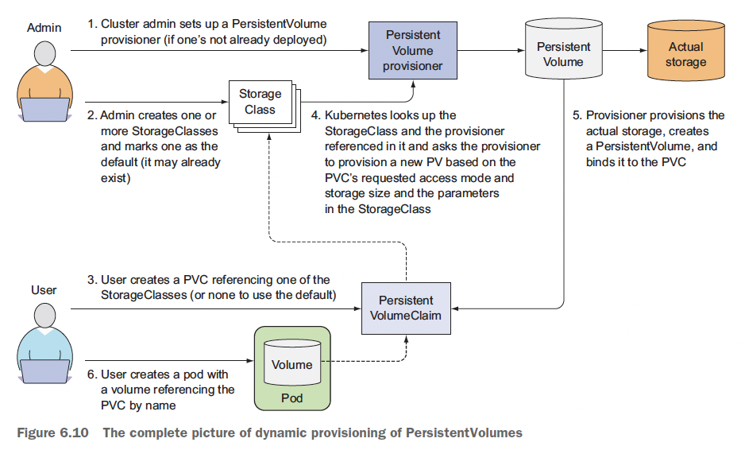

# Ch6. 볼륨: 컨테이너에 디스크 스토리지 연결

- 파드 내부의 각 컨테이너는 고유하게 분리된 파일시스템을 가짐. 파일시스템은  컨테이너 이미지에서 제공되기 때문
- 쿠버네티스는 스토리지 볼륨을 정의하는 방법으로 이 기능을 제공. 최상위 리소스(like 파드)는 아니지만 파드의 일부분으로 정의되며 파드와 동일한 라이프 사이클을 가짐
    - 파드가 시작되면 볼륨이 생성, 파드가 삭제되면 볼륨이 삭제
    - 볼륨의 콘텐츠는 컨테이너를 다시 시작해도 지속됨
    - 또한, 파드가 여러 개의 컨테이너를 가진 경우 모든 컨테이너가 볼륨을 공유

# 볼륨 소개

- 볼륨은 파드 스펙에서 정의. 독립적인 오브젝트가 아니므로 자체적으로 생성, 삭제 될 수 없음.
- 볼륨은 해당 파드의 모든 컨테이너에서 사용 가능하지만, 사용하기 위해서는 마운트를 해야함

## 1. 예제의 볼륨 설명


## 2. 사용 가능한 볼륨 유형 소개

- emptyDir: 일시적인 데이터를 저장하는데에 사용, 간단한 빈 디렉터리
- hostPath: 워커 노드의 파일시스템을 파드의 디렉터리로 마운트하는 데 사용
- gitRepo: 깃 레포의 특정 브랜치로 초기화한 볼륨
- nfs: NFS 공유를 파드에 마운트
- 클라우드 제공자의 전용 스토리지를 마운트: awsElasticBlock 등
- 다른 유형의 네트워크 스토리지를 마운트: cinder, cephfs, iscsi 등
- 쿠버네티스 리소스나 클러스터 정보를 파드에 노출하기 위해 사용되는 특별한 유형의 볼륨: configMap, secret, downwardAPI
- persistentVolumeClaim: 프로비저닝된 퍼시스턴트 스토리지를 사용하는 방법

# 볼륨을 사용한 컨테이너 간 데이터 공유

## 1. emptyDir 볼륨 사용

- 볼륨이 빈 디렉터리로 시작
- 볼륨의 라이프사이클이 파드에 묶여있음(파드가 사라지면 사라짐)
- 동일 파드에서 실행 중인 컨테이너 간 파일 공유에 유용
- 단일 컨테이너에서도 임시 데이터를 디스크에 쓸 경우 사용

### 파드 생성하기

```yaml
apiVersion: v1
kind: Pod
metadata:
  name: fortune
spec:
  containers:
  - image: luksa/fortune
    name: html-generator
    volumeMounts:
    - name: html
      mountPath: /var/htdocs
  - image: nginx:alpine
    name: web-server
    volumeMounts:
    - name: html
      mountPath: /usr/share/nginx/html
      readOnly: true
    ports:
    - containerPort: 80
      protocol: TCP
  volumes:
  - name: html
    emptyDir: {}
```

- html이라는 이름의 emptyDir 볼륨을 두 개의 컨테이너에 각각 다른 path로 마운트

### emptyDir을 사용하기 위한 매체 지정하기

- emptyDir은 워커 노드의 실제 디스크에 생성되므로, 노드 디스크의 유형에 영향을 받음
- 디스크가 아닌 메모리를 사용하는 tmpfs 파일시스템으로 생성하도록 요청 할 수 있음

```yaml
volumes:
- name: html
  emptyDir:
		medium: Memory
```

## 2. 깃 리포지터리를 볼륨으로 사용하기

- gitRepo 볼륨은 emptyDir 볼륨임. 파드가 시작되면(컨테이너가 생성되기 전에) 깃 레포를 복제하고 특정 리비전을 체크아웃해 데이터로 채움


- 깃 레포를 실시간으로 반영하지는 않지만, 파드가 새로 뜨게 되면 최신 커밋을 반영하게 됨
    
    → 새 버전을 보기 위해서는 파드를 삭제하고 다시 생성해야함. 이를 동기화할 수 있도록 추가 프로세스를 실행할 수 있음
    

### 사이드카 컨테이너 소개

- 사이드카 컨테이너는 주 컨테이너의 동작을 보완함

# 워커 노드 파일시스템의 파일 접근

- 특정 시스템 레벨의 파드(보통 데몬셋)는 노드의 파일을 읽거나 파일시스템을 통해 노드 디바이스를 접근하기 위해 노드의 파일 시스템을 사용해야함 → hostPath 볼륨

## 1. hostPath 볼륨 소개

- hostPath 볼륨은 노드 파일시스템의 특정 파일이나 디렉터리를 가르킴


- hostPath 볼륨의 콘텐츠는 파드가 삭제되도 삭제되지 않음
- 파드가 삭제되면 다음 파드가 호스트의 동일 경로를 가리키는 hostPath볼륨을 사용
- 이전 파드와 동일한 노드에 스케줄링된다는 조건에서 새로운 파드는 이전 파드에 남긴 모든 항목을 볼 수 있음

# 퍼시스턴트 스토리지 사용

- 파드에서 실행 중인 애플리케이션이 디스크에 데이터를 유지해야 하고 파드가 다른 노드로 재스케줄링된 경우에도 동일한 데이터를 사용해야 한다면 지금까지 언급한 볼륨 유형은 사용할 수 없음 → 어떤 클러스터 노드에서도 접근이 필요할 경우 NAS(Network-Attached Storage) 유형에 저장되어야함

## 1. 기반 퍼시스턴트 스토리지로 다른 유형의 볼륨 사용하기

### NFS 볼륨 사용하기

- NFS 서버와 서버에서 익스포트 경로(`/etc/exports`)를 지정

```yaml
apiVersion: v1
kind: Pod
metadata:
  name: mongodb-nfs
spec:
  volumes:
  - name: mongodb-data
    nfs:
      server: 1.2.3.4  # NFS 서버의 IP
      path: /some/path # 서버의 익스포트된 경로
  containers:
  - image: mongo
    name: mongodb
    volumeMounts:
    - name: mongodb-data
      mountPath: /data/db
    ports:
    - containerPort: 27017
      protocol: TCP
```

### 다른 스토리지 기술 사용하기

- 각 볼륨 유형별로 필요한 속성의 세부 정보를 보려면 쿠버네티스 API 러페런스를 확인 하거나 `kubectl explain`을 통해 정보를 찾아야함

← 그러나, 파드의 볼륨을 만들기 위해 실제 기반 인프라스트럭처를 참조한다는 것은 쿠버네티스가 추구하는 바가 아님

# 기반 스토리지 기술과 파드 분리

- 일정량의 퍼시스턴트 스토리지를 필요로 하면 쿠버네티스에 요청할 수 있고, 시스템 관리자는 클러스터를 구성해 애플리케이션이 요구한 것을 제공할 수 있어야함

## 1. 퍼시스턴트볼륨(PV)과 퍼시스턴트볼륨클레임(PVC) 소개


- 클러스터 관리자가 기반 스토리지를 설정하고 쿠버네티스 API 서버로 퍼시스턴트볼륨(PV) 리소스를 생성해 쿠버네티스에 등록 & PV가 생성되면 관리자는 크기와 지원 가능한 접근 모드를 지정
- 클러스터 사용자는 퍼시스턴트 스토리지를 사용해야 하면 먼저 최소 크기와 필요한 접근 모드를 명시한 퍼시스턴트볼륨클레임(PVC) 매니페스트를 생성 → PVC를 쿠버네티스 API 서버에 게시하고 쿠버네티스는 적절한 PV를 찾아 클레임에 볼륨을 바인딩
    - PVC는 파드 내부의 볼륨 중 하나로 사용될 수 있음. PVC의 바인딩을 삭제해 릴리스될 때까지 다른 사용자는 동일한 PV를 사용할 수 없음

## 2. PV 생성

```yaml
apiVersion: v1
kind: PersistentVolume
metadata:
  name: mongodb-pv
spec:
  capacity: 
    storage: 1Gi
  accessModes:
    - ReadWriteOnce
    - ReadOnlyMany
  persistentVolumeReclaimPolicy: Retain
  gcePersistentDisk:
    pdName: mongodb
    fsType: ext4
```

- 용량, 동시에 다수 노드에 읽기/쓰기 여부, PV이 해제되면 어떻게 동작해야할 지, 실제 스토리지의 유형, 위치, 그밖의 속성 등을 명시
- PV는 특정 네임스페이스에 속하지 않음. PV는 노드와 같은 클러스터 수준의 리소스

## 3. PVC 생성을 통한 PV 요청

```yaml
apiVersion: v1
kind: PersistentVolumeClaim
metadata:
  name: mongodb-pvc 
spec:
  resources:
    requests:
      storage: 1Gi
  accessModes:
  - ReadWriteOnce
  storageClassName: ""
```

- 접근 모드의 유형
    - RWO(ReadWriteOnce): 단일 노드만이 읽기/쓰기용으로 볼륨을 마운트
    - ROX(ReadWriteMany): 다수 노드가 읽기용으로 볼륨을 마운트
    - RWX(ReadWriteMany): 다수 노드가 읽기/쓰기용으로 볼륨을 마운트
- `k get pvc`를 통해 조회 했을 때, `Available`이라면 아직 사용 x, `Bound`가 되어있으면 클레임에 바인딩 됨

## 4. 파드에서 퍼시스턴트볼륨클레임 사용하기

- 볼륨을 해제할 때까지 다른 사용자는 동일한 볼륨에 클레임을 할 수 없음

```yaml
apiVersion: v1
kind: Pod
metadata:
  name: mongodb 
spec:
  containers:
  - image: mongo
    name: mongodb
    volumeMounts:
    - name: mongodb-data
      mountPath: /data/db
    ports:
    - containerPort: 27017
      protocol: TCP
  volumes:
  - name: mongodb-data
    persistentVolumeClaim: # 파드 볼륨에서 이름으로 PVC를 참조
      claimName: mongodb-pvc
```

## 5. PV와 PVC 사용의 장점 이해하기


- PV와 PVC를 생성하는 절차는 필요하지만, 개발자가 기저에 사용된 실제 스토리지 기술을 알 필요가 없음

## 6. PV 재사용

- 파드와 PVC를 삭제하고 다시 PVC를 생성하면 바로 PV에 바인딩되지 않고 `Pending` 상태로 넘어감
- PV 는 `Released` 상태로 이미 볼륨을 사용했기 때문에 클러스터 관리자가 볼륨을 비우기 전 까지는 PVC에 바인딩 되지 않음

### PV 수동으로 다시 클레임하기

```yaml
persistentVolumeReclaimPolicy: Retain
```

- 위와 같이 설정했을 경우 `Released` 상태가 될 수 있음
- 수동으로 재사용할 수 있는 유일한 방법은 PV 리소스를 삭제하고 다시 생성

### PV 자동으로 다시 클레임하기

- `persistentVolumeReclaimPolicy`
    - ~~Recycle: 볼륨의 콘텐츠를 삭제하고 볼륨이 다시 클레임될 수 있도록 볼륨을 사용가능하게 함~~
    - Delete: 기반 스토리지를 삭제


# PV의 동적 프로비저닝

- 클러스터 관리자는 실제 스토리지를 미리 프로비저닝 해야 함
    - PV를 직접 생성하는 대신 퍼시스턴트볼륨 프로비저너를 배포 & 사용자가 선택 가능한 PV의 타입을 하나 이상의 스토리지클래스(StorageClass)오브젝트로 정의 할 수 있음
        - PV와 유사하게 StorageClass도 네임스페이스에 속하지 않음
    - 사용자가 PVC에서 SC를 참고하면 프로비저너(provisioner)가 퍼시스턴트 스토리지를 프로비저닝할 때 이를 처리

## 1. SC 리소스를 통한 사용 가능한 스토리지 유형 정의하기

```yaml
apiVersion: storage.k8s.io/v1
kind: StorageClass
metadata:
  name: fast
provisioner: kubernetes.io/gce-pd # 퍼시스턴트볼륨 프로비저닝을 위해 사용되는 볼륨 플러그인
parameters:
  type: pd-ssd
```

## 2. PVC에서 스토리지 클래스 요청하기

### 특정 SC를 요청하는 PVC 정의 생성하기

```yaml
apiVersion: v1
kind: PersistentVolumeClaim
metadata:
  name: mongodb-pvc 
spec:
  storageClassName: fast
  resources:
    requests:
      storage: 100Mi
  accessModes:
    - ReadWriteOnce
```

- PVC에서 존재하지 않는 스토리지 클래스를 참조하면 PV 프로비저닝은 실패함 (PVC를 describe 해보면 ProvisioningFailed)

### SC 사용하는 법 이해하기

- SC는 클레임 이름으로 이를 참조함. 그러므로 다른 클러스터 간 SC 이름을 동일하게 사용한다면 PVC 정의를 다른 클러스터로 이식 가능
    - 동일한 PVC 매니페스트와 파드 매니페스트를 배포

## 3. SC를 지정하지 않은 동적 프로비저닝

### SC 조회하기

```bash
$ k get sc

NAME                   TYPE
fast                   kubernetes.io/gce-pd
standard (default)     kubernetes.io/gce-pd
```

### 기본 SC 확인하기

```bash
$ kubectl get sc standard -o yaml

apiVersion: storage.k8s.io/v1
kind: StorageClass
metadata:
	annotations:
		storageclass.beta.kubernetes.io/is-default-class: "true" # SC를 기본값으로 사용
```

### SC를 지정하지 않고 PVC 생성하기

- `storageClassName` 속성을 지정하지 않고 PVC를 생성하면 기본 SC를 사용

### PVC를 미리 프로비저닝된 PV로 바인딩 강제화하기

```yaml
apiVersion: v1
kind: PersistentVolumeClaim
metadata:
  name: mongodb-pvc 
spec:
  resources:
    requests:
      storage: 1Gi
  accessModes:
  - ReadWriteOnce
  storageClassName: "" 
```

- 빈 문자열을 SC 이름으로 지정하면 PVC가 새로운 PV를 동적 프로비저닝하는 대신 미리 프로비저닝된 PV에 바인딩 됨

### PV 동적 프로비저닝의 전체적인 그림

- 가장 최적의 방법은 PVC(SC를 명시적으로 지정한)와 파드(PVC를 이름으로 참조한)만 생성
- 다른 모든 것은 동적 PV 프로비저너가 처리

