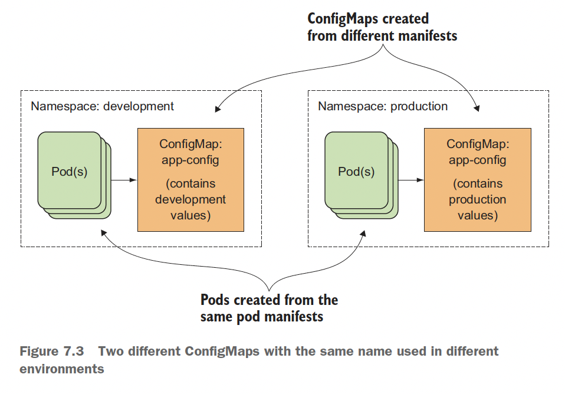
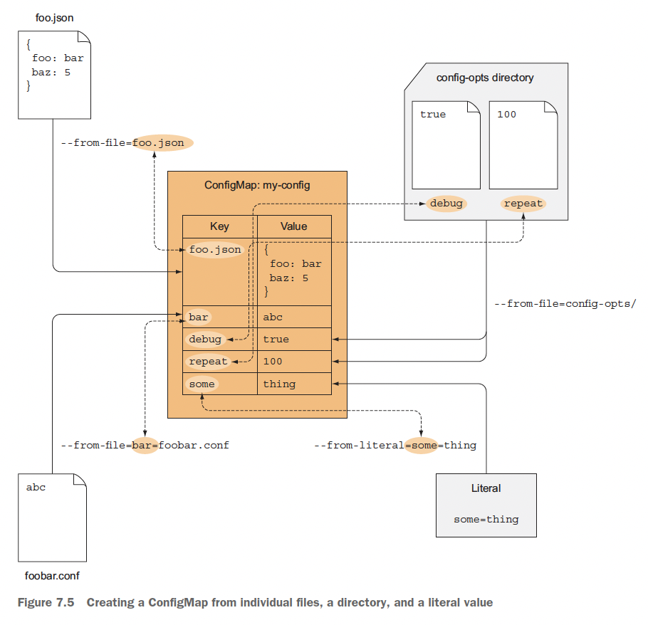
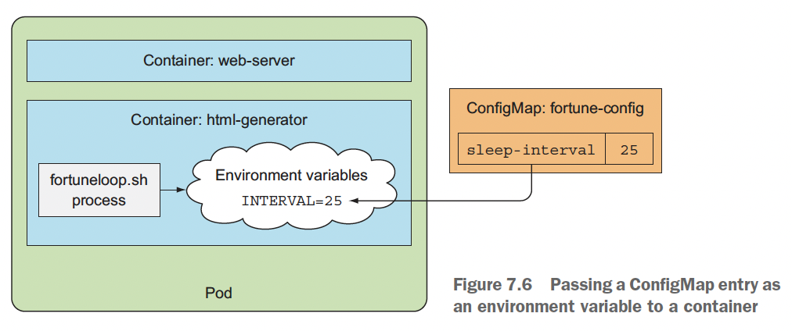
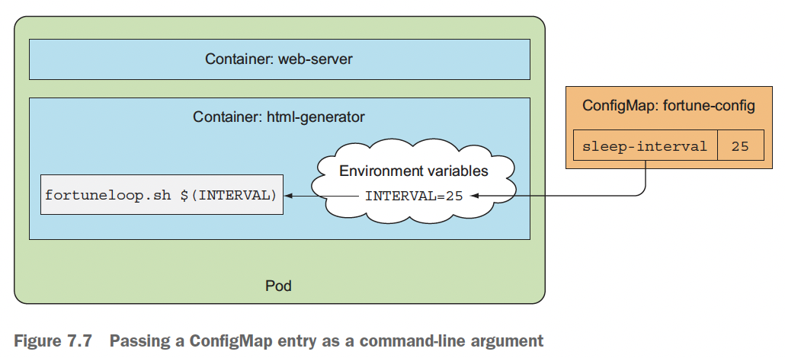
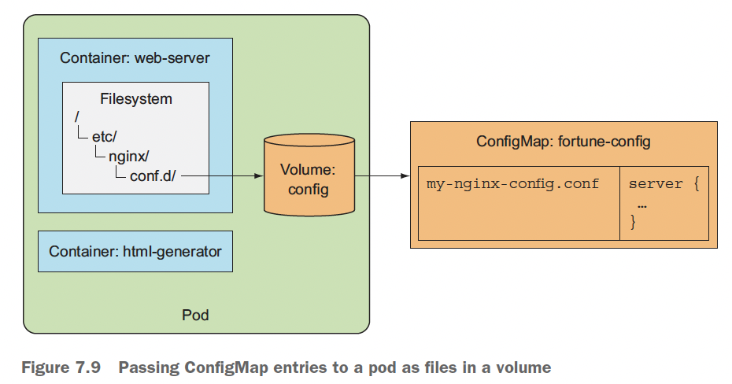
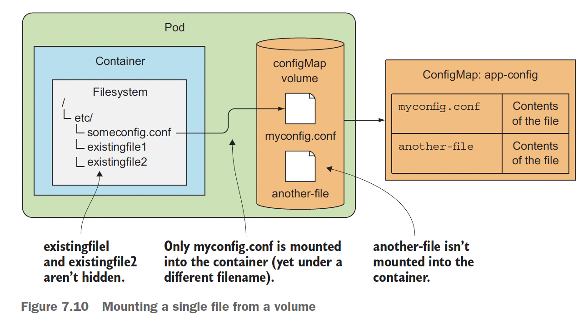
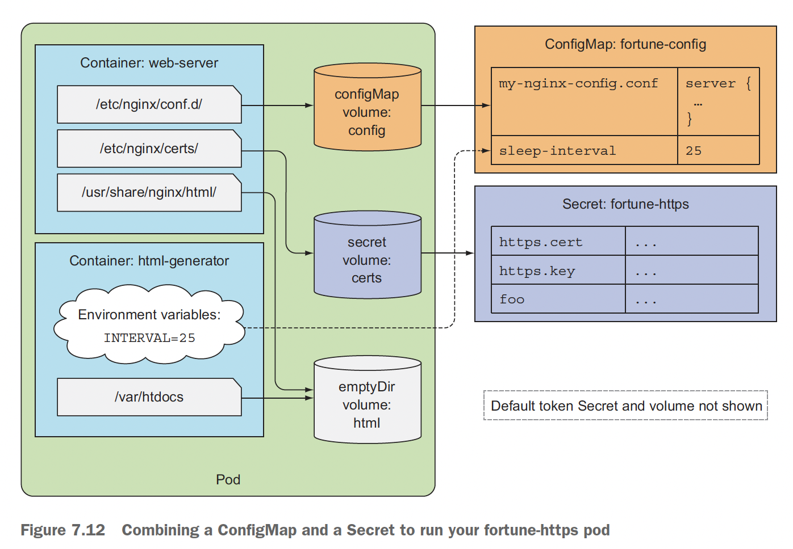

# Ch7. 컨피그맵과 시크릿: 애플리케이션 설정

- 빌드된 애플리케이션 자체에 포함하지 말아야 하는 설정(인스턴스별로 다른 세팅, 자격증명 등) 필요

# 컨테이너화된 애플리케이션 설정

- 컨테이너화된 애플리케이션에서 설정을 애플리케이션에 전달할 때
    - 컨테이너에 명령줄 인수 전달
    - 각 컨테이너를 위한 사용자 정의 환경변수 지정
    - 특수한 유형의 볼륨(ConfigMap)을 통해 설정 파일을 컨테이너에 마운트
- 보안을 유지해야하는 데이터는 Secret이라는 오브젝트를 이용

# 컨테이너에 명령줄 인자 전달

## 1. 도커에서 명령어와 인자 정의

### ENTRYPOINT 와 CMD

- ENTRYPOINT는 컨테이너가 시작될 때 호출될 명령어를 정의
- CMD는 ENTRYPOINT에 전달되는 인자

```bash
docker run $IMAGE $ARGUMENTS
```

- docker run 에서 추가 인자를 지정해 Dockerfile 안의 CMD에 정의된 값을 재정의

### Shell과 exec 형식 간의 차이점

- shell
    
    ```bash
    ENTRYPOINT node app.js
    ```
    
    - 프로세스 목록을 보면 shell 프로세스가 메인 프로세스
- exec
    
    ```bash
    ENTRYPOINT ["node", "app.js"]
    ```
    
    - node 프로세스를 직접 실행

## 2. 쿠버네티스에서 명령과 인자 재정의

- 쿠버네티스에서 컨테이너를 정의할 때, ENTRYPOINT와 CMD 둘 다 재정의 할 수 있음
    - command와 args 필드는 파드 생성 이후에 업데이트 할 수 없음

```yaml
kind: Pod
spec:
	containers:
	- image: some/image
	  command: ["/bin/commnad"] # ENTRYPOINT
	  args: ["arg1", "arg2", "arg3"] # CMD
```

- 인자를 정의할 때, 숫자는 따옴표로 묶어야함

# 컨테이너  환경변수 설정

- 파드의 각 컨테이너를 위한 환경변수 리스트를 지정할 수 있음
    - 환경변수 목록도 파드 생성 후에는 업데이트 할 수 없음

## 1. 컨테이너 정의에 환경변수 지정

```yaml
apiVersion: v1
kind: Pod
metadata:
  name: fortune-env
spec:
  containers:
  - image: luksa/fortune:env
    env:
    - name: INTERVAL
      value: "30"
    name: html-generator
...
```

- 자동으로 동일한 네임스페이스 안에 있는 각 서비스에 환경변수를 노출함

## 2. 변숫값에서 다른 환경변수 참조

```yaml
env:
- name: FIRST_VAR
  value: "30"
- name: SECOND_VAR
  value: "$(FIRST_VAR)bar"
```

- command와 args 속성 모두 이렇게 환경변수를 참조할 수 있음

## 3. 하드코딩된 환경변수의 단점

- 파드 정의에 환경변수를 정의하게되면 개발환경과 프로덕션 환경에 각각 다른 매니페스트를 배포해야함

⇒ 이런 단점을 해결하기 위해 컨피그맵 리소스를 이용

# 컨피그맵으로 설정 분리

## 1. 컨피그맵 소개

- key/value 쌍으로 구성
- 짧은 문자열에서 전체 설정 파일에 이르는 값까지 사용 가능
- 맵의 내용은 컨테이너의 환경변수 또는 볼륨 파일로 전달



- 컨피그맵 키는 유효한 DNS 서브도메인이여야함

## 2. 컨피그맵 생성

### k create configmap

- yaml

```bash
k create configmap -f myconfigmap.yaml
```

- from-literal

```bash
k create configmap fortune-config --from-literal=sleep-interval=25
```

### 파일 내용으로 컨피그맵 생성

- from-file

```bash
k create configmap fortune-config --from-file=customkey=config-file.conf
```

### 디렉터리에 있는 파일로 컨피그맵 생성

```bash
k create configmap fortune-config --from-file=customkey=path/to/dir
```

- 디렉토리에서 컨피그맵 키로 사용하기에 유효한 파일만 추가됨

### 다양한 조합으로 생성 가능



## 3. 컨피그맵 항목을 환경변수로 컨테이너에 전달

```yaml
apiVersion: v1
kind: Pod
metadata:
  name: fortune-env-from-configmap
spec:
  containers:
  - image: luksa/fortune:env
    env:
    - name: INTERVAL
      valueFrom:
        configMapKeyRef:
          name: fortune-config
          key: sleep-interval
    name: html-generator
    volumeMounts:
    - name: html
      mountPath: /var/htdocs
...
```

- 고정 값을 가져오는 대신 `valueFrom`을 통해 컨피그맵 키에서 값을 참조



### 파드에 존재하지 않는 컨피그맵 참조

- 컨테이너가 존재하지 않는 컨피그맵 참조하려고 하면 컨테이너는 시작하는 데 실패함
- `configMapKeyRef.optional: true` 를 사용하면 컨피그맵이 존재하지 않아도 컨테이너는 시작됨

## 4. 컨피그맵의 모든 항목을 한 번에 환경변수로 전달

- 컨피그맵의 모든 항목을 환경변수로 노출하는 방법을 제공 `envFrom`

```yaml
apiVersion: v1
kind: Pod
metadata:
  name: fortune-env-from-configmap
spec:
  containers:
  - image: luksa/fortune:env
    envFrom:
    - prefix: CONFIG_
			configMapRef:
				name: my-conifg-map
...
```

- 컨피그맵의 키가 올바른 형식이 아닌 경우 항목을 건너 뜀

## 5. 컨피그맵 항목을 명령줄 인자로 전달



```yaml
apiVersion: v1
kind: Pod
metadata:
  name: fortune-args-from-configmap
spec:
  containers:
  - image: luksa/fortune:args
    env:
    - name: INTERVAL
      valueFrom: 
        configMapKeyRef:        # 컨피그맵에서 환경 변수 정의
          name: fortune-config
          key: sleep-interval
    args: ["$(INTERVAL)"]       # 정의된 환경 변수 이용
    name: html-generator
...
```

## 6. 컨피그맵 볼륨을 사용해 컨피그맵 항목을 파일로 노출

- 컨피그맵 볼륨은 파일로 컨피그맵의 각 항목을 노출

### 볼륨 안에 있는 컨피그맵 항목 사용



```yaml
apiVersion: v1
kind: Pod
metadata:
  name: fortune-configmap-volume
spec:
  containers:
  - image: luksa/fortune:env
    env:
    - name: INTERVAL
      valueFrom:
        configMapKeyRef:
          name: fortune-config
          key: sleep-interval
    name: html-generator
    volumeMounts:
    - name: html
      mountPath: /var/htdocs
  - image: nginx:alpine
    name: web-server
    volumeMounts:
    - name: html
      mountPath: /usr/share/nginx/html
      readOnly: true
    - name: config
      mountPath: /etc/nginx/conf.d
      readOnly: true
    - name: config
      mountPath: /tmp/whole-fortune-config-volume
      readOnly: true
    ports:
      - containerPort: 80
        name: http
        protocol: TCP
  volumes:
  - name: html
    emptyDir: {}
  - name: config               # configmap
    configMap:
      name: fortune-config
```

### 마운트된 컨피그맵 볼륨 내용 살펴보기

- 여러 컨피그맵을 동일한 파드의 컨테이너들을 구성하는 데 사용x ⇒ 동일한 파드에 있는 컨테이너들은 컨테이너가 밀접한 관계를 가지고 있어 하나의 유닛으로 설정되어야함

### 볼륨에 특정 컨피그맵 항목 노출

- `items` 속성을 사용하면 컨피그맵 볼륨을 컨피그맵 항목의 일부로만 채울 수 있음

```yaml
apiVersion: v1
kind: Pod
metadata:
  name: fortune-configmap-volume-with-items
spec:
  containers:
  - image: luksa/fortune:env
    name: html-generator
    volumeMounts:
    - name: html
      mountPath: /var/htdocs
  - image: nginx:alpine
    name: web-server
    volumeMounts:
    - name: html
      mountPath: /usr/share/nginx/html
      readOnly: true
    - name: config
      mountPath: /etc/nginx/conf.d/
      readOnly: true
    ports:
    - containerPort: 80
      protocol: TCP
  volumes:
  - name: html
    emptyDir: {}
  - name: config
    configMap:
      name: fortune-config
      items:                            # 키와 파일 이름을 통해 특정 항목만 지정 가능
      - key: my-nginx-config.conf
        path: gzip.conf
```

### 디렉터리를 마운트할 때 디렉터리의 기존 파일을 숨기는 것 이해

- 일반적으로 리눅스에서 파일시스템을 비어 있지 않은 디렉터리에 마운트하면 **마운트한 파일 시스템에 있는 파일만 포함**하고, 원래 있던 파일은 해당 파일시스템이 마운트돼 있는 동안 접근할 수 없게 됨

### 디렉터리 안에 다른 파일을 숨기지 않고 개별 컨피그맵 항목을 파일로 마운트

- 전체 볼륨을 마운트 하는 대신 `volumeMount`에 `subPath` 속성으로 파일이나 디렉터리 하나를 볼륨에 마운트 할 수 있음



```yaml
spec:
  containers:
  - image: some/image
    volumeMounts:
    - name: myvolume
      mountPath: /etc/someconfig.conf   # 특정파일을 마운트
			subPath: myconfig.conf
```

### 컨피그맵 볼륨 안에 있는 파일 권한 설정

- 컨피그맵 볼륨의 모든 파일 권한은 644(`-rw-r-r--`)
- 파일 권한은 `defaultMode` 속성을 통해 변경할 수 있음

```yaml
apiVersion: v1
kind: Pod
metadata:
  name: fortune-configmap-volume
spec:
  containers:
  - image: luksa/fortune:env
...
  volumes:
  - name: html
    emptyDir: {}
  - name: config
    configMap:
      name: fortune-config
      defaultMode: 0660       # 모든 파일 권한을 -rw-rw----으로 설정
```

## 7. 애플리케이션을 재시작하지 않고 애플리케이션 설정 업데이트

- 환경변수 또는 명령줄 인수로 컨피그를 주입한 경우 프로세스가 실행되는 동안 업데이트가 되지 않음.

← 그러나 컨피그맵을 사용해 볼륨으로 노출하면 파드나 컨테이너를 재시작 할 필요 없이 업데이트 가능

컨피그맵을 업데이트하면, 이를 참조하는 볼륨의 파일이 업데이트 됨 → 프로세스를 다시 로드  필요

### 컨피그맵 볼륨이 업데이트 되는 방법 이해하기

- 쿠버네티스는 심볼릭 링크를 사용해 업데이트 하기 때문에 모든 컨피그들이 한번에 업데이트 됨
- 컨피그맵 업데이트 → 새 볼륨 생성 → 모든 파일 새로 쓰기 → 심볼릭 링크 생성

← 그러나 컨피그맵 볼륨에서 subPath 속성을 사용하여 일부만 마운트했을 경우 파일이 업데이트 되지 않음

# 시크릿으로 민감한 데이터를 컨테이너에 전달

## 1. 시크릿 소개

- 시크릿은 key-value 쌍을 가진 맵으로 컨피그맵과 유사
- 시크릿이 사용하는 방법
    - 환경변수로 시크릿 항목을 컨테이너에 전달
    - 시크릿 항목을 볼륨 파일로 노출
- 쿠버네티스는 파드가 실행되고 있는 노드에만 개별 시크릿을 배포해 시크릿을 안전하게 유지할 수 있음
- 노드 자체적으로 시크릿을 항상 메모리에만 저장되게 하고 물리 저장소에 기록되지 않도록 함
- 마스터 노드(etcd)에는 시크릿을 암호화되지 않은 형식으로 저장하므로, 마스터 노드는 보안이 필요
- 컨피그맵 vs 시크릿
    - 컨피그맵: 민감x, 일반 설정 데이터
    - 시크릿: 민감, 민감+민감x

## 2. 기본 토큰 시크릿 소개

- 모든 파드에는 secret 볼륨이 자동으로 연결됨
- 시크릿이 가지고 있는 항목은 API 서버와 통실할 때 필요한 모든 것 → `k describe secrets`으로 확인 가능
    - ca.crt
    - namespace
    - token

## 3. 시크릿 생성

```bash
k cretae secret generic $SECRET_NAME --from-file=https.key
```

### 4. 컨피그맵과 시크릿 비교

- 시크릿 항목의 내용은 Base64 인코딩 문자열
    - 인코딩의 이유는 시크릿에 바이너리 값도 담을 수 있기 때문
- 컨피그맵의 내용은 일반텍스트

### stringData 필드 소개

- 쿠버네티스는 시크릿의 값을 `stringData` 필드로 설정할 수 있게 해줌

```yaml
kind: Secret
apiVersion: v1
stringData:
	foo: plain text
data:
	http.cert: blahblah...
	http.key: blahblah...
```

- `stringData` 는 쓰기 전용
    - `k get secret -o yaml`로 조회할 경우 Base64로 인코딩 됨

### 파드에서 시크릿 항목 읽기

- 파드에서는 실제 형식으로 디코딩돼 파일에 기록 됨

## 5. 파드에서 시크릿 사용

### 시크릿을 파드에 마운트

```yaml
apiVersion: v1
kind: Pod
metadata:
  name: fortune-https
spec:
  containers:
  - image: luksa/fortune:env
    name: html-generator
    env:
    - name: INTERVAL
      valueFrom: 
        configMapKeyRef:
          name: fortune-config
          key: sleep-interval
    volumeMounts:
    - name: html
      mountPath: /var/htdocs
  - image: nginx:alpine
    name: web-server
    volumeMounts:
    - name: html
      mountPath: /usr/share/nginx/html
      readOnly: true
    - name: config
      mountPath: /etc/nginx/conf.d
      readOnly: true
    - name: certs                         # 시크릿 볼륨 마운트
      mountPath: /etc/nginx/certs/
      readOnly: true
    ports:
    - containerPort: 80
    - containerPort: 443
  volumes:
  - name: html
    emptyDir: {}
  - name: config
    configMap:
      name: fortune-config
      items:
      - key: my-nginx-config.conf
        path: https.conf
  - name: certs                    # 시크릿 볼륨 정의
    secret:
      secretName: fortune-https
```



### 시크릿 볼륨을 메모리에 저장하는 이유

- 시크릿 볼륨은 시크릿 파일을 저장하는 데 인메모리 파일시스템(tmpfs)를 사용

→ 민감한 데이터를 디스크에 저장하면 노출될 위험이 있어서

### 환경변수로 시크릿 항목 노출

- 시크릿의 개별 항목을 환경변수로 노출할 수 있음
- `configMapKeyRef` 대신 `secretKeyRef`를 사용

→ 그러나 보안 주의

## 6. 이미지를 가져올 때 사용하는 시크릿 이해

- 프라이빗 컨테이너 이미지 레지스트리를 사용하려는 경우 필요
- 프라이빗 컨테이너 이미지 레지스트리에서 이미지를 가져오기 위해서는
    - 도커 레지스트리 자격증명을 가진 시크릿 생성
    - 파드 매니페스트 안에 `imagePullSecrets` 필드에 해당 시크릿 참조
- 모든 파드에서 `imagePullSecrets` 을 지정할 필요는 없음
- 서비스어카운트에 추가하여 모든 파드에 자동으로 추가될 수 있게 구성할 수 있음

### 도커레지스트리 인증을 위한 시크릿 생성

```bash
k create secret docker-registry $SECRET_NAME --docker-username=$USER_NAME --docker-passworkd=$PASSWORD --docker-email=$EMAIL
```

### 파드 정의에서 도커 레지스트리 시크릿 사용

```yaml
apiVersion: v1
kind: Pod
metadata:
  name: private-pod
spec:
  imagePullSecrets:
  - name: mydockerhubsecret
  containers:
  - image: username/private:tag
    name: main
```