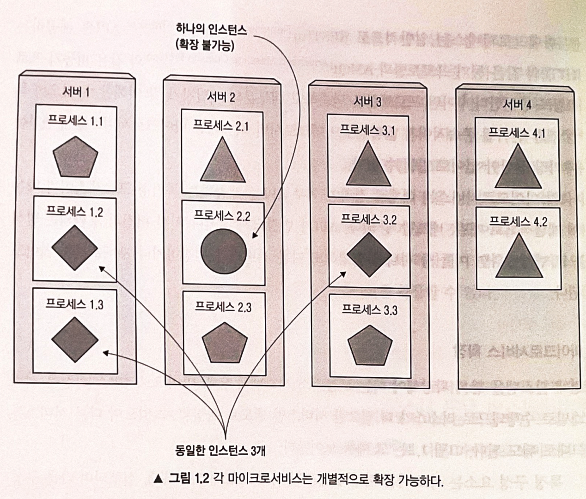
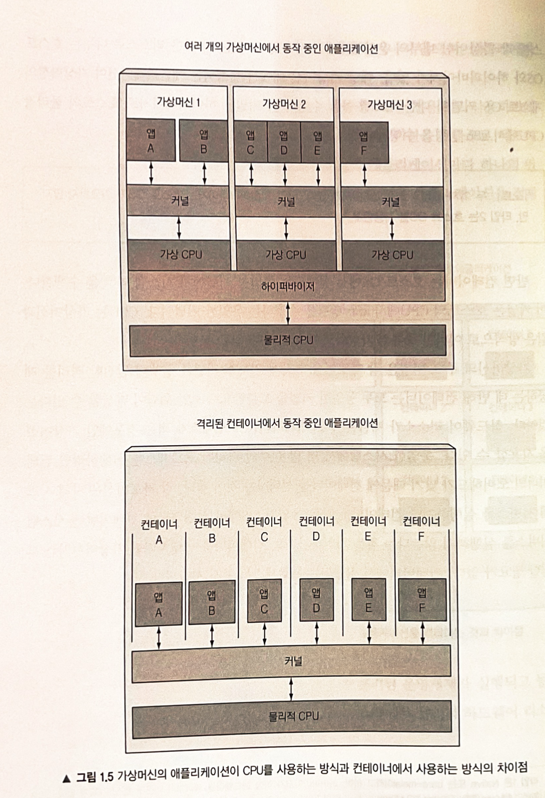
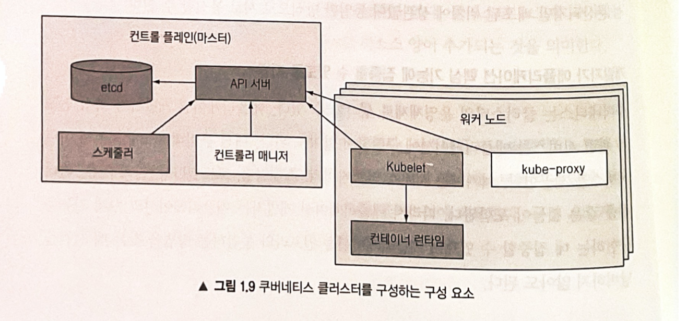

# 쿠버네티스와 같은 시스템이 필요한 이유

## 모놀리식 애플리케이션에서 마이크로서비스로 전환

#### 모놀리식 애플리케이션의 단점
- 모든것이 강하게 결합되어 있다.
- 애플리케이션의 한 부분을 변경해도 전제 재배포 필요
- 수평확장(scale up)하기 매우 어렵거나 불가능하다
  - 수직확장(scale out) 전체 애플리케이션을 복사해야만 가능하다.
- 구성요소간의 경계가 불분명해진다.
- 상호의존성의 제약이 커지면서 전체 시스템 복잡성이 증가하고 품질이 저하된다.
- 분할할 수 없다면 애플리케이션 확장이 불가능하다.

> 위의 많은 문제들로 인해 "<b>마이크로서비스</b>" 아키텍쳐 선택하게 되었다.
 
---

#### 마이크로서비스로 애플리케이션 분할
- 모놀리식 애플리케이션을 마이크로서비스라는 독립적으로 배포할 수 있는 작은 구성 요소로 분할
- 각 마이크로서비스는 독립적인 프로세스에서 실행
- 단순하고 잘 정의된 인터페이스 API 로 다른 마이크로서비스와 통신
- HTTP Restful API 또는 AMQP(Advanced Message Queuing Protocol)와 같은 비동기 프로토콜 이용
- 독립적인 서비스/프로세스이므로 변경한 부분만 배포 가능

---

#### 마이크로서비스 확장
- 서비스별로 수직확장가능
- 모놀리식 애플리케이션이라도 마이크로서비스인 형태로 분할해 수평확장을 가능하게 하거나, 수평 확장이 불가능 할 경우 수직으로 확장할 수 있다. 

---

#### 마이크로서비스 배포
- 마이크로서비스는 구성요소가 많아지므로 배포 조합의 수 구성 요소 간의 상호 종속성 수가 훨씬 더 많아지므로 배포 관련 결정이 점점 어려워진다.
- 마이크로서비스는 서로를 찾아 통신해야 하므로 전체가 하나의 시스템 처럼 동작할 수 있도록 구성을 해줘야 한다.
- 마이크로서비스 수가 증가함에 따라 오류가 발생할 가능성이 높아진다.
- 마이크로서비스는 여러 프로세스와 시스템에 분산돼 있기 때문에 실행 호출을 디버그하고 추적하기 어렵다. (ZipLin 같은 분산 추적 시스템으로 해결)

---

#### 환경 요구의 다양성
- 모놀리식 애플리케이션은 배포해야하는 구성요소가 많을수록 모든 요구사항을 충족시키려 모든 종속성을 관리하기가 더 어려워진다.

## 애플리케이션에 일관된 환경 제공

- 프로덕션 횐경과 개발 환경의 일치 필요
- 기존 애플리케이션에 영향을 주지 않고 동일한 서버에 애플리케이션을 추가할 수 있는 기능 필요

## 지속적인 배포로 전환 : 데브옵스와 노옵스
> 데브옵스 : 개발팀이 애플레이션을 배포하고 관리하는 것
> 
> 노옵스 : 자동화로 운영 팀의 손이 거의 필요 없는 환경 (개발자는 하드웨어 인프라를 전혀 알지 못하더라도 애플리케이션을 배포할 수 있다.)

#### 데브옵스의 장점
- 개발자가 운영의 문제를 이해 가능
- 사용자 피드백 바로 반영 가능

이를 위해서는 애플리케이션을 배포 프로세스를 간소화해야 한다. 이것이 노옵스이다.

--- 

<b>개발자와 시스템 관리자 각자가 최고로 잘하는 것을 하게 하는 것</b>
> 쿠버네티스를 이용하면 하드웨어를 추상화하고 이를 애플리케이션 배포, 실행을 위한 플랫폼을 제공함으로써 개발자는 시스템 관리자의 도움없이 애플리케이션을 구성, 배포할 수 있으며 시스템 관리자는 인프라 유지 및 운영에 집중 할 수 있다.

# 컨테이너 기술 소개

## 컨테이너 이해

#### 리눅스 컨테이너 기술로 구성 요소 격리<
마이크로서비스는 프로세스마다 환경 및 구성요소를 격리해야 한다. 두 방식이 존재하는데
- 가상머신 (Virtual Machine)
- 컨테이너 (Container)
기술이다. 

--- 

#### 컨테이너와 가상머신 비교
- 가상머신
  - 추가 시스템 프로세스 O
  - 추가프로세스 O
  - 오버헤드 O 
  - 리소스 부족으로 인해 가상머신에 여러 애플리케이션 그룹 배포를 한다.
- 컨테이너
  - 추가프로세스 X
  - 오버헤드 X
  - 각 애플리케이션마다 하나의 컨테이너를 가질 수 있다.
> 컨테이너는 가상머신보과 비교했을 때 같은 베어메탈 머신(아무것도 설치되지 않는 하드웨어 or 가상화되지 않는 머신) 에서 더 많은 애플리케이션 적재가능

- 가상머신 : 호스트 OS위의 게스트OS와 하이퍼바이저가 물리적 하드웨어 리소스를 더 작은 리소스로 나눈다. 게스트 OS 커널에 대한 시스템 콜을 수행하면, 커널은 하이퍼바이저로 호스트의 물리적 CPU에서 x86 명령을 수행한다.
  - Pros
    - 자체 리눅스 커널을 써서 완전한 격리 제공
  - Cons
    - 자체 시스템 서비스를 실행해 부팅할 필요가 있다.
    
- 컨테이너 : 호스트 OS에서 실행되는 동일한 커널에서 시스템 콜(call)을 수행한다. 가상머신과 달리 어떠한 종류의 가상화도 필요없다!
  - Pros
    - 동일한 OS에서 실행되므로 부팅할 필요가 없다.
  - Cons
    - 동일한 커널을 호출함으로써 보안위험 발생 가능성
  
격리하려는 프로세스가 적은 경우 -> 가상머신
격리하려는 프로세스가 많은 경우 -> 컨테이너

#### 컨테이너 격리를 가능하게 해주는 매커니즘 소개

두가지 방법으로 컨테이너내의 프로세스를 격리할 수 있다.
- 리눅스 네임스페이스 (Linux Namespace)
- 리눅스 콘트롤 그룹 (Linux cgroups)

---

#### 리눅스 네임스페이스로 프로세스 격리
- 리눅스 시스템은 포기 구동 시 하나의 네임스페이스가 존재한다.
- 파일시스템, 프로세스ID, 사용자ID, 네트워크 인터페이스 등과 같은 모든 시스템 리소스는 하나의 네임스페이스에 속한다.
- 프로세스는 동일한 네임스페이스 내에 있는 리소스만 볼 수 있다.
- 프로세스는 하나의 네임스페이스에만 속하는 것이 아니라 여러 네임스페이스에 속할 수 있다.
- 네임스페이스는 새로 생성할 수 있다.

네임스페이스의 종류
- 마운트(mnt)
- 프로세스 ID(pid)
- 네트워크(net)
- 호스트와 도메인 이름(uts)?
- 사용자 ID(user)

네임스페이스는 특정 리소스 스룹을 격리하는 데 사용된다.
ex) UTS는 해당 네임스페이스 내에서 실행 중인 프로세스가 사용할 호스트 이름과 도메인 이름을 결정

> 네임스페이스를 사용해 컨테이너에서 실행하는 애플리케이션을 분리하는 방법을 알 수 있다.

---

#### 프로세스의 가용 리소스 제한

- 컨테이너가 사용할 수 있는 시스템 리소스의 양은 리눋스 컨트롤그룹(cgroups) 로 이루어진다. 
- 프로세서는 설정된 양 이상의 CPU, 메모리, 네트워크 대역폭 등을 사용할 수 없다.
- 프로세스는 서로 예약된 리소스를 사용할 수 없으며, 이는 각 프로세스가 별도의 시스템에서 실행될 떄와 비슷한 효과를 준다.

## 도커 컨테이너 플랫폼 소개

#### 도커 개념의 이해

도커 : 
- 도커는 애플리케이션을 패키징, 배포 실행하기 위한 플랫폼이다. 
- 애플리케이션을 전체 환경과 함께 패키지화가 가능하다.
- 이 패키지를 중앙 저장소로 전송가능

도커의 3가지 개념
- 이미지 : 애플리케이션과 해당 환경을 패키지화 한 것
- 레지스트리 : 
  - 도커 이미지를 저장하는 저장소
  - 저장소에서 이미지 Push/Pull이 가능하다.
  - 공개는 누구나 비공개는 특정 사람만이 액세스 가능하다.
- 컨테이너 :
  - 도커 기반 컨테이너 이미지에서 생선된 리눅스 컨테이너이다.
  - 도커를 실행하는 호스트에서 실행됬지만 호스트와 호스트에서 실행중인 다른 프로세스와 완전히 격리되어있다.
  - 리소스 사용이 제한돼 있어 한정된 리소스만이 사용가능하다.
  
--- 

#### 도커 이미지의 빌드, 배포, 실행

---

#### 가상머신과 도커 컨테이너 비교 & 이미지 레이어의 이헤

- 모든 도커 이미지는 다른 이미지 위에 빌드되며 두 개의 다른 이미지는 기본 이미지로 동일한 부모 이미지를 사용할 수 있으므로 다른 이미지에는 정확히 동일한 레이어가 포함될 수 있다.
- 동일한 부모이미지가 있을 경우 중복해서 전송할 필요가 없기 때문에 네트워크로 이미지를 배포하는 속도가 빨라진다.
- 여러개의 이미지에 동일한 레이어가 있을 경우 여러 개의 컨테이너는 동일한 파일을 읽을 수 있지만 그중 하나가 파일을 덮어쓰면 다른 컨테이너는 해당 변경 사항을 볼 수 없다. 이로인해 이미지 레이어는 읽기 전용이고 컨테이너가 실행될 때 이미지 레이어 위헤 새로운 쓰기 가능한 레이어가 만들어져 각각의 컨테이너들은 이 쓰기 레이어를 조작한다. 

ex)
컨테이너이미지1
- 이미지1
  - 이미지3
    - 메타데이터
컨테이너이미지1
- 이미지1
  - 이미지2
    - 메타데이터

---

#### 컨테이너 이미지의 제한적인 이식성 이해

- 모든 컨테이너가 호스트의 리눅스 커널을 이용하므로 컨테이너가 특정 커널 버전을 쓰기란 불가능하다.

---

#### 도커의 대안으로 rkt 소개

- 도커는 컨테이너를 주류로 만든 최초의 컨테이너 플랫폼이다.
- 도커는 프로세스 격리를 제공해주지 않는다. 네임스페이스와 cgroups가 리눅스 커널수준에서 컨테이너 격리를 수행한다. 도커는 그저 이 기능들을 사용하기 쉽게 한다.
- 도커가 성공한뒤 컨테이너 형식과 런타임에 관한 개방된 업계 표준을 만들려는 OCI(Open Container Initiative) 가 탄생했고 도커는 가른 컨테이너 엔진인 rkt와 마찬가지로 이 업계 표준의 컨테이너 형식 런타임의 일부이다.
- 쿠버네티스는 도커 기반 컨테이너만을 위해 특별히 만들어진 컨테이너 오케스트레이션 시스템이 아니다(?)

# 쿠버네티스 소개

## 쿠버네티스의 기원

> 2014년 보그, 오메가, 기타배주 구글에서 수천개의 애플리케이션과 서비스를 관리한 경험을 기반으로 하는 오픈소스 시스템인 쿠버네티스를 출시했다.

## 넓은 시각으로 쿠버네티스 바라보기 

#### 쿠버네티스 핵심 이해

- 시스템은 마스터노드와 여러 워커노드로 구성된다.
- 개발자가 애플리케이션 매니페스트를 마스터에 게시하면 쿠너베티스는 해당 애플리케이션을 워커노드 클러스터에 배포한다.
- 애플리케이션은 클러스터에 걸쳐서 분산되지만 배포된 위치에 간관없이 동일한 방식으로 서로 통신 가능

---

#### 개발자가 애플리케이션 핵심 기능에 집중할 수 있도록 지원

- 쿠버네티스에서는 서비스 디스커버리, 스케일링, 로드밸런싱, 자가 치유, 리더 선출 등의 인프라 관련 서비스를 제공한다.
- 위와 같은 기능 구현에 집중하지 않고 애플리케이션 실제 기능을 구현하는데 집중 할 수 있다.

---

#### 운영 팀이 효과적으로 리소스를 활용할 수 있도록 지원

- 쿠버네티스는 클러스터 어딘가에 컨테이너화된 애플리케이션을 실행하고 구성 요소 간에 서로를 찾는 방법에 관한 정보를 제공하고 모든 애플리케이션을 계속 실행하게 한다. 어떤 노드 실행되든 상관이 없다. 쿠버네티스는 언제든지 애플리케이션을 재배치하고 조합함으로써 리소스를 수동 스케줄링보다 훨씬 더 잘 활용할 수 있다.

## 쿠버네틱스 클러스터 아키텍처 이해

쿠너네티스 클러스터 : 
- 마스터노드(Master Node) : 전체 쿠버네티스 시스템을 제어하고 관리하는 쿠버네티스 컨트롤 플레인을 실행한다.
- 워커노드(Worker Node) : 실제 배포되는 컨테이너 애플리케이션을 실행한다.

#### 컨트롤 플레인

컨트롤 플레인 (Control Plane)
- 쿠버네티스 API : 서버는 사용자, 컨트롤 플레인 구성 요소와 통신한다.
- 스케줄러 : 애플리케이션의 배포를 담당한다. (애플리케이션의 배포 가능한 각 구성요소를 워크 노드에 할당)
- 컨트롤러 매니저 : 구성 요소 복제본, 워커 노드 추적, 노드 장애 처리 등과 같은 클러스터 단의 기능을 수행  
- etcd : 클러스터 구성을 지속적으로 저장하는 신뢰할 수 있는 분산 데이터 저장

> 컨트롤 플레인의 구성 요소는 클러스터 상태를 유지하고 제어하지만 애프리케이션을 실행하지 않는다 이는 노드에 의해 이뤄진다.

--- 

#### 노드

워커 노드 (Worker Node)
- 컨테이너 런타임 : 컨테이너를 실행하는 도커, rkt 또는 다른 컨테이너 런타임
- Kubelet : API 서버와 통신하고 노드의 컨테이너를 관리한다.
- Kube-proxy : 애플리케이션 구성 요소 간에 네트워크 트래픽을 오드밸런싱하는 쿠버네티스 서비스 프록시

## 쿠버네티스에서 애플리케이션 실행

1, 하나 이상의 컨테이너 이미지로 패키징
2, 해당 이미지를 이미지 레지스트리로 푸시
3, 쿠버네티스 API 서버에 애플리케이션 디스크립션(설명)을 게시
  - 애플리케이션 설명 : 
    - 컨테이너 이미지
    - 애플리케이션 구성요소가 포람된 이미지
    - 구성 요소들끼리 서로 통신하는 방법
    - 동일서버에 함께 배치돼야 하는 구성 요소
    - 실행할 구성 요소의 복제본 수
    - 내부/외부 클라이언트에 서비스를 제공하는 구성 요소와 하나의 IP 수조롤 노툴해 다른 구성 요소에서 검색 가능하게하는 구성 요소

#### 디스크립션으로 컨테이너를 실행하는 방법 이해

1, 쿠버네티스 API 서버가 앱 디스크립션을 본뒤 스케줄러는 각 컨테이너에 필요한 리소스를 계산뒤 해당 시점에 각 노드에 할당되지 않는 리소스를 기반으로 사용 가능한 워커 노드에 지정된 컨테이너 할당
2, 해당 노드의 Kubelet은 컨테이너 런타임에 필요한 컨테이너 이미지를 가져와 컨테이너를 실행하도록 지시

> 아래 사진의 앱 디스크립션을 보면 3개로 그룹된 4개의 컨테이너를 가진다. (이 그룹을 파드(Pod) 라 한다.) 파드중에서 두 컨테이너가 같이 있는 것이 존재한다. 이것들은 함께 배치해야됨을 뜻하며 이 둘은 격리해서는 안된다.

---

#### 실행된 컨테이너 유지

쿠버네티스는 애플리케이션 배포 상태가 사용자가 제공한 디스크립션과 일치하는지 지속적으로 확인한다.
프로세스가 중단되거나 응답이 중지죌 떄와 같이 인스턴스가 제대로 작동하지 않으면 쿠버네티스가 자동으로 다시 시작한다.

ex) 다섯개의 웹 서버 인스턴스를 실행하도록 지정하면 쿠버네티스는 항상 다섯 개의 인스턴스를 계속 실행한다.

---

#### 복제본 수 스케일링

- 애플리케이션이 실행되는 동안 복제본 수를 늘릴지 줄일지 결정할 수 있으며, 쿠버네티스는 추가 복제본을 기동하거나 초과복제본을 정지시킬 것이다. 
- 쿠버네티스는 스스로 CPU 부히, 메모리 사용량, 초당 요청 수 등의 애플리케이션이 노출하는 다른 실시간 매트릭을 기반으로 복제본 수를 자동으로 조정할 수 있다.

---

#### 이동한 애플리케이션에 접근하기

- 쿠버네티스는 하나의 고정 IP 주소로 모든 컨테이너를 노출하고 해당 주소로 클러스터에서 실행 중인 모든 애플리케이션에 노출한다.
- 히지만 클라이언트는 오래전부터 사용된 DNS 로 서비스 IP를 조회할 수도 있다.
- kube-proxy는 서비스를 제공하는 모든 컨테이너에서 서비스 연결이 로드밸런싱되도록 한다.
- 서비스의 IP 주소는 일정하게 유지되므로 클라이언트는 클러스터 내에서 컨테이너가 이동해도 상시 연결 가능하다.

## 쿠버네티스 사용의 장점

- 모든 서버가 쿠버네티스로 관리하면 운영팀은 더이상 애플리케이션 배포를 처리할 필요가 없다.

#### 애플리케이션 배포의 단순화

- 모든 노드를 컴퓨팅리소스로 사용하는게 좋겠지만 특정 애플리케이션이 특정 하드웨어에 실행되어야 하는경우 특정 노드를 선택해서 배포하게만 설정할 수 있다.

---

#### 하드웨어 활용도 높이기

- 쿠버네티스는 애플리케이션의 리소스 요구 사항에 대한 디스크립션과 각 노드에서 사용 가능한 리소스에 따라 애플리케이션을 실행할 가장 적합한 노드를 선택할 수 있다.

---

#### 상태 확인과 자가 치유

- 쿠버네티스는 애플리케이션이 구동 중인 노드를 모니터링하다 노드 장애시 자동으로 애플리케이션을 다른 노드로 스케줄링한다. 
- 운영팀은 해당 노드 자체를 수정해 하드웨어 리소스 풀에 반환하시만 하면돼지 노드가 없어도 예비자원만 충분하면 굳이 수동으로 마이그레이션을 안해도 된다.

#### 오토스케일링

- 쿠버네티스는 각 애플리케이션의 리소스를 모니터링해 각 애플리케이샨의 실행 중인 인스턴스 수를 계속 조정하도록 지시할 수 있다.
- 클라우드 인프라에서 쿠버네티스가 실행될 경우 클라우드 제공업체의 API 로 쉽게 노드를 추가하면 배포된 애플리케이션의 부하에 따라 전체 클러스터 크기를 자동으로 확장/축소 가능하다.

#### 애플리케이션 개발 단순화

- 프로덕션과 개발환경 동일화로 인한 디버깅 환경 향상
- 새로운 버전을 출시할때 에러 감지시 롤아웃을 중지한다.

# 요약

- 모놀리식 애플리케이션은 유지 관리가 어렵고 확장이 때로 불가능하다.
- 마이크로서비스 기반 애플리케이션 아키텍처는 배포하고 구성하기가 어렵다.
- 리눅스 컨테이너는 가상머신과 동일한 이점에 훨씬 가볍고 하드웨어 활용도를 높일 수 있다.
- 도커는 OS 환경과 함께 컨테이너화된 애플리케이션을 좀 더 쉽고 빠르게 프로비저닝 할 수 있도록 지원해 기존 리눅스 컨테이너 기술 개선
- 쿠버네티스는 전테 데이터 센터를 애플리케이션 실행을 위한 컨퓨팅 리소스로 제공한다.
- 개발자는 시스템 관리자 없이도 쿠버네티스로 애플리케이션 배포 가능
- 시스템 관리자는 고이 예비 자원이 풍부할 시 고장 난 노드를 때문에 애플리케이션이 멈출 염려없이 편히 잘 수 있다. 