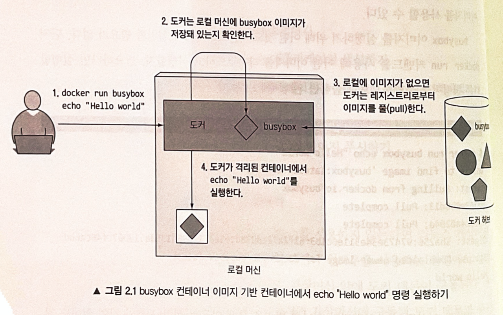
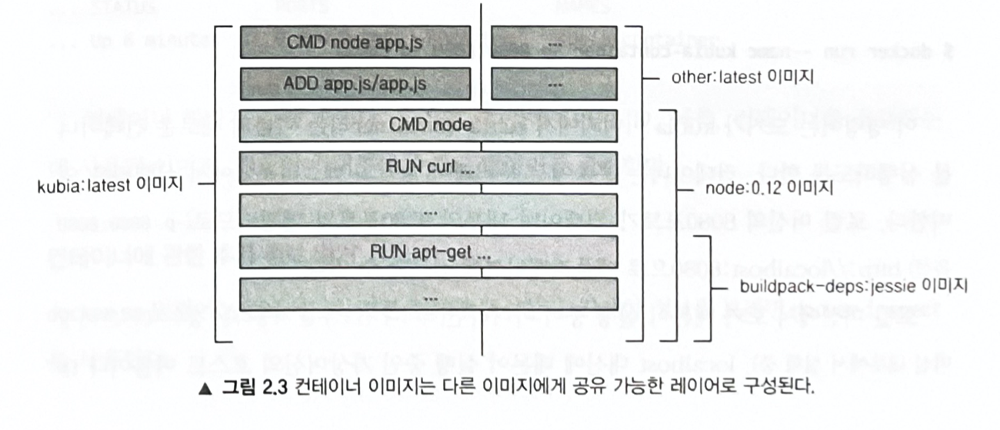
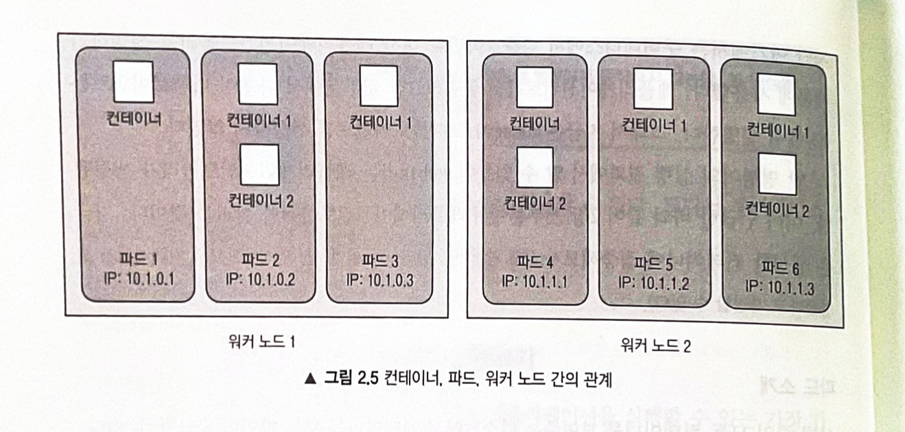
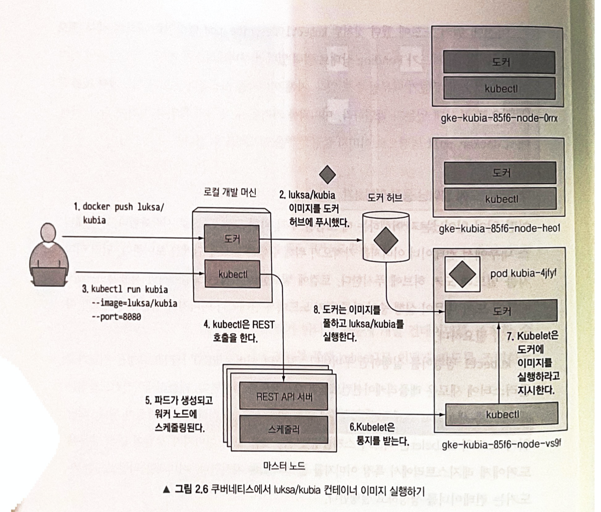
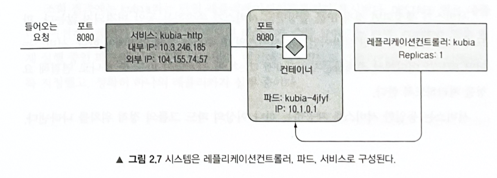
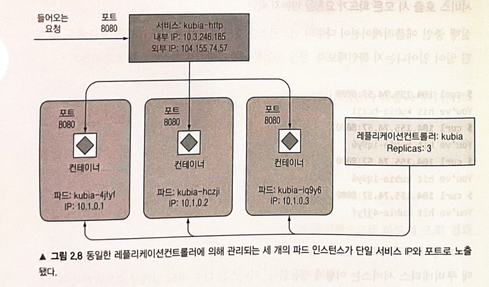
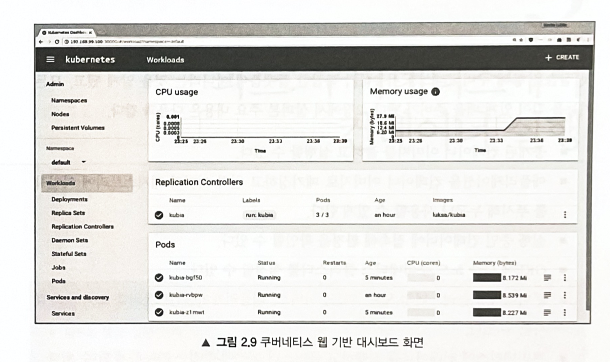

# 도커 쿠버네티 첫걸음
## 도커를 사용한 컨테이너 이미지 생성, 실행, 공유하기

### 도커설치와 Hello World 컨테이너 실행하기

#### Hello World 컨테이너 실
```shell
$ docker run busybox echo "Hello world"
```
```terminal
Unable to find image 'busybox:latest' locally
latest: Pulling from library/busybox
19d511225f94: Pull complete 
Digest: sha256:3614ca5eacf0a3a1bcc361c939202a974b4902b9334ff36eb29ffe9011aaad83
Status: Downloaded newer image for busybox:latest
Hello world
```

---

#### 백그라운드에 일어난 동작 이해하기

docker run 명령을 수행하면
1. `busybox:latest` 이미지가 로컬 컴퓨터에 존재하는지 체크하고 존재하지 않으면 http://docker.io의 도커허브 레지스토리에서 이미지를 다운
2. 이미지로부터 컨테이너를 생성하고 내부의 명령어 실행

> 위 경우에는 echo 명령어는 표준 출력(STD OUT)으로 출력한 후 프로세스가 종료후 컨테이너도 중지된다.

--- 

#### 다른 이미지 실행하기 / 컨테이너 이미지에 버전 지정하기

```shell
$ docker run <image>
$ docker run <image>:<tag>
```

---

### 간단한 node.js 애플리케이션 생성하기

```javascript
const http = require('http');
const os = require('os');

console.log("Kubia server starting...");

var handler = function(request, response) {
    console.log("Received request from " + request.connection.remoteAddress)
    response.writeHead(200);
    response.end("you've hit " + os.hostname() + "\n");
};
var www = http.createServer(handler)
www.listen(8080);
```

#### 이미지를 위한 Dockerfile 생성

```docker
FROM node:7
ADD app.js /app.js
ENTRYPOINT ["node", "app.js"]
```

`FROM node:7` : FROM 줄은 컨테이너의 이미지 생성의 기반이 되는 기본 이미지를 정의한다.

`ADD app.js /app.js` : 해당 docker 파일이 위치한 로컬 디렉토리의 app.js의 파일을 이미지의 루트 디렉토리에 동일한 이름(app.js)로 추가한다.

`ENTRYPOINT ["node", "app.js"]` : 이미지를 실행했을 때 수랭돼야 할 명령어를 정의한다.

### 컨테이너 이미지 생성

```shell
$ docker build -t kubia .
```



#### 어떻게 이미지가 빌드되는지 이해하기

- 빌드 프로세스는 도커 클라이언트가 수행하지 않는다.
- 디렉터리의 전체 콘텐츠가 도커 데몬에 업로드되고 그곳에서 이미지가 빌드된다.
- 리눅스가 아닌 OS일 경우 도커 클라이언트는 호스트 OS에 위치하고, 데몬은 가상머신 내부에서 실행된다.
- 빌드 프로세스동안 이미지가 사용자 컴퓨터에 존재하지 않을 경우 도커 허브에서 가져온다.

> 빌드 디렉토리에 불필요한 파일을 포함시키면 빌드 프로세스의 속도 저하를 가져온다.

---

#### 이미지 레이어에 관해 이해하기



- 기본 이미지를 구성한는 모든 레이어는 단 한 번만 저장된다.
- 이미지를 가져올 때도 각 레이어를 개별적으로 다운로드하고 이미 저장된 레이어는 다운받지 않는다.
- 앞의 선언한 도커파일은 하나의 새로운 레이어를 생성하는게 아닌 기본 이미지 레이어위에 새로운 레이어를 생성하고 app.js파일을 그 위에 추가한다. 그 위에 명령어 레이어 마지막에는 kubia:latest 라는 태그를 지정한다.
- 이미지 빌드 프로세스가 완료되면 새로운 이미지가 로컬에 저장된다.

```shell
$ docker images
```
```terminal
REPOSITORY                    TAG       IMAGE ID       CREATED             SIZE
kubia                         latest    9e579239c48b   About an hour ago   660MB
```

### 컨테이너 이미지 실행

```shell
$ docker run --name kubia-container -p 8080:8080 -d kubia
```
- `--name kubia-container` 이라는 이름의 컨테이너를 `-d` 백그라운드에서 실행된다.
- `-p 8080:8080` 호스트의 8080 포트와 컨테이너 내부의 8080 포트가 매칭된다. (http://localhost:8080 으로 애플리케이션 접근 가능)
- 만약 로컬 머신에서 데몬이 실행 중이 아니라면 (맥이나 윈도우를 사용하는 경우 데몬은 가상 머신 내부에서 실행 중) localhost 대신에 데몬이 실행 중인 가상머신의 호스트 이름이나 IP를 사용해야 한다. (위 정보는 DOCKER_HOST 환경변수로 확인 가)

#### 애플리케이션 접근하기

```shell
$ curl localhost:8080
```
```terminal
you've hit 1d440f9c6206
```
- 격리된 컨테이너 내부에서 실행중인 호스트 이름은 `1d440f9c6206` 인것을 알수 있다. 이 숫자는 16진수 도커 컨테이너 ID이다.

---

#### 실행중인 모든 컨테이너 조회하기 / 컨테이너에 관한츠가 정보 얻기

```shell
$ docker ps
```
```terminal
CONTAINER ID   IMAGE     COMMAND         CREATED         STATUS              PORTS                    NAMES
1d440f9c6206   kubia     "node app.js"   2 minutes ago   Up About a minute   0.0.0.0:8080->8080/tcp   kubia-container
```

- 실행중인 컨테이너를 조회할 수 있다. 현재는 하나의 컨테이너 만이 실행중이다.

```shell
$ docker inspect kubia-container
```

- 도커의 컨테이너의 상세 정보를 JSON 형식으로 출력

### 실행 중인 컨테이너 내부 탐색하기

#### 실행 중인컨테이너 내부에서 셀 실행하기

```shell
$ docker exec -it kubia-container bash
```

- 현재 실행중인 `kubia-container` 컨테이너 내부에 `bash`를 실행한다. 
- `-i` : 표준 입력을 오픈 상태로 유지한다. (셀의 명령어 입력을 위해 필요)
- `-t` : 의사(psuedo) 터미널(TTY)을 할당한다.

---

#### 내부에서 컨테이너 탐색

```terminal
root@1d440f9c6206:/# ps aux
USER       PID %CPU %MEM    VSZ   RSS TTY      STAT START   TIME COMMAND
root         1  0.0  1.2 813608 25828 ?        Ssl  13:43   0:00 node app.js
root        19  0.1  0.1  20252  3184 pts/0    Ss   13:52   0:00 bash
root        27  0.0  0.0  17508  2016 pts/0    R+   13:52   0:00 ps aux
```

- 내부프로세스는 오직 3개만 볼수 있고 호스트 운영체제의 다른 프로세스는 볼 수가 없다.

#### 호스트 운영체제에서 실행 중인 컨테이너에서 실행되는 프로세스 이해하기

```shell
$ ps aux | grep app.js
```
```terminal
esteban0829      16540   0.0  0.0  4277544    716 s000  S+   10:54PM   0:00.00 grep --color=auto --exclude-dir=.bzr --exclude-dir=CVS --exclude-dir=.git --exclude-dir=.hg --exclude-dir=.svn --exclude-dir=.idea --exclude-dir=.tox app.js
```

- 호스트 운영체제에서 프로세스를 조회해보면 모든 프로세스를 조회할 수 있다. 컨테이너안에 있는 프로세스도 볼 수 있다.
- 호스트 운영체제와 컨테이너 내부에서 조회한 프로세스의 ID가 다르다.
- 컨테이너는 자체 리눅스 PID 네임스페이스를 사용하며 고유의 시퀀스 번호를 가지고 완정히 분리된 프로세스 트리를 갖고 있다.

---

#### 격리된 컨테이너 파일시스템

- 각 컨테이너는 격리된 파일시스템을 갖고 있다.

```terminal
root@1d440f9c6206:/# ls /
app.js	bin  boot  dev	etc  home  lib	lib64  media  mnt  opt	proc  root  run  sbin  srv  sys  tmp  usr  var
```

### 컨테이너 중지와 삭제

```shell
$ docker stop kubia-container
```

- 이름이 `kubia-container` 인 컨테이너에 실행중인 메인프로세스를 중지시킨다.
- 컨테이너 내부에 실행중인 프로세스가 없으므로 컨테이너는 중지한다.
- `docker ps -a` 명령어를 활용하면 컨테이너 그 자체는 여전히 존재한다. (`-a` : 실행중인 중지한 모든 컨테이너 출력)

```shell
$ docker rm kubia-container
```

- 컨테이너를 삭제한다.

### 이미지 레지스트리에 이미지 푸쉬

- 지금까지의 이미지는 로컬에서만 사용이 가능하지 다른컴퓨터에서 사용하려면 외부 이미지 저장소레 이미지를 푸쉬해야한다.
- 개인 레지스트리를 사용할 수 있고 구글 컨테이너 레지스트리같은 공개적인 컨테이너 레지스트리를 사용할 수도 있다.
- `http://hub.docker.com`에 도커 허브 ID를 등록해 쓸 수 있다.

#### 추가 태그로 이미지 태그 지정

```shell
$ docker tag kubia esteban0829/kubia
```

- 같은 이미지에 추가적인 태그를 생성한다.
  
```shell
$ docker images | head
```
```terminal
REPOSITORY          TAG       IMAGE ID       CREATED          SIZE
esteban0829/kubia   latest    fda85b8c35c5   28 minutes ago   660MB
kubia               latest    fda85b8c35c5   28 minutes ago   660MB
```
- `kubia`와 `esteban0829/kubia`가 동일한 이미지 ID를 가리키고 있으므로 같은 이미지가 두개의 태그를 갖는 것이다.

---

#### 도커 허브에 이미지 푸시하기 / 다른 머신에서 이미지 실행하

```shell
$ docker login
```

- 도커에 이미지를 푸쉬하기 전에 로그인을 한다.

```shell
$ docker push esteban0829/kubia
```

- 도커허브에 이미지를 푸시한다.

```shell
$ docker run -p 8080:8080 -d esteban0829/kubia
```

- 이제 아무나 이 명령어를 쳐서 해당 이미지를 사용할 수 있다.

## 쿠버네티스 클러스터 설치

### Minikube를 활용한 단일 노드 쿠버네티스 클러스터 실행하기

- `Minikube`는 로컬에서 쿠버네티스를 테스트하고 애플리케이션을 개발하는 목적으로 단일 노드 클러스터를 설치하는 도구이다.

#### Minikube 설치

- Minikube는 해당 깃허브를 가서 다운받을 수 있다.([미니큐브 깃허브](https://github.com/kubernetes/minikube))

---

#### Minikube로 쿠버네티스 클러스터 시작하기

```shell
$ minikube start
```

---

#### 쿠버네티스 클라이언트 설치하기

- 쿠버네티스를 다루려면 `kubectl CLI` 클라이언트가 필요하다. 
- 필요한 바이너리를 다운로드해서 실행 가능한 경로에 둔다.

---

#### 클러스터 작동 여부 확인과 kubectl 사용하기

```shell
$ kubectl cluster-info
```
```terminal
Kubernetes control plane is running at https://127.0.0.1:61059
CoreDNS is running at https://127.0.0.1:61059/api/v1/namespaces/kube-system/services/kube-dns:dns/proxy

To further debug and diagnose cluster problems, use 'kubectl cluster-info dump'.
```

> minikube ssh을 사용해 Minikube 가상머신에 로그인해서 내부를 살펴 볼 수 있다. 노드에 실행중인 프로세스 등을 확인 가능하다.

[comment]: <> (어려우니까 생략)
[comment]: <> (### 구글 쿠버네티스 엔징을 활용한 관리형 쿠버네티스 클러스터 사용하기)

[comment]: <> (- 다중 노드 클러스터를 사용할 수 있다.)

[comment]: <> (- 모든 클러스터 노드와 네트워킹을 수동으로 설정할 필요가 없다.)

[comment]: <> (#### 구글 클라우드 프로젝트 설정과 필요한 클라이언트 바이너리 다운로드)

[comment]: <> (- GKE 환경을 설정해야지 쿠버네티스 클러스터를 생성할 수 있다.이곳에서 방법이 존재한다. &#40;[GKE 환경 설정법]&#40;https://cloud.google.com/kubernetes-engine/docs/deploy-app-cluster&#41;&#41;)

## 쿠버네티스에 첫 번때 애플리케이션 실행하기

### Node.js 애플리케이션 구동하기

- 처음은 JSON, YAML을 사용하지 않고 `kubectl run` 명령어를 사용해서 배포해 볼 것이다.

```shell
$ kubectl run kubia --image=esteban0829/kubia --port=8080 --generator=run/v1
```

> error: unknown flag: --generator
See 'kubectl run --help' for usage. 해당 명령어를 실행하면 이런 에러가 뜬다. 과거 k8s 1.18 버전에 썻던 명령어라 그러하다. 1.18 이후 k8s 버전에는 그낭 `kubectl run kubia --image=esteban0829/kubia --port=8080` 까지만 쓰면 된다.

#### 파드 소개

파드 (Pod) : 
- 컨테이너 그룹
- 하나 이상의 밀접하게 연관된 컨테이너의 그룹
- 워커 노드에서 같은 리눅스 네임스페이스로 함께 실행된다.
- 각 파드는 자체 IP, 호스트 이름, 프로세스 등이 있는 논리적으로 분리된 머신이다.
- 같은 파드에서 실행중인 모든 컨테이너는 동일한 논리적인 머신에서 실행하는 것처럼 보이는 반면, 다른 파드에 실행중인 모든 컨테이너는 같은 워커 노드에서 실행중이라 할지라도 다른 머신에서 실행 중인 것으로 나타난다.
- 아래 사진을 보면 각 파드는 애플리케이션 프로세스가 실행하는 하나 이상의 컨테이너를 갖는다.



---

#### 파드 조회하기

```shell
$ kubectl get pods
```
```terminal
NAME    READY   STATUS             RESTARTS   AGE
kubia   0/1     ImagePullBackOff   0          10m
```

- 현재 파드들을 출력한다.
- 파드의 상태가 여전히 보류상태로 파드의 단일 컨테이너가 아직 준비가 되지 않았다. 컨테이너가 이미지를 다운로드 완료되면 컨테이너가 생성되 파드의 상태가 Running 상태로 전환된다.

```terminal
NAME    READY   STATUS    RESTARTS   AGE
kubia   1/1     Running   0          12s
```

---

#### 백그라운드에 일어난 동작 이해하

1. 이미지를 빌드해 도커 허브에 푸쉬
2. kubectl 명령어를 실행하면 쿠버네티스의 API 서버로 REST HTTP 요처을 전달하고 클러스터에 새로운 레플리케이션컨트롤러오브젝트를 생성
3. 이 컨트롤러는 새 파드를 생성하고 스케줄러에 의해 워커 노드 중 하나에 스케줄링이 된다.
4. kubectl은 파드가 스케줄링됐다는 것을 보고 이미지가 로컬에 없기 때문에 도커에세 레지스트리에서 특정 이미지를 풀하게 시킨다.
5. 이미지를 다운로드한 후 도커는 컨테이너를 생성하고 실행한다.



### 웹 애플리케이션에 접근하기

- 일반적인 서비스 (Cluster IP 서비스)를 생성하면 이것은 클러스터 내부에서만 접근 가능하기 때문에 Load Balancer 유형의 특별한 서비스를 생성해야 한다.
- LoadBalancer 유형의 서비스를 생성하여 로드밸런서의 퍼블릭 IP를 통해서 파드에 연결하려 내부의 웹 애플리케이션에 연결해야 한다.

#### 서비스 오브젝트 생성하기 / 서비스 조회하

```shell
$ kubectl expose rc kubia --type=LoadBalancer --name kubia-http
```
```terminal
service/kubia-http exposed
```

> kubectl 1.18+ 버전에서는 --generator이 없으므로 rc 대신 po 를 적어 파드를 노출시킨다.

---

#### 서비스 조회하기

```shell
$ kubectl get services
```

```terminal
NAME         TYPE           CLUSTER-IP       EXTERNAL-IP   PORT(S)          AGE
kubernetes   ClusterIP      10.96.0.1        <none>        443/TCP          132d
kubia-http   LoadBalancer   10.109.111.106   <pending>     8080:30599/TCP   112s
```

---

#### External IP를 이용하여 서비스 접근하기

```shell
curl 104.155.74.57:8080
```
```terminal
you've hit kubia
```

> minikube를 사용하는 경우 `minikube service kubia-http` 룰 실행해 서비스에 접근 가능한 IP와 포트를 얻을 수 있다.

- 각 파드는 자체 IP 주소와 호스트 이름을 가진 별도의 독립 머신 처럼 동작한다.

### 시스템의 논리적인 부분

#### 레플리케이션컨트롤러, 파드, 서비스가 서로 동작하는 방식 이해

- `kubectl run` 명령을 수행하면 레플리케이션컨트롤러를 생성하고 이것이 실제 파드를 생성한다.
- 쿠버네티스에세 레플리케이션컨트롤러에 의해 관리되는 모든 파드를 단일 서비스로 노출하도록 명령한다. 



---

#### 파드와 컨테이너의 이해

- 파드는 원하는 만큼의 컨테이너를 포함시킬 수 있다.
- 컨테이너 내부에는 Node.js 프로세스가 있고 포트 8080에 바인딩돼 HTTP 요청을 기다리고 있다.
- 파드는 자체의 고유한 사설 IP 주소와 호스트 이름을 갖는다.

---

#### 레플리케이션컨트롤러의 역할 이해

- 파드를 복제하고하고 항사 실행 상태로 만든다.
- 모종의 이유로 파드가 사라지면 사라진 파드를 대체하기 위해 새로운 파드를 생성할 것이다.
- 레플리카를 지정하지 않으면 파드를 하나만 생성한다.

---

#### 서비스가 필요한 이유

- `kubia-http` 서비스
- 파드는 일시적이다. 언제든지 사라질 수 있다. 사라진 파드는 레플리케이션컨트롤러의에 의해 생성된 파드로 대체된다. 이떄 새로운 파드는 새 IP가 할당되므로 이를 서비스가 알아서 노출해야 된다.
- 서비스는 정적인 IP를 할당 받고 서비스가 존속하는 동안 변경되지 않는다.
- 클라이언트는 Pod에 연결하지않고 서비스 IP 주소를 통해 연결해야된다.
- 서비스는 동일한 서비스를 제공하는 하나 이상의 파드 그룹의 정적 위치를 나타낸다.
- 서비스의 IP와 포트로 유입된 요청은 서비스에 속해있는 하나의 파드에게 전달된다.

### 애플리케이션 수평 확장

```shell
$ kubectl get replicationcontrollers
```

```terminal
NAME    DESIRED   CURRENT     AGE
kubia   1         1           20m
```

- kubia라는 단일 레플리케이션컨트롤러가 표시된다.
- DESIRED 열은 레플리케이션컨트롤러가 유지해야 할 파드의 레플리카 수를 보여준다
- CURRENT 열은 현재 실행 중인 파드의 실제 수를 나타낸다.

#### 의도하는 레플리카 수 늘이기

```shell
$ kubectl scale rc kubia --replicas=3
```
```terminal
replicationcontroller "kubia" sclaed
```

- 항상 3개의 파드 인스턴스를 유지하도록 레플리케이션컨트롤러를 설정했다.
- 쿠버네티스가 어떤 정확한 액션을 취하도록 하기보다는 의도하는 상태(desired state)를 선언적으로 변경하여 현재 상태(current state)를 거사해 의도한 상태로 조정(reconcile) 한다.

---

#### 스케일 아웃 결과 보기

```shell
$ kubectl get rc
```
```terminal
NAME    DESIRED   CURRENT     READY    AGE
kubia   3         3           2        20m
```

```shell
$ kubectl get pods
```
```terminal
NAME          READY   STATUS    RESTARTS   AGE
kubia-dasdf   1/1     Running   0          12s
kubia-asdfd   1/1     Running   0          30s
kubia-gjied   1/1     Running   0          20s
```

- 쿠버네티스는 스케일업이나 스케일다운을 간단하게 만들어준다.

---

#### 서비스 호출시 모든 파드가 요청을 받는지 확인

---

#### 시스템의 새로운 상태 시각화

- 3개의 파드를 모두 레플리케이션 컨트롤러에의해서 관리된다.
- 서비스는 하나의 파드에 요청을 보내지 않고 파드3개에 모두 전송한다.



### 애플리케이션 실행 중인 노드 검사하기

- 어떤 노드에 파드가 실행중인지는 딱히 중요하지 않다.
- 파드가 스케줄링된 노드랑 관계없이 컨테이너 내부에 실행중인 모든 애플리케이션은 동일한 유형의 운영체제 환경을 갖는다.
- 각 파드는 자체 IP를 가지고 다른 파드가 같은 노드에 있는지 혹시 다른 노드에서 실행 중인지에 상괍없이 통신할 수 있다.
- 각 파드는 요청된 만큼의 컴퓨팅 리소스를 제공받는다.

#### 파드를 조회할 때 파드 IP롸 실행 중인 노드 표시하기

### 쿠버네티스 대시보드 소개

- 대시보드에서 파드, 레플리케이션컨트롤러, 서비스 같은 클러스터의 많은 오브젝트를 생성, 수정, 삭제가 가능하다.

