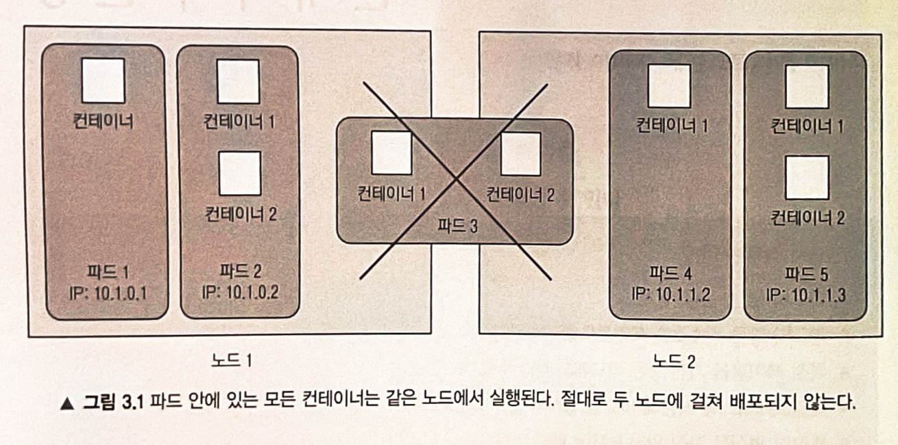
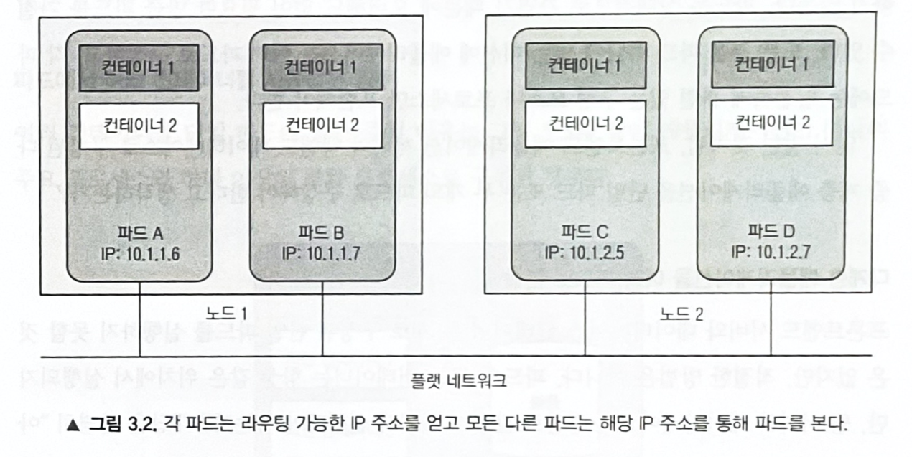
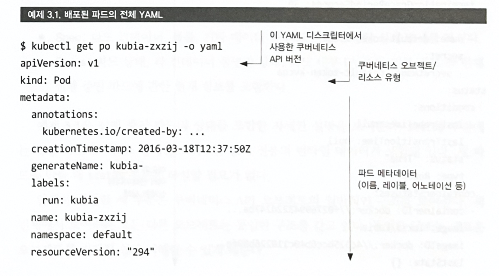
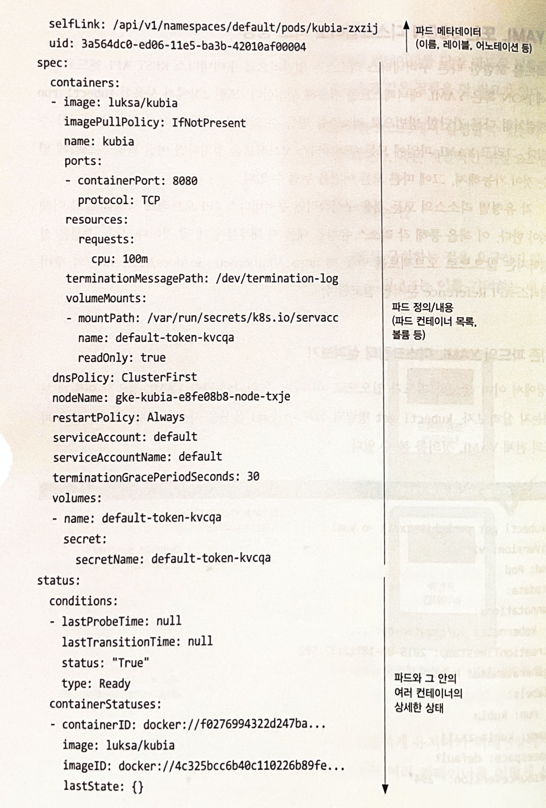
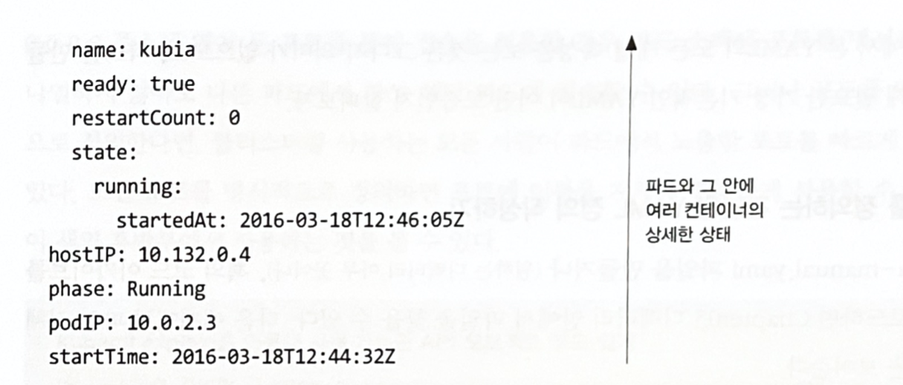
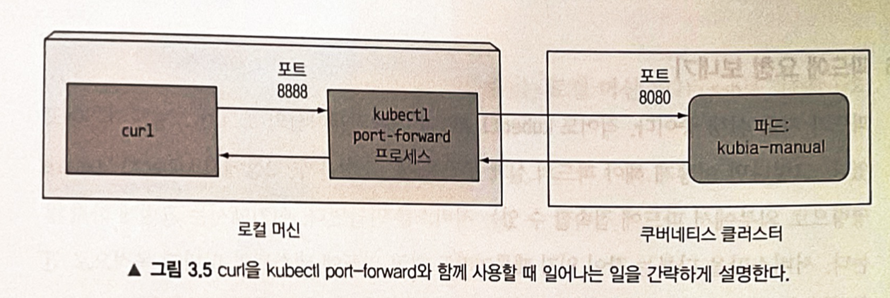
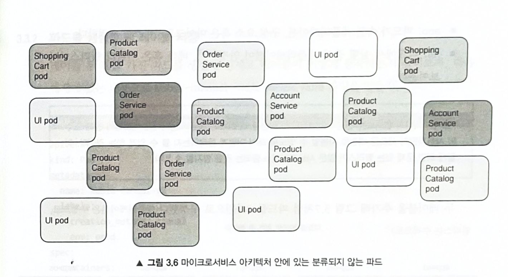
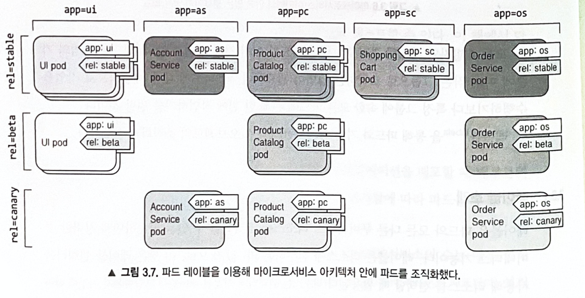
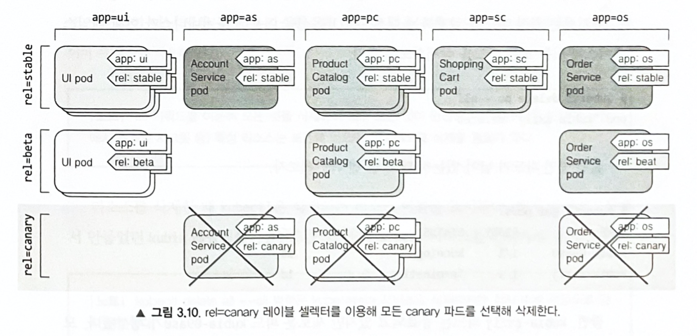

# 파드: 쿠버네티스에서 컨테이너 실행

## 3.1 파드소개

- 파드는 쿠버네티스의 기본 빌딩 블록이다.
- 일반적으로 파드는 하나의 컨테이너만 포함한다.
- 파드가 여러컨테이너를 가지고 있을 경우에, 모든 컨테이너는 항상 하나의 워 노드에서 실행도며 여러 워커노드에 걸쳐 실행되지 않는다.



### 파드가 필요한 이유

#### 여러 프로세스를 실행하는 단일 컨테이너보다 다중 컨테이너가 나은 이유

IPC(Inter-Process Communication) 혹은 로컬 파일을 통해 통신하는 여러 프로세스로 구성된 애플리케이션들이 있다 가정했을 때
- 모든 프로세스를 실행하고 로그를 관리하는 것은 모두 사용자 책임이다.
- n 개의 프로세스들이 실패하는 경우 자동으로 재시작하는 매커니즙을 포함해야 한다.
- 모든 프로세스는 동일한 표준 출력으로 로그를 기록하기 때문에 어떤 프로세스가 남긴 로그인지 파악이 어렵다.
- 각 프로세스를 자체의 개별 컨테이너로 실행해야 한다.

### 파드 이해하기

- 프로세스들이 단일 컨테이너로 묶지 않기 떄문에 컨테이너들을 묶고 하나의 단위로 관리할 수 있는 또 다른 상위 단위가 바로 파드이다.
- 단일 컨테이너가 주는 모두 함께 실행되는 것처럼 동일한 환경을 제공 가능하다.
- 컨테이너(프로세스) 끼리 격리된 상태를 유지 가능하다.

#### 같은 파드에서 컨테이너 간 부분 격리

- 쿠버네티스는 파드 안에 있는 모든 컨테이너가 자체 네임스페이스가 아닌 동일한 리눅스 네임스페이스를 공유하도록 도커를 설정한다.
- 모든 컨테이너는 같은 호스트 이름과 네트워크 인터페이스를 공유한다.
- 파드의 모든 컨테이너는 동일한 IPC 네임스페이스에서 실행돼 IPC를 통해 통신할 수 있다.
- 도커에서 동일한 PID 네임스페이스를 공유할 수 있지만 기본으로 활성화돼 있지 않다.
- 쿠버네티스의 볼륨 이용해 컨테이너끼리 파일 디렉토리를 공유할 수 있다.

---

#### 컨테이너가 동일한 IP와 포트공간을 공유하는 방법

- 파드 안의 컨테이너는 동일한 네임스페이스에서 실행되기 떄문에 프로세스끼리 같은 포드 번호를 사용하지 않도록 주의해야 한다.

---

#### 파드 간 플랫 네트워크 소개

- 쿠버네티스 클러스터의 모든 파드는 하나의 플랫한 공유 네트워크 주소 공간에 상주하므로 모든 파드는 다른 파드의 IP 주소를 사용해 접근하는 것이 가능하다. (Network Address Translation 불필요!)
- LAN에 있는 컴퓨터 간의 통신과 비슷하다.



### 파드에서 컨테이너의 적절한 구성

#### 다계층 애플리케이션을 여러 파드로 분할

프론트엔드 서버와 데이터베이스 컨테이너 두개로 실행되는 애플리케이션이 있을때
- 둘을 다른 파드에서 실행해야지 쿠버네티스가 워커 노드 하나만이 아닌 두 노드를 써서 컴퓨팅 리소스를 잘 활용 할 수 있다.
- 하나의 파드에 같이 넣으면 무조건 하나의 노드에서만 실행돼어서 컨퓨팅 리소스를 비효울적으로 사용할 수 있다.

---

#### 개별 확장이 가능하도록 여러파드로 분할

- 두 애플리케이션을 하나의 파드안에 넣으면 컨테이너 내의 단일 프로세스 또는 애플리케이션을 스케일링 하고 싶을때 다른 애플리케이션까지 같이 스케일링된다. 

----

#### 파드에서 여러 컨테이너를 사용하는 경우

- 애플리케이션이 하나의 주요 프로세스와 하나 이상의 보완 프로세스로 구성된 경우
- 사이드카 컨테이너 (보완 컨테이너, 보조 컨테이너, 등등) 으로는 로그 로테이터와 수집기, 데이터 프로세서, 통신 어댑터 등이 있다.

---

#### 파드에서 여러 컨테이너를 사용하는 경우 결정

컨테이너를 파드로 묶는 기준

|한 파드|다른 파드|
|------|---|
|컨테이너를 함께 실행 필수여부|다른 호스트에서 실행 가능|
|여러 컨테이너가 하나의 구성요소|개별적인 구성 요소|
|함께 스케일링|개별적 스케일링|

---

## YAML 또는 JSON 디스크립터로 파드 생성

### 기존 파드의 YAML 디스크립터 살펴보기

```shell
$ kubectl get po kubia -o yaml
```





#### 파드를 정의하는 주요 부분 소개

모든 쿠버네티스 리소스가 갖고 있는 세가지 중요한 부분이 있다.
- Metadata: 이름, 네임스페이스, 레이블 및 파드에 에관한 기타 정보 포함
- Spec: 파드 컨테이너, 볼륨, 기타 데이터 등 파드 자체에 관한 실제 명세
- Status: 파드 상태, 각 컨테이너 설명과 상태, 파드 내부 IP, 기타 기본 정보 등 현재 실행 중인 파드에 관한 현재 정보 포함

### 파드를 정의하는 간단한 YMAL 정의 작성하기

```yaml
apiVersion: v1 # 쿠버네티스 버전
kind: Pod # 오브젝트 종류
metadata: 
  name: kubia-manual # 파드 이름
spec:
  containers:
  - image: esteban0829/kubia # 컨테이너 이미지
    name: kubia #컨테이너 이름
    ports: # 애플리케이션이 수신하는 포트
    - containerPort: 8080
      protocol: TCP
```

> `$ kubectl explain pods` 해당 명령어를 통해 개별 API 오브젝트에서 지원되는 속성 및 설명을 확인할 수 있다.

### kubectl create 명령으로 파드 만들기

```shell
$ kubectl create -f kubia-manual.yaml
```

#### 실행 중인 파드의 전체 정의 가져오기 / 파드 목록에서 새로 생성된 파드 보기

```shell
$ kubectl get po kubia-manual -o yaml
# $ kubectl get po kubia-manual -o json 을 하면 json 포맷팅으로 정보를 제공한다.
```

### 애플리케이션 로그 보기

```shell
$ docker lofs <container id>
```

- ssh로 파드가 실행 중인 노드에 접속해 docker logs 명령으로 로그를 가져올 수도 있지만, 쿠버네티스는 더 쉬운 방법을 제공한다.

#### kubectl logs를 이용해 파드 로그 가져오기

```shell
$ kubectl logs kubia-manual
```

> 컨테이너 로그는 하루 단위로, 로그 파일이 10MB 크기에 도달할 때마다 순환된다. kubectl logs 명령은 마지막으로 순환된 로그 항목만 보여준다.

---

#### 컨테이너 이름을 지정해 다중 컨테이너 파드에서 로그 가져오기

```shell
$ kubectl logs kubia-manual -c kubia
```

### 파드에 요청 보내기

파드에는 서비스를 이용해서 연결할 수있는 방법이 있지만 파드에는 테스트와 디버깅 목적으로 연결할 수 있는 방법이 존재한다. 그것은 포트 포워딩(Port forwarding)이다.

#### 로컬 네트워크 포트를 파드의 포트로 포워딩 / 포트 포워딩을 통해 파드 연결

```shell
$ kubectl port-forward kubia-manual 8888:8080
```
```terminal
Forwarding from 127.0.0.1:8888 -> 8080
Forwarding from [::1]:8888 -> 8080
```

```shell
$ curl localhost:8888
```
```
you've hit kubia-manual
```



## 레이블을 이용한 파드 구성

- 파드 수가 늘어남에 관리가 어려워진다.
- 파드를 특정 그룹/부분 집합으로 나눌 필요가 있다.
- 레이블이라는 기능을 통해 나눌 수 있다.




### 레이블 소개

- 레이블은 리소스에 첨부하는 키-값 쌍으로, 이 쌍은 레이블 셀렉터를 사용해 리소스를 생성할 떄 활용된다.
- 리소스에 레이블은 언제든 생성 삭제가 가능하다.

- app : 파드가 속한 애플리케이션, 구성 요소 혹은 마이크로서비스를 지정한다.
- rel : 파드에서 실행 중인 애플리케이션 안정, 베타 혹은 카나리 릴리스인지 보여준다

> 카나리 릴리스는 안정 버전 옆에 새 버전을 배포하고, 모든 사용자에게 배포하기 전에 소수의 사용자만이 새로운 버전을 사용할 수 있도록 해서 어떻게 동자ㄱ하는지 볼 수 있게 하는 것이다. 이렇게 하면 문제 있는 릴리스가 많은 사용자에게 노출되는 것을 방지할 수 있다.



### 파드를 생성할 때 레이블 지정

kubia-manual-with-labels
```yaml
apiVersion: v1 # 쿠버네티스 버전
kind: Pod # 오브젝트 종류
metadata: 
  name: kubia-manual-v2 # 파드 이름
  labels:
    creation_method: manual
    env: prod
spec:
  containers:
  - image: esteban0829/kubia # 컨테이너 이미지
    name: kubia #컨테이너 이름
    ports: # 애플리케이션이 수신하는 포트
    - containerPort: 8080
      protocol: TCP
```

파드 생성
```shell
$ kubectl create -f kubia-manual-with-labels.yaml
```
```
pod/kubia-manual-v2 created
```

레이블 확인
```shell
$ kubectl get po --show-labels
```
```
NAME              READY   STATUS    RESTARTS   AGE   LABELS
kubia-manual      1/1     Running   0          34h   <none>
kubia-manual-v2   1/1     Running   0          48s   creation_method=manual,env=prod
```

### 기존 파드 레이블 수정

레이블 수정
```shell
$ kubectl label po kubia-manual-v2 env=debug --overwrite
```
```
pod/kubia-manual-v2 labeled
```

레이블 확인
```shell
$ kubectl get po -L creation_method,env
```
```
NAME              READY   STATUS    RESTARTS   AGE     CREATION_METHOD   ENV
kubia-manual      1/1     Running   0          34h                       
kubia-manual-v2   1/1     Running   0          5m12s   manual            debug
```

## 레이블 셀렉터를 이용한 파드 부분 집합 나열

레이블 셀렉터는 다음을 기준으로 리소스를 선택한다.
- 특정한 키를 포함하거나 포함하지 않는 레이블
- 특정한 키와 값을 가진 레이블
- 특정한 키를 갖고 있지만, 다른 값을 가진 레이블

### 레이블 셀렉터를 이용한 파드 나열

- creation_method 키가 존재할때 값이 manual인 것을 가지고 온다
```shell
$ kubectl get po -l creation_method=manual
```
```
NAME              READY   STATUS    RESTARTS   AGE
kubia-manual-v2   1/1     Running   0          9m21s
```

- env 레이블을 가지고 있지만 값은 상관없이 가져온다
```shell
$ kubectl get po -l env
```
```
NAME              READY   STATUS    RESTARTS   AGE
kubia-manual-v2   1/1     Running   0          10m
```

- env 레이블을 가지고 있지 않은 파드를 출력한다
```shell
$ kubectl get po -l '!env'
```
```
NAME           READY   STATUS    RESTARTS   AGE
kubia-manual   1/1     Running   0          34h
```

- creation_method!=manual : creation_method 레이블을 가진 파드중 값이 manual이 아닌 파드
- env in (prod,devel) : env 레이블을 가진 것중 값이 prod, devel 중 하나로 설정되어 있는 파드
- env notin (prod,devel) : : env 레이블을 가진 것중 값이 prod, devel 중 어느 하나도 아닌 파드

### 레이블 셀렉터에서 여러 조건 사용

## 레이블 셀렉터를 이용한 파드 스케줄링 제한

- 파드가 어느 노드에 스케줄링됐나냐는 중요하지 않지만 특정 노드의 리소스 디펜딩한 애플리케이션일 경우 어느 노드에 파드가 들어가는지 컨트롤이 필요할 수 있다.
- 하지만 쿠버네틱스에 어떤 노드에 배포해야되는지 파드에게 알려주면 애플리케이션으로부터 인프라스트럭처를 숨기는 쿠버네틱스의 정신에 위배되기 때문에 정확한 노드를 지정하는 대신 노드 요구사항을 기술하고 쿠버네티스가 만족하는 노드를 선택하게 하는 방식이 바람직하다
- 위의 구현방식은 레이블을 통해서 구현할 수 있다.

### 워커 노드 분류에 레이블 사용

- 노드 및 파드를 포함해 모든 쿠버네틱스 오브젝트에 레이블을 부착할 구 있다.
- 만약 노드중 범용 GPU 컴퓨팅에 사용할 수 있는 노드가 있을 때 이 기능을 가지고 있다는 것을 gpu=true 라는 레이블을 노드에 추가할 수 있다.

노드에 레이블 설정
```shell
$ kubectl label node minikube gpu=true
```
```
node/minikube labeled
```

해당 레이블 가진 노드 출력
```shell
$ kubectl get nodes -l gpu=true
```
```
NAME       STATUS   ROLES                  AGE   VERSION
minikube   Ready    control-plane,master   35h   v1.23.1
```

### 특정 노드에 파드 스케줄링

- GPU를 필요로 하는 파드를 배포해야된다고 가정했을 때 YAML파일에 노드 셀렉터를 추가해보자

kubia-gpu.yaml
```yaml
apiVersion: v1 # 쿠버네티스 버전
kind: Pod # 오브젝트 종류
metadata: 
  name: kubia-gpu # 파드 이름
spec:
  nodeSelector:
    gpu: "true"
  containers:
  - image: esteban0829/kubia # 컨테이너 이미지
    name: kubia #컨테이너 이름
```

### 하나의 특정 노드로 스케줄링

- 모든 노드에는 키를 `kubernetes.io/hostname` 으로 하고 값에는 호스트이름으로 설정되어있는 레이블이 존재해서 해당 레이블을 이용해 노드를 선택할 수 있지만 그러면 해당 노드가 오프라인일 경우 파드가 스케줄링되지 않을 수 있다.
- 이로인해 개별 노드가 아닌 특정 기준을 만족하는 노드의 논리적인 그룹이라 생각해야 한다.

## 파드에 어노테이션 달기

어노테이션 : 
- 오브젝트(파드, 노드, 등등)는 어노테이션이라는 키-값 쌍의 데이터를 가질 수 있다.
- 레이블과 달리 훨씬 더 많은 정보를 보유할 수 있고 주로 도구들에서 사용된다.
- 어노테이션은 개별 오브젝트에 관한 정보를 저장한다. ex) 오브젝트 만든 사람 이름

### 오브젝트의 어노테이션 조회 / 어노테이션 추가 및 수정

- 어노테이션에서는 총 256kb의 데이터를 저장 가능하다.
```shell
$ kubectl get po kubia-zxzij -o yaml
```
```yaml
apiVersion: v1
kind: pod
metadata: 
  annotations:
    kubernetes.io/created-by: |
      {"kind":"SerializedReference", "apiVersion":"v1","reference":{"kind":"ReplicationController","namespace":"default", ...
...
```

> kubernetes.io/created-by 어노테이션은 버전 1.8에서 더 이상 사용되지 않으며, 1.9에서 제거돼 더 이상 YAML에서 볼 수 없다.

어노테이션 추가
```shell
$ kubectl annotate pod kubia-manual esteban0829.kro.kr/someannotation="foo bar"
```
```
pod/kubia-manual annotated
```

어노테이션 조회
```shell
$ kubectl describe pod kubia-manual
```
```
Name:         kubia-manual
Namespace:    default
Priority:     0
Node:         minikube/192.168.49.2
Start Time:   Mon, 20 Jun 2022 21:05:34 +0900
Labels:       <none>
Annotations:  esteban0829.kro.kr/someannotation: foo bar
Status:       Running
...
```

## 네임 스페이스를 사용한 리소스 그룹화
- 각 레이블은 모든 오브젝트가 가질 수 있기 때문에 레이블 셀렉터를 지정하지 않으면 모든 오브젝트를 보게 된다.
- 오브젝트를 겹치지 않는 그룹을 분할은 쿠버네티스는 네임스페이스로 그룸화한다. 여기서 네임스페이스는 리눅스 네임스페이스가 아니다.
- 쿠버네티스는 모든 리소스를 하나의 단일 네임스페이스에 두는 대신에 여러 네임스페이스로 분할할 수 있다.

### 네임스페이스의 필요성

- 복잡한 시스템을 좀 더 작은 개별 그룹으로 분리할 수 있다.

### 다른 네임스페이스와 파드 살펴보기

클러스터에 있는 모든 네임스페이스 나열
```shell
$ kubectl get ns
# $ kubectl get namespace
```
```
NAME              STATUS   AGE
default           Active   36h
kube-node-lease   Active   36h
kube-public       Active   36h
kube-system       Active   36h
```

- kubectl 명령어를 이용할때 네임스페이스를 지정하지 않으면 항상 `default` 네임스페이스로 진행된다.

`kube-system` 네임스페이스에 속해 있는 파드를 나열
```shell
$ kubectl get po --namespace kube-system
# $ kubectl get po --n kube-system
```
```
NAME                               READY   STATUS    RESTARTS      AGE
coredns-64897985d-5kzbj            1/1     Running   0             36h
etcd-minikube                      1/1     Running   3             36h
kube-apiserver-minikube            1/1     Running   3             36h
kube-controller-manager-minikube   1/1     Running   3             36h
kube-proxy-7g5gg                   1/1     Running   0             36h
kube-scheduler-minikube            1/1     Running   3             36h
storage-provisioner                1/1     Running   1 (36h ago)   36h
```

### 네임스페이스 생성

#### YAML 파일에서 네임스페이스 생성 / kubectl create namespace 명령으로 네임스페이스 생성

custom-namespace.yaml
```yaml
apiVersion: v1
kind: Namespace
metadata:
  name: custom-namespace
```

```shell
$ kubectl create -f custom-namespace.yaml
# $ kubectl create namespace custom-namespace
```
```
namespace/custom-namespace created
```

> 네임스페이스 및 몇몇 리소스는 RFC 1035(도메인 이름)에 지정된 규칙에 더불어 점을 포함할 수 없다. ex) custom-namespace.name X

### 다른 네임스페이스의 오브젝트 관리

- 생성한 네임스페이스에 리소스를 넣기 위해서는 YAML metadata 섹샨에 `namespace: custom-namespace` 또는 `kubectl create` 명령을 사용할 때 네임스페이스를 지정한다.
```shell
$ kubectl create -f kubia-manual.yaml -n custom-namespace
```
```
pod/kubia-manual created
```

- 다른 네임스페이스안의 오브젝트를 조회/수정/삭제를 하기 위해서는 ``--namespace``(또는 `-n`) 플래그를 kubectl에 전달해야 한다.
- 네임스페이스를 지정하지 않으면 현재 kubectl 컨텍스트에 구성돼 있는 기본 네임스페이스에서 작업을 수행한다. 이는 `kubectl config` 명령으로 변경할 수 있다.

> 네임스페이스를 빠르게 변경하려면 별칭(alias)을 설정한다.
 ```alias kcd='kubectl config set-context $(kubectl config current-context) --namespace'```

### 네임스페이스가 제공하는 격리 이해

- 오브젝트를 별도 그룹으로 분리해 특정 네임스페이스 안에 속한 리소스를 대상으로 작업 가능
- 실행중인 오브젝트에 대한 격리는 제공하지 않는다. ex) `foo` 네임스페이스에 있는 파드는 `bar` 네임스페이스에 있는 파드와 통신을 막는 제약이 존재하지 않는다.

## 파드 중지와 제거

### 이름으로 파드 삭제

```shell
$ kubectl delete po kubia-gpu
```
```
pod "kubia-gpu" deleted
```

- 파드를 삭제하면 쿠버네티스는 파드안에 있는 모든 컨테이너를 종료시키도록 지시한다. 
- 쿠버네티스는 `SIGTERM` 신호를 프로세스에 보내고 지정된 시간(기본값 30초) 동안 기다리고 종료되지 않으면 `SIGKILL` 신호를 통해 종료한다. 프로세스가 정상적이게 종료되기 위해서 `SIGTERM` 신호를 올바르게 처리해야한다.

### 레이블 셀렉터를 이용한 파드 삭제

```shell
$ kubectl delete po -l creation_method=manual
```
```
pod "kubia-manual" deleted
pod "kubia-manual-v2" deleted
```

- 예를 들어 마이크로서비스 예제처럼 수십개의 파드를 가지고 있을때 rel=canary 레이블을 지정해 모든 canary 파드를 한 번에 지울 수 있다.
```shell
$ kubectl delete po -l rel=canary
```



### 네임스페이스를 삭제한 파드 제거

- 네임스페이스를 삭제하면서 파드도 네임스페이그와 함께 삭제된다.
```shell
$ kubectl delete ns custom-namespace
```
```
namespace "custom-namespace" deleted
```

### 네임스페이스를 유지하면서 네임스페이스 안에 있는 모든 파드 삭제

- 파드를 모두 종료시키자만 레플리케이션 컨트롤러가 이를 감지하고 새로운 파드를 생성하기 떄문에 무조건 파드가 다 사라지는 명령어는 아니다.
```shell
$ kubectl delete pod --all
```

### 네임스페이스에서 (거의) 모든 리소스 삭제

- 첫번째 `all`은 모든 유형의 리소스를 삭제하도록 지정하고, `--all` 옵션은 리소스 이름이 아닌 모든 리소스 인스턴스를 삭제할 것을 지정한다.
```shell
$ kubectl delete all --all
```
```
pod "kubia-manual" deleted
pod "kubia-manual-v2" deleted
service "kubernetes" deleted
```

> 하지만 모든 리소스가 사라지지는 않는다. 특정 리소스는 보존되어 있고 이는 명시적으로 삭제해야 한다.