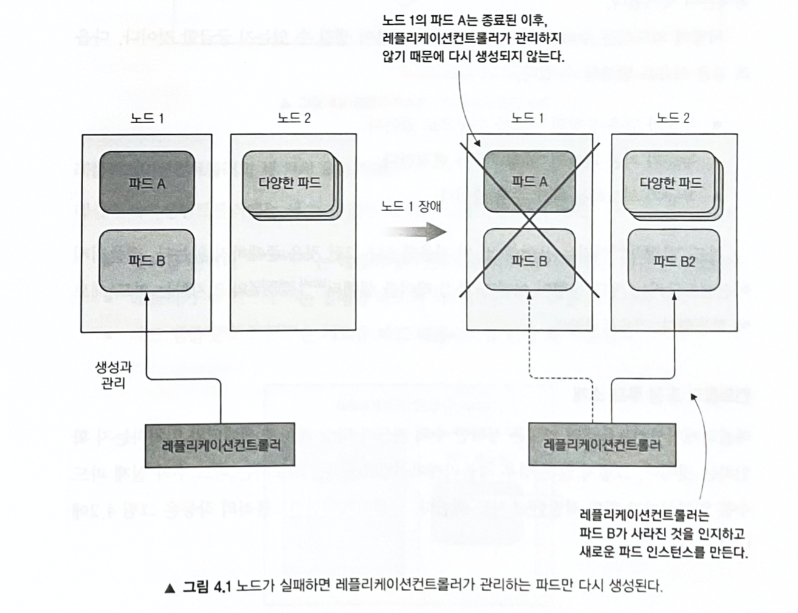
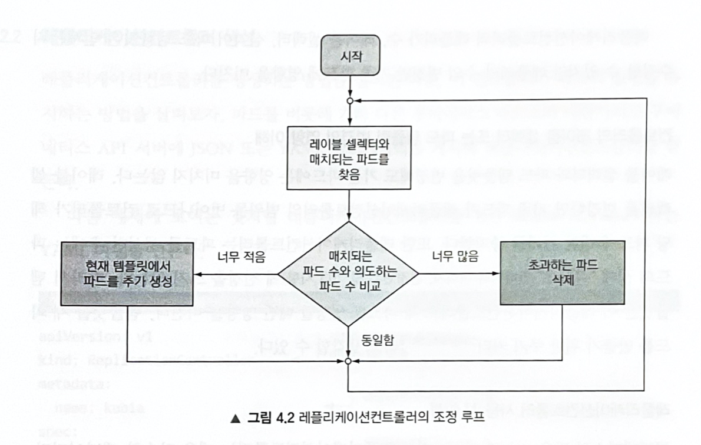
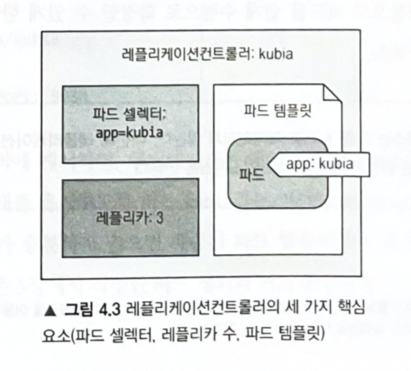

# 레플리케이션과 그 밖의 컨트롤러: 관리되는 파드 배포

## 파드를 안정적으로 유지하기

### 라이브니스 프로브 소개

- 파드의 spec 설정에 각 컨테이너의 라이브니스 프로브를 지정할 수 있다.
- 쿠버네티스는 주기적으로 프로브를 실행하여 실패한 경우 컨테이너를 다시 시작한다.

쿠버네티스는 3가지 메커니즘을 사용해 컨테이너 프로브를 실행한다.
- HTTP GET 프로브: 지정한 IP 주소, 포트, 경로에 HTTP GET 요청을 수행한다. 해당 HTTP 요청의 응답코드가 오류를 나타내지 않는 경우 성공했다고 간주하고 오류를 나타낸 경우 프로브를 실패한 것으로 간주해 컨테이너를 재시작한다.
- TCP 소켓 프로브: 컨테이너의 지정된 포트에 TCP 연결을 시도 후 연결에 성공하면 프로브 성공 아니면 실패된다.
- Exec 프로브: 컨테이너 내의 임의의 명령을 실행하고 멸령의 종료 상태 코드를 확인한다. 상태 코드 0이면 성공 그외 모든 코드는 실패로 간주한다.

### HTTP 기반 라이브니스 프로브 생성

- 웹 애플리케이션이므로 웹 서버가 요청을 처리하는지 체크하는 라이브니스 프로브를 추가하는 것이 좋다.

kubia-liveness-probe
```yaml
apiVersion: v1
kind: Pod
metadata:
  name: kubia-liveness
spec:
  containers:
  - image: luksa/kubia-unhealthy
    name: kubia
    livenessProbe:
      httpGet:
        path: /
        port: 8080
```

- 파드 디스크립터는 쿠버네티스가 주기적으로 "/" 경로와 8080포트에 HTTP GET을 요청해서 컨테이너가 정상 동작하는지 확인하도록 httpGet 라이브니스 프로브를 정의한다.

```shell
$ kubectl create -f kubia-liveness-probe.yaml
```

### 동작 중인 라이브니스 프로브 확인

```shell
$ kubectl get po kubia-liveness
```

```terminal
NAME             READY   STATUS    RESTARTS      AGE
kubia-liveness   1/1     Running   1 (34s ago)   2m44s
```

> 크래시된 컨테이너의 애플리크에션 로그를 얻으려면 련재 컨테이너 로그를 뽑는 `kubectl logs mypod`에 `--previous` 인자를 붙이면 된다. `kubectl logs mypod --previous`

```shell
$ kubectl describe po kubia-liveness
```
```terminal
...

Containers:
  kubia:
    Container ID:   docker://69b6955876bf27f2cd12ce433136fdad33dfc070fb8cb4c616942a291c6c9691
    Image:          luksa/kubia-unhealthy
    Image ID:       docker-pullable://luksa/kubia-unhealthy@sha256:5c746a42612be61209417d913030d97555cff0b8225092908c57634ad7c235f7
    Port:           <none>
    Host Port:      <none>
    State:          Running
      Started:      Wed, 29 Jun 2022 09:08:45 +0900
    Last State:     Terminated
      Reason:       Error
      Exit Code:    137 # 이전 컨테이너가 에러로 인해 코드 137을 반환하고 중지됐다.
      Started:      Wed, 29 Jun 2022 09:06:56 +0900
      Finished:     Wed, 29 Jun 2022 09:08:43 +0900
    Ready:          True
    Restart Count:  1 # 컨테이너가 한번 다시 시작됐다.
    Liveness:       http-get http://:8080/ delay=0s timeout=1s period=10s #success=1 #failure=3
    Environment:    <none>
    Mounts:
      /var/run/secrets/kubernetes.io/serviceaccount from kube-api-access-s966w (ro)
      
...

Events:
  Type     Reason     Age                  From               Message
  ----     ------     ----                 ----               -------
  Normal   Scheduled  2m22s                default-scheduler  Successfully assigned default/kubia-liveness to minikube
  Normal   Pulled     2m19s                kubelet            Successfully pulled image "luksa/kubia-unhealthy" in 2.516975922s
  Warning  Unhealthy  62s (x3 over 82s)    kubelet            Liveness probe failed: HTTP probe failed with statuscode: 500
  Normal   Killing    62s                  kubelet            Container kubia failed liveness probe, will be restarted
  Normal   Pulling    32s (x2 over 2m22s)  kubelet            Pulling image "luksa/kubia-unhealthy"
  Normal   Created    30s (x2 over 2m19s)  kubelet            Created container kubia
  Normal   Started    30s (x2 over 2m19s)  kubelet            Started container kubia
  Normal   Pulled     30s                  kubelet            Successfully pulled image "luksa/kubia-unhealthy" in 2.467073672s
```

- 컨테이너가 실행 중이지만 오류로 인해 이전에 종료된 것을 알 수 있다.
- 종료 코드 (Exit Code)가 137인 이유는 `128 + x` 여기서 `x`는 프로세스에 전송된 시그널 번호이며, 이 시그널로 인해 컨테이너가 종료됐다. 이 예에서는 `x`는 `SIGKILL` 시그널 번호인 9이며, 프로세스가 강제 종료됐음을 뜻한다.

> 컨테이너가 종료됬을 때 같은 컨테이너가 아닌 완전히 새로운 컨테이너가 생성된다.

### 라이브니스 프로브의 추가 속성 설정

```yaml
livenessProbe:
  httpGet:
    path: /
    port: 8080
  initialDelaySeconds: 15 # 첫 번째 프로브 실행까지 15초 대기
```

- 초기 지연을 설정하지 안ㄹ므녀 프로브는 컨테이너가 시작되자마자 프로브를 시작한다. 이 경우 대부분 애플리케이션이 요청을 받을 준비가 되어있지 않기 때문에 프로브가 실패하고 이 실패횟수가 임곗값을 초과하면 애플리케이션이 올라오기도 전에 컨테이너가 다시 시작한다.
> 종료코드가 137 or 143 일경우 `SIGKILL(9)` or `SIGTERM(15)` 외부시그널로 인해 컨테이너가 종료됐음을 나타낸다.

### 효과적인 라이브니스 프로브 생성

#### 라이브니스 프로브가 확인해야 할 사항

- 라이브니스 프로브를 사용하면 컨테이너 내부의 웹 서버가 HTTP 요청에 응답하지 않으면 컨테이너가 다시 시작되기 때문에 대부분 이것으로 충분할 것이다.
- 그러나 특정 url경로에 요청하도록 프로브를 구성해서 애플리케이션 내에서 실행 중인 모든 주요 구성 요소가 살아 있는지 또는 응답이 없는지 확인하도록 구성할 수 있다.
- 라이브니스 프로브는 애플리케이션 내부만 측정하고 외부 요인의 영향을 받지 않도록 해야 한다. 예를 들어 프론트엔드 웹서버가 백엔드 데이터베이스에 연결될수 없을때 라이브니스 프로브는 실패를 반환해서는 안된다. 근본적인 원인이 데이터베이스일 경우 웹 서버 컨테이너 재시작으로 고칠 수 없기 때문이다.

> 프로브가 확인한는 HTTP 엔드포인트에 인증이 필요한지 않은지 확인하라. 그렇지 않으면 프로보가 항상 실패해 컨테이너가 무한정으로 재시작한다.

---

#### 프로브를 가볍게 유지하기 / 프로브에 재시도 루프를 구현하지 마라

- 프로브는 컨테이너의 CPU 시간 할당량으로 계산되므로, 라이브니스 프로브는 애플리케이션에 큰 부하가 되지 않게 가볍게 만들어야 한다.
- 프로브 실패 임곗값을 1로 설정하더라도 쿠버네티스는 실패를 한번 했다고 간주하기 전에 프로브를 여러번 재시도한다. 따라서 프로브에 자체적인 재기도 루프를 구현하는 것은 헛수고이다.

---

#### 라이브니스 프로브 요약

- 파드를 호스팅하는 노드의 `kubelet`는 컨테이너가 크래시하거나 라이브니스 프로브가 실패할 경우 컨테이너를 재시작하는 작업을 수행한다. 마스터에서 수행하는 쿠버네티스 컨트롤 플레인은 이 프로세스에 관여하지 않는다.
- 하지만 노드가 크래쉬하면 노드 크래시로 중단된 모든 파드의 대체 파드를 생성해랴 하는 것은 컨트롤 플레인의 몫이다.
- 사용자가 직접 생성한 파드는 `kubelet`에서만 관리되는데, `kubelet`는 노드에서 실행되기 때문에 노드 자체가 고장나면 아무것도 할 수 없다. (이를 해결하기 위한것이 레플리케이션컨트롤러와 같은 방법을 이용한 매커니즘)

## 레플리케이션컨트롤러 소개

- 레플리케이션 컨트롤러가 관리하는 파드는 새로 만들어지지만 관리하지 않는 파드는 없에면 사라진다.



### 레플리케이션컨트롤러의 동작

#### 컨트롤러 조정 루프 소개

- 레플리케이션 컨트롤러는 정확한 수의 파드가 항상 레이블 셀렉터랑 일치하는지 확인하고 그렇지 않은 경우 의도한 파드의 수를 일치시키기 위해 적절한 조치를 취한다.



#### 레플리케이션컨트롤러의 세 가지 요소 이해

- 레이블 셀렉터는 레플리케이션컨트롤러의 범위에 있는 파드를 결정한다.
- 레플리카 수는 실행할 파드의 의도하는 수를 지정한다.
- 파드 템플릿은 새로운 파드 레플리카를 만들 때 사용된다.
- 레플리케리션컨트롤러의 레플리카 수, 레이블 셀렉터, 심지어 파드 템플릿은 언제든지 수정할 수 있지만 레플리카 수의 변경만 기존 파드에 영향을 미친다. (?)



---

#### 컨트롤러의 레이블 셀렉터 또는 파드 템플릿 변경의 영향 이해
- 레이블 셀렉터와 파드 템플릿을 변경하면 기존 파드가 범위를 벗어나므로 컨트롤러는 해당 파드에 대한 관리를 중지한다.
- 파드를 생성한 후에는 파드의 실제 "콘텐츠"(컨테이너 이미지, 환경변수 및 기타사항)에 신경쓰지 않는다.
- 템플릿은 레플리케이션 컨트롤러로 새 파드를 생성할 때만 영향을 미친다.
- 템플릿은 새 파드를 위한 쿠키 커터!

#### 레플리케이션컨트롤러의 사용 시 이점
- 기존 파드가 사라지면 새 파드를 시작해 파드(또는 여러 파드의 복제본)가 항상 실행 되도록 한다.
- 클러스터 노드에 장애가 발생하면 발생한 노드에서 실행 중인 모든 파드에 관한 교체 복제본이 생성된다.
- 수평 또는 자동으로 파드를 쉽게 수평으로 확장할 수 있게 한다.

### 레플리케이션 컨트롤러 생성

kubia-rc.yaml
```yaml
apiVersion: v1
kind: ReplicationController
metadata: 
  name: kubia
spec:
  replicas: 3
  selector:
    app: kubia
  template:
    metadata:
      labels:
        app: kubia
    spec:
      containers:
      - name: kubia
        image: luksa/kubia
        ports:
        - containerPort: 8080 
```

```shell
$ kubectl create -f kubia-rc.yaml
```

- 파일을 API 서버에 게시하면 쿠버네티스는 레이블 셀렉터가 app=kubia와 일치하는 파드 인스터스가 3개를 유지하도록 하는 kubia라는 이름의 새로운 레플리케이션 컨트롤러를 생성한다.
- 템플릿의 파드 레이블이 레플리케이션 컨트롤러의 레이블 셀렉터와 완전히 일치하지 않으면 컨트롤러가 새 파드를 무한정 생성할 수 있다.
- 이를 방지하기 위해 API서버는 레플리케이션 컨트롤러의 정의를 검증하고 잘못 구성된 경우 이를 받아들이지 않는다.
- 셀렉터를 지정하지 않으면 템플릿의 레이블로 자동 설정된다.

> 레플리케이션 컨트롤러를 지정할때 파드 셀렉터를 지정하지 않으면 쿠버네티스가 파드 템플릿에서 추출한다. 이렇게 하면 YAML이 더 단순하다.

### 레플리케이션컨트롤러 작동 확인

```shell
$ kubectl get pods
```

```terminal
NAME          READY   STATUS              RESTARTS   AGE
kubia-j5825   0/1     ContainerCreating   0          15s
kubia-pgdj6   0/1     ContainerCreating   0          15s
kubia-xndvt   0/1     ContainerCreating   0          15s
```

#### 삭제된 파드에 관한 레플리케이션 컨트롤러의 반응 확인

```shell
$ kubectl delete pod kubia-j5825
```

```terminal
NAME          READY   STATUS              RESTARTS   AGE
kubia-ndlk5   1/1     Terminating         0          4m33s
kubia-pgdj6   1/1     Running             0          7m58s
kubia-sl6tp   0/1     ContainerCreating   0          1s
kubia-xndvt   1/1     Running             0          7m58s
```

- 레플리이션컨트롤러가 삭제한 파드를 자동으로 생성한다.

#### 레플리케이션컨트롤러 정보 얻기

```shell
$ kubectl get rc
# $ kubectl get replicationController 
```

```terminal
NAME    DESIRED   CURRENT   READY   AGE
kubia   3         3         3       13m
```

- DESIRED: 의도하는 파드 수
- CURRENT: 실제 파드 수
- READY: 준비된 파드 수
- AGE: 레플리케이션 컨트롤러 수명

```shell
$ kubectl describe rc kubia
```
```terminal
Name:         kubia
Namespace:    default
Selector:     app=kubia
Labels:       app=kubia
Annotations:  <none>
Replicas:     3 current / 3 desired
Pods Status:  3 Running / 0 Waiting / 0 Succeeded / 0 Failed
Pod Template:
  Labels:  app=kubia
  Containers:
   kubia:
    Image:        luksa/kubia
    Port:         8080/TCP
    Host Port:    0/TCP
    Environment:  <none>
    Mounts:       <none>
  Volumes:        <none>
Events:
  Type    Reason            Age    From                    Message
  ----    ------            ----   ----                    -------
  Normal  SuccessfulCreate  16m    replication-controller  Created pod: kubia-j5825
  Normal  SuccessfulCreate  16m    replication-controller  Created pod: kubia-pgdj6
  Normal  SuccessfulCreate  16m    replication-controller  Created pod: kubia-xndvt
  Normal  SuccessfulCreate  12m    replication-controller  Created pod: kubia-ndlk5
  Normal  SuccessfulCreate  8m10s  replication-controller  Created pod: kubia-sl6tp
```

---

#### 컨트롤러가 새로운 파드를 생성한 원인 정확히 이해하기

- 컨트롤러는 삭제된 파드에 대응하지만 엄밀히 말하면 현재 상태와 결과적인 상태가 맞지 않아서 대응하는 것이다.
- 컨트롤러는 삭제된 파드에 대한 즉각적으로 통지를 받지만 

