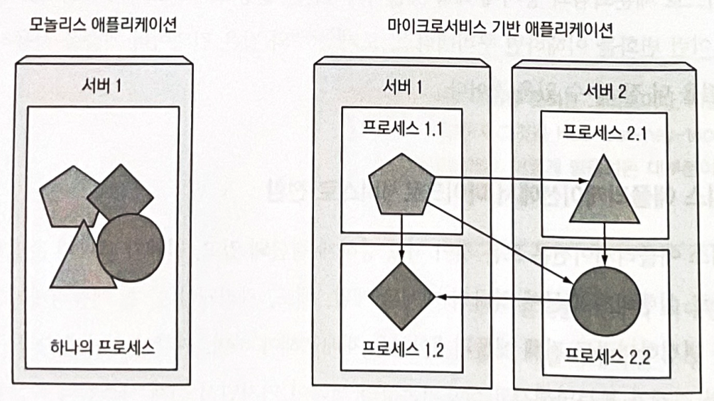
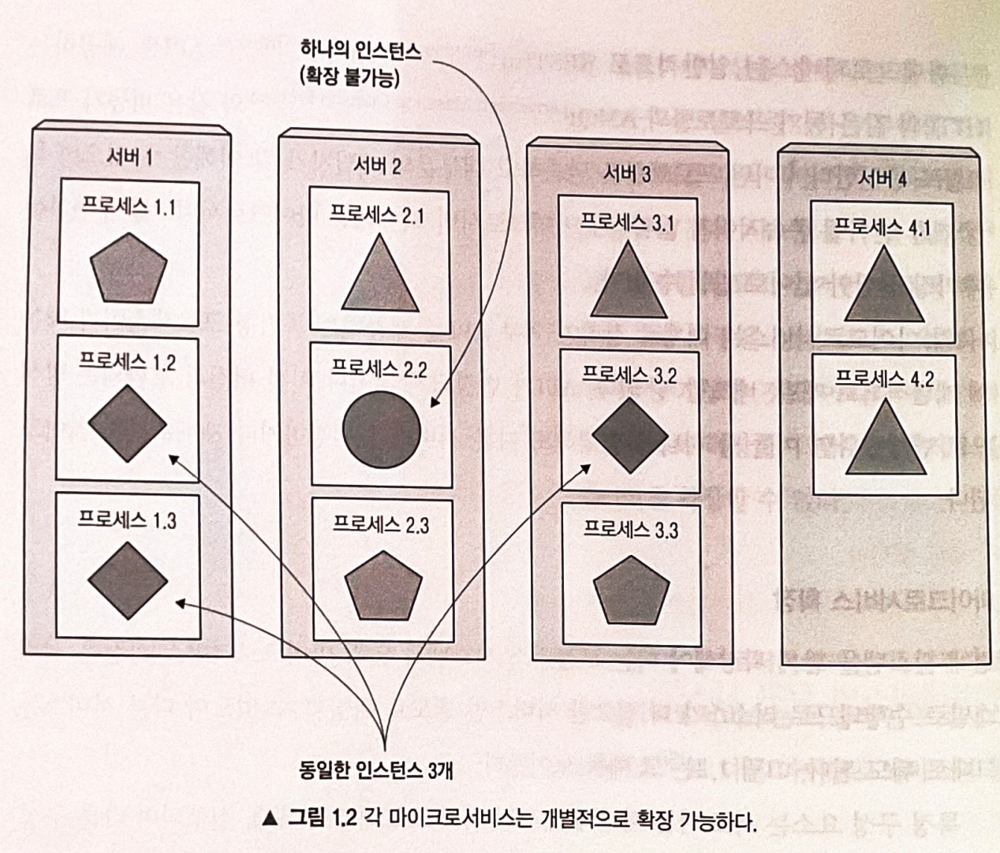
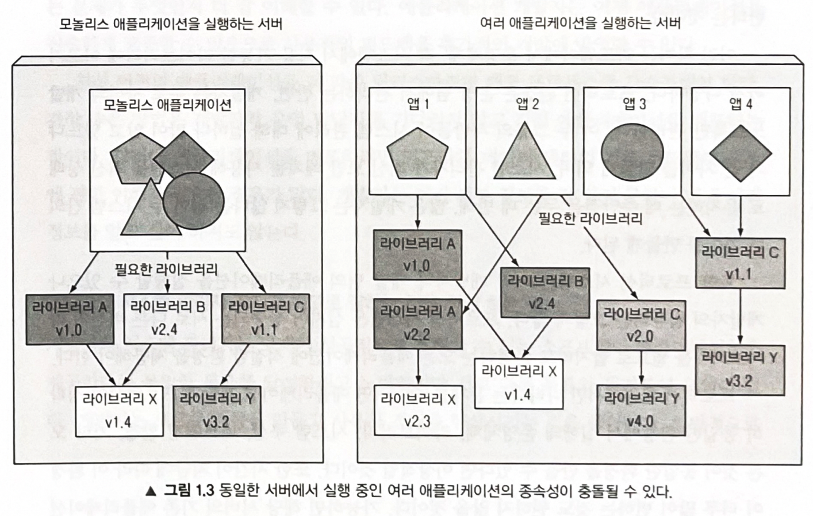
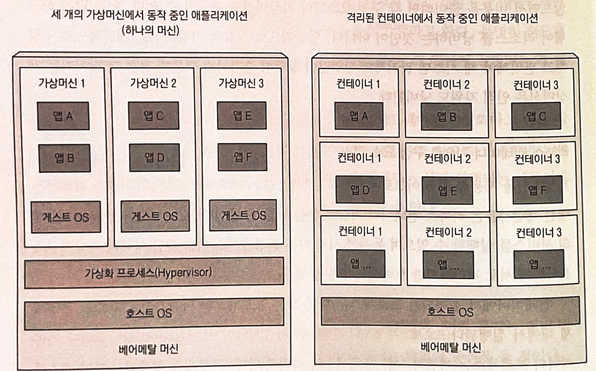

# 쿠버네티스 소개 

### 다루는 내용
- 최근 소프트웨어의 개발과 배포의 변화 이해
- 애플리케이션 격리, 컨테이너를 통한 실행 환경 차이 줄이기
- 쿠버네티스에서 사용되는 컨테이너와 도커의 이해
- 쿠버네티스로 개발자와 시스템 관리자의 작업 간소화

---

과거 거대한 모놀리스로 구성되던 레거시 시스템들은 릴리스 주기가 느리고 업데이트가 자주 되지 않는 등 몇 가지 문제점들이 존재한다.  

이러한 모놀리스 레거시 시스템들이 점차 마이크로서비스로 세분화되고있다.
- 이로써 개별적으로 개발, 배포, 업데이트, 확장을 진행할 수 있어서 요구사항을 신속하게 만족시킬 수 있다.

그러나 분산된 서비스들이 모두 관리 요소가 되는 만큼 전체 시스템을 원활하게 구성, 관리, 유지하는 일이 점점 어려워졌다.  
- 리소스 활용률 높이기
- 하드웨어 비용 낮추기
- 각 구성 요소 배치할 위치 파악
- 서버 배포 자동화 및 스케줄링
- 구성, 관리, 장애 처리를 포함한 자동화

위와 같은 문제점들을 해결하기 위해 쿠버네티스가 등장했다.
- 애플리케이션을 원하는 만큼 자주 배포 가능
- 장애 발생시 애플리케이션 자동 모니터링 및 스케줄링 조정
- 하드웨어 인프라를 추상화 하여 데이터 센터 전체를 하나의 거대한 컴퓨팅 리소스로 제공
  - 서버 정보에 대해 세세하게 알 필요 없음

## 쿠버네티스가 왜 필요한가?

### 1. 모놀리스 애플리케이션 -> 마이크로 서비스
모놀리스 애플리케이션은 다음과 같은 특징과 문제점들이 있다.
- 모든 것이 서로 강하게 결합되어 있다.
- 하나의 개체로 개발, 배포, 관리돼야 한다.
- 애플리케이션의 한 부분이 변경되어도 전체 애플리케이션을 재배포 해야한다.
- 시간이 지남에 따라 구성 요소 간의 경계가 불분명해진다.
- 상호의존성의 제약이 커진다.
- 전체 시스템의 복잡성이 증가되고 품질이 저하된다.
- Scale out에 용이한 구조가 아니기 때문에 Scale up만 가능하다.
  - Scale out은 전체 애플리케이션을 복제하는 방식으로만 가능하다.

위와 같은 모놀리스 애플리케이션의 문제점을 해결하기 위해 애플리케이션을 마이크로서비스라는 독립적으로 배포할 수 있는 작은 구성 요소로 분할해야 한다.

마이크로서비스는 일반적으로 RESTful API를 제공하는 HTTP와 같은 동기 프로토콜과 AMQP(Advanced Message Queuing Protocol)와 같은 비동기 프로토콜로 통신한다.
- 최근 gRPC나 RSocket등 다양한 프로토콜도 사용한다.
각 마이크로서비스는 대체로 정적인 외부 API를 제공하는 독립형 프로세스이기 때문에 개별적올 개발, 배포될 수 있다.  

전체 시스템을 함께 확장해야되는 모놀리스 시스템과 달리 마이크로서비스 확장은 서비스별로 수행되므로 리소스가 더 필요한 서비스만 별도로 확장할 수 있다.  

이런 장점을 가진 마이크로서비스도 단점이 존재한다.
- 구성 요소가 많아지면 배포 조합의 수뿐만 아니라 구성 요소 간의 상호 종속성 수가 훨씬 더 많아지므로 배포 관련 결정이 점점 어려워진다.  
- 여러 서비스가 함께 작업을 수행하므로 서로를 찾아 통신해야 한다.
- 전체가 하나의 시스템처럼 동작할 수 있도록 제대로 구성해야한다. 
- 여러 프로세스와 시스템이 분산되어 실행 호출을 디버그하고 추적하기 어렵다.  

마지막으로 마이크로서비스 아키텍처의 구성 요소들은 독립적으로 배포될 뿐만 아니라 독립적으로 개발된다.  
따라서 각 팀이 다른 라이브러리를 사용하는 경우가 많다.  
이런 경우 아래 그림처럼 애플리케이션 구성 요소 간 종속성이 복잡해진다.
  

이렇게 복잡해진 종속성을 관리하기는 매우 어려운 일이다.  

### 2. 애플리케이션에 일관된 환경 제공
애플리케이션을 실행하는 환경은 항상 달라진다.
- 개발 환경
- 프로덕션 환경
- 프로덕션 환경의 변화

프로덕션 환경에서만 나타나는 문제를 줄이려면 애플리케이션 개발과 프로덕션이 정확히 동일한 환경에서 실행돼야 한다.  
가능하면 해당 서버의 기존 애플리케이션에 영향을 주지 않고 동일한 서버에 애플리케이션을 추가할 수 있는 기능을 원할 것이다.  

### 3. 지속적인 배포
이제는 개발 팀이 애플리케이션을 배포하고 관리하는 것이 더 낫다는 것을 깨달았다.
- 개발자, QA, 운영 팀이 전체 프로세스에서 협업해야한다.
- 이것이 데브옵스이다.  

데브옵스에서는 아래와 같은 이점을 챙길 수 있다.  
- 운영 팀이 애플리케이션을 유지하면서 직면하는 문제점을 개발자가 바로 알 수 있다.  
- 개발자가 신속하게 애플리케이션을 제공할 수 있으므로 사용자의 피드백을 추가적인 개발에 반영할 수 있다.  
- 배포 프로세스를 간소화 하여 더 많은 릴리즈를 소화할 수 있다.

## 컨테이너 기술
### 컨테이너란?  
가상머신의 상당한 크기로 인해 각 마이크로서비스의 환경을 격리하는 대신 리눅스 컨테이너 기술이 눈길을 끌기 시작했다.  
동일한 호스트 시스템에서 여러 개의 서비스를 실행할 수 있으며 동시에 서로 다른 환경을 만들어줄 뿐만 아니라 가상머신과 유사하게 서로 격리하지만 오버헤드가 훨씬 적다.  
- 컨테이너에서 실행되는 모든 프로세스는 호스트 운영체제 내에서 실행된다.
- 그러나 컨테이너 프로세스는 다른 프로세스와 격리되어 있다.  

리소스 제한으로 인해 각 가상머신에 여러 애플리케이션을 그룹으로 배포해야되는 가상머신과는 다르게 컨테이너를 사용하면 각 애플리케이션마다 하나의 컨테이너를 가질 수 있다.  
- 그 결과 더 많은 애플리케이션을 적재할 수 있다.  

  

### 컨테이너 격리 메커니즘
#### 리눅스 네임스페이스
기본적으로 각 리눅스 시스템은 초기 구동시 하나의 네임스페이스가 있다.  
모든 시스템 리소스는 하나의 네임스페이스에 속한다.  
프로세스는 동일한 네임스페이스 내에 있는 리소스만 볼 수 있으며 프로세스는 여러 네임스페이스에 속할 수 있다.  

네임스페이스의 종류는 아래와 같으며, 각 네임스페이스는 특정 리소스 그룹을 격리하는데 사용된다.  
- 마운트(mnt)
- 프로세스 ID(pid)
- 네트워크(net)
- 프로세스 간 통신(ipc)
- 호스트와 도메인 이름(uts)
- 사용자 ID(user)  

#### 프로세스 가용 리소스 제한
프로세스의 리소스 사용을 제한하는 리눅스 커널 기능인 cgroups로 이루어진다.  
- 프로세스는 설정된 양 이상의 CPU, 메모리, 네트워크 대역폭 등을 사용할 수 없다.  

이런 방식으로 프로세스는 다른 프로세스용으로 예약된 리소스를 사용할 수 없다.  
