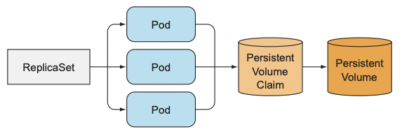
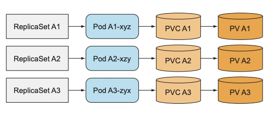
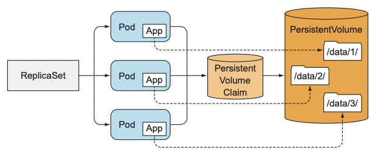
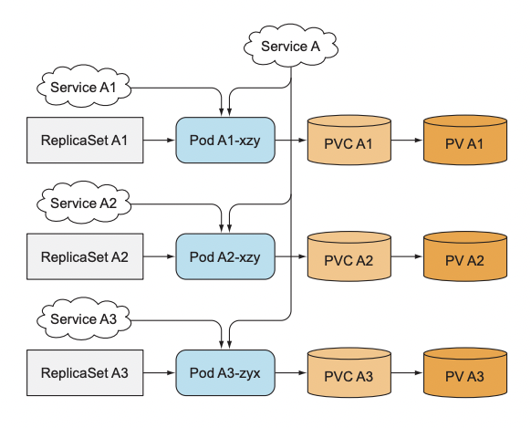
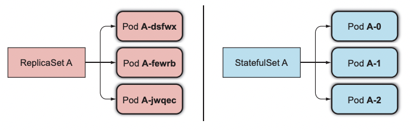
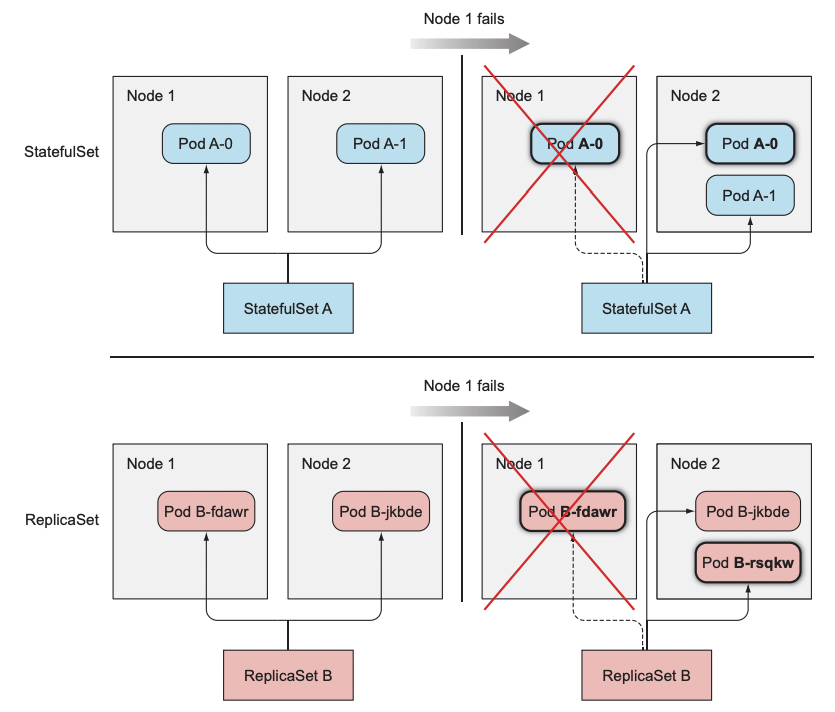
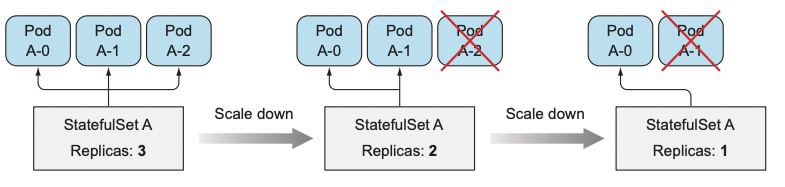
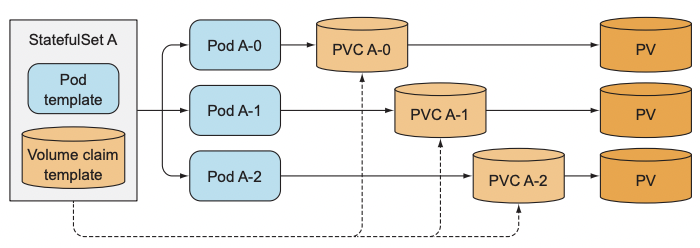
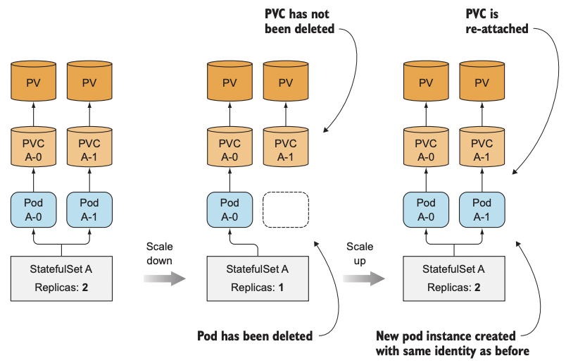

# 스테이트풀셋

# 스테이트풀 파드 복제하기
레플리카셋은 하나의 파드 템플릿에서 여러 개의 파드 레플리카를 생성한다.

파드 템플릿이 특정 PVC를 참조하는 볼륨을 포함하면 레플리카셋의 모든 레플리카는 정확히 동일한 PVC를 사용할 것이고 클레임에 바인딩된 동일한 퍼시스턴트볼륨을 사용하게된다.  

  

여러 개의 파드 레플리카를 복제하는데 사용하는 파드 템플릿에는 클레임에 관한 참조가 있으므로 각 레플리카가 별도의 PVC를 사용하도록 만들 수 없다.  

각 인스턴스가 별도의 스토리지를 필요로 하는 분산 데이터 저장소를 실행하려면 레플리카셋을 사용할 수 없다.

## 개별 스토리지를 갖는 레플리카 여러 개 설정하기
### 수동으로 파드 생성하기
파드를 수동으로 생성해 각 파드가 다른 PVC를 갖게 한다.
- 레플리카셋이 파드를 감시하지 않으므로 수동으로 파드를 관리해야한다.

가능한 옵션이 아니다.

### 파드 인스턴스별로 하나의 레플리카셋 사용하기
  
단일 레플리카셋을 사용하는 것에 훨씬 번거롭다.
- 파드를 스케일링하는 대신 추가 레플리카셋을 생성해야한다.  

### 동일 볼륨을 여러 개 디렉터리로 사용하기  
  
모든 파드가 동일한 퍼시스턴트볼륨을 사용하게 하되 각 파드의 볼륨 내부에서 별도의 파일 디렉터리를 갖게 한다.  
- 각 인스턴스에 어떤 디렉터리를 사용해야 하는지 전달할 수 없다.  
- 다른 인스턴스가 사용하지 않는 디렉터리를 선택하게 해야 한다.  
- 인스턴스간 조정이 필요하고 올바르게 수행하기 쉽지 않다.
- 공유 스토리지 볼륨에 병목 현상이 발생한다.  

## 각 파드에 안정적인 아이덴티티 제공하기
스토리지 외에도 특정 클러스터 애플리케이션은 각 인스턴스에서 장시간 지속되는 안정적인 아이덴티티를 필요로 한다.  

레플리카셋이 파드를 교체하면 새 파드가 갖는 스토리지 볼륨의 데이터는 종료된 이전의 파드 것일지라도 완전히 새로운 호스트 이름과 IP를 가진다.
- 이전 인스턴스의 데이터를 가지고 시작할 때 새로운 네트워크 아이덴티티로 인해 문제가 발생할 수 있다.  

### 각 파드 인스턴스별 전용 서비스 사용하기
서비스 IP는 안정적이므로 설정에서 각 멤버를 서비스 IP를 통해 가리킬 수 있다.
- 레플리카셋을 각각 생성하는 것과 유사하다.

  

개별 파드는 자신이 어떤 서비스를 통해 노출되는지 알 수 없으므로 그 IP를 사용해 다른 파드에 자신을 등록할 수 없다.  

# 스테이트풀셋 이해하기  

### 애완동물과 가축

스테이트리스 애플리케이션의 인스턴스는 가축과 같이 동작한다.  
- 인스턴스가 죽더라도 새로운 인스턴스로 교체하는 것 처럼 차이를 알아차리지 못한다.
- 인스턴스가 죽는 것은 아무런 문제가 되지 않는다.  

스테이트풀 애플리케이션은 애완동물과 같다.  
- 애완동물이 죽었을 때 새 애완동물을 바로 살 수 없고, 사람들도 금방 알아차린다.
- 잃어버린 애완동물을 대체하려면 이전 애완동물과 생김새와 행동이 완전히 같아야 한다.  
- 새 인스턴스가 이전 인스턴스와 완전히 같은 상태와 아이덴티티를 가져야 함을 의미한다.  

## 안정적인 네트워크 아이덴티티 제공하기
스테이트풀셋으로 생성된 파드는 서수 인덱스가 할당되고 파드의 이름과 호스트 이름, 안정적인 스토리지를 붙이는데 사용된다.  

스테이트풀셋의 이름과 인스턴스의 서수 인덱스로부터 파생되므로 파드의 이름을 예측할 수 있다.  

  

### 거버닝 서비스 소개
스테이트풀 파드는 때때로 호스트 이름을 통해 다뤄져야 할 필요가 있다.  

스테이트풀셋은 거버닝 헤드리스 서비스를 생성해서 각 파드에게 실제 네트워크 아이덴티티를 제공해야 한다.  

이 서비스를 통해 각 파드는 자체 DNS 엔트리를 가지며 클러스터의 피어 혹은 클러스터의 다른 클라이언트가 호스트 이름을 통해 파드의 주소를 지정할 수 있다.  

> default라는 네임스페이스에 속하는 foo라는 이름의 거버닝 서비스가 있고 파드의 이름이 A-0 이라면, 이 파드는 `a-0.foo.default.svc.cluster.local` 이라는 FQDN을 통해 접근할 수 있다.  

### 스테이트풀셋 교체  
  

### 스테이트풀셋 스케일링 
스테이트풀셋은 스케일링시 사용하지 않는 다음 서수 인덱스를 갖는 새로운 파드 인스턴스를 생성한다.  

스테이트풀셋의 스케일 다운의 좋은 점은 항상 어떤 파드가 제거될지 알 수 있다는 점이다.  

스테이트풀셋의 스케일 다운은 항상 가장 높은 서수 인덱스를 먼저 제거한다.  

  

스테이트풀셋은 인스턴스 하나라도 비정상인 경우 스케일 다운 작업을 허용하지 않는다.  

## 각 스테이트풀 인스턴스에 안정적인 전용 스토리지 제공하기  
스테이트풀 파드의 스토리지는 영구적이어야 하고 파드와는 분리돼야 한다.  

### 볼륨 클레임 템플릿과 파드 템플릿을 같이 구성 
스테이트풀셋이 파드를 생성하는 것과 같은 방식으로 PVC 또한 생성해야 한다.  

이런 이유로 스테이트풀셋은 각 파드와 함께하는 PVC를 복제하는 하나 이상의 볼륨 클레임 템플릿을 가질 수 있다.  

  

스테이트풀셋을 하나 스케일 업 하면 두 개 이상의 API 오브젝트(파드와 파드에서 참조하는 하나 이상의 PVC)가 생성된다.  
하지만 스케일 다운을 할 때 파드만 삭제하고 클레임은 남겨둔다.  

때문에 퍼시스턴트볼륨을 릴리즈 하려면 pvc를 수동으로 삭제해야 한다.  

스케일 다운 이후 PVC가 남아있다는 사실은 이후에 스케일 업을 하면 PVC에 바인딩된 동일한 클레임을 다시 연결할 수 있고, 새로운 파드에 그 콘텐츠가 연결된다는 것을 의미한다.  

  

## 스테이트풀셋 보장 이해하기
파드가 안정적인 아이덴티티와 스토리지를 갖는 것으로 끝나지 않는다.  

스테이트풀셋이 파드에 대해 보장하는 것은 더 있다.  

쿠버네티스는 두 개의 스테이트풀 파드 인스턴스가 절대 동일한 아이덴티티로 실행되지 않고 동일한 PVC에 바인딩되지 않도록 보장한다.  

스테이트풀셋은 스테이트풀 파드 인스턴스의 최대 하나의 의미를 보장해야 한다.  
- 즉 스테이트풀셋은 교체 파드를 생성하기 전에 파드가 더 이상 실행중이지 않는다는 점을 절대적으로 확신해야 한다.  

