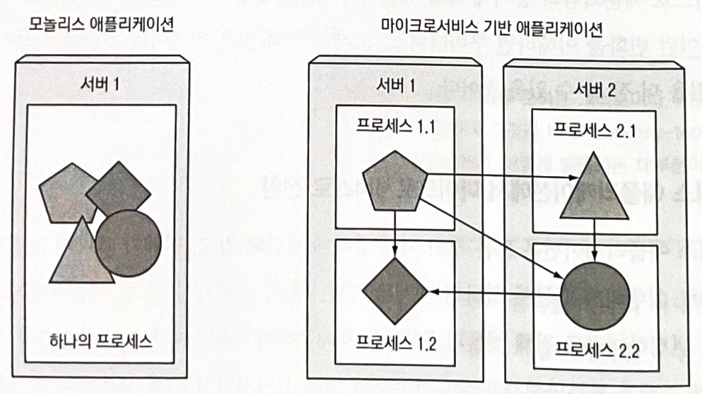

# 쿠버네티스 소개 

### 다루는 내용
- 최근 소프트웨어의 개발과 배포의 변화 이해
- 애플리케이션 격리, 컨테이너를 통한 실행 환경 차이 줄이기
- 쿠버네티스에서 사용되는 컨테이너와 도커의 이해
- 쿠버네티스로 개발자와 시스템 관리자의 작업 간소화

---

과거 거대한 모놀리스로 구성되던 레거시 시스템들은 릴리스 주기가 느리고 업데이트가 자주 되지 않는 등 몇 가지 문제점들이 존재한다.  

이러한 모놀리스 레거시 시스템들이 점차 마이크로서비스로 세분화되고있다.
- 이로써 개별적으로 개발, 배포, 업데이트, 확장을 진행할 수 있어서 요구사항을 신속하게 만족시킬 수 있다.

그러나 분산된 서비스들이 모두 관리 요소가 되는 만큼 전체 시스템을 원활하게 구성, 관리, 유지하는 일이 점점 어려워졌다.  
- 리소스 활용률 높이기
- 하드웨어 비용 낮추기
- 각 구성 요소 배치할 위치 파악
- 서버 배포 자동화 및 스케줄링
- 구성, 관리, 장애 처리를 포함한 자동화

위와 같은 문제점들을 해결하기 위해 쿠버네티스가 등장했다.
- 애플리케이션을 원하는 만큼 자주 배포 가능
- 장애 발생시 애플리케이션 자동 모니터링 및 스케줄링 조정
- 하드웨어 인프라를 추상화 하여 데이터 센터 전체를 하나의 거대한 컴퓨팅 리소스로 제공
  - 서버 정보에 대해 세세하게 알 필요 없음

# 쿠버네티스가 왜 필요한가?

## 1. 모놀리스 애플리케이션 -> 마이크로 서비스
모놀리스 애플리케이션은 다음과 같은 특징과 문제점들이 있다.
- 모든 것이 서로 강하게 결합되어 있다.
- 하나의 개체로 개발, 배포, 관리돼야 한다.
- 애플리케이션의 한 부분이 변경되어도 전체 애플리케이션을 재배포 해야한다.
- 시간이 지남에 따라 구성 요소 간의 경계가 불분명해진다.
- 상호의존성의 제약이 커진다.
- 전체 시스템의 복잡성이 증가되고 품질이 저하된다.
- Scale out에 용이한 구조가 아니기 때문에 Scale up만 가능하다.
  - Scale out은 전체 애플리케이션을 복제하는 방식으로만 가능하다.

위와 같은 모놀리스 애플리케이션의 문제점을 해결하기 위해 애플리케이션을 마이크로서비스라는 독립적으로 배포할 수 있는 작은 구성 요소로 분할해야 한다.

마이크로서비스는 일반적으로 RESTful API를 제공하는 HTTP와 같은 동기 프로토콜과 AMQP(Advanced Message Queuing Protocol)와 같은 비동기 프로토콜로 통신한다.
- 최근 gRPC나 RSocket등 다양한 프로토콜도 사용한다.
각 마이크로서비스는 대체로 정적인 외부 API를 제공하는 독립형 프로세스이기 때문에 개별적올 개발, 배포될 수 있다.  

전체 시스템을 함께 확장해야되는 모놀리스 시스템과 달리 마이크로서비스 확장은 서비스별로 수행되므로 리소스가 더 필요한 서비스만 별도로 확장할 수 있다.  

이런 장점을 가진 마이크로서비스도 단점이 존재한다.
- 구성 요소가 많아지면 배포 조합의 수뿐만 아니라 구성 요소 간의 상호 종속성 수가 훨씬 더 많아지므로 배포 관련 결정이 점점 어려워진다.  
- 여러 서비스가 함께 작업을 수행하므로 서로를 찾아 통신해야 한다.
- 전체가 하나의 시스템처럼 동작할 수 있도록 제대로 구성해야한다. 
- 여러 프로세스와 시스템이 분산되어 실행 호출을 디버그하고 추적하기 어렵다.  

마지막으로 마이크로서비스 아키텍처의 구성 요소들은 독립적으로 배포될 뿐만 아니라 독립적으로 개발된다.  
따라서 각 팀이 다른 라이브러리를 사용하는 경우가 많다.  
이런 경우 아래 그림처럼 애플리케이션 구성 요소 간 종속성이 복잡해진다.
  

이렇게 복잡해진 종속성을 관리하기는 매우 어려운 일이다.  

## 2. 애플리케이션에 일관된 환경 제공
애플리케이션을 실행하는 환경은 항상 달라진다.
- 개발 환경
- 프로덕션 환경
- 프로덕션 환경의 변화

프로덕션 환경에서만 나타나는 문제를 줄이려면 애플리케이션 개발과 프로덕션이 정확히 동일한 환경에서 실행돼야 한다.  
가능하면 해당 서버의 기존 애플리케이션에 영향을 주지 않고 동일한 서버에 애플리케이션을 추가할 수 있는 기능을 원할 것이다.  

## 3. 지속적인 배포
이제는 개발 팀이 애플리케이션을 배포하고 관리하는 것이 더 낫다는 것을 깨달았다.
- 개발자, QA, 운영 팀이 전체 프로세스에서 협업해야한다.
- 이것이 데브옵스이다.  

데브옵스에서는 아래와 같은 이점을 챙길 수 있다.  
- 운영 팀이 애플리케이션을 유지하면서 직면하는 문제점을 개발자가 바로 알 수 있다.  
- 개발자가 신속하게 애플리케이션을 제공할 수 있으므로 사용자의 피드백을 추가적인 개발에 반영할 수 있다.  
- 배포 프로세스를 간소화 하여 더 많은 릴리즈를 소화할 수 있다.

# 컨테이너 기술
## 컨테이너란?  
가상머신의 상당한 크기로 인해 각 마이크로서비스의 환경을 격리하는 대신 리눅스 컨테이너 기술이 눈길을 끌기 시작했다.  
동일한 호스트 시스템에서 여러 개의 서비스를 실행할 수 있으며 동시에 서로 다른 환경을 만들어줄 뿐만 아니라 가상머신과 유사하게 서로 격리하지만 오버헤드가 훨씬 적다.  
- 컨테이너에서 실행되는 모든 프로세스는 호스트 운영체제 내에서 실행된다.
- 그러나 컨테이너 프로세스는 다른 프로세스와 격리되어 있다.  

리소스 제한으로 인해 각 가상머신에 여러 애플리케이션을 그룹으로 배포해야되는 가상머신과는 다르게 컨테이너를 사용하면 각 애플리케이션마다 하나의 컨테이너를 가질 수 있다.  
- 그 결과 더 많은 애플리케이션을 적재할 수 있다.  

  

## 컨테이너 격리 메커니즘
### 리눅스 네임스페이스
기본적으로 각 리눅스 시스템은 초기 구동시 하나의 네임스페이스가 있다.  
모든 시스템 리소스는 하나의 네임스페이스에 속한다.  
프로세스는 동일한 네임스페이스 내에 있는 리소스만 볼 수 있으며 프로세스는 여러 네임스페이스에 속할 수 있다.  

네임스페이스의 종류는 아래와 같으며, 각 네임스페이스는 특정 리소스 그룹을 격리하는데 사용된다.  
- 마운트(mnt)
- 프로세스 ID(pid)
- 네트워크(net)
- 프로세스 간 통신(ipc)
- 호스트와 도메인 이름(uts)
- 사용자 ID(user)  

### 프로세스 가용 리소스 제한
프로세스의 리소스 사용을 제한하는 리눅스 커널 기능인 cgroups로 이루어진다.  
- 프로세스는 설정된 양 이상의 CPU, 메모리, 네트워크 대역폭 등을 사용할 수 없다.  

이런 방식으로 프로세스는 다른 프로세스용으로 예약된 리소스를 사용할 수 없다.  

## 도커 컨테이너

도커는 애플리케이션을 패키징, 배포, 실행하기 위한 플랫폼이다.  

도커의 세 가지 주요 개념은 아래와 같다.
- 이미지
  - 애플리케이션과 해당 환경을 패키지화 한 것
- 레지스트리
  - 도커 이미지를 저장하고 다른 사람이나 컴퓨터 간에 해당 이미지를 쉽게 공유할 수 있는 저장소
- 컨테이너
  - 도커 기반 컨테이너 이미지에 생성된 일반적인 리눅스 컨테이너

  

### 이미지 레이어
도커 이미지는 레이어로 구성되어 두 개의 다른 이미지가 기본 이미지로 동일한 부모 이미지를 사용한다면 첫 번째 이미지의 일부로 전송한 레이어를 다른 이미지를 전송할 때 다시 전송할 필요가 없기 때문에 네트워크로 이미지를 배포하는 속도가 빨라진다.  
뿐만 아니라 각 레이어는 동일 호스트에 한 번만 저장되기 때문에 스토리지 공간을 줄이는데 도움이 된다.  

### 컨테이너 이미지의 제한
컨테이너화된 애플리케이션이 특정 커널 버전이 필요하다면 모든 시스템에서 작동하지 않을 수 있다. 
- 머신이 다른 버전의 리눅스 커널로 실행되거나 동일한 커널 모듈을 사용할 수 없는 경우 애플리케이션이 실행될 수 없다.  
- 가상머신은 자체 커널을 실행하기 때문에 이런 제약이 없다.

특정 하드웨어 아키텍처용으로 만들어진 컨테이너화된 애플리케이션은 해당 아키텍처 시스템에서만 실행될 수 있다.  
- x86 아키텍처용으로 만들어진 애플리케이션을 ARM 기반 컴퓨터에서 도커가 실행된다고 해서 컨테이너화 할 수 없다.

# 쿠버네티스
구글은 애플리케이션 개발자와 시스템 관리자가 수천 개의 애플리케이션과 서비스를 관리하는 내부 시스템인 Borg를 개발해 운영하다가 2014년에 이를 통해 얻은 경험을 바탕으로 오픈소스 시스템인 쿠버네티스를 출시했다.  

  

쿠버네티스 시스템은 마스터 노드와 여러 워커 노드로 구성된다.  
개발자가 애플리케이션 매니페스트를 마스터에 게시하면 쿠버네티스는 해당 애플리케이션을 워커 노드 클러스터에 배포한다.  

애플리케이션 개발자가 특정 인프라 관련 서비스를 애플리케이션에 구현하지 않아도 된다.  
- 서비스 디스커버리, 스케일링, 로드밸런싱, 자가 치유, 리더 선출과 같은 로직을 애플리케이션에 구현하지 않아도 된다.  

## 쿠버네티스 클러스터 아키텍처
쿠버네티스 클러스터는 여러 노드로 구성되며 두 가지 유형으로 나눌 수 있다.
- 마스터 노드
  - 전체 쿠버네티스 시스템을 제어하고 관리하는 쿠버네티스 컨트롤 플레인을 실행
- 워커 노드
  - 실제 배포되는 컨테이너 애플리케이션 실행
  

### 컨트롤 플레인
컨트롤 플레인은 클러스터를 제어하고 작동시킨다.  
하나의 마스터 노드에서 실행되거나 여러 노드로 분할되어 고가용성을 보장할 수 있는 여러 구성 요소로 구성된다.  

- API 서버
  - 사용자, 컨트롤 플레인의 구성요소와 통신
- 스케줄러
  - 애플리케이션의 배포 담당
- 컨트롤러 매니저
  - 구성 요소 복제본, 워커 노드 추적, 노드 장애 처리 등과 같은 클러스터단의 기능 수행
- Etcd
  - 클러스터 구성을 지속적으로 저장하는 분산 데이터 저장소  

### 워커 노드
워커 노드는 컨테이너화된 애플리케이션을 실행하는 시스템이며 아래 구성 요소에 의해 수행된다.  
- 컨테이너 런타임
  - 컨테이너를 실행하는 도커, rkt 등등
- Kubelet  
  - API 서버와 통신하고 노드의 컨테이너 관리
- 서비스 프록시 (kube-proxy)  
  - 애플리케이션 구성 요소 간에 네트워크 트래픽을 로드밸런싱

## 쿠버네티스에서의 애플리케이션 실행

  
쿠버네티스에서 애플리케이션을 실행하려면 애플리케이션을 하나 이상의 컨테이너 이미지로 패키징하고 해당 이미지를 이미지 레지스트리로 푸시한 다음 쿠버네티스 API 서버에 애플리케이션 디스크립션을 게시해야 한다.  

디스크립션에는 아래와 같은 정보가 포함된다.  
- 컨테이너 이미지
- 애플리케이션 구성 요소가 포함된 이미지
- 해당 구성 요소가 서로 통신하는 방법
- 동일 서버에 함께 배치돼야 하는 구성 요소

API 서버가 애플리케이션 디스크립션을 처리할 때 스케줄러는 각 컨테이너에 필요한 리소스를 계산하고 해당 시점에 각 노드에 할당되지 않은 리소스를 기반으로 사용 가능한 워커 노드에 지정된 컨테이너를 할당한다.  
그런 다음 해당 노드의 Kubelet은 컨테이너 런타임에 필요한 컨테이너 이미지를 가져와 컨테이너를 실행하도록 지시한다.    

쿠버네티스는 애플리케이션의 배포 상태가 사용자가 제공한 디스크립션과 일치하는지 지속적으로 확인한다.  
- 예를 들어 항상 다섯 개의 웹 서버 인스턴스를 실행하도록 지정하면 쿠버네티스는 항상 정확히 다섯 개의 인스턴스를 계속 실행한다.  
- 인스턴스가 제대로 작동하지 않으면 쿠버네티스가 자동으로 다시 시작한다.  
만약 워커 노드가 종료되거나 액세스할 수 없게 되면 쿠버네티스는 이 노드에서 실행중인 모든 컨테이너의 노드를 새로 스케줄링하고, 새로 선택한 노드에서 실행한다.  

애플리케이션이 실행되는 동안 복제본 수를 지정할 수 있다.
- 최적의 복제본 수를 쿠버네티스가 결정하게 할 수 있다.
  - CPU 부하, 메모리 사용량, 초당 요청 수 등등 메트릭을 기반

컨테이너가 클러스터에서 지속적으로 이동하더라도 쿠버네티스의 kube-proxy는 서비스를 제공하는 모든 컨테이너에서 서비스 연결이 로드밸런싱되도록 한다.  

## 쿠버네티스 장점
### 애플리케이션 배포의 단순화  
쿠버네티스는 모든 워커 노드를 하나의 배포 플랫폼으로 제공하기 때문에 애플리케이션 개발자는 자체적으로 애플리케이션 배포를 싲가할 수 있으며 클러스터를 구성하는 서버에 관해 알 필요가 없다.  

### 하드웨어 활용도 증가
쿠버네티스에 애플리케이션을 실행하도록 지시하면 애플리케이션의 리소스 요구 사항에 대한 디스크립션과 각 노드에서 사용 가능한 리소스에 따라 애플리케이션을 실행할 가장 적합한 노드를 선택할 수 있다.  

즉 노드의 하드웨어 리소스를 최대한 활용할 수 있다.  

### 상태 확인과 자가 치유
쿠버네티스는 애플리케이션 구성 요소와 이 애플리케이션이 구동 중인 노드를 모니터링하다가 노드 장애 발생 시 자동으로 애플리케이션을 다른 노드로 스케줄링한다.  

### 오토스케일링
쿠버네티스는 각 애플리케이션에서 사용하는 리소스를 모니터링 하고 각 애플리케이션의 실행 중인 인스턴스 수를 계속 조정하도록 지시할 수 있다.  

클라우드 인프라에서 쿠버네티스가 실행 중인 경우 클라우드 제공업체의 API로 쉽게 노드를 추가하면 배포된 애플리케이션의 부하에 따라 전체 클러스터 크기를 자동으로 확장하거나 축소할 수 있다.  

### 애플리케이션 개발 단순화  
애플리케이션이 개발과 프로덕션 환경이 모두 동일한 환경에서 실행되기 때문에 버그가 발견됐을때 빠르게 해결할 수 있다.  

또한 개발자가 일반적으로 구현해야 하는 기능을 구현할 필요가 없어진다.  
- 서비스나 피어 검색, 리더 선정 등

마지막으로 새로운 버전의 애플리케이션을 출시할 때 새로운 버전이 잘못된 경우 자동으로 감지하고 롤아웃을 중지할 수 있다.  
- 이는 애플리케이션의 지속적인 전달을 가속화해 조직 전체에 도움이 된다. 

# 요약  
- 모놀리스 애플리케이션은 구축이 쉽지만 유지 관리하기가 어려우며 확장이 불가능할 수 있다.  
- 마이크로서비스 기반 애플리케이션은 개발이 용이하지만 하나의 시스템으로 작동하도록 배포하고 구성하기 어렵다.  
- 리눅스 컨테이너는 가상머신과 동일한 이점을 제공하면서 훨씬 더 가볍고 하드웨어 활용도를 높일 수 있다.  
- 쿠버네티스는 전체 데이터 센터를 애플리케이션 실행을 위한 컴퓨팅 리소스로 제공한다.  
- 개발자는 시스템 관리자의 도움 없이 쿠버네티스를 활용해 애플리케이션을 배포할 수 있다.
- 시스템 관리자는 쿠버네티스의 노드 관리 자동화를 활용해 더 편리하게 노드를 관리할 수 있다.