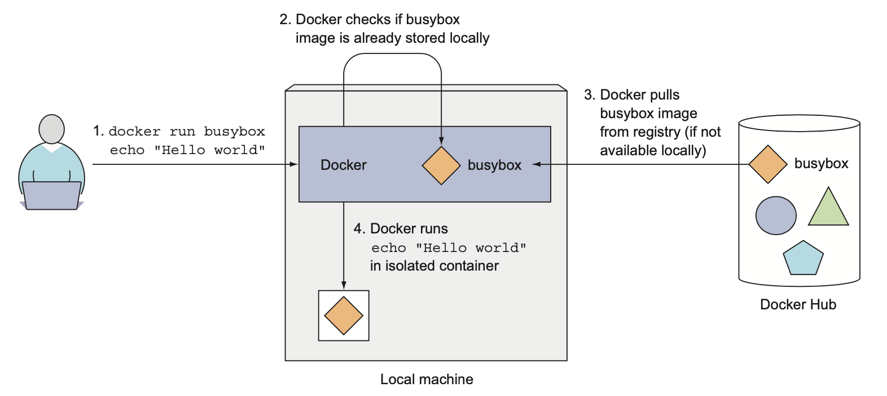

# 도커와 쿠버네티스 첫 걸음

### 다루는 내용
- 도커를 사용한 컨테이너 이미지 생성, 실행, 공유
- 로컬에 단일 노드 쿠버네티스 클러스터 실행
- 구글 쿠버네티스 엔진에서 쿠버네티스 클러스터 설치
- kubectl CLI 클라이언트 설정과 사용
- 쿠버네티스에서 애플리케이션의 배포와 수평 스케일링


# 도커를 사용한 컨테이너 이미지 생성, 실행, 공유

## 도커 설치와 Hello World 컨테이너 실행하기

[Install Docker Desktop on Mac](https://docs.docker.com/desktop/mac/install/)  

### Hello World
도커 허브는 잘 알려진 소프트웨어 패키지를 위한 즉시 실행 가능한 이미지를 보유하고 있다.  

```bash
> docker run busybox echo "Hello world"
Unable to find image 'busybox:latest' locally
latest: Pulling from library/busybox
19d511225f94: Pull complete 
Digest: sha256:3614ca5eacf0a3a1bcc361c939202a974b4902b9334ff36eb29ffe9011aaad83
Status: Downloaded newer image for busybox:latest
Hello world
```  

아무런 설치나 추가 작업 없이 애플리케이션이 컨테이너 내부에서 실행되고, 컴퓨터에서 실행중인 다른 모든 프로세스로부터 완전이 격리된다는 점은 매우 큰 이점으로 다가온다.  


  

위 그림은 docker run 명령 수행시 일어나는 일을 보여준다.

1. `docker run busybox echo "Hello World"` 실행
2. 로컬 머신에 busybox:latest 이미지가 있는지 확인한다.
3. 로컬 머신에 이미지가 없으면 레지스트리로부터 이미지를 가져온다.
4. 로컬 머신에 이미지 다운로드가 완료되면 컨테이너를 생성하고 컨테이너 내부에서 명령어를 실행한다. 
5. 명령을 수행한 뒤 프로세스를 중단하고 컨테이너도 중지된다.  

다른 이미지를 실행하는 것도 동일하다.  
```bash
> docker run <image>
```
  
모든 소프트웨어 패키지는 업데이트되기 때문에 일반적으로 하나 이상의 버전이 존재한다.  


71 - 112