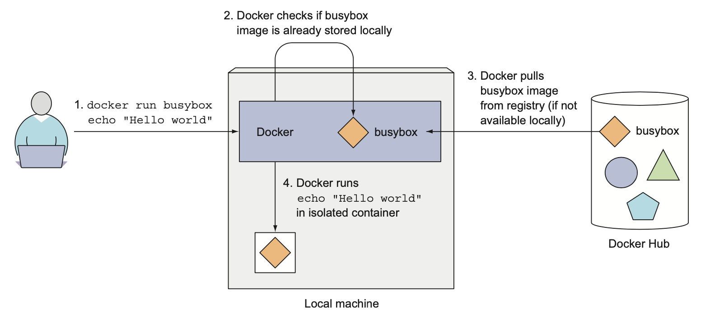
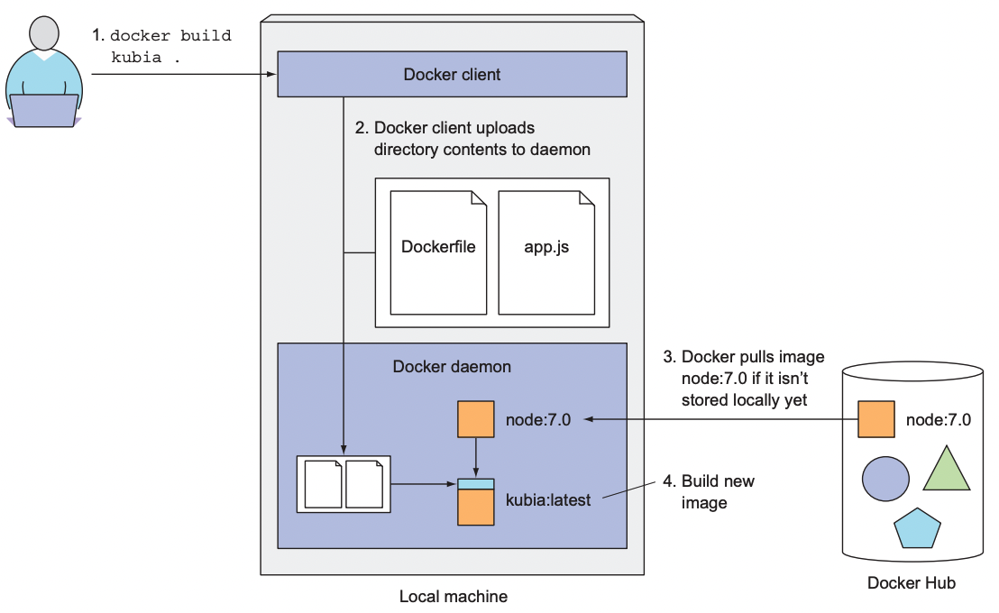
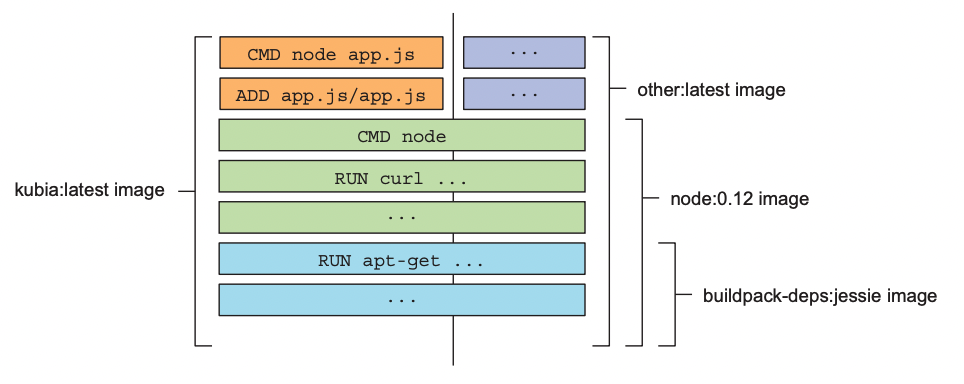
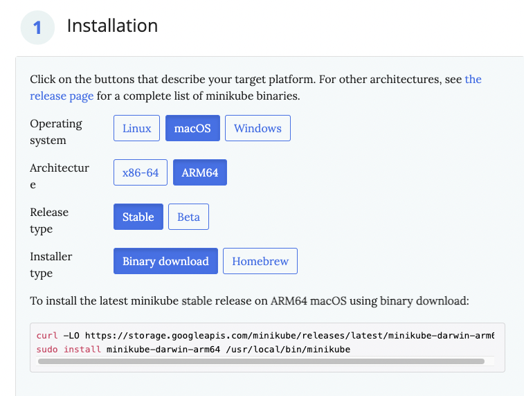
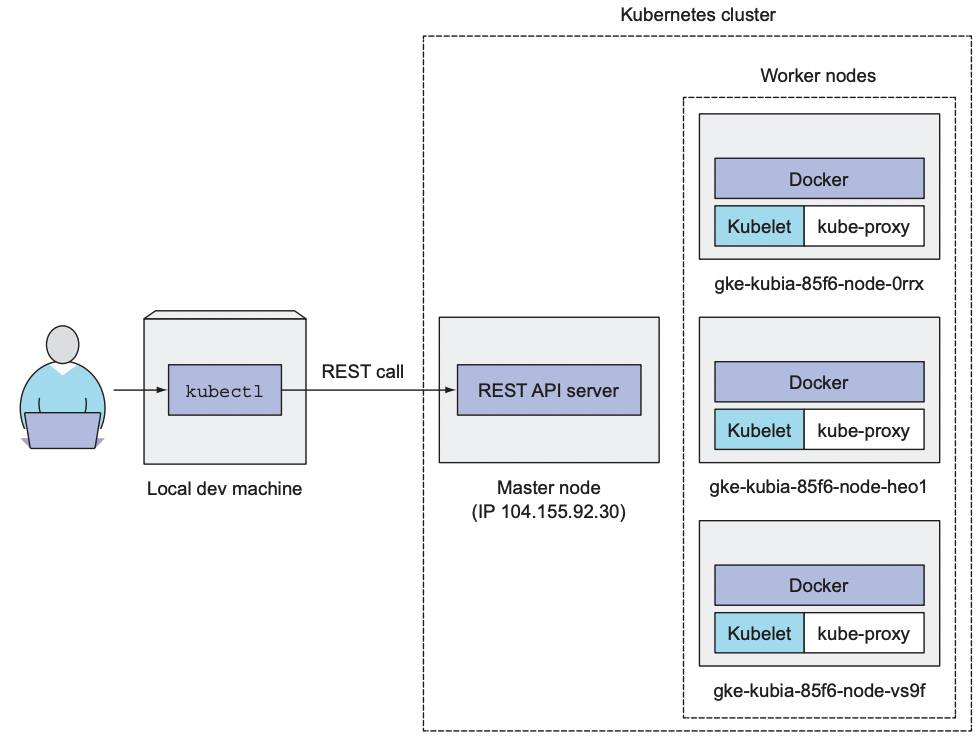
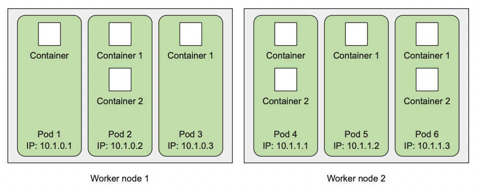
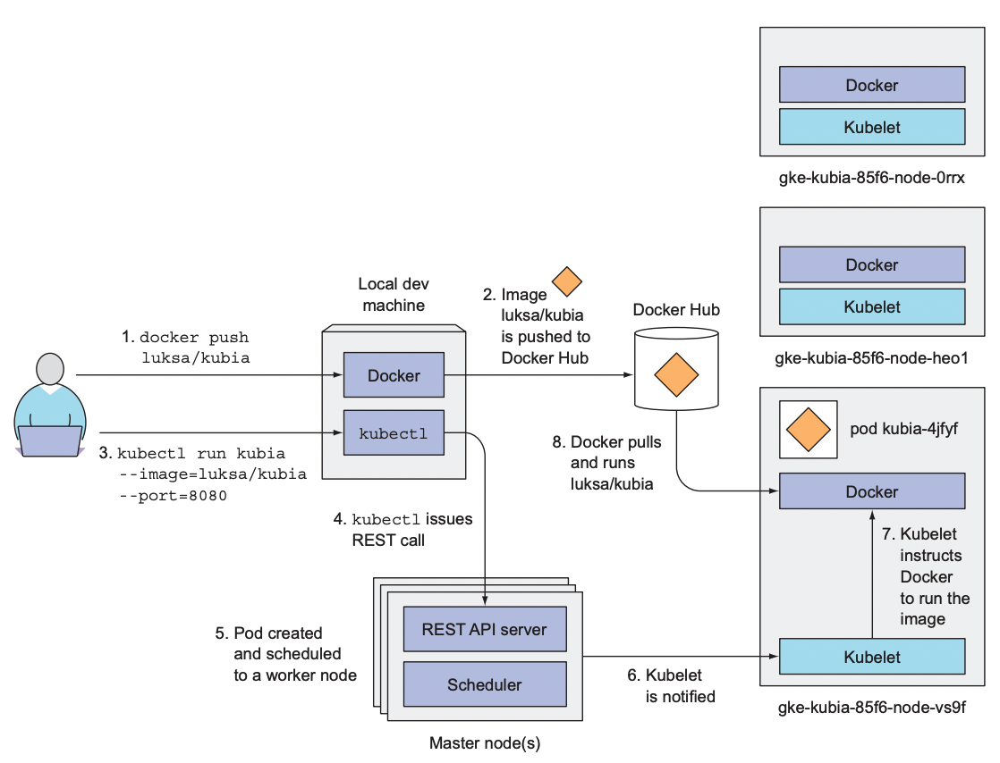
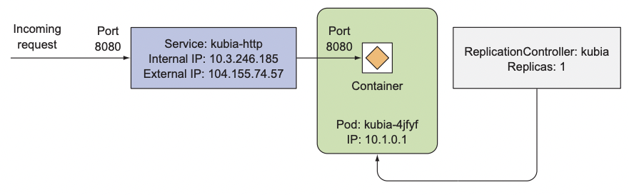

# 도커와 쿠버네티스 첫 걸음

### 다루는 내용
- 도커를 사용한 컨테이너 이미지 생성, 실행, 공유
- 로컬에 단일 노드 쿠버네티스 클러스터 실행
- 구글 쿠버네티스 엔진에서 쿠버네티스 클러스터 설치
- kubectl CLI 클라이언트 설정과 사용
- 쿠버네티스에서 애플리케이션의 배포와 수평 스케일링


# 도커를 사용한 컨테이너 이미지 생성, 실행, 공유

## 도커 설치와 Hello World 컨테이너 실행하기

[Install Docker Desktop on Mac](https://docs.docker.com/desktop/mac/install/)  

### Hello World
도커 허브는 잘 알려진 소프트웨어 패키지를 위한 즉시 실행 가능한 이미지를 보유하고 있다.  

```bash
> docker run busybox echo "Hello world"
Unable to find image 'busybox:latest' locally
latest: Pulling from library/busybox
19d511225f94: Pull complete 
Digest: sha256:3614ca5eacf0a3a1bcc361c939202a974b4902b9334ff36eb29ffe9011aaad83
Status: Downloaded newer image for busybox:latest
Hello world
```  

아무런 설치나 추가 작업 없이 애플리케이션이 컨테이너 내부에서 실행되고, 컴퓨터에서 실행중인 다른 모든 프로세스로부터 완전이 격리된다는 점은 매우 큰 이점으로 다가온다.  


  

위 그림은 docker run 명령 수행시 일어나는 일을 보여준다.

1. `docker run busybox echo "Hello World"` 실행
2. 로컬 머신에 busybox:latest 이미지가 있는지 확인한다.
3. 로컬 머신에 이미지가 없으면 레지스트리로부터 이미지를 가져온다.
4. 로컬 머신에 이미지 다운로드가 완료되면 컨테이너를 생성하고 컨테이너 내부에서 명령어를 실행한다. 
5. 명령을 수행한 뒤 프로세스를 중단하고 컨테이너도 중지된다.  

다른 이미지를 실행하는 것도 동일하다.  
```bash
> docker run <image>
```
  
모든 소프트웨어 패키지는 업데이트되기 때문에 일반적으로 하나 이상의 버전이 존재한다.  
도커는 동일한 이미지와 이름에 여러 개의 버전을 가질 수 있다.  
- 각 버전은 고유한 태그를 가져야 한다.
- 이미지를 참조할 때 명시적으로 태그를 지정하지 않으면 latest 태그를 참조한 것으로 간주한다.  

```bash
> docker run <image>:<tag>
```

## 간단한 node.js 애플리케이션 

### app.js
```js
const http = require('http');
const os = require('os');

console.log('kubia server starting...');

var handler = function(request, response) {
    console.log("received request from " + request.connection.remoteAddress);
    response.writeHead(200);
    response.end("You've hit " + os.hostname() + "\n");
} 

var www = http.createServer(handler);
www.listen(8080);
```
8080 포트로 HTTP 서버를 시작하는 간단한 스크립트이다.  

### Dockerfile
```
FROM node:7
ADD app.js /app.js

ENTRYPOINT ["node"]
```
- FROM : 시작점으로 사용할 컨테이너 이미지 정의
- ADD : 로컬 디렉터리의 파일을 이미지에 추가
- ENTRYPOINT : 이미지를 실행했을 때 수행돼야 할 명령어 정의


### 컨테이너 이미지 생성
```bash
> docker build -t kubia .
```
  
사용자가 docker build 명령을 통해 이미지를 빌드하면 도커는 Dockerfile을 보고 파일에 명시된 지시 사항에 근거해 이미지를 빌드한다.  

디렉터리의 전체 콘텐츠가 도커 데몬에 업로드되고 그곳에서 이미지가 빌드된다.  

  

이미지는 이전 챕터에서 소개된 것 처럼 레이어로 구성되어 있다.  
빌드되는동안 기본 이미지를 가져오고, 그 위에 이미지가 빌드되는 동안 수행되는 명령들을 레이어로 추가한다.  
  
빌드된 이미지는 docker images 명령을 통해 확인할 수 있다.  
```
❯ docker images
REPOSITORY                       TAG                       IMAGE ID       CREATED          SIZE
kubia                            latest                    3089ae9238a3   11 minutes ago   660MB
```

### 컨테이너 실행
```
> docker run --name kubia-container -p 8080:8080 -d kubia
```  
- `kubia` : 컨테이너를 실행할 이미지
- `--name kubia-container` : 생성될 컨테이너 이름
- `-p 8080:8080` : 로컬 머신의 8080포트가 컨테이너 내부의 8080포트를 매핑
- `-d` : 컨테이너가 콘솔에서 분리돼 백그라운드에서 실행

```
> curl localhost:8080
You've hit 35dj22e00w
```  
curl 명령을 통해 애플리케이션의 응답을 확인할 수 있다.  

```
❯ docker ps
CONTAINER ID   IMAGE     COMMAND   CREATED         STATUS                     PORTS                    NAMES
2e6f693c01b8   kubia     "node"    1 second ago    Up Less than a second      0.0.0.0:8080->8080/tcp   kubia-container
```  
docker ps 명령으로 실행중인 컨테이너 리스트를 확인할 수 있으며 추가 정보를 얻기 위해서는 docker inspect 명령을 사용해야한다.  

```
docker inspect <container-name>
```

## 실행중인 컨테이너 내부 접속
```
> docker exec -it kubia-container bash
```  
- `-it` : 아래 두 옵션 축약
  - `-i` : 표준 입력을 오픈 상태로 유지한다.
  - `-t` : 터미널 할당
- `kubia-container` : 타겟 컨테이너 이름
- `bash` : 컨테이너 내부에서 실행할 명령어  

## 컨테이너 중지 및 삭제
```
> docker stop kubia-container
```
위 명령은 컨테이너에 실행 중인 메인 프로세스를 중지시키며 컨테이너 내부에 실행중인 다른 프로세스가 없으므로 컨테이너가 중지된다.  

컨테이너 자체는 존재하지만 실행되지 않는 상태로 남아있는다.  
- `docker ps -a`와 같이 `-a`옵션을 추가해야 한다.  

컨테이너를 삭제하기 위해서는 docker rm 명령을 수행해야 한다.  
```
> docker rm kubia-container
```  

## 이미지 레지스트리에 이미지 푸쉬
```
> docker tag kubia wjrmffldrhrl/kubia
```  
빌드된 이미지를 `<docker-hub-id>/<image-name>`와 같은 형태로 변경한다.  
- 위 명령은 태그를 변경하지 않고 같은 이미지에 추가적인 태그를 생성한다.  

```
> docker push wjrmffldrhrl/kubia

---- other machine ---

> docker run -p 8080:8080 -d wjrmffldrhrl/kubia
```  


# 쿠버네티스 클러스터 설치  

가벼운 실습을 위해 Minikube를 설치하기로 했습니다.  

### Minikube 설치
[Minikube GitHub Repository](https://github.com/kubernetes/minikube)를 참고했습니다.  

  

```
curl -LO https://storage.googleapis.com/minikube/releases/latest/minikube-darwin-arm64
sudo install minikube-darwin-arm64 /usr/local/bin/minikube
```


### Minikube 실행
```
❯ minikube start
😄  Darwin 12.4 (arm64) 의 minikube v1.25.2
✨  자동적으로 docker 드라이버가 선택되었습니다
👍  minikube 클러스터의 minikube 컨트롤 플레인 노드를 시작하는 중
🚜  베이스 이미지를 다운받는 중 ...
💾  쿠버네티스 v1.23.3 을 다운로드 중 ...
    > preloaded-images-k8s-v17-v1...: 419.07 MiB / 419.07 MiB  100.00% 8.03 MiB
    > gcr.io/k8s-minikube/kicbase: 343.12 MiB / 343.12 MiB  100.00% 4.89 MiB p/
🔥  Creating docker container (CPUs=2, Memory=1988MB) ...
🐳  쿠버네티스 v1.23.3 을 Docker 20.10.12 런타임으로 설치하는 중
    ▪ kubelet.housekeeping-interval=5m
    ▪ 인증서 및 키를 생성하는 중 ...
    ▪ 컨트롤 플레인이 부팅...
    ▪ RBAC 규칙을 구성하는 중 ...
🔎  Kubernetes 구성 요소를 확인...
    ▪ Using image gcr.io/k8s-minikube/storage-provisioner:v5
🌟  애드온 활성화 : storage-provisioner, default-storageclass
🏄  끝났습니다! kubectl이 "minikube" 클러스터와 "default" 네임스페이스를 기본적으로 사용하도록 구성되었습니다.

```  
- kubectl이 자동으로 설치됨

자주 사용하는 명령어인만큼 kubectl을 k로 alias 지정

```
alias k="kubectl"
alias kgp="kubectl get pods"
```  


### 클러스터 작동 여부 확인
```
❯ k cluster-info
Kubernetes control plane is running at https://127.0.0.1:50919
CoreDNS is running at https://127.0.0.1:50919/api/v1/namespaces/kube-system/services/kube-dns:dns/proxy
```  

### 클러스터 개념
  
- 각 노드는 도커, Kubelet, kube-proxy를 실행 
- Kubectl 클라이언트 명령어는 마스터 노드에서 실행중인 쿠버네티스 API 서버로 REST 요청  

### 클러스터 노드 조회
```
❯ k get nodes
NAME       STATUS   ROLES                  AGE   VERSION
minikube   Ready    control-plane,master   14m   v1.23.3
```

describe 명령을 통해 세부 정보를 확인할 수 있다.  
```
❯ k run kubia --image=luksa/kubia --port=8080
pod/kubia created
```  


# 쿠버네티스에 첫 번째 애플리케이션 실행하기  
```
k run kubia --image=luksa/kubia --port=8080
```

> 책에서는  `--generator=run/1` 를 추가하라고 하지만 k8s v1.18+ 부터는 필요 없다고 한다. 
> https://community.kodekloud.com/t/unknown-tag-generator/25444
> https://discuss.educative.io/t/error-unknown-flag-generator/26832/2  

### 파드
쿠버네티스는 개별 컨테이너들을 직접 다루지 않는다.  
대신 함께 배치된 다수의 컨테이너라는 개념을 사용한다.  
- 이 컨테이너 그룹을 파드라고 한다.  

  

- 한 파드의 컨테이너들은 같은 리눅스 네임스페이스로 함께 실행된다.  
- 각 파드는 자체 IP, 호스트 이름, 프로세스 등이 논리적으로 분리된 머신이다.  

```
❯ kgp
NAME    READY   STATUS    RESTARTS   AGE
kubia   1/1     Running   0          10m
```  

k describe pod 명령으로 파드의 세부 정보를 확인할 수 있다.  
- 파드가 Pendig 상태로 멈춰있을 때 문제를 확인할 수 있다.  

### 백그라운드 동작
  
- 이미지 빌드 후 도커 허브에 푸쉬
- kbuectl 명령을 통해 쿠버네티스 API 서버로 REST HTTP 요청 전달 
- 클러스터에 새로운 오브젝트 생성
- 새롭게 생성된 파드는 스케줄러에 의해 워커 노드 중 하나에 스케줄링된다.
- 해당 워커 노드의 Kubelet은 파드가 스케줄링된 것을 확인하고 이미지를 풀
- 이미지 다운로드 후 도커는 컨테이너를 생성하고 실행


## 웹 애플리케이션 접근  
각 파드는 자체 IP 주소를 가지고 있지만 이 주소는 클러스터 내부에 있으며 외부에서 접근이 불가능하다.  
- 외부에서 파드에 접근하기 위해서는 서비스 오브젝트를 통해 노출해야한다.  
- 일반적인 서비스는 내부에서만 접근 가능하므로 LoadBalancer 유형의 서비스를 생성해야 한다.  

### 서비스 생성  
```
k expose po kubia --type=LoadBalancer --name kubia-http service "kubia-http" exposed
```
- pod를 생성했기 때문에 책에서 rc를 한 것과 달리 po로 진행

```
❯ k get svc
NAME         TYPE           CLUSTER-IP      EXTERNAL-IP   PORT(S)          AGE
kubernetes   ClusterIP      10.96.0.1       <none>        443/TCP          41m
kubia-http   LoadBalancer   10.106.138.95   <pending>     8080:32614/TCP   5s
```

로컬 환경이라 External ip가 할당되지 않는다 :(  

클라우드 환경에서 진행하여 External IP가 할당된다면 아래와 같이 애플리케이션에 접근할 수 있다.  

```
curl <external-ip>:8080
```


## 시스템의 논리적인 부분
SKIP

  

사용자는 컨테이너를 직접 생성하지 않으며 쿠버네티스는 기본 단위인 파드를 이용한다.  

그러나 파드도 직접 생성하지 않으며 레플리케이션 컨트롤러가 실제 파드를 생성한다.  


> 공식 홈페이지에서는 레플리케이션 컨트롤러의 대안으로 디플로이먼트를 사용하도록 권장하고있다.  
> https://kubernetes.io/ko/docs/concepts/workloads/controllers/replicationcontroller/#%EB%A0%88%ED%94%8C%EB%A6%AC%EC%BC%80%EC%9D%B4%EC%85%98-%EC%BB%A8%ED%8A%B8%EB%A1%A4%EB%9F%AC%EC%9D%98-%EB%8C%80%EC%95%88  


### Deployment
```yaml
apiVersion: apps/v1
kind: Deployment
metadata:
  name: kubia-deployment
  labels:
    app: kubia
spec:
  replicas: 3
  selector:
    matchLabels:
      app: kubia
  template:
    metadata:
      labels:
        app: kubia
    spec:
      containers:
      - name: kubia
        image: luksa/kubia:latest
        ports:
        - containerPort: 8080
```

```
❯ k apply -f ./kubia_deployment.yaml
deployment.apps/kubia-deployment created

❯ kgp
NAME                                READY   STATUS              RESTARTS   AGE
kubia-deployment-654ddc86d9-7ndf5   0/1     ContainerCreating   0          3s
kubia-deployment-654ddc86d9-9hgt7   0/1     ContainerCreating   0          3s
kubia-deployment-654ddc86d9-z8wvx   0/1     ContainerCreating   0          3s
```


### 애플리케이션 수평 확장

deployment 기준으로 아래와 같은 명령을 수행하면 된다.
```
❯ k scale deployment kubia-deployment --replicas=5
deployment.apps/kubia-deployment scaled

❯ kgp
NAME                                READY   STATUS              RESTARTS   AGE
kubia-deployment-654ddc86d9-7ndf5   1/1     Running             0          52s
kubia-deployment-654ddc86d9-8b7qm   0/1     ContainerCreating   0          4s
kubia-deployment-654ddc86d9-9hgt7   1/1     Running             0          52s
kubia-deployment-654ddc86d9-g5s69   0/1     ContainerCreating   0          4s
kubia-deployment-654ddc86d9-z8wvx   1/1     Running             0          52s
```

이렇게 수평 확장 되더라도 서비스는 항상 동일한 주소를 가지고 있기 때문에 파드들이 클러스터 내에서 이동하면서 생성되고 삭제되며 IP가 변경되더라도 항상 동일한 주소로 요청을 받을 수 있다.  
- 실습은 서비스가 안되는 관계로...  


## 애플리케이션이 실행중인 노드 확인
```
❯ k get pods -o wide
NAME                                READY   STATUS    RESTARTS   AGE     IP           NODE       NOMINATED NODE   READINESS GATES
kubia-deployment-654ddc86d9-7ndf5   1/1     Running   0          4m15s   172.17.0.3   minikube   <none>           <none>
kubia-deployment-654ddc86d9-8b7qm   1/1     Running   0          3m27s   172.17.0.6   minikube   <none>           <none>
kubia-deployment-654ddc86d9-9hgt7   1/1     Running   0          4m15s   172.17.0.4   minikube   <none>           <none>
kubia-deployment-654ddc86d9-g5s69   1/1     Running   0          3m27s   172.17.0.7   minikube   <none>           <none>
kubia-deployment-654ddc86d9-z8wvx   1/1     Running   0          4m15s   172.17.0.5   minikube   <none>           <none>
```  

쿠버네티스에서 파드가 적절히 실행하는데 필요한 CPU와 메모리를 제공하는 노드에 스케줄링됐다면, 어떤 노드에 파드가 실행 중인지는 중요하지 않다.  
- 파드가 스케줄링된 노드와 상관없이 컨테이너 내부에 실행 중인 모든 애플리케이션은 동일한 유형의 운영체제 환경을 갖는다.  
- 확인하고 싶다면 -o wide 옵션을 추가해보자  
- 또는 describe 명령을 통해 파드의 상세 정보에서 노드를 확인할 수 있다.  


# 요약
- 공개된 컨테이너 이미지 풀/실행 가능
- 실행 중인 컨테이너에 접속해 환경 확인 가능
- 쿠버네티스에 컨테이너를 실행하고 클러스터 외부에서 접근 가능하게 할 수 있다.  
- 디플로이먼트의 레플리카 수를 변경해 애플리케이션을 수평으로 확장할 수 있다.
- 미니쿠베에서는 `minikube dashboard`를 통해 웹 기반 대시보드를 확인할 수 있다.
