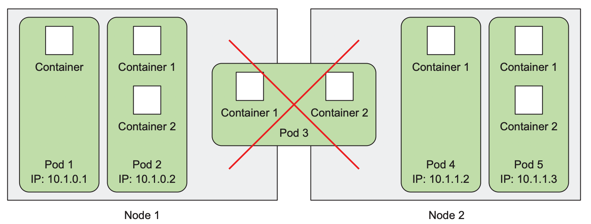
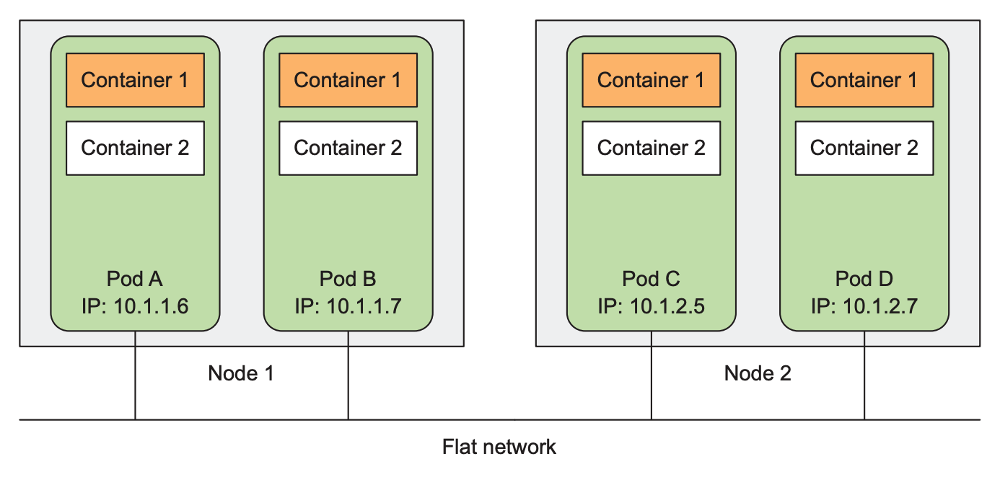
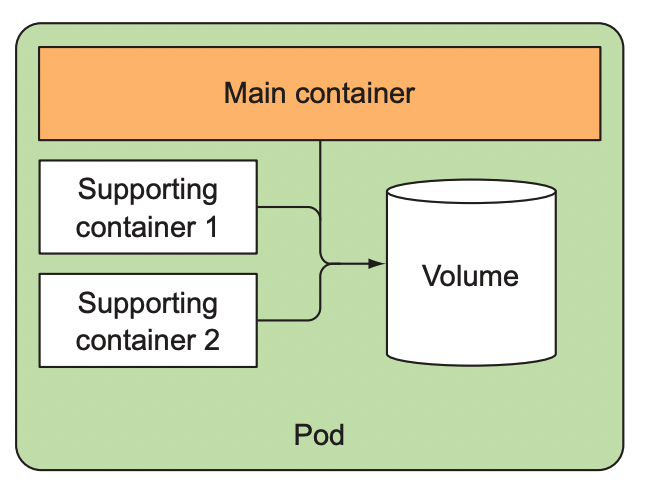
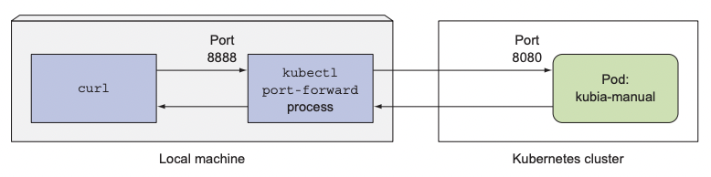
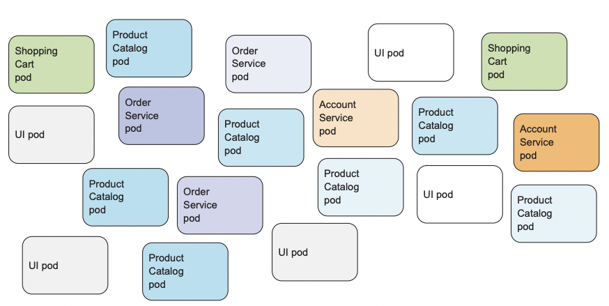
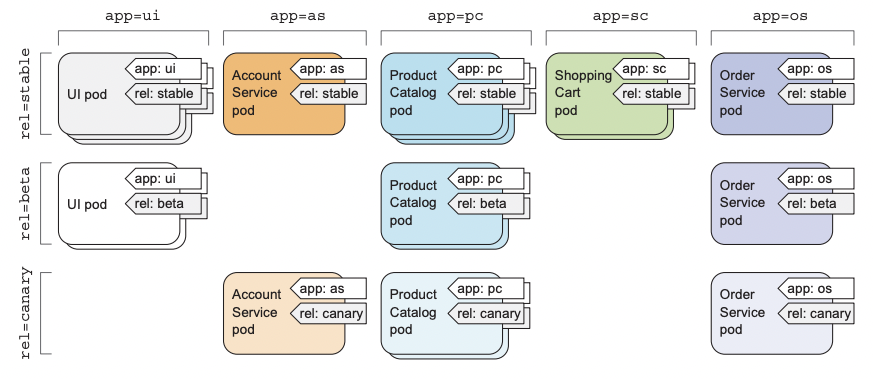

# 파드: 쿠버네티스에서 컨테이너 실행

### 다루는 내용  
- 파드의 생성, 실행, 정지
- 파드와 다른 리소스를 레이블로 조직화하기
- 특정 레이블을 가진 모든 파드에서 작업 수행
- 네임스페이스를 사용해 파드를 겹치지 않는 그룹으로 나누기
- 특정한 형식을 가진 워커 노드에 파드 배치  

# 파드 소개
  
파드는 함께 배치된 컨테이너 그룹이며 쿠버네티스의 기본 빌딩 블록이다.  
- 파드는 여러 워커 노드에 걸쳐 실행되지 않는다.  

## 파드가 필요한 이유  
- 파드가 필요한 이유?
- 컨테이너를 직접 사용할 수 없는 이유?
- 여러 컨테이너를 같이 실행해야 하는 이유?
- 모든 프로세스를 단일 컨테이너에 넣을 수 없는 이유?  

컨테이너는 단일 프로세스를 실행하는 것을 목적으로 설계했다.  

단일 컨테이너에서 관련 없는 다른 프로세스를 실행 하는 경우 로그들을 관리하는데 많은 어려움이 생긴다.  

이러한 프로세스들은 동일한 표준 출력으로 로그를 기록하기 때문에 어떤 프로세스가 남긴 로그인지 파악하기 어렵다.  

따라서 각 프로세스를 자체의 개별 컨테이너로 실행해야 하며 이러한 개별 컨테이너를 함께 묶고 하나의 단위로 관리할 수 있는 상위구조인 파드가 필요하다.  

## 파드 이해하기  

파드를 활용하면 연관된 프로세스에 **동일한 환경**을 제공하면서 **격리된 상태**로 유지할 수 있다.  

### 부분 격리
쿠버네티스는 파드 안에 있는 모든 컨테이너가 자체 네임스페이스가  아닌 동일한 리눅스 네임스페이스를 공유하도록 도커를 설정한다.  

파드의 모든 컨테이너는 동일한 네트워크, UTS 네임스페이스 안에서 실행되기 때문에, 모든 컨테이너는 같은 호스트 이름과 네트워크 인터페이스를 공유한다.  

그러나 컨테이너 파일시스템은 컨테이너 이미지에서 나오기 때문에, 기본적으로 파일시스템은 다른 컨테이너와 완전히 분리된다.  
- 쿠버네티스의 볼륨 개념을 이용해 컨테이너가 파일 디렉터리를 공유하는 것이 가능하다.  


### IP, 포트 공유
파드 안의 컨테이너가 동일한 네트워크 네임스페이스에서 실행되기 때문에 IP 주소와 포트 공간을 공유한다.  
- 따라서 각 컨테이너들이 같은 포트 번호를 사용하지 않도록 주의해야 한다.  

### 플랫 네트워크  

  

쿠버네티스 클러스터의 모든 파드는 하나의 플랫한 공유 네트워크 주소 공간에 상주하므로 모든 파드는 다른 파드의 IP 주소를 사용해 접근하는 것이 가능하다.  
- NAT이 존재하지 않는다.
- NAT이란?  
- LAN에 있는 컴퓨터 간의 통신과 비슷하다.  


## 파드에서 컨테이너의 적절한 구성  

모든 것을 파드 하나에 넣는 대신에 애플리케이션을 여러 파드로 구성하고, 각 파드에는 밀접하게 관련 있는 구성 요소나 프로세스만을 포함해야 한다.  

### 다계층 애플리케이션 분할  

만약 프론트엔드와 백엔드가 같은 파드에 있다면, 둘은 항상 같은 노드에서 실행된다.  

두 노드를 가진 쿠버네티스 클러스터가 있고 이 파드 하나만 있다면, 워커 노드 하나만 사용된다.  

파드를 두 개로 분리하여 쿠버네티스가 각 노드로 파드를 스케줄링해 리소스를 더 유용하게 활용할 수 있다.  


### 개별 확장이 가능하도록 분할  
파드는 스케일링의 기본 단위다.  
- 쿠버네티스는 개별 컨테이너를 수평으로 확장할 수 없다.  

일반적으로 프론트엔드와 백엔드는 다른 스케일링 요구사항을 가지고 있다.  
- 개별적으로 확장하는 경향이 있다.  

따라서 컨테이너를 개별적으로 스케일링 하려면 별도 파드에 배포해야 한다.  

### 파드에서 여러 컨테이너를 사용하는 이유

  

여러 컨테이너를 단일 파드에 넣는 주된 이유는 애플리케이션이 하나의 주요 프로세스와 하나 이상의 보완 프로세스로 구성된 경우다.  

기본적으로 특정한 이유 때문에 컨테이너를 단일 파드로 구성하는것을 요구하지 않는다면, 분리된 파드에서 컨테이너를 실행하는 것이 좋다.  


# YAML 또는 JSON 디스크립터로 파드 생성

파드를 포함한 다른 쿠버네티스 리소스는 일반적으로 쿠버네티스 REST API 엔드포인트에 YAML 메니페스트를 전송해 생성한다.  
- kubectl run 명령처럼 간단하게 배포하면 제한된 속성만 적용할 수 있다.  
- YAML로 쿠버네티스 오브젝트를 정의하면 버전 관리 시스템에서 관리할 수 있다.  

### 기존 파드 YAML 디스크립터 확인
```
kubectl get po kubia-zscfe -o yaml
```
거의 모든 쿠버네티스 리소스가 가지고 있는 세 가지 중요한 부분이 있다.  

- Metadata : 이름, 네임스페이스, 레이블 및 리소스에 대한 기타 정보
- Spec : 컨테이너, 볼륨, 기타 데이터 등 리소스 자체에 관한 실제 명세
- Status : 리소스의 상태, 각 컨테이너 설명과 상태, 내부 IP, 기타 기본 정보

## 파드를 정의하는 간단한 YAML 정의 작성

```yaml
apiVersion: v1 # 디스크립터는 API 버전 v1을 준수한다.
kind: Pod # 리소스 종류
metadata:
  name: kubia-manual # 파드 이름
spec:
  containers:
  - image: luksa/kubia # 컨테이너 이미지
    name: kubia # 컨테이너 이름
    ports:
    - containerPort: 8080 # 애플리케이션이 수신하는 포트
      protocol: TCP
``` 

## 파드 생성
```sh
❯ k create -f kubia-manual.yaml
pod/kubia-manual created
```
### 배포된 파드 전체 정의
```
❯ k get po kubia-manual -o yaml
apiVersion: v1
kind: Pod
metadata:
  creationTimestamp: "2022-06-19T08:05:26Z"
  name: kubia-manual
  ...
  ...
```

### 배포된 파드 확인
```
❯ kgp
NAME           READY   STATUS    RESTARTS   AGE
kubia-manual   1/1     Running   0          3m18s
```

## 애플리케이션 로그 확인  
컨테이너화된 애플리케이션은 로그를 파일에 쓰기보다는 표준 출력과 표준 에러에 로그를 남기는 것이 일반적이다.  

컨테이너 런타임은 이러한 스트림을 파일로 전달한다.  

### 파드 로그 가져오기
```
k logs kubia-manual
```
> 컨테이너 로그는 하루 단위 또는 10MB 크기에 도달할 때마다 순환된다. kubectl logs 명령은 마지막으로 순환된 로그만 보여준다.  

### 컨테이너 이름을 지정해 다중 컨테이너 파드에서 로그 가져오기  

```
k logs kubia-manual -c kubia
```
`kubectl logs` 명령에 `-c <container-name>` 옵션을 추가해야 한다.  


## 파드에 요청 보내기  
### 로컬 포트를 파드의 포트로 포워딩
서비스를 거치지 않고 특정 파드와 대화하고 싶을 때 쿠버네티스는 해당 파드로 향하는 포트 포워딩을 구성해준다.  

```
❯ k port-forward kubia-manual 8888:8080

Forwarding from 127.0.0.1:8888 -> 8080
Forwarding from [::1]:8888 -> 8080
```  
이제 프록시를 통해 HTTP 요청을 해당 파드에 보낼 수 있다.  
   
```
❯ curl localhost:8888
You've hit kubia-manual
```

  


# 레이블을 이용한 파드 구성
파드 수가 증가함에 따라 파드를 부분 집합으로 분류할 필요가 있다.  

## 레이블 소개
레이블은 파드와 모든 다른 쿠버네티스 리소스를 조직화할 수 있는 단순하면서 강력한 쿠버네티스의 기능이다.  
  
레이블은 리소스에 첨부하는 키-값 쌍으로, 이 쌍은 레이블 셀렉터를 사용해 리소스를 선택할 때 활용된다.  

예를 들어 app, rel 레이블을 추가하여 파드를 2차원으로 구성할 수 있다.  

#### 적용 전
  
#### 적용 후
  

## 파드 생성시 레이블 지정
```yaml
apiVersion: v1
kind: Pod
metadata:
  name: kubia-manual-v2
  labels:
    creation_method: manual
    env: prod
spec:
  containers:
  - image: luksa/kubia
    name: kubia
    ports:
    - containerPort: 8080
      protocol: TCP
```
```sh
❯ k create -f kubia-manual-with-labels.yaml
pod/kubia-manual-v2 created
```  
```sh
❯ kgp --show-labels
NAME              READY   STATUS    RESTARTS   AGE   LABELS
kubia-manual      1/1     Running   0          78m   <none>
kubia-manual-v2   1/1     Running   0          25s   creation_method=manual,env=prod
```  

### 특정 레이블 값 출력
```
❯ kgp -L creation_method,env
NAME              READY   STATUS    RESTARTS   AGE     CREATION_METHOD   ENV
kubia-manual      1/1     Running   0          80m                       
kubia-manual-v2   1/1     Running   0          2m28s   manual            prod
```

## 기존 파드 레이블 수정
```sh
❯ k label po kubia-manual creation_method=manual
pod/kubia-manual labeled
```  

```sh
❯ k label po kubia-manual-v2 env=debug --overwrite
pod/kubia-manual-v2 labeled
```
> 기존 레이블 변경시 `--overwrite` 옵션 필요


```
❯ kgp -L creation_method,env
NAME              READY   STATUS    RESTARTS   AGE     CREATION_METHOD   ENV
kubia-manual      1/1     Running   0          82m     manual            
kubia-manual-v2   1/1     Running   0          4m36s   manual            debug
```  

# 레이블 셀렉터를 이용한 파드 부분 집합 나열
레이블 셀렉터는 특정 레이블로 태그된 파드의 부분 집합을 선택해 원하는 작업을 수행한다.  

레이블 셀렉터는 아래 기준에 따라 리소스를 선택한다.  
- 특정한 키를 포함하거나 포함되지 않는 레이블
- 특정한 키와 값을 가진 레이블
- 특정한 키를 갖고 있지만, 다른 값을 가진 레이블  

## 레이블 셀렉터를 사용해 파드 나열  

### 특정 레이블 값
```
❯ kgp -l creation_method=manual
NAME              READY   STATUS    RESTARTS   AGE
kubia-manual      1/1     Running   0          90m
kubia-manual-v2   1/1     Running   0          12m
```

### 특정 레이블 키
```
❯ kgp -l env
NAME              READY   STATUS    RESTARTS   AGE
kubia-manual-v2   1/1     Running   0          12m
```

### 특정 레이블 키 제외
```
❯ kgp -l '!env'
NAME           READY   STATUS    RESTARTS   AGE
kubia-manual   1/1     Running   0          91m
```  

### ETC
- `creation_method!=manual` : creation_method 레이블을 가지고 있는 파드 중에 값이 manual이 아닌 것
- `env in (prod,devel)` : env 레이블 값이 prod 또는 devel로 설정된 파드
- `env notin (prod,devel)` : env 레이블 값이 prod, devel이 아닌 파드  
- 여러 조건을 사용할 때는 쉼표(`,`)를 사용한다.
  - `app=pc,rel=beta`


# 레이블과 셀렉터를 이용해 파드 스케줄링 제한
기본적으로 쿠버네티스에서는 워커 노드 전체에 걸쳐 무작위로 스케줄링 되지만, 파드를 스케줄링할 위치를 명시해야 하는 경우가 있다.  
- 특정 워커 노드는 HDD, 나머지는 SDD인 경우
- GPU 가속을 제공하는 노드에서만 GPU 계산이 필요한 파드를 스케줄링 해야하는 경우  

쿠버네티스가 요구 사항을 만족하는 노드를 선택할때 노드 레이블과 레이블 셀렉터를 사용한다.  

## 워커 노드 분류에 레이블 사용  
클러스터 내부에 GPU를 가지고 있는 노드가 있다고 가정한다.  

```
> k label node gke-kubia-1 gpu=true
```

## 특정 노드에 파드 스케줄링
```yaml
apiVersion: v1
kind: Pod
metadata:
  name: kubia-gpu
spec:
  nodeSelector:
    gpu: "true" # 해당 파드가 gpu=true 레이블을 포함한 노드에 배포되도록 한다.
  containers:
  - image: luksa/kubia
    name: kubia
```

# 파드에 어노테이션 달기
어노테이션은 키-값 쌍으로 레이블과 거의 비슷하지만 식별 정보를 갖지 않는다.  
- 레이블은 오브젝트를 묶는 데 사용할 수 있지만 어노테이션은 그렇게 할 수 없다.

어노테이션은 쿠버네티스에 새로운 기능을 추가할 때 흔히 사용된다.
- API 오브젝트에 새로운 필드를 바로 도입하지 않고 어노테이션을 사용한 뒤 필요한 API 변경이 명확해지면 새로운 필드가 도입되고 어노테이션 사용이 중단된다.  

```
❯ k annotate pod kubia-manual mycompany.com/someannotation="foo bar"
pod/kubia-manual annotated
```  


# 네임스페이스를 사용한 리소스 그룹화  
쿠버네티스 네임스페이스는 오브젝트 이름의 범위를 제공한다.  

모든 리소스를 여러 네임스페이스로 분할할 수 있으며, 이렇게 분리된 네임스페이스는 같은 리소스 이름을 다른 네임스페이스에 걸쳐 여러 번 사용할 수 있게 해준다.  

## 네임스페이스의 필요성
여러 네임스페이스를 사용하면 많은 구성 요소를 가진 복잡한 시스템을 좀 더 작은 개별 그룹으로 분리할 수 있다.  
- 리소스를 프로덕션, 개발, QA 환경 등으로 나누어 사용할 수 있다.  

대부분의 리소스는 네임스페이스 안에 속하지만 일부는 그렇지 않다.  
- 그 중 하나는 노드 리소스이다.

## 다른 네임스페이스와 파드 살펴보기
```
❯ k get ns
NAME                   STATUS   AGE
default                Active   4d20h
kube-node-lease        Active   4d20h
kube-public            Active   4d20h
kube-system            Active   4d20h
kubernetes-dashboard   Active   4d18h
```
kubectl get 명령 사용시 네임스페이스를 명시적으로 지정하지 않으면 default 네임스페이스에 속한 오브젝트만 표시한다.  

```
❯ kgp --namespace kube-system
NAME                               READY   STATUS    RESTARTS       AGE
coredns-64897985d-fmbwf            1/1     Running   1 (154m ago)   4d20h
etcd-minikube                      1/1     Running   1 (154m ago)   4d20h
kube-apiserver-minikube            1/1     Running   1 (154m ago)   4d20h
kube-controller-manager-minikube   1/1     Running   1 (154m ago)   4d20h
kube-proxy-hmb77                   1/1     Running   1 (154m ago)   4d20h
kube-scheduler-minikube            1/1     Running   1 (154m ago)   4d20h
storage-provisioner                1/1     Running   3 (153m ago)   4d20h
```
> --namespace 대신 -n 사용 가능

## 네임 스페이스 생성
```yaml
apiVersion: v1
kind: Namespace
metadata:
  name: custom-namespace
```

```
❯ k create -f custom-namespace.yaml
namespace/custom-namespace created
```  

## 다른 네임스페이스 오브젝트 관리
생성한 네임스페이스 안에 리소스를 만들기 위한 방법은 두 가지가 있다.  
-  metadata 섹션에 `namespace: custom-namespace` 추가하기
- k create 명령 사용시 네임스페이스 지정
```
❯ k create -f kubia-manual.yaml -n custom-namespace
pod/kubia-manual created
```

## 네임스페이스가 제공하는 격리 이해  
네임스페이스는 실행 중인 오브젝트에 대한 격리는 제공하지 않는다.  

예를 들어 다른 사용자들이 서로 다른 네임스페이스에 파드를 배포할 때 해당 파드가 서로 격리돼 통신할 수 없다고 생각하지만, 반드시 그런 것은 아니다.  
- foo 네임스페이스 안에 있는 파드가 bar 네임스페이스 안에 있는 파드의 IP 주소를 알고 있다면, 트래픽을 다른 파드로 보내는 것에 아무런 제약 사항이 없다.  


# 파드 중지와 제거  

## 이름으로 제거
```
❯ k delete pod kubia-manual-v2
pod "kubia-manual-v2" deleted
```
> 쿠버네티스는 SIGTERM 신호를 프로세스에 보내고 지정된 시간동안 기다린다.  
> 프로세스가 항상 정상적으로 종료되게 하기 위해 SIGTERM 신호를 올바르게 처리해야 한다.  

## 레이블 셀렉터를 이용한 파드 삭제  
```
❯ k delete pod -l creation_method=manual
pod "kubia-manual" deleted
```

## 네임스페이스를 이용한 파드 제거
네임스페이스 자체를 제거하면 해당 네임스페이스 내부의 모든 파드는 제거된다.
```
❯ k delete ns custom-namespace
namespace "custom-namespace" deleted
```  

네임스페이스를 유지하면서 내부 파드를 모두 삭제하려면 아래와 같이 수행하면 된다.  
```
k delete pod --all
```

### 네임스페이스에서 (거의) 모든 리소스 삭제
```
k delete all --all
```  
> 시크릿 등 특정 리소스는 보존된다.  

