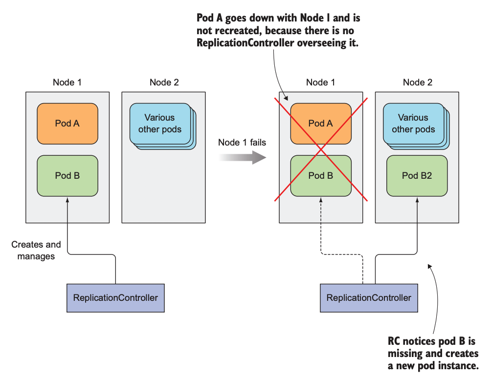
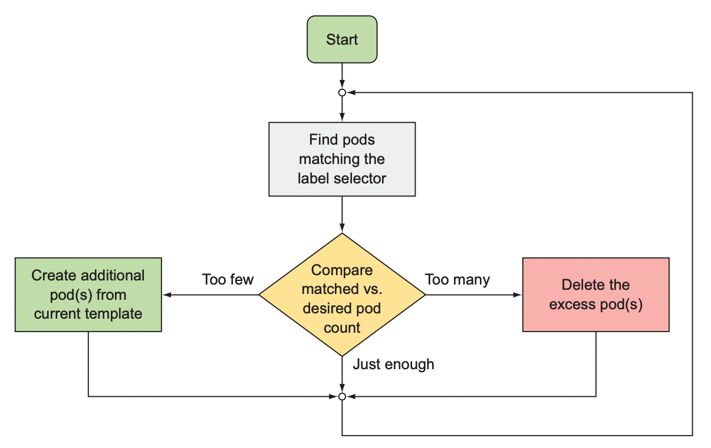
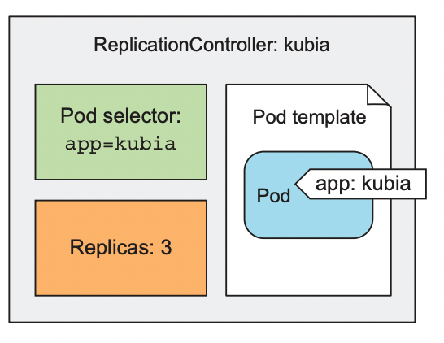
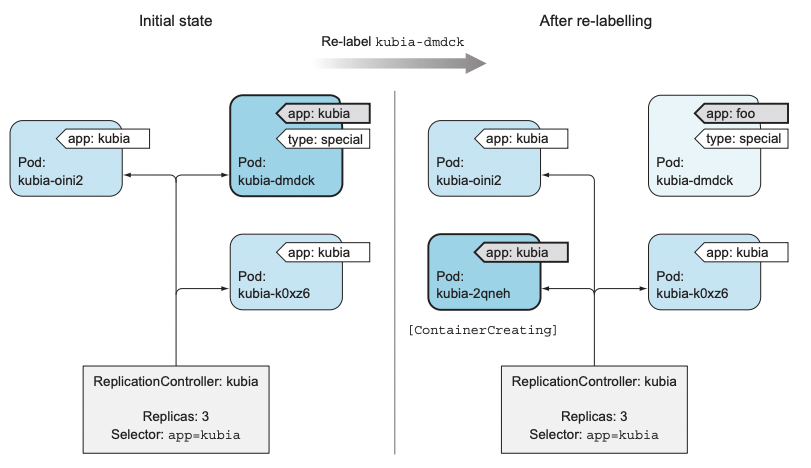

# 레플리이ㄴ과 그 밖의 컨트롤러: 관리되는 파드 배포

### 다루는 내용
- 파드의 안정적인 유지
- 동일한 파드의 여러 인스턴스 실행
- 노드 장애 시 자동으로 파드 스케줄링
- 파드의 수평 스케줄링
- 각 클러스터 노드에서 시스템 수준의 파드 실행
- 배치 잡 실행
- 잡을 주기적으로 또는 한 번만 실행하도록 스케줄링

# 파드를 안정적으로 유지하기 
파드의 컨테이너가 하나, 또는 모두 죽게되면 어떻게 되는가?  
- 파드가 노드에 스케줄링 되는 즉시, 해당 노드의 Kubelet은 파드의 컨테이너를 실행하고 파드가 존재하는 한 컨테이너가 계속 실행되도록 할 것이다.  
- 컨테이너의 주 프로세스에 크래시가 발생하면 Kubelete은 컨테이너를 다시 시작한다.  
- 이로써 애플리케이션을 실행하는 것 만으로도 치유 능력이 보장된다.  

그러나 무한 루프나 교착 상태와 같은 응답이 되지 않는 상황에서 애플리케이션이 다시 실행되게 하려면 다른 방법이 필요하다.

## 라이브니스 프로브
쿠버네티스는 라이브니스 프로브를 통해 컨테이너가 살아 있는지 확인할 수 있다.  
- 주기적으로 프로브를 실행하고 프로브가 실패할 경우 컨테이너를 다시 시작한다.  

쿠버네티스는 세 가지 프로브가 존재한다.  
- HTTP GET 프로브
- TCP 소켓 프로브
- Exec 프로브


## HTTP 기반 라이브니스 프로브
웹 애플리케이션은 웹 서버가 요청을 처리하는지 확인하는 라이브니스 프로브를 추가하는 것이 좋다.  

```yaml
apiVersion: v1
kind: Pod
metadata:
  name: kubia-liveness
spec:
  containers:
  - image: luksa/kubia-unhealthy
    name: kubia
    livenessProbe: # HTTP GET을 수행하는 라이브니스 프로브
      httpGet:
        path: / # HTTP 요청 경로
        port: 8080 # 프로브가 연결해야 하는 네트워크 포트 

```

## 라이브니스 프로브의 추가 속성
프로브를 정의할 때 timeout, period 등과 같은 추가 속성들을 지정할 수 있다.

```yaml
...
livenessProbe:
  httpGet:
    path: /
    port: 8080
  initialDelaySeconds: 15 # 첫 번째 프로브 실행까지 15초 대기
...
``` 

대부분 애플리케이션은 컨테이너가 실행되자마자 바로 준비되지는 않기 때문에 대기시긴을 넣어주는 경우가 많다.  

## 효과적인 라이브니스 프로브 생성
### 라이브니스 프로브가 확인해야 할 사항
라이브니스 프로브는 단순하지만 아주 중요한 역할을 수행하고있다.  

더 나은 라이브니스 프로브를 위해 특정 URL 경로에 요청하도록 프로브를 구성해 애플리케이션 내에서 실행 중인 모든 주요 구성 요소가 살아있는지 또는 응답이 없는지 확인하도록 구성할 수 있다.  

또한 라이브니스 프로브는 외부 요인의 영향을 받지 안도록 해야 한다.  
- EX) 프론트엔드 웹 서버의 라이브니스 프로브가 백엔드 서버의 오류로 인해 응답이 없어서 종료되는 일이 있어서는 안된다.  

### 프로브를 가볍게 유지
라이브니스 프로브는 너무 많은 연산 리소스를 사용해서는 안되며, 완료하는데 오래 걸리지 않아야 한다.

### 재시도 루프 구현 X
프로브의 실패 임곗감을 정할 수 있지만 실패 임곗값을 1로 설정하더라도, 쿠버네티스는 실패를 한 번 했다고 간주하기 전에 프로브를 여러 번 재시도 한다.
- 따라서 프로브에 자체적인 재시도 로직을 구현 할 필요가 없다.


# 레플리케이션컨트롤러
레플리케이션컨트롤러(이하 RC)는 쿠버네티스 리소스로서 파드가 항상 실행되도록 보장한다.  
- 클러스터에서 노드가 사라지거나 노드에서 파드가 제거된 경우, 사라진 파드를 감지해 교체 파드를 생성한다.  

  

## RC의 동작
RC는 실행 중인 파드 목록을 지속적으로 모니터링하고, 특정 유형의 실제 파드 수가 의도하는 수와 일치하는지 항상 확인한다.  

언제 의도하는 수의 파드와 실제 존재하는 파드의 수가 달라지는가?
- 누군가 같은 유형의 파드를 수동으로 만든다.
- 누군가 기존 파드의 유형을 변경한다.
- 누군가 의도하는 파드의 수를 줄인다.  

RC에서는 특정 레이블 셀랙터와 일치하는 파드로 파드의 유형을 구분한다.  

### 컨트롤러 조정 루프
RC의 역할은 정확한 수의 파드가 항상 레이블 셀렉터와 일치하는지 확인하는 것이다.  

  


### RC 세 가지 요소 이해
- 레이블 셀렉터 : RC 범위에 있는 파드 결정
- 레플리카 수 : 실행할 파드의 수 지정
- 파드 템플릿 : 새로운 파드 레플리카 생성시 사용

  

### 컨트롤러의 레이블 셀렉터 또는 파드 템플릿 변경의 영향
레이블 셀렉텨 : 변경시 기존 파드가 RC의 범위를 벗어나므로 컨트롤러가 해당 파드에 대한 관리 중지  
템플릿 : RC는 파드를 생성한 후 파드의 실제 콘텐츠에 신경을 쓰지 않는다. 
  - 따라서 탬플릿은 RC가 새로운 파드를 생성할 때만 영향을 미친다.  


### RC 사용시 이점  
- 기존 파드가 사라지면 새 파드를 시작해 파드가 항상 실행되도록 한다.  
- 클러스터 노드에 장애가 발생하면 장애가 발생한 노드에서 실행 중인 모든 파드에 관한 교체 복제본 생성
- 수동 또는 자동으로 파드를 쉽게 수평으로 확장할 수 있다.


## RC 생성
```yaml
apiVersion: v1
kind: ReplicationController # 메니페스트 정의
metadata:
  name: kubia               # RC 이름
spec:
  replicas: 3               # 원하는 파드 인스턴스 수
  selector:
    app: kubia              # 파드 셀렉터로 RC가 관리하는 파드 선택
  template:                 # 파드 템플릿
    metadata:
      labels:
        app: kubia
    spec:
      containers:
      - name: kubia
        image: luksa/kubia
        ports:
        - containerPort: 8080
```
- 템플릿의 파드 레이블은 RC의 레이블 셀렉터와 일치해야 한다.  

```sh
$ k create -f kubia-rc.yaml
```

### RC 정보 얻기
```
$ k get rc
NAME    DESIRED CURRENT READY AGE
kubias  3       3       2     3m
```

`k describe rc kubia` 를 통해 RC의 세부 정보를 확인할 수 있으며  
이 정보에는 RC가 어떤 pod를 생성하고 제거했는지 확인할 수 있다.

### 컨트롤러가 새로운 파드를 생성하는 원리
  
컨트롤러의 동작은 파드의 삭제나 생성에 대응하는 것이 아니라 결과적인 상태(파드의 수)에 대응하는 것이다.  

RC는 삭제되는 파드에 대해 즉시 통지를 받지만, 이 통지 자체가 대체 파드를 생성하게 하는 것은 아니다.  
- 이 통지가 파드 수를 확인하고 조치를 취하도록 하는 트리거 역할을 한다.  


### 컨트롤러에서 파드를 제거하는 실제 사례
특정 파드에 어떤 작업을 하는 경우 해당 파드를 RC 범위에서 제거하면 작업이 수월해진다.  

예를 들어서 특정 파드에서 오류가 발생하는것을 확인하면, 해당 파드의 레이블을 변경해 범위 밖으로 빼낸다음 디버깅을 해볼 수 있다.  

## 파드 템플릿 변경
RC의 파드 템플릿은 언제든지 변경 가능하며 기존에 생성된 파드에는 영향을 미치지 않고 이후 생성될 파드에만 영향을 미친다.  

## 수평 파드 스케일링
RC에서 원하는 복제본 수를 변경하는 것은 매우 간단한 일이다.   

이는 파드의 수평 스케일링이 매우 간단하다는 것을 의미한다.  

단순히 RC의 replicas 필드 값을 변경하기만 하면 된다.  

```
$ k scale rc kubia --replicas=10

---- OR ----

$ k edit rc kubia
...
spec:
replicas: 10
...

```

## RC 삭제
`k delete`를 통해 RC를 삭제하면 파드도 삭제된다.  
그러나 `--cascade=false` 옵션을 추가하면 RC가 관리하는 파드들을 삭제하지 않고도 RC를 제거할 수 있다.  

```sh
$ k delete rc kubia --cascade=false
replicationcontroller "kubia" delete
```  

# 레플리카셋
RC를 완전히 대체하게 될 레플리카셋이 도입됐다.  

## 레플리카셋과 레플리케이션컨트롤러 비교  
레플리카셋은 레플리케이션 컨트롤러와 똑같이 동작하지만 좀 더 풍부한 표현식을 사용하는 파드 셀렉터를 가지고 있다.  
- 레플리케이션컨트롤러 : 특정 레이블이 있는 파드만 매칭 가능
- 레플리카셋 : 특정 레이블이 없는 파드나 레이블 값과 상관 없이 특정 레이블의 키를 가지고 있는 파드 매칭 가능

## 레플리카셋 정의
```yaml
apiVersion: apps/v1beta2
kind: ReplicaSet
metadata:
  name: kubia
spec:
  replicas: 3
  selector:
    matchLabels:
      app: kubia
  template:
    metadata:
      labels:
        app: kubia
    spec:
      containers:
      - name: kubia
        image: luksa/kubia
```


167 - 203