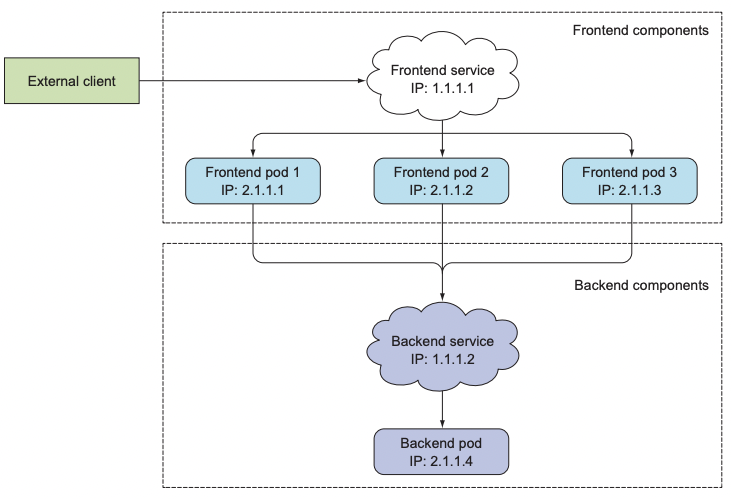
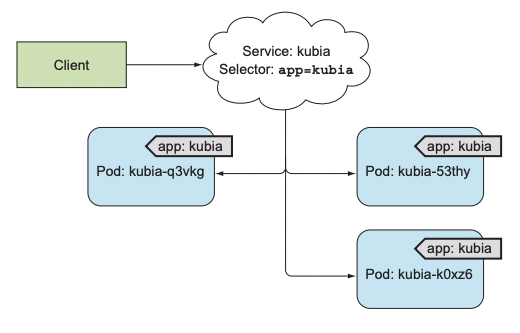
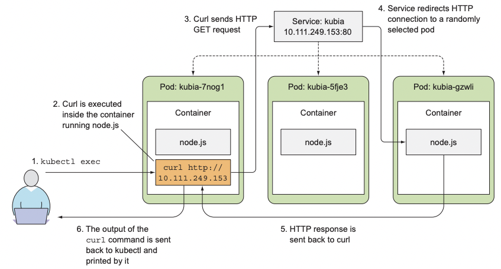

# 서비스

### 다루는 내용
- 단일 주소로 파드를 노출하는 서비스 리소스 만들기
- 클러스터 안에서 서비스 검색
- 외부 클라이언트에 서비스 노출
- 클러스터 내에서 외부 서비스 접속
- 파드가 서비스할 준비가 됐는지 제어하는 방법
- 서비스 문제 해결

마이크로서비스의 경우 파드는 대개 클러스터 내부의 다른 파드나 클러스터 외부의 클라이언트에서 오는 HTTP 요청에 응답한다.  

일반적인 방법처럼 서버의 IP 주소나 호스트 이름을 지정해 애플리케이션을 구성하면 아래의 이유들로 인해서 동작하지 않는다.  
- 파드는 일시적이다.
  - 노드에서 제거되거나 다른 노드로 이동할 수 있다.
- 파드가 시작되기 바로 전에 파드의 IP 주소가 할당된다.
  - 클라이언트 서버는 IP 주소를 미리 알 수 없다.
- 여러 파드가 동일한 서비스를 제공할 수 있다.
  - 수평 스케일링


# 서비스 소개
위와 같은 문제들을 해결하기 위해 쿠버네티스는 서비스라는 리소스를 제공한다.  

쿠버네티스의 서비스는 동일한 서비스를 제공하는 파드 그룹에 지속적인 단일 접점을 만들려고 할 때 생성하는 리소스다.  
- 각 서비스는 서비스가 존재하는 동안 절대 바뀌지 않는 IP 주소와 포트가 있다.
- 클라이언트는 해당 IP와 포트로 접속한 다음 해당 서비스를 지원하는 파드들 중 하나로 연결된다.

  


## 서비스 생성
서비스는 레이블 셀렉터로 어떤 파드가 서비스의 일부분인지 구분한다.  
  


```yaml
apiVersion: v1
kind: Service
metadata:
  name: kubia
spec:
  ports:
  - port: 80 # 서비스가 사용할 포트
    targetPort: 8080 # 서비스가 포워드할 컨테이너 포트
  selector:
    app: kubia # app=kubia 레이블이 있는 모든 파드가 이 서비스에 포함된다.
```  

```sh
❯ k create -f kubia-svc.yaml
service/kubia created 

❯ k get svc
NAME         TYPE        CLUSTER-IP      EXTERNAL-IP   PORT(S)   AGE
kubernetes   ClusterIP   10.96.0.1       <none>        443/TCP   18d
kubia        ClusterIP   10.107.237.90   <none>        80/TCP    4s
```

> k exec 명령을 통해 파드 내부 컨테이너에 명령어를 전달하여 서비스가 잘 동작하는지 테스트해볼 수 있다.  


### k exec kubia-7nog1 -- curl -s http://10.107.237.90
  


### 세션 어피니티
동일한 클라이언트에서 요청하더라도 서비스 프록시가 각 연결을 임의의 파드로 전달하므로 요청마다 다른 파드가 선택된다.  

특정 클라이언트의 모든 요청을 같은 파드로 리다이렉션 하려면 서비스의 세션 어피니티 속성을 `ClientIp`로 설정한다.  

```yaml
...
spec:
  sessionAffinity: ClientIP
...
```

### 동일 서비스 다중 포트 노출
만약 파드가 두 개 이상의 포트를 수신한다면 하나의 서비스를 사용해 여러 포트를 노출시킬 수 있다.  

```yaml
apiVersion: v1
kind: Service
metadata:
  name: kubia
spec:
  ports:
  - name: http
    port: 80
    targetPort: 8080
  - name: https
    port: 443
    targetport: 8443
  selector:
    app: kubia
```

### 이름이 지정된 포트 사용

파드가 포트 이름을 정의하는 경우 해당 이름으로 서비스에서 노출할 수 있다.

```yaml
kind: pod
spec:
  containers:
  - name: kubia
    ports:
    - name: http
      containerPort: 8080  # 8080 -> http
    - name: https
      containerPort: 8443 # 8443 -> https
```

```yaml
apiVersion: v1
kind: Service
spec:
  ports:
  - name: http
    port: 80
    targetPort: http
  - name: https
    port: 443
    targetPort: https
```

**이렇게 이름으로 연결하면 서비스 스펙을 변경하지 않고도 포트 번호를 변경할 수 있다는 장점이 있다.**

## 서비스 검색
클라이언트 파드는 서비스의 IP와 포트를 어떻게 알 수 있는가?  

쿠버네티스는 클라이언트 파드가 서비스의 IP와 포트를 검색할 수 있는 방법을 제공한다.  

### 환경변수를 통한 서비스 검색
클라이언트 파드를 생성하기 전에 서비스를 생성하면 해당 파드의 프로세스는 환경변수를 검사해 서비스의 IP 주소와 포트를 얻을 수 있다.  
- 파드를 만들고 서비스를 만들면 서비스에 대한 환경변수를 설정할 수 없다.  

```sh
> k exec kubia-3inly env
KUBERNETES_SERVICE_HOST=10.96.0.1
KUBERNETES_SERVICE_PORT=443
KUBIA_SERVICE_HOST=10.107.237.90
KUBIA_SERVICE_PORT=80
```

> 서비스 이름의 대시는 밑줄로 변환되고 서비스 이름이 환경변수 이름의 접두어로 쓰이면서 모든 문자는 대문자로 표시된다.  

### DNS를 통한 서비스 검색
kube-system 네임스페이스에는 kube-dns라는 파드와 서비스가 존재한다.  
- minikube에서는 coredns로 시작하는 것 같다.  

해당 파드는 DNS 서버를 실행하며 클러스터에서 실행 중인 다른 모든 파드는 자동으로 이를 사용하도록 구성된다.  

각 서비스는 내부 DNS 서버에서 DNS 항목을 가져오고 서비스 이름을 알고 있는 클라이언트 파드는 환경변수 대신 FQDN으로 액세스할 수 있다.  

### FQDN을 통한 서비스 연결

service-name.namespacke.svc.cluster.local 과 같은 형태로 구성되어있다.  
- ex) backend-database.default.svc.cluster.local

클라이언트 파드와 서비스 되는 파드가 같은 네임스페이스에 있는 경우 svc.cluster.local 접미사와 네임스페이스는 생략할 수 있다.  
- ex) backend-database
> 클라이언트는 서비스의 포트 번호를 알아야 한다.  


# 클러스터 외부에 있는 서비스 연결 

205 - 258