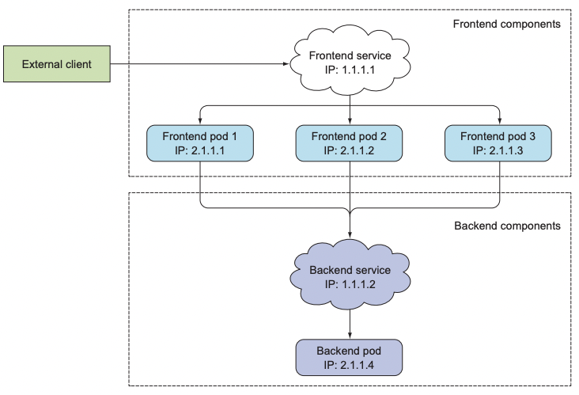
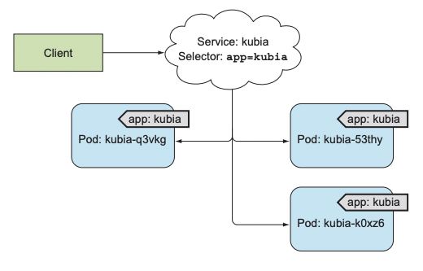

# 서비스

### 다루는 내용
- 단일 주소로 파드를 노출하는 서비스 리소스 만들기
- 클러스터 안에서 서비스 검색
- 외부 클라이언트에 서비스 노출
- 클러스터 내에서 외부 서비스 접속
- 파드가 서비스할 준비가 됐는지 제어하는 방법
- 서비스 문제 해결

마이크로서비스의 경우 파드는 대개 클러스터 내부의 다른 파드나 클러스터 외부의 클라이언트에서 오는 HTTP 요청에 응답한다.  

일반적인 방법처럼 서버의 IP 주소나 호스트 이름을 지정해 애플리케이션을 구성하면 아래의 이유들로 인해서 동작하지 않는다.  
- 파드는 일시적이다.
  - 노드에서 제거되거나 다른 노드로 이동할 수 있다.
- 파드가 시작되기 바로 전에 파드의 IP 주소가 할당된다.
  - 클라이언트 서버는 IP 주소를 미리 알 수 없다.
- 여러 파드가 동일한 서비스를 제공할 수 있다.
  - 수평 스케일링


# 서비스 소개
위와 같은 문제들을 해결하기 위해 쿠버네티스는 서비스라는 리소스를 제공한다.  

쿠버네티스의 서비스는 동일한 서비스를 제공하는 파드 그룹에 지속적인 단일 접점을 만들려고 할 때 생성하는 리소스다.  
- 각 서비스는 서비스가 존재하는 동안 절대 바뀌지 않는 IP 주소와 포트가 있다.
- 클라이언트는 해당 IP와 포트로 접속한 다음 해당 서비스를 지원하는 파드들 중 하나로 연결된다.

  


## 서비스 생성
서비스는 레이블 셀렉터로 어떤 파드가 서비스의 일부분인지 구분한다.  
  


```yaml
apiVersion: v1
kind: Service
metadata:
  name: kubia
spec:
  ports:
  - port: 80 # 서비스가 사용할 포트
    targetPort: 8080 # 서비스가 포워드할 컨테이너 포트
  selector:
    app: kubia # app=kubia 레이블이 있는 모든 파드가 이 서비스에 포함된다.
```  

```sh
❯ k create -f kubia-svc.yaml
service/kubia created 

❯ k get svc
NAME         TYPE        CLUSTER-IP      EXTERNAL-IP   PORT(S)   AGE
kubernetes   ClusterIP   10.96.0.1       <none>        443/TCP   18d
kubia        ClusterIP   10.107.237.90   <none>        80/TCP    4s
```

> k exec 명령을 통해 파드 내부 컨테이너에 명령어를 전달하여 서비스가 잘 동작하는지 테스트해볼 수 있다.  


### k exec kubia-7nog1 -- curl -s http://10.107.237.90
  


### 세션 어피니티
동일한 클라이언트에서 요청하더라도 서비스 프록시가 각 연결을 임의의 파드로 전달하므로 요청마다 다른 파드가 선택된다.  

특정 클라이언트의 모든 요청을 같은 파드로 리다이렉션 하려면 서비스의 세션 어피니티 속성을 `ClientIp`로 설정한다.  

```yaml
...
spec:
  sessionAffinity: ClientIP
...
```

### 동일 서비스 다중 포트 노출
만약 파드가 두 개 이상의 포트를 수신한다면 하나의 서비스를 사용해 여러 포트를 노출시킬 수 있다.  

```yaml
apiVersion: v1
kind: Service
metadata:
  name: kubia
spec:
  ports:
  - name: http
    port: 80
    targetPort: 8080
  - name: https
    port: 443
    targetport: 8443
  selector:
    app: kubia
```

### 이름이 지정된 포트 사용

파드가 포트 이름을 정의하는 경우 해당 이름으로 서비스에서 노출할 수 있다.

```yaml
kind: pod
spec:
  containers:
  - name: kubia
    ports:
    - name: http
      containerPort: 8080  # 8080 -> http
    - name: https
      containerPort: 8443 # 8443 -> https
```

```yaml
apiVersion: v1
kind: Service
spec:
  ports:
  - name: http
    port: 80
    targetPort: http
  - name: https
    port: 443
    targetPort: https
```

**이렇게 이름으로 연결하면 서비스 스펙을 변경하지 않고도 포트 번호를 변경할 수 있다는 장점이 있다.**

## 서비스 검색
클라이언트 파드는 서비스의 IP와 포트를 어떻게 알 수 있는가?  

쿠버네티스는 클라이언트 파드가 서비스의 IP와 포트를 검색할 수 있는 방법을 제공한다.  

### 환경변수를 통한 서비스 검색
클라이언트 파드를 생성하기 전에 서비스를 생성하면 해당 파드의 프로세스는 환경변수를 검사해 서비스의 IP 주소와 포트를 얻을 수 있다.  
- 파드를 만들고 서비스를 만들면 서비스에 대한 환경변수를 설정할 수 없다.  

```sh
> k exec kubia-3inly env
KUBERNETES_SERVICE_HOST=10.96.0.1
KUBERNETES_SERVICE_PORT=443
KUBIA_SERVICE_HOST=10.107.237.90
KUBIA_SERVICE_PORT=80
```

> 서비스 이름의 대시는 밑줄로 변환되고 서비스 이름이 환경변수 이름의 접두어로 쓰이면서 모든 문자는 대문자로 표시된다.  

### DNS를 통한 서비스 검색
kube-system 네임스페이스에는 kube-dns라는 파드와 서비스가 존재한다.  
- minikube에서는 coredns로 시작하는 것 같다.  

해당 파드는 DNS 서버를 실행하며 클러스터에서 실행 중인 다른 모든 파드는 자동으로 이를 사용하도록 구성된다.  

각 서비스는 내부 DNS 서버에서 DNS 항목을 가져오고 서비스 이름을 알고 있는 클라이언트 파드는 환경변수 대신 FQDN으로 액세스할 수 있다.  

### FQDN을 통한 서비스 연결

service-name.namespacke.svc.cluster.local 과 같은 형태로 구성되어있다.  
- ex) backend-database.default.svc.cluster.local

클라이언트 파드와 서비스 되는 파드가 같은 네임스페이스에 있는 경우 svc.cluster.local 접미사와 네임스페이스는 생략할 수 있다.  
- ex) backend-database
> 클라이언트는 서비스의 포트 번호를 알아야 한다.  


# 클러스터 외부에 있는 서비스 연결 
쿠버네티스는 서비스 기능으로 외부 서비스를 노출할 수 있다.  

## 서비스 엔드포인트
서비스는 파드에 직접 연결되지 않는다.
- 대신 엔드포인트 리소스가 그 사이에 있다.  
- `k get`을 사용해도 확인 가능하다.
```sh
> k describe svc kubia
Name:           kubia
Namespace:      default
Labels:         <none>
Selector:       app=kubia # 서비스의 파드 셀렉터는 엔드포인트 목록을 만드는데 사용된다.
Type:           ClusterIP
IP:             10.111.249.153
Port:           <unset> 80/TCP
Endpoints:      10.108.1.4:8080,10.108.2.5:8080,10.108.2.6:8080
# 해당 서비스의 엔드포인트를 나타내는 파드 IP와 포트 목록
....

> k get endpoints kubia
NAME          ENDPOINTS                                             AGE
kubia         10.108.1.4:8080,10.108.2.5:8080,10.108.2.6:8080       1h
```

## 서비스 엔드포인트 수동 구성
위와 같은 엔드포인트를 수동으로 구성하여 외부 서비스에 연결할 수 있다.  

1. 파드 셀렉터 없이 서비스를 생성한다.
2. 서비스 리소스와 이름이 같은 엔드포인트 리소스를 생성한다.
```yaml
apiVersion: v1
kind: Endpoints
metadata:
  name: external-service # 서비스 이름과 같은 엔드포인트
subsets:
  - addresses: # 서비스가 연결을 전달할 엔드포인트 IP
    - ip: 11.11.11.11
    - ip: 22.22.22.22
    ports:
    - port: 80 # 엔드포인트의 대상 포트
```
  


## 외부 서비스를 위한 별칭
간단하게 FQDN으로 외부 서비스를 참조할 수 있다.  
```yaml
apiVersion: v1
kind: Service
metadata:
  name: external-service
spec:
  type: ExternalName # 서비스 유형을 ExternalName으로 지정
  externalName: api.somecompany.com # 실제 서비스의 정규화된 도메인 이름
  ports:
  - port: 80
```

이렇게 구성하면 파드는 서비스의 FQDN를 직접 사용하는 대신 external-service.default.svc.cluster.local과 같은 이름을 사용할 수 있다.
- 이를 통해 외부 서비스와의 결합도를 낮출 수 있다.  

# 외부 클라이언트에 서비스 노출
  
위 그림과 같이 특정 서비스를 외부에 노출해 외부 클라이언트가 액세스할 수 있도록 구성하는 방법이 몇가지 있다.  

- 노드포트로 서비스 유형 설정
- 서비스 유형을 로드밸런서로 설정
- 단일 IP 주소로 여러 서비스를 노출하는 인그레스 리소스 생성

## 노드포트 서비스 사용
노드포트 서비스를 만들면 쿠버네티스의 모든 노드에 특정 포트를 할당하고 서비스를 구성하는 파드로 들어오는 연결을 전달한다.  

```yaml
apiVersion: v1
kind: Service
metadata:
  name: kubia-nodeport
spec:
  type: NodePort              # 서비스 유형을 노드포트로 설정
  ports:
  - port: 80                  # 서비스 내부 클러스터 IP의 포트
    targetPort: 8080          # 서비스 대상 파드의 포트
    nodePort: 30123           # 각 클러스터 노드에서 서비스로 액세스할 포트
  selector:
    app: kubia
```
- 노드 포트는 생략 가능하며, 생략시 쿠버네티스가 임의로 지정한다.  


해당 서비스는 아래의 방법들로 액세스할 수 있다.
- `<CLUSTER-IP>:80`
- `<FIRST-NODE-IP>:30123`
- `<SECOND-NODE-IP>:30123`
- `ETC`

  
- 첫 번째 노드의 30123 포트로 수신된 연결이 두 번쨰 노드의 실행중인 파드로 연결될 수 있다.  

## 외부 로드밸런서로 서비스 노출
클라우드 공급자에서 실행되는 쿠버네티스 클러스터는 일반적으로 클라우드 인프라에서 로드밸런서를 자동으로 프로비저닝하는 기능을 제공한다.  

```yaml
apiVersion: v1
kind: Service
metadata:
  name: kubia-loadbalancer
spec:
  type: LoadBalancer
  ports:
  - port: 80
    targetPort: 8080
  selector:
    app: kubia

```
```sh
> k get svc kubia-loadbalancer
NAME                  CLUSTER-IP        EXTERNAL-IP       PORT(S)       AGE
kubia-loadbalancer    10.111.241.153    130.211.53.173    80:32143/TCP  1m
```
이 경우 로드밸런서는 IP 130.211.53.173로 사용할 수 있으므로 해당 IP 주소로 외부에서 서비스에 액세스할 수 있다.
  

## 외부 연결 특성 이해
노드포트로 서비스에 접속한 경우(로드밸런서 포함) 연결을 수신한 노드의 포트로 연결이 전달될 수 있고 다른 노드로 연결이 전달될 수 있다.  

후자의 경우 추가적인 네트워크 홉이 필요해진다.  

서비스 스펙 섹션의 externalTrafficPolicy 필드를 Local로 구성하여 연결을 수신한 노드에서 실행중인 파드로만 외부 트래픽을 전달하도록 서비스를 구성할 수 있다.  

그러나 이 옵션을 사용한 경우 고려해야할 것이 몇가지 있다. 
- 연결을 수신한 노드에 파드가 존재하지 않으면 연결이 중단된다.
- 트래픽이 고르개 분산되지 않을 수 있다.  
  

# 인그레스 리소스로 서비스 외부 노출
로드밸런서 서비스는 자신의 공용 IP 주소를 가진 로드밸런서가 필요하지만, 인그레스는 한 IP 주소로 수십 개의 서비스에 접근이 가능하도록 지원해준다.
  

> 인그레스 리소스를 작동시키려면 클러스터에 인그레스 컨트롤러를 실행해야 한다.  
> 쿠버네티스 환경마다 다른 컨트롤러 구현을 사용할 수 있다.  


## 인그레스 리소스 생성
```yaml
apiVersion: extensions/v1beta1
kind: Ingress
metadata:
  name: kubia
spec:
  rules:
  - host: kubia.example.com  # 인그레스는 kubia.example.com 도메인 이름을 서비스에 매핑한다.
    http:
      paths:
      - path: / # 모든 요청은 kubia-nodeport 서비스의 포트 80으로 전달된다.
        backend:
          serviceName: kubia-nodeport
          servicePort: 80
```
## 인그레스로 서비스 액세스
해당 도메인의 서비스에 액세스하려면 도메인 이름이 인그레스 컨트롤러의 IP와 매핑되도록 해야한다.

```sh
$ k get ingresses
NAME        HOSTS                 ADDRESS           PORTS     AGE
kubia       kubia.example.com     192.168.99.100    80        1m
```

아래 정보를 `/etc/hosts`에 추가하면 된다.
- `192.186.99.100     kubia.example.com`

  
1. 클라이언트가 `kubia.example.com`을 DNS 서버에 조회
2. 클라이언트는 헤더 `Host: kubia.example.com`과 함께 요청 전달
3. 인그레스 컨트롤러는 요청의 헤더값으로 액세스 하는 서비스 결정
4. 서비스와 관련된 엔드포인트 리소스로 파드 IP를 조회한 뒤 해당 파드로 전달

인그레스 컨트롤러는 요청을 서비스로 전달하지 않고 파드를 선택하는데만 사용한다.  


## 하나의 인그레스로 여러 서비스 노출
단일 IP 주소로 두 개의 서비스에 도달할 수 있다.
```yaml
...
- host: kubia.example.com
  http:
    paths:
    - path: /kubia  # kubia.example.com/kubia으로의 요청은 kubia 서비스로 전달
      backend:
        serviceName: kubia
        servicePort: 80
    - path: /bar   # kubia.example.com/bar으로의 요청은 bar 서비스로 전달
      backend:
        serviceName: bar
        servicePort: 80
...
```
  
서로 다른 호스트로 서로 다른 서비스를 매핑할 수 있다.  

```yaml
...
spec:
  rules:
  - host: foo.example.com # foo.example.com 요청은 서비스 foo로 전달
    http:
      paths:
      - path: /
        backend:
          serviceName: foo
          servicePort: 80
  - host: bar.example.com # bar.example.com 요청은 서비스 bar로 전달
    http:
      paths:
      - path: /
        backend:
          serviceName: bar
          servicePort: 80
...
```

## TLS 트래픽을 처리하도록 인그래스 구성
클라이언트가 인그레스 컨트롤러에 대한 TLS 연결을 하면 컨트롤러는 TLS 연결을 종료한다.  
- 클라이언트와 컨트롤러간의 통신은 암호화되지만 컨트롤러와 파드간의 통신은 암호화 되지 않는다.
  - 파드에서 실행중인 애플리케이션은 TLS를 지원할 필요가 없다.  

시크릿 리소스를 활용해 인증서와 개인 키를 인그레스에 첨부해야한다.  

```yaml
...
spec:
  tls:
  - hosts:
    - kubia.example.com
    secretName: tls-secret
...
```

# 파드가 연결을 수락할 준비가 됐을 때 신호 보내기
만약 서비스에 포함된 파드가 준비가 되기도 전에 요청이 전달된다면 사용자의 경험에 좋지 않은 영향을 미칠 수 있다.  
- 완전히 준비될 때까지 파드에 요청을 전달하지 않는게 좋다.  

## 레디니스 프로브
라이브니스 프로브와 비슷하게 레디니스 프로브를 정의할 수 있다.  
- 라이브니스 프로브와 동일하게 Exec, HTTP, TCP 소켓 프로브가 존재한다.

레디니스 프로브는 주기적으로 호출되며 특정 파드가 클라이언트 요청을 수신할 수 있는지 결정한다.  

  

레디니스 프로브는 주기적으로 파드가 준비됐는지 확인한다.  
만약 준비되지 않았다면 서비스에서 제거하고, 준비되면 서비스에 다시 추가한다. 
- 실제로는 엔드포인트에 추가되거나 제거된다.  
- 라이브니스 프로브와는 다르게 점검에 실패해도 컨테이너가 종료되거나 다시 시작되지 않는다.  

```yaml
apiVersion: v1
kind: ReplicationController
metadata:
  name: kubia
spec:
  replicas: 3
  selector:
    app: kubia
  template:
    metadata:
      labels:
        app: kubia
    spec:
      containers:
      - name: kubia
        image: luksa/kubia
        ports:
        - name: http
          containerPort: 8080
        readinessProbe:  # 각 컨테이너에 레디니스 프로브가 정의된다.
          exec:  # 아래 커멘드를 수행하면서 파일이 존재하면 0을 반환한다.
            command:
            - ls
            - /var/ready

```

# 헤드리스 서비스로 개별 파드 찾기
클라이언트가 서비스의 모든 파드에 연결하려면 각 파드의 IP를 알아야 한다.  

쿠버네티스는 클라이언트가 DNS 조회로 파드 IP를 찾을 수 있도록 한다.  

서비스 스펙의 clusterIP 필드를 None으로 설정하면 쿠버네티스는 클라이언트가 서비스의 파드에 연결할 수 있는 클러스터 IP를 할당하지 않기 때문에 서비스가 헤드리스 상태가 된다.  


```yaml
apiVersion: v1
kind: Service
metadata:
  name: kubia-headless
spec:
  clusterIP: None # 이 부분이 헤드리스 서비스로 만드는 부분
  ports:
  - port: 80
    targetPort: 8080
  selector:
    app: kubia

``` 

# 서비스 문제 해결
서비스의 문제를 해결하는 방법을 간략하게 살펴보자  

- 외부가 아닌 클러스터 내에서 서비스의 클러스터 IP에 연결되는지 확인한다.  
- 서비스 IP로 핑을 할 필요 없다.
- 레디니스 프로브를 정의했다면 성공했는지 확인해야한다.  
- 파드가 서비스의 일부인지 확인하려면 `k get endpoints`를 사용해 엔드포인트 오브젝트를 확인한다.  
- FQDN이나 그 일부로 서비스에 액세스가 안되는 경우, FQDN 대신 클러스터 IP를 사용해 액세스할 수 있는지 확인한다.  
- 대상 포트가 아닌 서비스로 노출된 포트에 연결하고 있는지 확인한다. 
- 파드 IP에 직접 연결해 파드가 올바른 포트에 연결돼 있는지 확인한다.  
- 파드 IP로 애플리케이션에 액세스할 수 없는 경우 애플리케이션이 로컬호스트에만  바인딩 하고 있는지 확인한다.  

# 요약
- 안정된 단일 IP 주소와 포트로 레이블 셀렉터와 일치하는 여러 개의 파드를 노출한다. 
- 클러스터 내외부에서 서비스에 액세스할 수 있다.   
- 엔드포인트 리소스 없이 서비스를 생성해 외부의 서비스를 검색하고 통신할 수 있다.  
- ExternalName 서비스 유형으로 외부 서비스에 대한 DNS CNAME을 제공한다.  
- 단일 인그레스로 여러 서비스를 노출한다. 
- 레디니스 프로브는 파드를 서비스 엔드포인트에 포함해야 하는지 여부를 결정한다.  
- 헤드리스 서비스를 생성하면 DNS로 파드 IP를 검색할 수 있다.