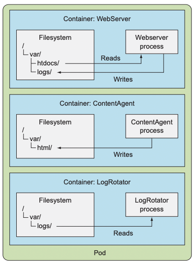
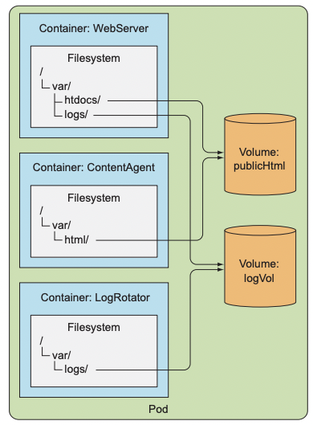

# 볼륨: 컨테이너에 디스크 스토리지 연결

### 다루는 내용
- 다중 컨테이너 파드 생성
- 컨테이너 간 디스크 스토리지 공유를 위한 볼륨 생성
- 파드 내부에 깃 리포지터리 사용
- 파드에 GCE 퍼시스턴트 디스크와 같은 퍼시스턴트 스토리지 연결
- 사전 프로비저닝된 퍼시스턴트 스토리지
- 퍼시스턴트 스토리지의 동적 프로비저닝

파드 내부의 각 컨테이너는 고유하게 분리된 파일시스템을 가진다.
- 파일시스템은 컨테이너 이미지에서 제공되기 때문이다.  

컨테이너는 시작될 때마다 컨테이너 이미지를 빌드할 때 추가한 파일들을 갖는 컨테이너를 시작한다.
- 새로 시작한 컨테이너는 이전에 실행했던 컨테이너에 쓰여진 파일시스템의 어떤 것도 볼 수 없다.  

실제 데이터를 가진 디렉터리를 보존하기 위해 쿠버네티스는 스토리지 볼륨 제공한다.  

# 볼륨 소개
쿠버네티스 볼륨은 파드의 구성 요소로 컨테이너와 동일하게 파드 스펙에서 정의된다.  
- 자체적으로 생성, 삭제될 수 없다.  

## 예시
1. `/var/logs`에 로그를 생성하는 웹 서버 컨테이너
2. `/var/html` 경로에 HTML 파일을 생성하는 에이전트 컨테이너
3. `/var/logs`의 로그를 처리하는 컨테이너

  

볼륨이 없다면 각기 쓸모없는 컨테이너가 된다.

그러나 아래와 같이 볼륨 두 개를 파드에 추가하고 적절하게 마운트 한다면 좋은 시스템이 된다.  

  

## 사용 가능한 볼륨 유형
- emptyDir: 일시적인 데이터를 저장하는데 사용되는 간단한 빈 디렉터리
- hostPath: 워커 노드의 파일시스템을 파드의 디렉터리로 마운트하는 데 사용되는 디렉터리
- gitRepo: 깃 리포지터리의 콘텐츠를 체크아웃해 초기화한 볼륨
- nfs: NFS 공유를 파드에 마운트
- gcePersistentDisk, awsElasticBlockStore, azureDisk: 클라우드 제공자의 전용 스토리지를 마운트하는데 사용
- cinder, cephfs, iscsi, flocker, glusterfs, quobyte, rbd, flexVolume, vsphereVolume, photonPersistentDisk, scaleIO: 다른 유형의 네트워크 스토리지를 마운트 하는데 사용
- configMap, secret, downwardAPI: 쿠버네티스 리소스나 클러스터 정보를 파드에 노출하는데 사용되는 특별한 유형의 볼륨
- persistentVolumeClaim: 사전에 혹은 동적으로 프로비저닝된 퍼시스턴트 스토리지를 사용하는 방법.  

# 볼륨을 사용한 컨테이너 간 데이터 공유
## emptyDir 볼륨
이름에서 알 수 있듯이 볼륨이 빈 디렉터리로 시작된다.  
볼륨의 라이프사이클이 파드에 묶여 있으므로 파드가 삭제되면 볼륨의 콘텐츠는 사라진다.  

컨테이너 간 파일을 공유할 때 유용하다.  
단일 컨테이너에서도 가용한 메모리에 넣기에 큰 데이터 세트의 정렬 작업을 수행하는 것과 같이 임시 데이터를 디스크에 쓰는 목적인 경우 사용할 수 있다.  
- 자체 파일시스템에도 쓸 수 있지만 파일시스템이 쓰기가 불가능한 상태일 수 있다.  

259 - 304