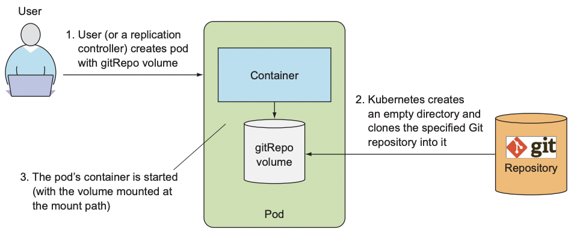
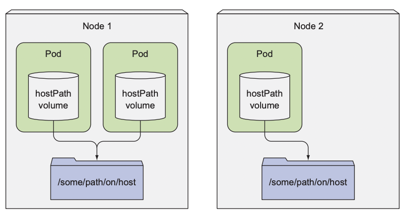
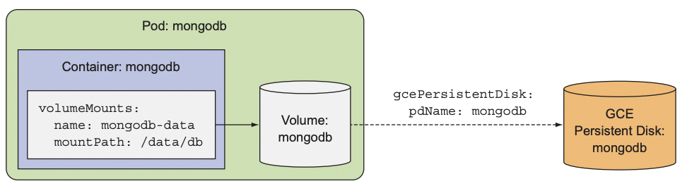
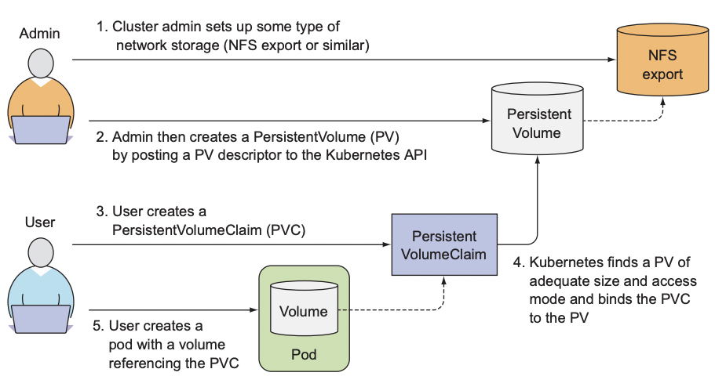
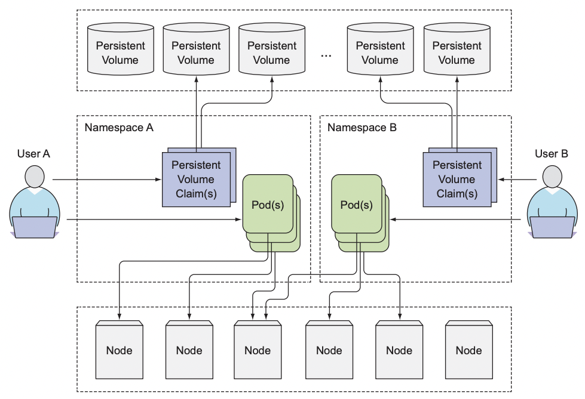
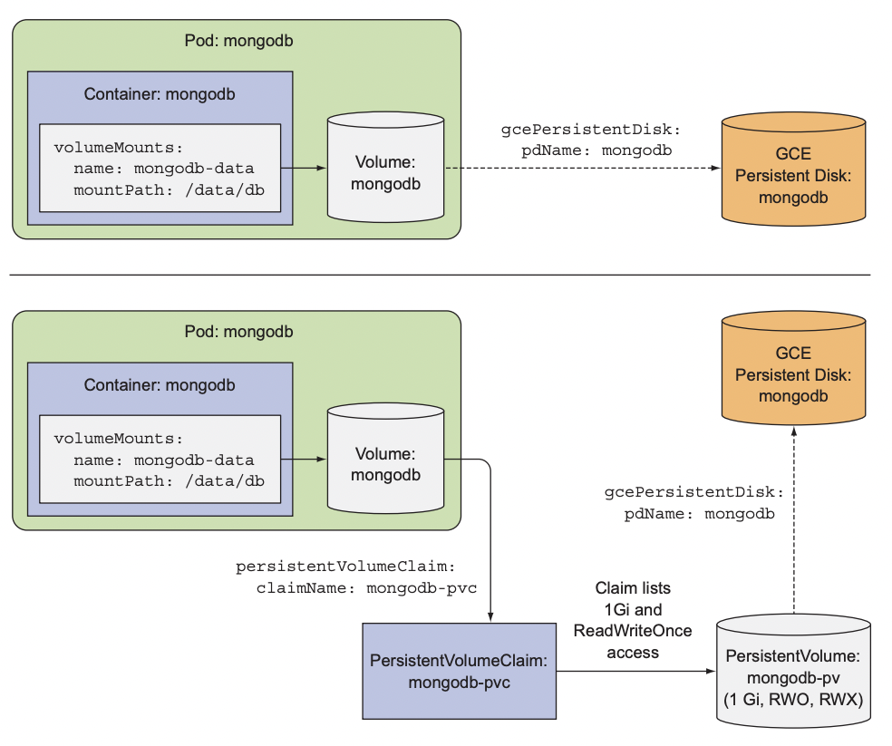
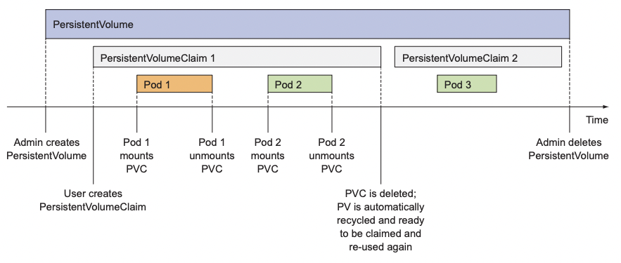
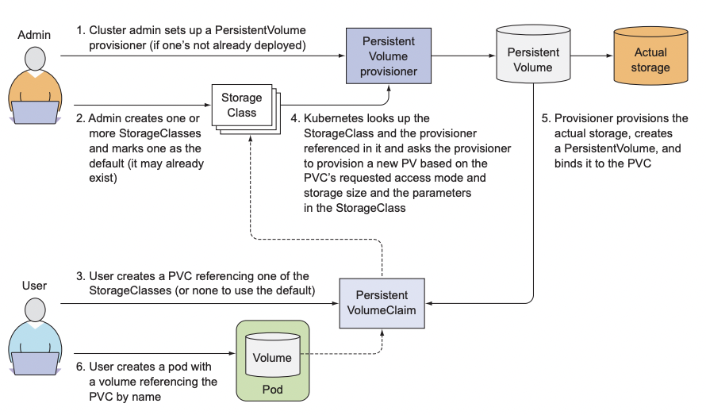

# 볼륨: 컨테이너에 디스크 스토리지 연결

### 다루는 내용
- 다중 컨테이너 파드 생성
- 컨테이너 간 디스크 스토리지 공유를 위한 볼륨 생성
- 파드 내부에 깃 리포지터리 사용
- 파드에 GCE 퍼시스턴트 디스크와 같은 퍼시스턴트 스토리지 연결
- 사전 프로비저닝된 퍼시스턴트 스토리지
- 퍼시스턴트 스토리지의 동적 프로비저닝

파드 내부의 각 컨테이너는 고유하게 분리된 파일시스템을 가진다.
- 파일시스템은 컨테이너 이미지에서 제공되기 때문이다.  

컨테이너는 시작될 때마다 컨테이너 이미지를 빌드할 때 추가한 파일들을 갖는 컨테이너를 시작한다.
- 새로 시작한 컨테이너는 이전에 실행했던 컨테이너에 쓰여진 파일시스템의 어떤 것도 볼 수 없다.  

실제 데이터를 가진 디렉터리를 보존하기 위해 쿠버네티스는 스토리지 볼륨 제공한다.  

# 볼륨 소개
쿠버네티스 볼륨은 파드의 구성 요소로 컨테이너와 동일하게 파드 스펙에서 정의된다.  
- 자체적으로 생성, 삭제될 수 없다.  

## 예시
1. `/var/logs`에 로그를 생성하는 웹 서버 컨테이너
2. `/var/html` 경로에 HTML 파일을 생성하는 에이전트 컨테이너
3. `/var/logs`의 로그를 처리하는 컨테이너

  

볼륨이 없다면 각기 쓸모없는 컨테이너가 된다.

그러나 아래와 같이 볼륨 두 개를 파드에 추가하고 적절하게 마운트 한다면 좋은 시스템이 된다.  

  

## 사용 가능한 볼륨 유형
- emptyDir: 일시적인 데이터를 저장하는데 사용되는 간단한 빈 디렉터리
- hostPath: 워커 노드의 파일시스템을 파드의 디렉터리로 마운트하는 데 사용되는 디렉터리
- gitRepo: 깃 리포지터리의 콘텐츠를 체크아웃해 초기화한 볼륨
- nfs: NFS 공유를 파드에 마운트
- gcePersistentDisk, awsElasticBlockStore, azureDisk: 클라우드 제공자의 전용 스토리지를 마운트하는데 사용
- cinder, cephfs, iscsi, flocker, glusterfs, quobyte, rbd, flexVolume, vsphereVolume, photonPersistentDisk, scaleIO: 다른 유형의 네트워크 스토리지를 마운트 하는데 사용
- configMap, secret, downwardAPI: 쿠버네티스 리소스나 클러스터 정보를 파드에 노출하는데 사용되는 특별한 유형의 볼륨
- persistentVolumeClaim: 사전에 혹은 동적으로 프로비저닝된 퍼시스턴트 스토리지를 사용하는 방법.  

# 볼륨을 사용한 컨테이너 간 데이터 공유
## emptyDir 볼륨
이름에서 알 수 있듯이 볼륨이 빈 디렉터리로 시작된다.  
볼륨의 라이프사이클이 파드에 묶여 있으므로 파드가 삭제되면 볼륨의 콘텐츠는 사라진다.  

컨테이너 간 파일을 공유할 때 유용하다.  
단일 컨테이너에서도 가용한 메모리에 넣기에 큰 데이터 세트의 정렬 작업을 수행하는 것과 같이 임시 데이터를 디스크에 쓰는 목적인 경우 사용할 수 있다.  
- 자체 파일시스템에도 쓸 수 있지만 파일시스템이 쓰기가 불가능한 상태일 수 있다.  

```yaml
apiVersion: v1
kind: Pod
metadata:
  name: fortune
spec:
  containers:
  - image: luksa/fortune 
    name: html-generator
    volumeMounts:
    - name: html # html이라는 볼륨을 /var/htdocs 에 마운트
      mountPath: /var/htdocs
  - image: nginx:alpine
    name: web-server
    volumeMounts:
    - name: html # 위와 동일한 볼륨을 읽기 전용으로 마운트
      mountPath: /usr/share/nginx/html
      readOnly: true
    ports:
    - containerPort: 80
      protocol: TCP
  volumes:
  - name: html
    emptyDir: {}
```

쿠버네티스의 emptyDir을 디스크가 아닌 메모리를 사용하는 tmpfs 파일 시스템으로 생성하도록 요청할 수 있다.  
```yaml
volumes:
  - name: html
    emptyDir:
      medium: Memory
```  
- emptyDir 볼륨은 가장 단순한 볼륨의 유형이지만 다른 유형들도 이 볼륨을 기반으로 한다.  

## 깃 리포지터리를 볼륨으로 사용하기
gitRepo 볼륨은 기본적으로 emptyDir 볼륨이며 파드가 시작되면 깃 리포지터리를 복제하고 특정 리비전을 체크아웃해 데이터로 채운다.
  
- gitRepo에 변경을 푸시할 때마다 파드를 삭제해줘야 한다.  

```yaml
apiVersion: v1
kind: Pod
metadata:
  name: gitrepo-volume-pod
spec:
  containers:
  - image: nginx:alpine
    name: web-server
    volumeMounts:
    - name: html
      mountPath: /usr/share/nginx/html
      readOnly: true
    ports:
    - containerPort: 80
      protocol: TCP
  volumes:
  - name: html
    gitRepo: # gitRepo 볼륨 생성
      repository: https://github.com/luksa/kubia-website-example.git # 해당 레포지토리를 복제한다.
      revision: master
      directory: . # 볼륨의 루트 디렉터리에 리포지토리 복사

```  

변경 사항이 있을때마다 파드를 삭제하는 대신에 볼륨이 항상 깃 레포지토리와 동기화하도록 추가 프로세스를 실행할 수 있다.  
- 사이드카 컨테이너

프라이빗 깃 리포지토리로 gitRepo 볼륨을 사용할 수 없다.
- gitRepo 볼륨은 단순하게 유지하고 깃 동기화 사이드카나 다른 유사 방법을 사용해야 한다.  

# 워커 노드 파일시스템의 파일 접근
대부분의 파드는 호스트 노드를 인식하지 못하므로 노드의 파일시스템에 접근해서는 안된다.  

그러나 hostPath 볼륨을 사용하면 가능하다.  

## hostPath 볼륨 소개
hostPath 볼륨은 노드 파일시스템의 특정 파일이나 디렉터리를 가리킨다.  
- 퍼시스턴트 스토리지 중 하나이다.
- hostPath 볼륨의 콘텐츠는 파드가 종료되어도 삭제되지 않는다. 
- 동일한 노드에 스케줄링된다면 새로운 파드는 이전 파드가 남긴 모든 항목을 볼 수 있다.  
  


# 퍼시스턴트 스토리지 사용
파드에서 실행 중인 애플리케이션이 디스크에 데이터를 유지해야 하고 파드가 다른 노드로 재스케줄링된 경우에도 동일한 데이터를 사용해야 한다면 NAS 유형에 저장되어야 한다.  

## GCE 
```yaml
apiVersion: v1
kind: Pod
metadata:
  name: mongodb 
spec:
  volumes:
  - name: mongodb-data
    gcePersistentDisk: # GCE 퍼시스턴트 디스크
      pdName: mongodb 
      fsType: ext4 # 파일시스템 유형은 EXT4
  containers:
  - image: mongo
    name: mongodb
    volumeMounts:
    - name: mongodb-data
      mountPath: /data/db # MongoDB가 데이터를 저장할 경로
    ports:
    - containerPort: 27017
      protocol: TCP

```
  

만약 GCE대신 AWS를 사용한다면 awsElasticBlockStroe 볼륨을 사용할 수 있다.
```yaml
volumes:
- name: mongodb-data
  awsElasticBlockStore:
    volumeId: my-volume
    fsType: ext4
```
 

# 기반 스토리지 기술과 파드 분리

쿠버네티스는 여러 유형의 스토리지 기술을 지원하지만, 파드의 볼륨이 실제 기반 인프라스트럭처를 참조한다는 것은 쿠버네티스가 추구하는 바가 아니다.  

## 퍼시스턴트볼륨과 퍼시스턴트볼륨클레임
인프라스트럭처의 세부 사항을 처리하지 않고 애플리케이션이 쿠버네티스 클러스터에 스토리지를 요청할 수 있도록 하기 위해 새로운 리소스 두 개가 도입됐다.

  

클러스터 관리자가 기반 스토리지를 설정하고 쿠버네티스 API 서버로 퍼시스턴트볼륨 리소스를 생성해 쿠버네티스에 등록한다.  

클러스터 사용자가 파드에 퍼시스턴트볼륨클레임 매니페스트를 생성하여 쿠버네티스 API 서버에 게시하면 쿠버네티스는 적절한 퍼시스턴트볼륨을 찾아 클레임에 볼륨을 바인딩한다.  

그렇게 되면 퍼시스턴트볼륨클레임은 파드 내부의 볼륨 중 하나로 사용될 수 있다.
- 바인징을 삭제헤 릴리즈될 때까지 다른 사용자는 동일한 퍼시스턴트 볼륨을 사용할 수 없다.

### 퍼시스턴트볼륨
```yaml
apiVersion: v1
kind: PersistentVolume
metadata:
  name: mongodb-pv
spec:
  capacity: 
    storage: 1Gi # 볼륨 사이즈 지정
  accessModes:
    - ReadWriteOnce
    - ReadOnlyMany
  persistentVolumeReclaimPolicy: Retain # 클레임이 해제된 후 퍼시스턴트볼륨은 유지돼야 한다.
  gcePersistentDisk:
    pdName: mongodb
    fsType: ext4
```
- 퍼시스턴트볼륨은 특정 네임스페이스에 속하지 않는다.
- 퍼시스턴트볼륨은 노드와 같은 클러스터 수준 리소스다.

  

## 퍼시스턴트볼륨클레임 생성을 통한 퍼시스턴트볼륨 요청
```yaml
apiVersion: v1
kind: PersistentVolumeClaim
metadata:
  name: mongodb-pvc # 해당 이름으로 나중에 파드의 볼륨을 요청할때 사용한다.
spec:
  resources:
    requests:
      storage: 1Gi # 1GB의 스토리지 요청
  accessModes:
  - ReadWriteOnce
  storageClassName: ""
```
PVC가 생성되자마자 쿠버네티스는 적절한 PV를 찾고 클레임에 바인딩한다.  
- 용량과 접근 권한을 검사한다.  

## 파드에서 PVC 사용
```yaml
apiVersion: v1
kind: Pod
metadata:
  name: mongodb 
spec:
  containers:
  - image: mongo
    name: mongodb
    volumeMounts:
    - name: mongodb-data
      mountPath: /data/db
    ports:
    - containerPort: 27017
      protocol: TCP
  volumes:
  - name: mongodb-data
    persistentVolumeClaim: # 파드 볼륨에서 이름으로 PVC를 참조한다.
      claimName: mongodb-pvc

```  
  
이렇게 PVC와 PV를 사용하면 개발자는 기저에 사용된 실제 스토리지 기술을 알 필요가 없다.  

게다가 동일한 파드와 클레임 매니페스트는 인프라와 관련된 어떤 것도 참조하지 않으므로 다른 쿠버네티스 클러스터에서도 사용할 수 있다.  


## 퍼시스턴트볼륨 재사용
파드와 PVC를 삭제하고 다시 PVC를 생성하면 바로 PV에 바인딩되지 않고 Pending 상태로 넘어간다.  

PV 는 Released 상태로써 이미 볼륨을 사용했기 때문에 데이터를 가지고 있으므로 클러스터 관리자가 볼륨을 비우기 전 까지는 PVC에 바인딩 되지 않는다.  

PV의 persistentVolumeReclaimPolicy를 Retain으로 설정하면 이와 같이 동작하며 Recycle로 지정하면 PV의 컨텐츠를 삭제하고 다시 클레임될 수 있도록 구성해주며 Delete 정책을 사용하면 기반 스토리지를 삭제한다.

  

# 퍼시스턴트볼륨의 동적 프로비저닝
개발자가 내부적으로 스토리지를 쉽게 사용할 수 있게 됐지만, 클러스터 관리자는 실제 스토리지를 미리 프로비저닝해둬야 한다.  

쿠버네티스의 PV 동적 프로비저닝을 통해 이 작업을 자동으로 수행할 수 있다.  

클러스터 관리자가 PV를 생성하는 대신 PV 프로비저너를 배포하고 사용자가 선택 가능한 PV 타입을 하나 이상의 스토리지클래스 오브젝트로 정의할 수 있다.  

사용자가 PVC에서 스토리지클래스를 참조하면 프로비저너가 퍼시스턴트 스토리지를 프로비저닝할 때 이를 처리한다.  

## 스토리지클래스 리소스

```yaml
apiVersion: storage.k8s.io/v1
kind: StorageClass
metadata:
  name: fast
provisioner: kubernetes.io/gce-pd # PV 프로비저닝을 위해 사용되는 볼륨 플러그인
parameters:
  type: pd-ssd
```  
- 클라우드 공급자마다 프로비저너가 다르다.  
  


259 - 304