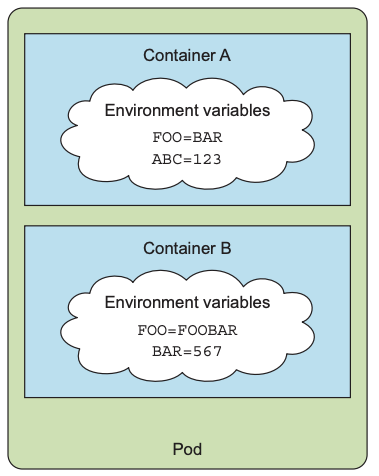
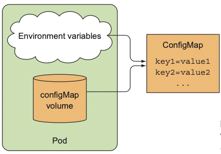
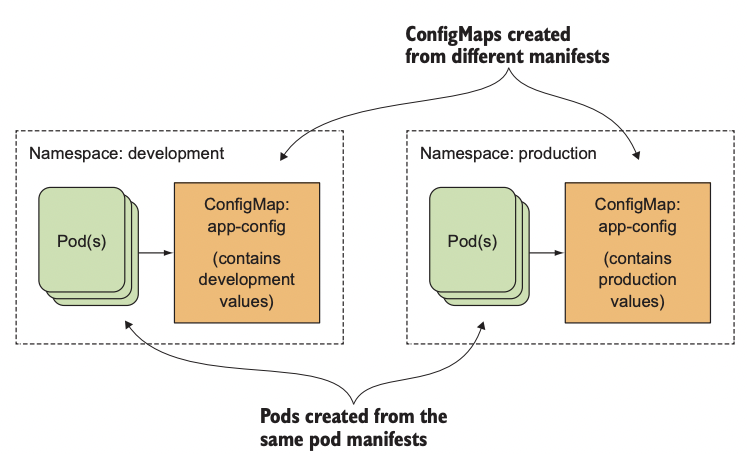
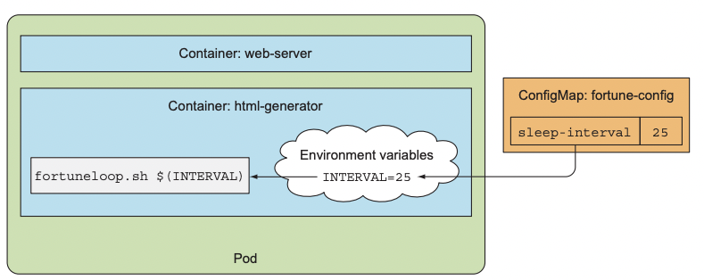
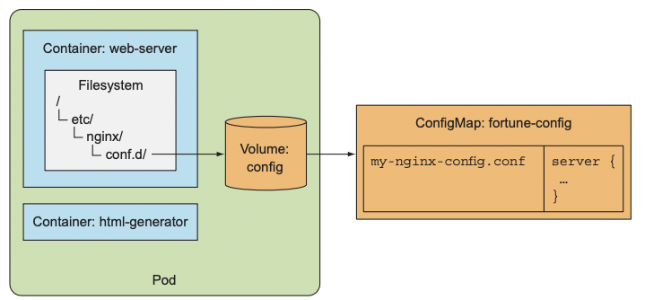
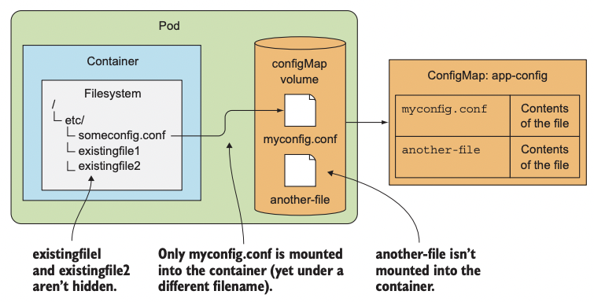

# 컨피그맵과 시크릿
### 다루는 내용
- 컨테이너의 주 프로세스 변경
- 애플리케이션에 명령줄 옵션 전달
- 애플리케이션에 노출되는 환경변수 설정
- 컨피그맵으로 애플리케이션 설정
- 시크릿으로 민감한 정보 전달

# 컨테이너화된 애플리케이션 설정

컨테이너화된 애플리케이션에 설정 데이터를 전달하는 방법은 아래와 같다. 
- 모든 설정을 애플리케이션에 포함
- 명령줄 인수로 애플리케이션에 전달
- 설정을 파일에 저장하고 사용
- 환경변수 사용

컨테이너에서는 환경변수를 널리 사용한다.  
- 도커 컨테이너 내부에 있는 설정 파일을 사용하려면 설정 파일을 컨테이너 이미지에 포함해야 하거나 볼륨을 마운트해야 하기 때문  

간단한 방법으로 설정 데이터를 쿠버네티스 리소스에 저장하고 제공하는 것을 컨피그맵이라고 한다.  

# 컨테이너에 명령줄 인자 전달

## 도커에서 명령어와 인자 정의

- ENTRYPOINT : 컨테이너가 시작될 때 호출될 명령어
- CMD : ENTRYPOINT에 전달할 인자 정의
올바른 방법은 ENTRYPOINT로 명령어를 실행하고 기본 인자를 정의하려는 경우에만 CMD를 지정하는 것이다.  

- shell 형식 : ENTRYPOINT node app.js
- exec 형식 : ENTRYPOINT ["node", "app.js"]
두 형식의 차이점은 정의된 명령을 셸로 호출하는지 여부다.  
shell 형식을 사용하면 메인 프로세스는 node 프로세스가 아닌 shell 프로세스다.  
- shell 프로세스는 불필요하므로 ENTRYPOINT 명령에서 exec 형식을 사용하는게 옳다.  


## 쿠버네티스에서 명령과 인자 재정의
쿠버네티스에서 컨테이너를 정의할 때, ENTRYPOINT와 CMD 둘 다 재정의할 수 있다.  

```yaml
kind: Pod
spec: 
  containers:
  - image: some/image
    command: ["/bin/command"] # ENTRYPOINT와 대응
    args: ["args1", "args2", "args3"] # CMD와 대응
```  

# 컨테이너의 환경변수 설정
쿠버네티스는 아래 그림과 같이 파드의 각 컨테이너를 위한 환경변수 리스트를 지정할 수 있다.  

  

## 컨테이너 정의에 환경변수 지정
```yaml
kind: Pod
spec:
  containers:
  - image: luksa/fortune:env
    env:
    - name: INTERVAL # 환경 변수 추가
      value: "30"
    name: html-generator

```  

## 변숫값에서 다른 환경변수 참조
위 예시에서는 고정된 환경변수 값을 설정했지만 `$(VAR)` 구문을 사용해 이미 정의된 환경변수나 기타 기존 변수를 참조할 수 있다.  

```yaml
env:
- name: FIRST_VAR
  value: "foo"
- name: SECOND_VAR
  value: "$(FIRST_VAR)bar"
```

## 하드코딩된 환경변수의 단점
여러 환경에서 동일한 파드 정의를 재사용하려면 파드 정의에서 설정을 분리하는 것이 좋다.  

value 필드 대신 valueFrom으로 환경변숫값의 원본 소스로 사용할 수 있다.  


# 컨피그맵으로 설정 분리  
애플리케이션 구성의 요점은 환경에 따라 다르거나 자주 변경되는 설정 옵션을 애플리케이션 소스 코드와 별도로 유지하는 것이다.


## 컨피그맵 소개
쿠버네티스에서는 설정 옵션을 컨피그맵이라 부르는 별도 오브젝트로 분리할 수 있다.  
- 컨피그맵은 짧은 문자열에서 전체 설정 파일에 이르는 값을 가지는 키/값 쌍으로 구성된 맵이다.  

맵의 내용은 컨테이너의 환경변수 또는 볼륨 파일로 전달된다.  

또한 환경변수는 `$(ENV_VAR)` 구문을 사용해 명령줄 인수에서 참조할 수 있기 때문에, 컨피그맵 항목을 프로세스의 명령줄 인자로 전달할 수 도 있다.
  

파드는 컨피그맵을 이름으로 참조하기 때문에, 모든 환경에서 동일한 파드 정의를 사용하면서 서로 다른 설정을 사용할 수 있다.  

  

## 컨피그맵 생성
`k create -f`명령어로 YAML 파일을 게시하는 대신 `k create configmap` 명령으로 컨피그맵을 생성할 수 있다.  

```sh
> k create configmap fortune-config --from-literal=sleep-interval=25
```  
여러 문자열 항목을 가진 컨피그맵을 생성하려면 여러 개의 --from-literal 인자를 추가한다.  
```sh
> k create configmap myconfigmap \
  --from-literal=foo=bar --from-literal=bar=baz --from-literal=one=two
```  

### 파일 내용으로 컨피그맵 생성  
컨피그맵에는 전체 설정 파일 같은 데이터를 통째로 저장하는 것도 가능하다. 
```sh
> k create configmap my-config --from-file=config-file.conf
```  

기본적으로 파일 이름을 키 이름으로 지정하지만 직접 이름을 지정할 수 있다. 
```sh
> k create configmap my-config --from-file=customkey=config-file.conf
```

각 파일을 개별적으로 추가하는 대신 디렉터리 내부의 모든 파일을 가져올 수 있다.
```sh
> k create configmap my-config --from-file=customkey=/path/to/dir
```
지정한 디렉터리 안에 있는 각 파일을 개별 항목으로 작성한다.  

## 컨피그맵 항목을 환경변수로 컨테이너에 전달

```yaml
apiVersion: v1
kind: Pod
metadata:
  name: fortune-env-from-configmap
spec:
  containers:
  - image: luksa/fortune:env
    env:
    - name: INTERVAL # INTERVAL 이라는 환경변수 설정
      valueFrom: 
        configMapKeyRef: # 고정 값 대신 컨피그맵 키에서 값을 가져와 초기화
          name: fortune-config # 컨피그맵 이름
          key: sleep-interval # 컨피그맵에서 해당 키
    name: html-generator
  :
  :
```
INTERVAL 환경변수를 선언한 뒤 fortune-config 컨피그맵 내부에서 sleep-interval 키로 가져온 값으로 초기화한다.  

만약 파드를 생성할 때 존재하지 않는 컨피그맵을 참조한다면 파드가 스케줄링된 뒤 컨테이너가 실행될떄 실패한다.  
- 이후에 컨피그맵을 생성하면 컨테이너는 시작된다.  


## 컨피그맵의 모든 항목을 한 번에 환경변수로 전달  
쿠버네티스 버전 1.6부터는 컨피그맵의 모든 항목을 환경변수로 노출하는 방법을 제공한다.  

env 속성 대신 envFrom 속성을 사용해 환경변수로 모두 노출할 수 있다. 
```yaml
spec:
  containers:
  - image: some-image
    envFrom:
    - prefix: CONFIG_ # 모든 환경변수는 CONFIG_ 접두사를 가진다
      configMapRef:
        name: my-config-map  # 컨피그맵 my-config-map를 참조
```

해당 컨피그맵에는 FOO-BAR 라는 항목도 있는데 환경변수로 생성되지 않는다.  

그 이유는 CONFIG_FOO-BAR는 대시(-)를 가지고 있어서 올바른 환경변수 이름이 아니기 때문에 생성되지 않는다.  
- 컨피그맵의 키가 올바른 형식이 아닌 경우 항목을 건너뛴다.  

## 컨피그맵 항목을 명령줄 인자로 전달  

pod.spec.containers.args 필드에서 직접 컨피그맵 항목을 참조할 수는 없지만 컨피그맵 항목을 환경변수로 먼저 초기화하고 해당 변수를 인자로 참조하도록 지정할 수 있다.  

  

```yaml
apiVersion: v1
kind: Pod
metadata:
  name: fortune-args-from-configmap
spec:
  containers:
  - image: luksa/fortune:args
    env:
    - name: INTERVAL # 컨피그맵을 통한 환경변수 정의
      valueFrom: 
        configMapKeyRef:
          name: fortune-config
          key: sleep-interval
    args: ["$(INTERVAL)"] # 인자에 앞에서 정의한 환경변수 지정

```

## 컨피그맵 볼륨을 사용해 컨피그맵 항목을 파일로 노출 
위에서 살펴본 것 처럼 컨피그맵은 모든 설정 파일을 포함할 수 있다.  

컨피그맵 볼륨은 파일로 컨피그맵의 각 항목을 노출한다.  
- 컨테이너에서 실행중인 프로세스는 이 파일 내용을 읽어 각 항목의 값을 얻을 수 있다.  

```yaml
apiVersion: v1
kind: Pod
metadata:
  name: fortune-configmap-volume
spec:
  containers:
  - image: luksa/fortune:env
    env:
    - name: INTERVAL
      valueFrom:
        configMapKeyRef:
          name: fortune-config
          key: sleep-interval
    name: html-generator
    volumeMounts:
    - name: html
      mountPath: /var/htdocs
  - image: nginx:alpine
    name: web-server
    volumeMounts:
    - name: html
      mountPath: /usr/share/nginx/html
      readOnly: true
    - name: config
      mountPath: /etc/nginx/conf.d # 컨피그맵 볼륨을 마운트하는 위치
      readOnly: true
    - name: config
      mountPath: /tmp/whole-fortune-config-volume
      readOnly: true
    ports:
      - containerPort: 80
        name: http
        protocol: TCP

  volumes:
  - name: html
    emptyDir: {}
  - name: config
    configMap: # 해당 볼륨은 fortune-config 컨피그맵을 참조한다.
      name: fortune-config
```

  

### 볼륨에 특정 컨피그맵 항목 노출
컨피그맵 볼륨을 컨피그맵 항목의 일부만으로 채울 수 있다.  

컨피그맵 볼륨 안에 파일로 노출될 항목을 정의하려면 items 속성을 사용하면 된다.  

```yaml
  volumes:
  - name: config
    configMap:
      name: fortune-config
      items: # 볼륨에 포함할 항목을 조회해 선택
      - key: my-nginx-config.conf
        path: gzip.conf
```

### 디렉터리를 마운트할 때 디렉터리의 기존 파일을 숨기는 것 이해
위 예시에서 볼륨을 디렉터리에 마운트 하는데, 이는 기존 디렉터리에 있던 파일을 숨겼음을 의미한다.  

일반적으로 리눅스에서 파일시스템을 비어 있지 않은 디렉터리에 마운트할 때 발생한다.  

원래 있던 파일은 해당 파일시스템이 마운트돼 있는 동안 접근할 수 없다.  

컨피그맵의 항목을 개별 파일로 기존 디렉터리 안에 있는 모든 파일을 숨기지 않고 추가하기 위해서는, 전체 볼륨에 마운트하는 대신 volumeMount에 subPath 속성으로 파일이나 디렉터리 하나를 볼륨에 마운트할 수 있다.  


  

```yaml
spec:
  containers:
  - image: some/image
    volumeMounts:
    - name: myvolume
      mountPath: /etc/someconfig.conf # 디렉터리가 아닌 파일을 마운트
      subPath: myconfig.conf # 전체 볼륨을 마운트하는 대신 myconfig.conf 항목만 마운트
```  

### 컨피그맵 볼륨 내부의 파일 권한 설정
기본적으로 컨피그맵 볼륨의 모든 파일 권한은 644로 설정된다.  
defaultMode 속성을 설정해 변경할 수 있다.  

```yaml
  volumes:
  - name: html
    emptyDir: {}
  - name: config
    configMap:
      name: fortune-config
      defaultMode: 0660
```
305 - 352