# 디플로이먼트
# 파드에서 실행중인 애플리케이션 업데이트
파드나 외부 클라이언트에 서비스를 제공하는 파드 인스턴스 세트가 있다고 가정했을 때, 쿠버네티스에서 실행되는 기본 애플리케이션은 아래와 같다.  

  

모든 파드를 새로운 버전으로 바꾸려고 할 때, 파드를 만든 후에는 기존 파드의 이미지를 변경할 수 없으므로 기존 파드를 제거하고 새 이미지를 실행하는 새 파드로 교체해야 한다.  

이때 방법은 두 가지가 있다.
1. 기존 파드를 모두 삭제한 다음 새 파드를 시작한다.  
2. 새로운 파드를 시작하고, 기동하면 기존 파드를 삭제한다.  
  - 새 파드를 모두 추가한 다음 한꺼번에 기존 파드 삭제하기
  - 순차적으로 새 파드를 추가하고 기존 파드를 점진적으로 제거하기  

첫 번째는 짧은 시간동안 애플리케이션을 사용할 수 없다는 단점이 있다.  
두 번째 방법은 애플리케이션이 동시에 두 가지 버전을 실행해야 하기 때문에 애플리케이션이 데이터 저장소에 데이터를 저장하는 경우 새 버전이 이전 버전을 손상시킬 수 있는 위험이 있다.  

## 오래된 파드를 삭제하고 새 파드로 교체
RPC(레플리케이션컨트롤러)의 파드 템플릿은 언제든지 업데이트할 수 있다.  
- RPC는 새 인스턴스를 생성할 때 업데이트된 파드 템플릿을 사용한다.  
- 버전 1 파드 세트를 관리하는 RPC가 있는 경우 이미지의 버전 2를 참조하도록 파드 템플릿을 수정한 다음 이전 파드 인스턴스를 삭제해 쉽게 교체할 수 있다.  

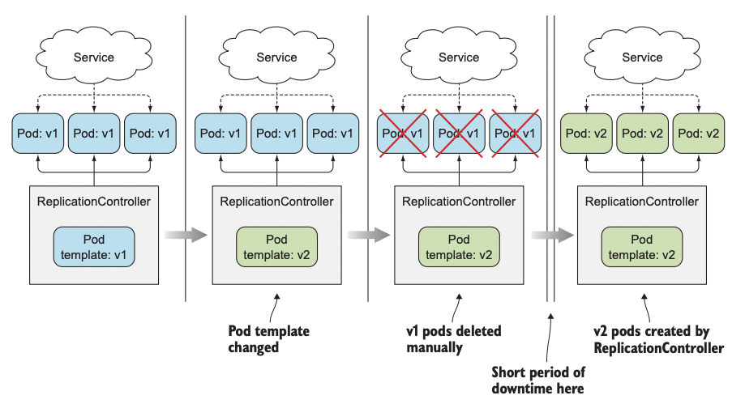  


## 새 파드 기동과 이전 파드 삭제
다운타임이 발생하지 않고 한 번에 여러 버전의 애플리케이션이 실행하는 것을 지원하는 경우 프로세스를 먼저 전환해 새 파드를 모두 기동한 후 이전 파드를 삭제할 수 있다.  
- 잠시 동시에 두 배의 파드가 실행되므로 더 많은 하드웨어 리소스가 필요하다.  

파드의 앞쪽에는 일반적으로 서비스를 배치한다. 새 버전을 실행하는 파드를 불러오는 동안 서비스는 파드의 이전 버전에 연결된다. 그 다음 새 파드가 모두 실행되면 아래와 같이 서비스의 레이블 셀렉터를 변경하면 된다.  
- 이것을 블루-그린 디플로이먼트라고 한다.  
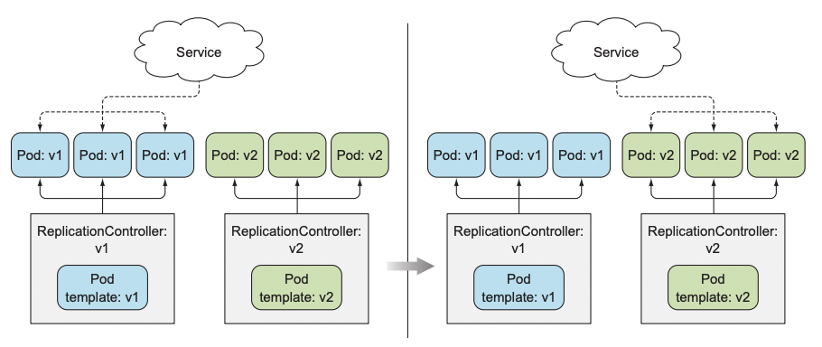  

### 롤링 업데이트
파드를 단계별로 교체하는 롤링 업데이트를 수행할 수 있다.  
이전 버전의 RPC는 천천히 스케일 다운하고 새로운 버전의 RPC는 천천히 스케일 업해 이를 수행할 수 있다.  
- 이 경우 서비스의 파드 셀렉터에 이전 파드와 새 파드를 모두 포함하게 해 요청을 두 파드 세트로 보낼 수 있다.  

수동으로 롤링 업데이트를 수행하는 것은 어렵고 오류가 발생하기 쉽다.  

레플리카수에 따라 업데이트 프로세스를 실행하려면 올바른 순서로 많은 명령어를 실행해야 한다.  

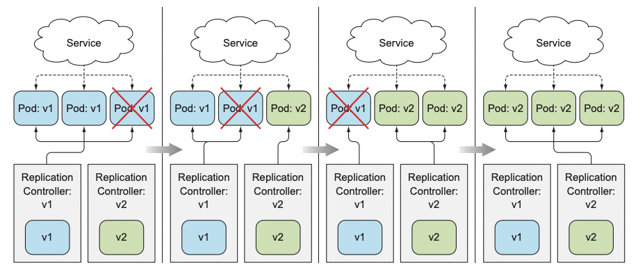  

# RPC로 자동 롤링 업데이트 수행  
RPC를 사용해 수동으로 롤링 업데이트를 수행하는 대신 kubectl을 사용해 업데이트를 수행할 수 있다.  

```yaml
apiVersion: v1
kind: ReplicationController
metadata:
  name: kubia-v1
spec:
  replicas: 3
  template:
    metadata:
      name: kubia
      labels:
        app: kubia
    spec:
      containers:
      - image: luksa/kubia:v1 # 해당 이미지를 사용하는 RPC 생성
        name: nodejs
---
apiVersion: v1
kind: Service
metadata:
  name: kubia
spec:
  type: LoadBalancer
  selector:
    app: kubia
  ports:
  - port: 80
    targetPort: 8080
```

## kubectl을 이용한 롤링 업데이트
`kubectl rolling-update` 명령어를 실행하면 교체할 RPC를 알려주고, 새 RPC이름을 지정한 다음 원래 이미지를 교체할 새 이미지로 지정하기만 하면 된다.  

```sh
$ kubectl rolling-update kubia-v1 kubia-v2 --image=luksa/kubia:v2
```  

명령어 실행 즉시 새 RPC가 생성된다.  
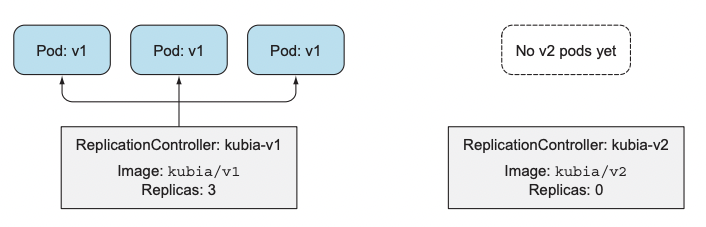  

kubectl은 kubia-v1 RPC를 복사하고 해당 파드 템플릿에서 이미지를 변경해 새 RPC를 생성한다.  
RPC의 레이블 셀렉터를 보면 컨트롤러도 수정되어있다.  
- deployment 레이블도 추가되어 있다.  

첫 번째 RPC의 셀렉터가 `app=kubia`로 설정되어 있기 대문에 새 컨트롤러의 파드들이 선택될 수 있을까?  

롤링 업데이트 프로세스는 첫 번째 RPC의 셀렉터에도 deployment 레이블을 추가했다.  
- 해싱된 값을 추가  

```sh
$ kubectl describe rc kubia-v1
Name: kubia-v1
Namespace: default
Image(s): luksa/kubia:v1
Selector: app=kubia,deployment=3ddd307978b502a5b975ed4045ae4964-orig 

$ kubectl describe rc kubia-v2
Name: kubia-v2
Namespace: default
Image(s): luksa/kubia:v2
Selector: app=kubia,deployment=757d16a0f02f6a5c387f2b5edb62b155
Labels: app=kubia
Replicas: 0 current / 0 desired
```  

또한 kubectl이 RPC의 셀렉터를 변경하기 전 실행 중인 파드의 레이블을 먼저 수정한다.  
```sh
$ kubectl get po --show-labels
NAME READY STATUS RESTARTS AGE LABELS
kubia-v1-m33mv 1/1 Running 0 2m app=kubia,deployment=3ddd...
kubia-v1-nmzw9 1/1 Running 0 2m app=kubia,deployment=3ddd...
kubia-v1-cdtey 1/1 Running 0 2m app=kubia,deployment=3ddd...
```  
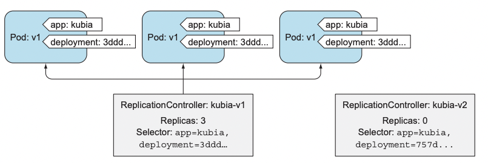  

kubectl은 스케일 업 또는 스케일 다운을 시작하기 전 위 작업들을 모두 수행해야 한다.  

이제 이전 버전의 RPC를 스케일 다운, 새로운 버전의 RPC를 스케일 업 해서 롤링 업데이트를 진행한다.  

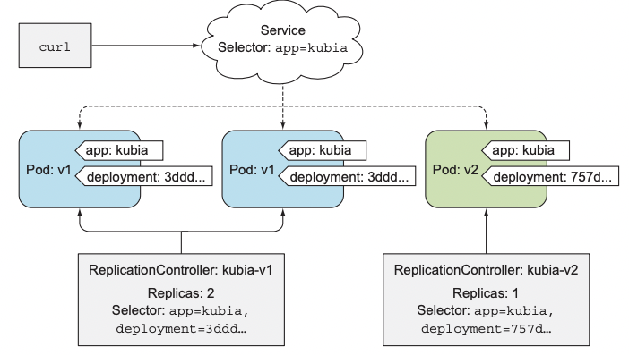  


## kubectl rolling-update를 더 이상 사용하지 않는 이유
롤링 업데이트의 모든 단계를 수행하는 것은 kubectl 클라이언트이다.  
만약 kubectl이 업데이트를 수행하던 중 네트워크 연결이 끊어진다면 업데이트 프로세스는 중간에 중단된다.  

또한 모든 업데이트 과정은 실제 명령을 나타낸다.  

쿠버네티스에게는 시스템의 상태를 선언하고 쿠버네티스가 그것을 달성할 수 있는 가장 좋은 방법을 스스로 찾아내는것이 가장 좋다.  
- 쿠버네티스에 파드를 추가하거나 초과된 파드를 제거하라고 지시하는게 아니라 원하는 레플리카 수를 변경해야 한다.  

# 애플리케이션을 선언적으로 업데이트하기 위한 디플로이먼트 사용하기
디플로이먼트는 낮은 수준의 개념으로 간주되는 RPC 또는 레플리카셋을 통해 수행하는 대신 애플리케이션을 배포하고 선언적으로 업데이트하기 위한 높은 수준의 리소스다.  

디플로이먼트를 생성하면 레플리카셋 리소스가 그 아래에 생성된다.  
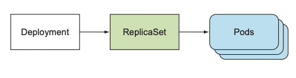  

애플리케이션을 업데이트할 때는 추가 RPC를 도입하고 두 컨트롤러가 잘 조화되도록 조정해야 한다.  
- 전체적으로 통제하는 것이 필요하다.  

디플로이먼트 리소스가 이를 관리한다.  

낮은 수준의 구조 대신 디플로이먼트를 사용하면 하나의 디플로이먼트 리소스를 통해 원하는 상태를 정의하면 쿠버네티스가 나머지를 처리한다.  

## 디플로이먼트 생성  
디플로이먼트는 레이블 셀렉터, 원하는 레플리카 수, 파드 템플릿으로 구성된다.  
또한 디플로이먼트 리소스가 수정될 때 업데이트 수행 방법을 정의하는 디플로이먼트 전략을 지정하는 필드도 있다.  

```yaml
apiVersion: apps/v1
kind: Deployment
metadata:
  name: kubia
spec:
  replicas: 3
  template:
    metadata:
      name: kubia
      labels:
        app: kubia
    spec:
      containers:
      - image: luksa/kubia:v1
        name: nodejs
  selector:
    matchLabels:
      app: kubia
```
특정 시점에 디프롤이먼트는 여러개의 파드 버전을 실행할 수 있으므로 해당 이름이 애플리케이션 버전을 참조하지 않아도 된다.

```sh
$ kubectl create -f kubia-deployment-v1.yaml --record
deployment "kubia" created
```  

```sh
$ kubectl get po
NAME READY STATUS RESTARTS AGE
kubia-1506449474-otnnh 1/1 Running 0 14s
kubia-1506449474-vmn7s 1/1 Running 0 14s
kubia-1506449474-xis6m 1/1 Running 0 14s
```
RPC를 이용해 파드를 만들 때 해당 이름이 컨트롤러 이름과 임의로 생성된 문자열로 구성됐다.  
디플로이먼트에서 생성한 파드 세 개에는 디플로이먼트와 파드 템플릿의 해시값을 의미하는 문자가 포함되어 있다.  
- 레플리카셋이 이러한 파드를 관리함을 뜻한다.  

```sh
$ kubectl get replicasets
NAME DESIRED CURRENT AGE
kubia-1506449474 3 3 10s
```  
레플리카셋 이름에도 해당 문자열이 포함되어 있다.  

디플로이먼트는 파드 템플릿의 각 버전마다 하나씩 여러 개의 레플리카셋을 만든다.  

## 디플로이먼트 업데이트
디플로이먼트 리소스에 정의된 파드 템플릿을 수정하기만 하면 쿠버네티스가 실제 시스템 상태를 리소스에 정의된 상태로 만드는데 필요한 모든 단계를 수행한다.  

수행 방법은 디플로이먼트에 구성된 디플로이먼트 전략에 의해 결정된다. 
### RollingUpdate
기본값으로 이전 파드를 하나씩 제거하고 동시에 새 파드를 추가해 전체 프로세스 애플리케이션을 계속 사용할 수 있고 서비스 다운 타임이 없더록 한다.  

### Recreate
새 파드를 만들기 이전에 이전 파드를 모두 삭제한다.  
- 애플리케이션이 여러 버전을 병렬로 실행하는 것을 지원하지 않는 경우 이 전략을 사용한다.  
- 짧은 서비스 다운타임이 발생한다.  

```
$ kubectl set image deployment kubia nodejs=luksa/kubia:v2
deployment "kubia" image updated
```

위 명령을 실행하면 파드 템플릿이 업데이트 돼 새로운 이미지를 사용하게된다.  

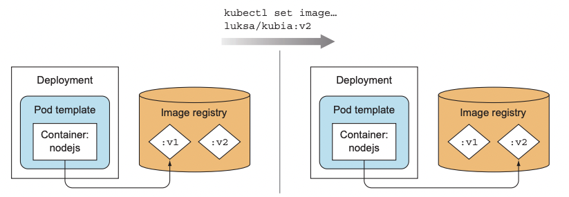  

이후 추가 레플리카셋을 생성하고, 그 후 천천히 스케일 업을 한 뒤 이전 레플리카셋의 크기를 0으로 스케일 다운했다.  

최종적인 모습은 아래 그림과 같다.  
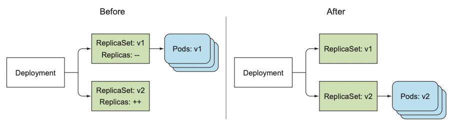  

레플리카셋을 조회하면 기존 레플리카셋과 새 레플리카셋을 나란히 볼 수 있다.  
- RPC는 롤링 업데이트 프로세스가 끝나면 기존 RPC는 삭제됐다.
```
$ kubectl get rs
NAME DESIRED CURRENT AGE
kubia-1506449474 0 0 24m
kubia-1581357123 3 3 23m
```  

## 디플로이먼트 롤백
위와 같은 방법으로 새로운 버전인 v3를 배포한다고 가정한다.  
- 해당 버전은 버그가 숨겨져있다.  

```
$ kubectl set image deployment kubia nodejs=luksa/kubia:v3
deployment "kubia" image updated
```

서버 오류가 발생하기 시작하고 사용자가 이러한 오류들을 경험하게 둘 수 없으므로 신속하게 조치를 취해야 한다.  

디플로이먼트를 사용하면 쿠버네티스에서 디플로이먼트의 마지막 롤아웃을 취소하도록 지시해서 이전에 배포된 버전으로 쉽게 롤백할 수 있다.  

```
$ kubectl rollout undo deployment kubia
deployment "kubia" rolled back
```  

undo 명령어에서 revision 번호를 지정해 특정 revision으로 롤백할 수 있다.  

```
$ kubectl rollout undo deployment kubia --to-revision=1
```
디플로이먼트를 수정했을때 비활성화된 레플리카셋들이 각각의 revision을 나타낸다.  
- 디플로이먼트에서 생성한 모든 레플리카셋은 전채 revision 내역을 나타낸다.  
- 수동으로 레플리카셋을 삭제하게 되면 롤백할 수 없다.  
- 그러나 과거 레플리카셋이 레플리카셋 목록을 복잡하게 만드는 것은 이상적이지 않으므로 개정 내역 수는 디플로이먼트 리소스의 `editionHistoryLimit` 속성에 의해 제한된다.
  - 기본값은 2다

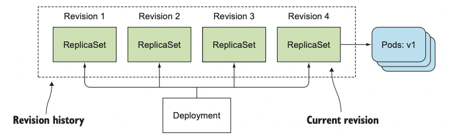  

## 롤아웃 속도 제어

### 롤링 업데이트 전략의 maxSurge와 maxUnavailable 속성
이 속성 두 개는 디플로이먼트의 롤링 업데이트 중에 한 번에 몇 개의 파드를 교체할지를 결정한다.  

```yaml
spec:
    strategy:
        rollingUpdate:
            maxSurge: 1
            maxUnavailable: 0
        type: RollingUpdate
```
- maxSurge: 디플로이먼트가 의도하는 레플리카 수보다 얼마나 많은 파드 인스턴스 수를 허용할수 있는지 결정한다.
- maxUnavailable: 업데이트 중에 의도하는 레플리카 수를 기준으로 사용할 수 없는 파드 인스턴스 수를 결정한다.

두 속성 모두 25%가 기본값이다.  

의도하는 레플리카 수가 3이고 위 속성이 모두 25%이므로 `maxSurge`는 모든 파드 수가 네 개에 도달하도록 허용했으며 `maxUnavailable`은 사용할 수 없는 파드를 허용하지 않는다. 

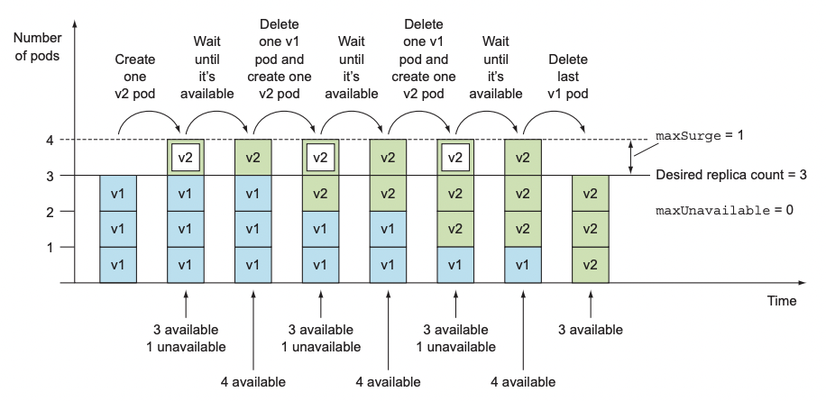  


## 롤아웃 프로세스 일시 중지  

애플리케이션 v3의 버그를 수정하고 v4 이미지를 푸시했다고 가정한다.  

추가적으로 원하는 것은 v2 파드 옆에서 v4 파드를 하나 실행하고 일부 사용자만 작동하는지 확인한 다음 모든것이 정상이면 기존 모든 파드를 새파드로 교체하는 것이다.  

롤아웃 프로세스 중에 배포를 일시중지 하면 나머지 롤아웃을 진행하기 전에 새 버전이 정상인지 확인할 수 있다.  

```
$ kubectl set image deployment kubia nodejs=luksa/kubia:v4
deployment "kubia" image updated

$ kubectl rollout pause deployment kubia
deployment "kubia" paused
```
새 파드가 하나 생성되고 원본 파드도 계속 실행중이다.  
요청의 일부가 새 파드로 전달되면서 카나리 릴리스를 효과적으로 실행할 수 있다.  

새 버전이 제대로 작동한다고 확신하면 디플로이먼트를 다시 시작해 이전 파드를 모두 새 ㅍ파드로 교체할 수 있다.

```
$ kubectl rollout resume deployment kubia
deployment "kubia" resumed
```  

## 잘못된 버전의 롤아웃 방지
롤아웃 속도를 조절할 수 있는 디플로이먼트의 속성인 `minReadySeconds`의 주요 기능은 오작동 버전의 배포를 방지하는 것이다.  

`minReadySeconds` 속성은 파드를 사용 가능한 것으로 취급하기 전에 새로 만든 파드를 준비할 시간을 지정한다.  

파드가 사용 가능할 때까지 롤아웃 프로세스가 계속되지 않는다.  
- 모든 파드의 레디니스 프로브가 성공하면 파드가 준비된다.  
- minReadySeconds가 지나기 전에 새 파드가 제대로 작동하지 않고 레디니스 프로브가 실패하기 시작하면 새 버전의 롤아웃이 효과적으로 차단된다.  

```yaml
apiVersion: apps/v1beta1
kind: Deployment
metadata:
  name: kubia
spec:
  replicas: 3
  minReadySeconds: 10 # minReadySeconds를 10으로 설정
  strategy:
    rollingUpdate:
      maxSurge: 1
      maxUnavailable: 0 # 디플로이먼트가 파드를 하나씩 교체하도록 maxUnavailable을 0으로 설정
    type: RollingUpdate
  template:
    metadata:
      name: kubia
      labels:
        app: kubia
    spec:
      containers:
      - image: luksa/kubia:v3
        name: nodejs
        readinessProbe: # 매초마다 실행될 레디니스 프로브 정의
          periodSeconds: 1
          httpGet:
            path: /
            port: 8080
```  

레디니스 프로브가 실패하기 시작하면 파드는 준비 되지 않은 상태로 변경된다.  
결과적으로 파드는 서비스의 엔드포인트에서 제거된다.  
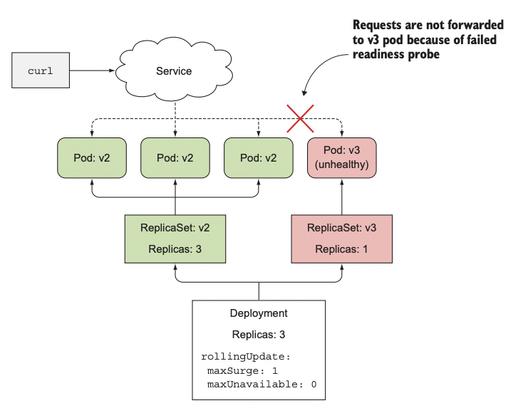  

또한 새로운 파드가 사용할 수 없으므로 롤아웃 프로세스는 계속되지 않고 새 파드를 만들지 않으며 maxUnavailable 속성을 0으로 설정했기 때문에 원래 파드도 제거하지 않는다.  
- 사용 가능한 것으로 간주되려면 10초 이상 준비돼 있어야 한다.  

이렇게 잘못된 버전의 배포를 막음으로써 사용자에게 부정적인 영향을 막을 수 있다.  

기본적으로는 롤아웃이 10분동안 진행되지 않으면 실패한 것으로 간주하고 이러한 시간은 디플로이먼트 스팩의 `progressDeadlineSecodns`속성으로 설정할 수 있다.  

잘못된 롤아웃을 중지하기 위해서는 아래 명령어를 수행하면 된다.
```
$ kubectl rollout undo deployment kubia
deployment "kubia" rolled back
```
